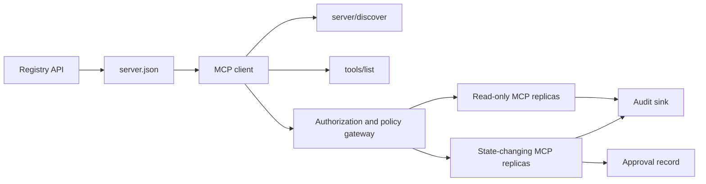

# Capstone 13: Servidor de MCP sem Estado com Registro e Governança

> O MCP de produção não é um processo de servidor, é uma cadeia de contratos: metadados publicáveis, descoberta ao vivo, um envelope de solicitação sem estado, autorização, política, auditoria e evidências de implantação.

**Type:** Capstone
**Languages:** Python and TypeScript reference models; any production language
**Prerequisites:** Phase 11, Phase 13, Phase 14, Phase 17, and Phase 18
**Required MCP deep dives:** [Lesson 28: Tool Contracts](../../../13-tools-and-protocols/28-mcp-tool-contracts-and-content/docs/en.md)- Não .[Lesson 29: Reliability](../../../13-tools-and-protocols/29-mcp-reliability-cancellation-and-flow-control/docs/en.md)- Não .[Lesson 30: Registry Supply Chain](../../../13-tools-and-protocols/30-mcp-registry-supply-chain-and-drift/docs/en.md), e [Lesson 31: Conformance Operations](../../../13-tools-and-protocols/31-mcp-conformance-versioning-and-operations/docs/en.md)
**Protocol target:**MCP `2026-07-28`
**Time:** ~25 hours

## Objetivos de aprendizagem

- Implementar o pedido de MCP sem estatuto e o envelope de resultados.
- Mantenha os metadados do Registro separados da descoberta do protocolo ao vivo.
- Construir uma ferramenta determinista de descoberta consciente do cache.
- Aplicar a política de emissor, público, alcance e aprovação para cada chamada de ferramenta.
- Implemente o HTTP Streamable sem afinidade de sessão.
- Prova o comportamento no fio, autorização, política, registro e fronteiras de auditoria.

## Caminho pré-requisito do MCP requerido

Complete as quatro lições ligadas da Fase 13 em ordem antes de tratar esta pedra final como pronta para produção:

1. [Lesson 28](../../../13-tools-and-protocols/28-mcp-tool-contracts-and-content/docs/en.md)define a ferramenta, esquema, conteúdo, pagination, conclusão, roteamento e contratos de erro que este servidor deve expor.
2. [Lesson 29](../../../13-tools-and-protocols/29-mcp-reliability-cancellation-and-flow-control/docs/en.md)define corridas de cancelamento, prazos, idempotencia, contrapressão, retestamento e comportamento de reconexão.
3. [Lesson 30](../../../13-tools-and-protocols/30-mcp-registry-supply-chain-and-drift/docs/en.md)define o espaço de nomes, a proveniência, o pin de admissão, o status do Registo, a derivação, o livro-razão e a evidência de reversão.
4. [Lesson 31](../../../13-tools-and-protocols/31-mcp-conformance-versioning-and-operations/docs/en.md)define transcrições douradas e negativas, eras de versão rigorosa, verificações de diferenciais do SDK, prova de proxy, redação, saúde e libertação de gating.

A pedra final integra esses artefatos. Não os substitui por um teste de SDK de caminho feliz.

## O problema

Uma plataforma interna precisa de ferramentas de dados somente leituras e um pequeno conjunto de ferramentas de mudança de estado. Os desenvolvedores devem ser capazes de descobrir o servidor, entender como se conectar, inspecionar suas capacidades ao vivo e ligar apenas as operações que estão autorizados a usar.

A parte difícil é não registrar uma função, a parte difícil é manter seis verdades diferentes alinhadas:

1. `server.json`Diz onde o servidor pode ser instalado ou alcançado.
2. `server/discover`diz o que o processo ao vivo suporta agora.
3. Cada pedido diz qual revisão de protocolo e recursos do cliente que usa.
4. A autorização vincula um chamador ao emissor, recurso e escopo corretos.
5. A política decide se essa acção específica pode ser executada.
6. A evidência da auditoria registra o que atravessou a fronteira sem vazamento de segredos ou cargas úteis sensíveis.

Se qualquer uma dessas derivações, a plataforma pode listar um servidor que não pode ser alcançado, encaminhar um cliente incompatível, aceitar um token feito para outro recurso ou expor uma ação destrutiva sem a revisão esperada.

## As duas camadas de descoberta

O Registro e o servidor MCP ao vivo respondem a perguntas diferentes.

| Layer | Contract | Question it answers |
|---|---|---|
| Publication | `server.json` and Registry API | What is this server, where is its package or remote endpoint, and how is it configured? |
| Runtime | `server/discover` | Which protocol versions, capabilities, extensions, and server identity does this process support? |

O Registo Oficial utiliza uma versão editada `server.json`Uma entrada remota pode nomear um URL HTTP Streamable:

```json
{
  "$schema": "https://static.modelcontextprotocol.io/schemas/2025-12-11/server.schema.json",
  "name": "com.example/internal-readonly",
  "title": "Internal Read-Only Tools",
  "description": "Read-only incident and data lookup tools.",
  "version": "1.0.0",
  "remotes": [
    {
      "type": "streamable-http",
      "url": "https://mcp.internal.example.com/readonly"
    }
  ]
}
```

A versão do esquema do Registro e a revisão do protocolo MCP são independentes. Não reescreva uma data para coincidir com a outra. Valide cada documento contra o seu próprio contrato.

A validade do esquema não prova a propriedade do espaço de nomes.`example.com`utiliza o espaço de nomes do DNS inverso `com.example/*`O fluxo de autenticação do Registro prova essa propriedade.

O modelo stdlib `validate_registry_document`A função é intencionalmente um validador de perfil remoto parcial.`name`- Não .`description`, e `version`campos; opcionais `title`; o nome e as restrições de comprimento publicados; a forma da versão em concreto; e cada `streamable-http`ou `sse`forma de URL HTTP ((S) do remoto. Além disso, requer uma não vazia `remotes`lista porque esta pedra-cabeça sempre está a testar um controle remoto.`validate_publisher_namespace`Verifica separadamente o nome contra o domínio de editor verificado, enquanto `validate_runtime_alignment`compara o nome da publicação e a versão com o live `serverInfo`O esquema oficial também suporta registros apenas para pacotes e campos mais remotos. Antes da publicação, valida todo o documento com o esquema oficial JSON afixado ou `mcp-publisher`Não apresentar este subconjunto livre de dependências como validação completa do esquema.

O servidor deve implementar `server/discover`Este cliente de capstone faz isso após a resolução do endpoint e recebe a revisão do protocolo atual e as capacidades ao vivo:

```json
{
  "resultType": "complete",
  "supportedVersions": ["2026-07-28"],
  "capabilities": {
    "tools": {
      "listChanged": false
    }
  },
  "_meta": {
    "io.modelcontextprotocol/serverInfo": {
      "name": "com.example/internal-readonly",
      "version": "1.0.0"
    }
  },
  "ttlMs": 3600000,
  "cacheScope": "public"
}
```

Um catálogo privado pode indexar dados adicionais de propriedade, revisão ou ciclo de vida, mas não deve inventar esses dados como campos de fio MCP ou raiz `server.json`Os campos de dados são utilizados para a análise de dados e para a análise de dados.`_meta.io.modelcontextprotocol.registry/publisher-provided`Extensão e manutenção dentro do seu limite de 4 KB.

## Núcleo de MCP sem Estado

Revisão do MCP `2026-07-28`elimina as sessões de protocolo e os`initialize`- Não .`notifications/initialized`Apertar a mão.`Mcp-Session-Id`- Não .

Cada pedido contém o contexto do protocolo em `params._meta`- Não .

```json
{
  "io.modelcontextprotocol/protocolVersion": "2026-07-28",
  "io.modelcontextprotocol/clientCapabilities": {},
  "io.modelcontextprotocol/clientInfo": {
    "name": "internal-platform-client",
    "version": "1.0.0"
  }
}
```

A versão e as capacidades são fatos de pedido, não fatos de conexão. Um balançador de carga pode enviar solicitações consecutivas para diferentes réplicas saudáveis porque qualquer réplica pode validar a solicitação da própria mensagem.

Os resultados comuns incluem:`resultType: "complete"`Os servidores devem colocar a sua identidade em`_meta.io.modelcontextprotocol/serverInfo`Uma versão do protocolo faltante ou não string é parâmetros inválidos `-32602`- Erro .`-32022`é apenas para uma cadeia fornecida que não é suportada, com exatamente `{"supported": ["2026-07-28"], "requested": "..."}`como dados.

### Descoberta em cache

`tools/list`O resultado deve ser determinista para o mesmo conjunto de ferramentas eficazes.

- `ttlMs`, uma dica de frescura para o cliente;
- `cacheScope`, ou `public`ou `private`O artigo 2.o
- uma ordem de ferramentas estável para que as listas idênticas possam reutilizar os caches rápidos;
- `resultType: "complete"`e metadados de identidade do servidor.

A autorização por utilizador deve normalmente produzir `cacheScope: "private"`Não coloque a visibilidade das ferramentas específicas do utilizador atrás de um cache público compartilhado.

## HTTP em transmissão

Um servidor de rede expõe um endpoint MCP que aceita POST. Cada solicitação ou notificação JSON-RPC recebe seu próprio POST.

Para uma solicitação, o servidor retorna um objeto JSON ou um fluxo SSE abrangido para essa solicitação.`subscriptions/listen`Não há fluxo GET independente, DELETE de sessão, cabeçalho de sessão ou `Last-Event-ID`Repetição no transporte corrente.

Cada pedido inclui:

- `MCP-Protocol-Version`, correspondência dos metadados do corpo;
- `Mcp-Method`, correspondente ao método JSON-RPC;
- `Mcp-Name`Para`tools/call`- Não .`resources/read`, e `prompts/get`O artigo 2.o
- `Accept: application/json, text/event-stream`- Não .

Rejeitar cabeçalhos espelhados incompatíveis com os especificados `-32020`erro. Validação `Origin`, ligar os servidores de desenvolvimento locais para loopback, autenticar clientes remotos e tratar uma resposta SSE fechada com escala de solicitação como cancelamento.



```figure
cf-mcp-gate
```

## Autorização e Política

Metadados de transporte não são autorização.

Para servidores remotos:

1. Descobrir metadados de recursos protegidos.
2. Selecione o servidor de autorização para esse recurso.
3. Preferir documentos de metadados de ID do cliente para o registro do cliente.
4. Enviar o indicador de recursos durante a autorização.
5. Validar um retorno `iss`valor em relação ao servidor de autorização registado para o fluxo.
6. Identificação de cliente por emissor. Nunca reutilize os dados de registo entre emissores.
7. Validar o emissor de tokens, o público ou o recurso, a expiração e os escopo no servidor MCP.
8. Aplicar uma segunda decisão de política à ferramenta e aos argumentos concretos.

Anotativas de ferramentas como `readOnlyHint`E ...`destructiveHint`Não são controles de autorização confiáveis.

### A aprovação é um registro, não um escopo mágico

Uma chamada de mudança de estado precisa de um registro de aprovação vinculado ao ator, ferramenta, argumentos normalizados ou digest, ambiente alvo, expiração e política de uso único ou repetido.

O modelo Python hashes JSON canônico com chaves ordenadas, em seguida, liga que digest com o tóquico assunto, nome da ferramenta, URL do servidor, e expiração. Reproduzir o registro após mudar mesmo um argumento falha antes do processador executar. A aprovação é evidência separada, não um escopo adicionado ao tóquico de acesso.

Mantenha as ferramentas de alto risco em uma superfície revisavelmente separada quando isso reduz significativamente o raio da explosão.

## Construí-lo

### 1. Modelo de metadados de publicação

Criar e validar esquemas `server.json`. Incluir um nome estável no espaço de nomes autenticado para o editor, mais versão, descrição, oficial `repository`ou `packages`Os dados de dados são transmitidos por meio de um sistema de comunicação de dados, incluindo dados de metadados, quando aplicável, e um transporte remoto ou de estúdio.

### 2. Implementar a descoberta ao vivo

Implementação `server/discover`Antes de qualquer recurso RPC. Anunciar versões de protocolo suportadas, recursos, extensões e identidade do servidor. Adicionar um caso de rejeição de versão usando `-32022`- Não .

### 3. Implementar o envelope sem Estado

Requer versão de protocolo e recursos do cliente em cada pedido.`resultType`Remover o estado de inicialização, cache de capacidade de conexão e identificadores de sessão.

### 4. Construir a superfície da ferramenta

Comece com duas ferramentas de somente leitura e uma ferramenta de mudança de estado. Dê a cada uma um esquema JSON limitado, descrição precisa, forma determinista do resultado e anotações honestas. Adicione esquemas de saída quando os clientes dependem de resultados estruturados.

### 5. Adicionar listagem de cache-consciente

Retorno de ferramentas em ordem estável com `ttlMs`E ...`cacheScope`Exercer o comportamento de notificação de expiração do cache e de alteração de lista separadamente.

### 6. Adicionar autorização e política

Validar emissor, público, expiração e alcance. Execute uma decisão de política para cada chamada de ferramenta. Ligue as aprovações a ações exatas de alto risco. Negar aprovações faltantes ou obsoletas antes de executar um processador.

### 7. Registro separado e validação de tempo de execução

Validar a estática `server.json`Registo, depois sondeio o ponto final remoto com `server/discover`.Drift de relatório quando o controle remoto, a identidade, a versão ou as capacidades exigidas publicadas discordam do processo ao vivo.

### 8. Adicionar provas de auditoria

Registrar actor, emissor, recurso, ferramenta, decisão de política, identificador de solicitação, contexto de rastreamento, latência e resultado. Redigir ou digerir argumentos e resultados sensíveis antes da persistência. Mantenha o auditório fora do contexto visível ao modelo.

### 9. Exercício de escala horizontal

Coloque duas réplicas sem estado atrás de um balançador de carga. Envie pelo menos 100 solicitações simultâneas. Demonstre que a corretão não depende da afinidade. Se uma ferramenta precisa de um estado de chamada cruzada, colete um manilho opaco explícito e armazená-lo em um sistema durável compartilhado.

### 10. Atravessem o cabo real .

Execute verificações de conformidade contra o binário do servidor real. Capture header de solicitações e corpos JSON, não apenas objetos SDK. Exercite versão errada, desajuste de header, escopo perdido, público errado, argumentos malformados, falha do processador, cancelamento e expiração do cache.

## Pacote de provas requerido

Uma apresentação é incompleta até que contenha todas as cinco classes de provas:

| Evidence | Minimum proof | Source lesson |
|---|---|---|
| Wire | Redacted raw headers and JSON-RPC bodies for golden and negative cases, including metadata type failure, header mismatch, unsupported version, missing or unknown `resultType`, notification no-response, and response ID matching | [Lesson 31](../../../13-tools-and-protocols/31-mcp-conformance-versioning-and-operations/docs/en.md) |
| Proxy | The same stable case run directly and through the deployed intermediary, with ingress, origin, and egress status and body digests; prove protocol errors are not collapsed into generic 500 responses and streaming is not buffered | [Lessons 29](../../../13-tools-and-protocols/29-mcp-reliability-cancellation-and-flow-control/docs/en.md) and [31](../../../13-tools-and-protocols/31-mcp-conformance-versioning-and-operations/docs/en.md) |
| Admission | Verified publisher namespace, immutable Registry record digest, artifact or remote provenance, live `server/discover` identity and capability observation, descriptor pin, current Registry status, and admission-ledger event | [Lesson 30](../../../13-tools-and-protocols/30-mcp-registry-supply-chain-and-drift/docs/en.md) |
| Retry | A cancellation-versus-completion race, explicit timeout, safe read retry, mutation idempotency key, reconnect refetch, and proof that request cancellation cannot silently become durable task cancellation | [Lesson 29](../../../13-tools-and-protocols/29-mcp-reliability-cancellation-and-flow-control/docs/en.md) |
| Rollback | Exact previous version, admission and artifact digests, descriptor pin, active Registry status, current health window, route restoration result, and redacted decision evidence | [Lessons 30](../../../13-tools-and-protocols/30-mcp-registry-supply-chain-and-drift/docs/en.md) and [31](../../../13-tools-and-protocols/31-mcp-conformance-versioning-and-operations/docs/en.md) |

Mantenha um digeste do pacote editado com a versão. Se alguma classe estiver faltando, mantenha a versão. Não deduzir o comportamento de proxy de um dispecer em processo, admissão da presença do Registro, retestar a segurança de um novo ID JSON-RPC ou prontidão de rollback da implementação anterior.

## Modelos de referência locais

O modelo Python demonstra metadados do registo, validação do espaço de nomes do editor reverso do DNS, verificações de identidade de publicação para execução, descoberta ao vivo, listagem de ferramentas deterministas, metadados por solicitação, emissor confiável, audiência, verificação de validade e alcance, aprovações vinculadas a a ação, um validador de registo parcial documentado, política e auditoria sem abrir um soquete de rede:

```bash
cd phases/19-capstone-projects/13-mcp-server-with-registry
python3 code/main.py
python3 -m unittest discover -s code/tests -v
```

O projeto TypeScript expõe a forma JSON-RPC sem estado através de estúdios sem um SDK MCP.`tools/call`O caminho impõe os mesmos esquemas de entrada limitados anunciados por `tools/list`; argumentos inválidos para uma ferramenta conhecida retornam um resultado completo com `isError: true`sem invocar o executor:

```bash
cd phases/19-capstone-projects/13-mcp-server-with-registry/code/ts
npm install
npm run typecheck
npm test
npm run demo
```

Estes modelos provam a lógica do contrato local. Eles não provam cabeçalhos HTTP, troca de OAuth, publicação do Registro, integração de OPA, equilíbrio de carga ou recibo de colecionador.

## Exemplo de fio

```http
POST /mcp HTTP/1.1
Host: mcp.internal.example.com
Content-Type: application/json
Accept: application/json, text/event-stream
MCP-Protocol-Version: 2026-07-28
Mcp-Method: tools/call
Mcp-Name: postgres.readonly
Authorization: Bearer REDACTED

{
  "jsonrpc": "2.0",
  "id": 42,
  "method": "tools/call",
  "params": {
    "name": "postgres.readonly",
    "arguments": {"sql": "SELECT 1"},
    "_meta": {
      "io.modelcontextprotocol/protocolVersion": "2026-07-28",
      "io.modelcontextprotocol/clientCapabilities": {},
      "io.modelcontextprotocol/clientInfo": {
        "name": "internal-platform-client",
        "version": "1.0.0"
      }
    }
  }
}
```

## Envia-o

Enviar um repositório que contenha:

- um esquema-válido `server.json`O artigo 2.o
- Superfícies de servidor de somente leitura e de mudança de estado;
- `server/discover`, determinista `tools/list`, e por políticas .`tools/call`O artigo 2.o
- uma implementação HTTP streamable com duas réplicas intercâmbios;
- A integração das autorizações e aprovações;
- Um editor de Registro ou um adaptador de API de Registro privado;
- Definições de políticas e registos de aprovação vinculados à ação;
- A produção de auditoria e a propagação de rastos editados;
- Prova de falha por fio e por procuração;
- Admissão, retestamento, saúde e evidências de regresso com um resumo da embalagem editada.

| Weight | Criterion | Evidence |
|---:|---|---|
| 25 | Protocol correctness | Stateless request metadata, discovery, results, headers, and negative cases |
| 20 | Authorization | Issuer, audience, expiry, scope, and action-bound approval cases |
| 15 | Registry integrity | Valid `server.json`, publication record, live discovery probe, and drift report |
| 15 | Policy and safety | Allow, deny, malformed, stale approval, and sensitive-data cases |
| 15 | Scale and reliability | Two replicas, no affinity dependency, cancellation, timeout, and recovery |
| 10 | Auditability | Redacted receiver-side audit and trace evidence |

## Exercícios

1. Mudar o URL remoto publicado, deixando o servidor vivo inalterado. Faça o registro de validação relatar a deriva exata.
2. Enviar .`tools/list`duas vezes com entradas idênticas e provar ordem de ferramentas estável em byte.`ttlMs`E refrescar.
3. Enviar um corpo válido com outro .`MCP-Protocol-Version`- Retorno.`-32020`Não invoquem a política nem a ferramenta.
4. Crie um token para o servidor de somente leitura e apresente-o ao servidor de mudança de estado.
5. Ligue uma aprovação a um digestão de argumento normalizado. Altere um campo e provar que a aprovação não pode ser reproduzida.
6. Rotear chamadas consecutivas para replicas alternadas. Substitua a memória de processo oculta por um manilho compartilhado explícito onde quer que o fluxo de trabalho precise de persistência.
7. Desligar uma conexão SSE escopo de pedido e tentar novamente com um novo ID de pedido JSON-RPC. Verificar que não `Last-Event-ID`O caminho de recuperação é utilizado.

## Termos-chave

| Term | What people say | What it actually means |
|---|---|---|
| Stateless MCP | "No state anywhere" | No protocol session; cross-call state is explicit and server-managed |
| `server.json` | "The tool manifest" | Registry metadata for naming, packaging, configuration, and transports |
| `server/discover` | "The handshake" | A normal mandatory RPC for live versions and capabilities, not a session initializer |
| Cache scope | "Can I cache it?" | Whether a cacheable result is safe for shared or private reuse |
| Policy decision | "The token allows it" | A separate decision over actor, tool, target, arguments, and context |
| Approval record | "A human clicked yes" | Evidence bound to one actor and consequential action under an expiry policy |
| Explicit handle | "A session ID" | Ordinary application data for named server-managed state, not protocol connection state |

## Mais leitura

- [MCP 2026-07-28 key changes](https://modelcontextprotocol.io/specification/2026-07-28/changelog)
- [Streamable HTTP](https://modelcontextprotocol.io/specification/2026-07-28/basic/transports/streamable-http)
- [Server discovery](https://modelcontextprotocol.io/specification/2026-07-28/server/discover)
- [MCP authorization](https://modelcontextprotocol.io/specification/2026-07-28/basic/authorization)
- [Official Registry server.json requirements](https://github.com/modelcontextprotocol/registry/blob/main/docs/reference/server-json/official-registry-requirements.md)
- [Official Registry OpenAPI contract](https://registry.modelcontextprotocol.io/openapi.yaml)
