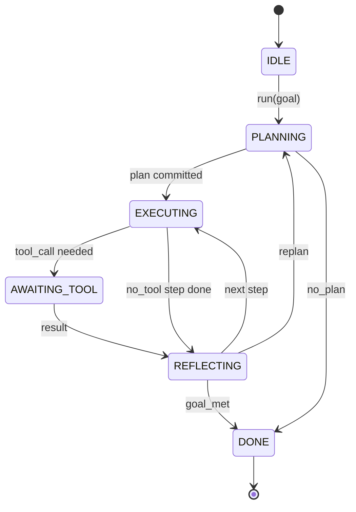

# Contrato de Loop do Agente Harness

> O arnes é o agente, o modelo é um coprocessor, esta lição congela o contrato de circuito que pode ser incorporado a qualquer modelo.

**Type:** Build
**Languages:** Python
**Prerequisites:** Phase 13 lessons 01-07, Phase 14 lesson 01
**Time:** ~90 minutes

## Objetivos de aprendizagem
- Especificar um ciclo de arremesso de agente como uma máquina de estado determinista com transições explícitas.
- Implementar dez tópicos de gancho do ciclo de vida que os operadores transmitem políticas, telemetria e barris.
- Defina dois pontos de puxão em que o loop retorna o controle ao chamador e retoma em uma entrada nova.
- Aplicar os orçamentos por sessão (voltas, chamadas de ferramentas, relógio de parede) sem vazamento de estado parcial em exceder.
- Emite um fluxo tipado de onze tipos de eventos para que as UI e os rastreadores podem assinar sem inspecionar o loop diretamente.

```figure
cf-loop-contract
```

## O quadro

Um agente de codificação que funciona sem supervisão durante quarenta voltas não é um loop de bate-papo. É uma máquina de estado cujos nós o operador pode interceptar e cujas bordas o operador pode auditar. Uma vez que você escreve o contrato, trocar modelos, ferramentas ou políticas deixa de ser um refactor. Torna-se uma chamada de registro.

Esta lição constrói esse contrato. Nós nomeamos seis estados, dez tópicos de gancho, dois pontos de puxão, onze tipos de eventos e um envelope orçamental. Tudo o resto no arnes (registro de ferramentas, transporte JSON-RPC, despachador, planejador) conecta-se a esta forma.

## Os Estados

O circuito tem seis estados, cinco estão ativos, um é terminal.



`IDLE`É o único ponto de entrada legal. `DONE`É a única saída legal.`AWAITING_TOOL`É o único estado que produz um ponto de atração.

A máquina de estado é determinista. Dado o mesmo registro de eventos, o arnes re-entrar no mesmo estado. Essa propriedade é o que permite que você reproduzir sessões para depurar sem re-chamando o modelo.

## Os tópicos do gancho

Os ganchos são a costura do operador no loop. O arnes dispara dez tópicos. Cada tópico aceita qualquer número de assinantes. Os assinantes disparam em ordem de registro. Um assinante pode mudar a carga útil, aumentar para abortar a volta ou devolver um sentinela para pular o próximo passo.

```text
before_plan         after_plan
before_tool_call    after_tool_call
before_step         after_step
on_error
on_pause
on_budget_exceeded
on_complete
```

A forma reflete o que Claude Code, Cursor e OpenCode convergem em meados de 2025. Os nomes são funcionais, não marcados.`rm -rf`vive em`before_tool_call`Um gancho que envia um espaço de OpenTelemetry vive em`after_step`Um gancho que retoma uma sessão pausa vive em`on_pause`- Não .

## Os pontos de atracção

O circuito dá o controlo duas vezes.`AWAITING_TOOL`Quando não pode progredir sem um resultado de ferramenta.`on_pause`Quando o orçamento é esgotado ou um gancho solicita explícitamente uma revisão humana.

Um ponto de puxão não é uma exceção, é um retorno, o chamador inspeciona o estado do cinto, traz o que o cinto pediu e liga.`resume(payload)`O arnes retoma onde parou. Esta é a mesma forma que um gerador Python. O transporte sobre o ponto de puxão é a sua escolha. Em um TUI é teclado.`tools/call`É uma pesquisa de emprego.

## O fluxo de eventos

O loop anexa eventos a um fluxo digitado em pontos específicos do contrato. O fluxo é apenas anexado e os assinantes podem reproduzir a partir de qualquer offset. Os onze tipos de eventos implementados são:

- `session.start` emitido uma vez quando `run(goal)`é chamado
- `plan.draft` emitido quando o planejador retorna um projecto de plano
- `plan.commit` emitido após o projecto ser comprometido como plano activo
- `step.start` emitido no início de cada etapa de execução
- `step.end` emitido no final de cada etapa de execução
- `tool.call` emitido quando um passo que requer ferramentas dá o controlo ao chamador
- `tool.result` emitido em currículo com resultado de ferramenta
- `tool.error` emitido no currículo com um erro ou quando um gancho abortar a chamada
- `budget.warn` emitidos quando um limite orçamental é atingido
- `session.pause` emitido quando o ciclo produz uma pausa (orçamento ou gancho)
- `session.complete` emitido uma vez quando o ciclo atinge `DONE`

Os eventos não duplicam cargas úteis de gancho. os ganchos são imperativos (mutação, abortar). os eventos são observacionais (registro, nave).

## O envelope orçamental

Uma sessão tem três limites. Contagem de viradas, número de chamadas de ferramentas, segundos de relógio de parede. Cada turno increments gira por um. Cada ferramenta chamada increments de ferramentas chamadas por um. O relógio de parede é verificado em cada transição de estado. Quando qualquer limite é atingido, o loop dispara .`on_budget_exceeded`, emite`budget.warn`, depois transições para `IDLE`com um motivo que exceda o orçamento no próximo ponto de atracção.

O orçamento não é um interruptor de morte, é um rendimento, o chamador decide se prorrogar o orçamento e retomar ou fechar a sessão.

## O que esta lição não faz

Não chama um modelo, não registra ferramentas reais, não implementa um transporte, são as quatro lições seguintes, esta lição clabe o contrato para que as quatro seguintes possam ligar-se a ele sem reescrever.

O planeador determinista em `main.py`O ponto é o ciclo, não o plano.

## Como ler o código

`HarnessLoop`É a classe principal, mantém o estado, dispara ganchos, emite eventos.`Budget`- Trace limites.`Event`é o envelope escrito na corrente. `HookRegistry`É a mesa de expedição.`_transition`É a única função que muda de estado, então os invariantes da máquina de estado vivem em um só lugar.

Leia `main.py`De cima para baixo.`code/tests/test_loop.py`Os testes identificam cada transição e cada ordem de disparo.

## Vai mais longe

A parte mais difícil de construir um arnes na produção não é a máquina do estado. Ela está fazendo o contrato executável. O contrato tem que sobreviver a uma recarga quente do planejador. Tem que sobreviver a uma ferramenta que retorna JSON malformado. Tem que sobreviver a um gancho que eleva em`before_tool_call`Os testes nesta aula exercem esses modos de falha, executam-nos, desintegram-nos, adicionam casos.

A próxima lição adiciona o registro de ferramentas. Depois disso, o transporte JSON-RPC. Depois disso, o despachador. Pela lição vinte e quatro, o loop neste arquivo estará executando um plano real contra ferramentas reais com orçamentos reais aplicados.
