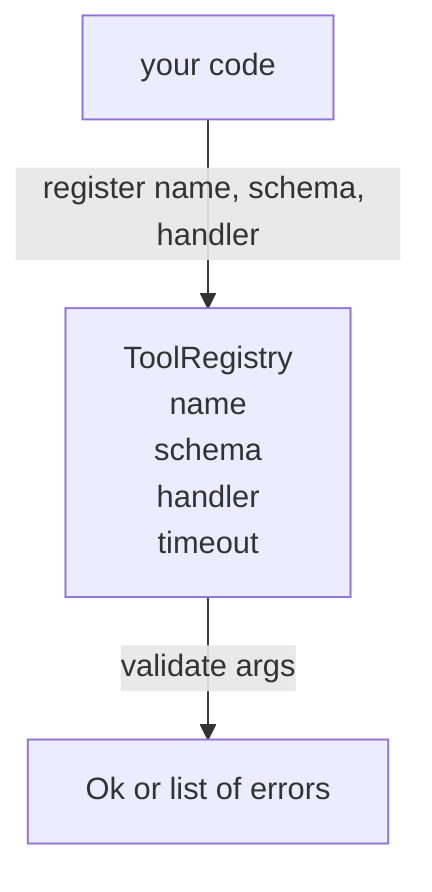

# Registro de ferramentas com validação de esquema

> Uma ferramenta que o agente não pode validar é uma ferramenta que o agente não pode chamar.

**Type:** Build
**Languages:** Python
**Prerequisites:** Phase 13 lessons 01-07, Phase 14 lesson 01
**Time:** ~90 minutes

## Objetivos de aprendizagem
- Mantenha um registo digitado de nome da ferramenta → schema → manipulador que o despachador possa pedir uma vez e confiar depois.
- Implementar um subconjunto JSON Schema 2020-12 que cobre as palavras-chave noventa por cento das chamadas de ferramentas realmente usam.
- Retorna a rota de erro precisa em forma de json-pointer para que o modelo possa auto-corrigir em uma viagem de ida e volta.
- Rejeitar o reinscrição sem a sobreposição explícita, já que as sobreposições silenciosas são a forma como os catálogos de ferramentas de produção se deslocam.
- Mantenha o validador puro (sem I/O, sem tempo, sem globals) para que possa ser reexibido num registro de repetição.

```figure
cf-registry-validate
```

## Por que o registo vem antes da ferramenta

Um agente de codificação em 2026 tem mais ferramentas registradas do que o modelo pode caber em uma única janela de contexto. Um arame não trivial registrará duzentos ferramentas e superficial 10 a 40 em qualquer virada. O registro é a fonte de verdade para "qual é a ferramenta que existe", "que forma tomam os argumentos deles", e "a qual manipulador chamo". Uma vez que essas três respostas são fixadas, o resto do arnes pode parar de adivinhar.

O erro que estamos evitando é o transporte de manipuladores sem esquemas, ou os esquemas de transporte sem validação. Ambos são comuns. Ambos transformam a próxima camada (o despachador na lição vinte e três) em um jogo de adivinhação onde o único modo de falha é um rastro de pilha do manipulador.

## Como é um registro de ferramentas

```text
ToolRecord
  name        : str          (unique, lowercase alphanumeric and underscore segments separated by dots, e.g., snake_case.segment.case)
  description : str          (one line, shown to the model)
  schema      : dict         (JSON Schema 2020-12 subset)
  handler     : Callable     (async or sync, returns Any)
  idempotent  : bool         (dispatcher uses this for retry decisions)
  timeout_ms  : int          (override per-tool dispatcher default)
```

O esquema é o único campo que o validador toca. O processador é opaco para ele. Nós os separamos de propósito. O esquema é dados. O processador é código. Misturando-os tenta-nos a colocar a lógica de validação dentro do processador, que é o bug que estamos a parar.

## O subconjunto JSON Schema 2020-12

A especificação completa para 2020-12 é um artigo. Precisamos de oito palavras-chave.

```text
type           string / number / integer / boolean / object / array / null
properties     map of property name -> schema
required       list of property names
enum           list of allowed primitive values
minLength      integer, applies to strings
maxLength      integer, applies to strings
pattern        ECMA-262-compatible regex, applies to strings
items          schema applied to every array element
```

Isso é suficiente para cobrir o que uma API de ferramenta realmente precisa. As palavras-chave que não estamos adicionando (oneOf, anyOf, allOf, $ref, condicionais) são válidas em esquemas de produção, mas transformam o validador em um caminhador de árvore com ciclos. Estamos construindo um registro, não um mecanismo de esquema JSON.

## Json caminho de erro de ponteiro

Quando a validação falha, o validador retorna uma lista de erros. Cada erro carrega um caminho json-pointer para a entrada. Um ponteiro é uma sequência de nomes de propriedades e índices de matriz prefixada por faixa.

```text
{"a": {"b": [1, 2, "x"]}}
                    ^
                    /a/b/2
```

O modelo lê os caminhos de erro melhor do que as frases.`args.user.email`e o modelo passou um número inteiro, o erro deve ser `/user/email`com`expected_type: string`O modelo corrige isso na próxima chamada sem uma ronda de linguagem natural.

## Registro e revogação

`register(name, schema, handler, **opts)`Rejeita a reinscrição por padrão.`override=True`As duas partes da base de código registando silenciosamente o mesmo nome da ferramenta é o tipo de bug que leva uma semana para encontrar na produção.

O registo expõe três métodos de leitura. `get(name)`Retorna o recorde ou aumenta. `validate(name, args)`Retorna um `Ok`ou uma lista de erros. `names()`Retorna os nomes das ferramentas em ordem de registo.

## O que é e não é o validador

É uma única passagem sobre a árvore de esquema, recorrente. É puro. Não chama manipuladores. Não força tipos (uma cadeia `"42"`Não passa num esquema numérico.

O despachador na lição vinte e três adiciona timeout e camadas de caixa de areia. O registro adiciona forma.

## Forma



## Como ler o código

`code/main.py`define`ToolRegistry`- Não .`ToolRecord`- Não .`ValidationError`O validador envia os dados de um dos dois tipos de dados.`schema["type"]`(ou trata um esquema com `enum`Cada validador de tipo retorna uma lista vazia ou uma lista de `ValidationError`O caminhador de nível superior concatenar erros e prependem segmentos de caminho à medida que desce.

`code/tests/test_registry.py`abrange o registo, a anulação, o sucesso da validação, a falha da validação com os caminhos e todas as palavras-chave do subconjunto.

## Vai mais longe

As duas extensões que você vai querer quando esta lição aterrissamos são`$ref`Resolução contra um bloco de definições locais, e `additionalProperties: false`Mas, como é comum adicionar, o catálogo de ferramentas cresce para além de cinquenta ferramentas.

A próxima lição (vinte e duas) constrói o transporte de estúdio JSON-RPC que faz a superfície deste registro para um cliente modelo.
