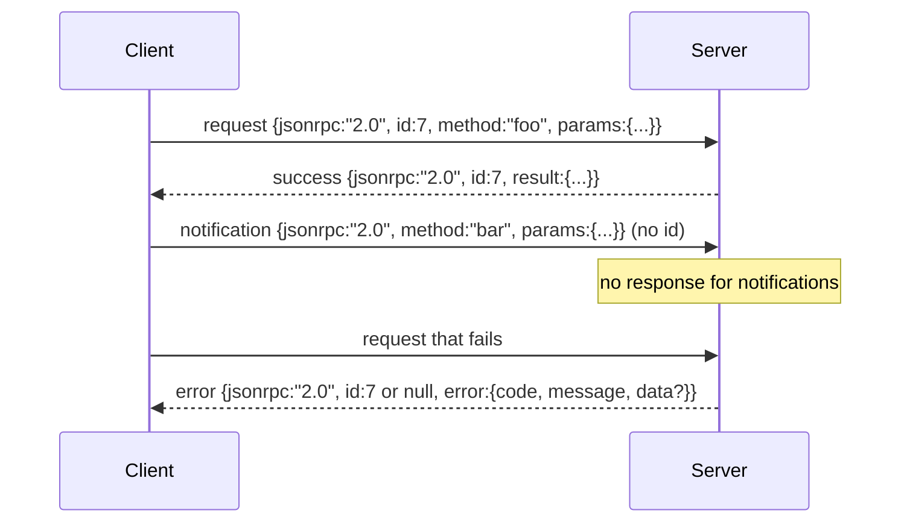

# JSON-RPC 2.0 Over Newline-Delimited Stdio

> O transporte entre um cliente modelo e um servidor de ferramentas é JSON-RPC através do estúdio.

**Type:** Build
**Languages:** Python
**Prerequisites:** Phase 13 lessons 01-07, Phase 14 lesson 01
**Time:** ~90 minutes

## Objetivos de aprendizagem
- Falar JSON-RPC 2.0 enquadrado como JSON de linha nova-delimitada sobre stdin e stdout.
- Mapear os cinco códigos de erro padrão (-32700, -32600, -32601, -32602, -32603) e superficial com a semântica certa.
- Distinguir pedidos, respostas, notificações e lotes sem inventar novas chaves de envelope.
- Manusei um erro de análise por linha sem envenenar o resto do fluxo.
- Construa uma demonstração autotermino usando io.BytesIO para que a lição seja executada sem gerar um processo infantil.

```figure
cf-jsonrpc-frames
```

## Por que o JSON-RPC continua a ser a lingua franca

Um agente de codificação em 2026 conversa com talvez doze servidores de ferramentas numa única sessão. Cada servidor é um processo separado ou um endpoint remoto. O formato de fio é o mesmo desde 2013. JSON-RPC 2.0 é uma especificação de duas páginas. Ele sobrevive porque as alternativas (gRPC, HTTP por chamada, binário personalizado) impõem uma troca JSON-RPC não: eles escolhem streaming ou batching ou transport-coupling. O JSON-RPC é simétrico em estúdio, soquetes, websockets e HTTP, e um cliente pode dirigir um servidor que nunca viu se ambos honrarem a especificação.

Esta lição constrói a variante stdio. JSON de linha nova-delimitada. Cada solicitação é uma linha. Cada resposta é uma linha. O limite de transporte é `\n`- Não .

## A forma do fio

Existem quatro formas de envelope, duas são faladas pelo cliente, duas pelo servidor.



Uma notificação não tem `id`O servidor não deve responder a ele. Se um servidor retorna uma resposta a uma notificação, o cliente não tem forma de ligá-la a um site de chamada. Essa única regra mantém a matemática de enquadramento simples.

Um lote é uma matriz JSON de solicitações ou notificações. O servidor responde com uma matriz de respostas, em qualquer ordem, uma por entrada não notificativa. Se cada entrada no lote é uma notificação, o servidor não envia nada de volta.

## Os cinco códigos de erro

```text
-32700  Parse error      JSON could not be parsed
-32600  Invalid Request  Envelope shape is wrong
-32601  Method not found
-32602  Invalid params
-32603  Internal error
```

Os códigos entre -32000 e -32099 são reservados para erros definidos pelo servidor. Tudo o resto é definido pela aplicação. A lição fica na cinco. Se o seu processador eleva, o transporte o enrola como -32603 com o nome da classe excepcional em `data.exception`- Não .

Um erro de análise tem uma regra especial.`id`A resposta é `null`, porque o pedido nunca foi analisado o suficiente para extrair uma identificação.

## Quadro de linha nova e a demonstração BytesIO

O transporte lê uma linha por vez.`\n`Se uma linha não puder ser analisada, o transporte escreve uma resposta -32700 com `id: null`O fluxo não está envenenado, a linha seguinte é analisada fresca.

Para a lição encerramos um`io.BytesIO`O servidor lê as solicitações até EOF, escreve respostas para cada um e retorna. O cliente lê as respostas de volta. Não há processamento de criação. Não há tempos de saída. O comportamento de transporte é idêntico a um tubo de subprocesso real porque Python `io`interface apresenta o mesmo `.readline()`E ...`.write()`contrato.

## Disposição de método

O transporte não sabe quais métodos existem.`handler(method, params)`O manipulador retorna um resultado ou aumenta.

```text
MethodNotFound -> -32601
InvalidParams  -> -32602
Anything else  -> -32603 with exception name in data
```

O transporte nunca vê um registro de ferramentas. O registro fica atrás do processador. Esta é a camada que queremos. O transporte fala JSON-RPC. O registro fala formas de ferramentas. O dispecer (leção vinte e três) as costura juntas.

## Comportamento de fluxo em erros

```text
client writes              server reads             server writes
---------------            -----------              -------------
{...valid request...}      parses ok                {...response, id matches...}
{...broken json...         parse fails              {id:null, error: -32700}
{...valid request...}      parses ok                {...response, id matches...}
{...missing method...}     invalid envelope         {id:X, error: -32600}
```

Uma linha JSON quebrada não interrompe o ciclo.`method`O campo não interrompe o circuito. Uma exceção do manipulador não interrompe o circuito. O transporte continua a ler até a EOF.

## Notificações e fluxos assimétricos

Uma notificação é de fogo e esquecimento. O arnes usa notificações para eventos de progresso, sinais de cancelamento e linhas de registro.

A lição implementa um assistente de notificação de saída, `write_notification`O servidor usa-o para emitir progressos enquanto uma solicitação está em voo. A demonstração mostra o padrão: uma solicitação entra, o processador emite duas notificações de progresso, em seguida, escreve a resposta final.

## Como ler o código

`code/main.py`define`StdioTransport`, o assistente de análise (`parse_request`), os três assistentes de redacção (`write_response`- Não .`write_error`- Não .`write_notification`), e o ciclo de expedição `serve`As constantes do código de erro estão em vigor no âmbito do módulo.

`code/tests/test_transport.py`abrange os cinco códigos de erro, as notificações (sem resposta escrita), os lotes (arrange in, array out, notificações omitidas), o JSON quebrado (erro de paragem continua), e o fluxo assimétrico em que um processador escreve uma notificação no meio da chamada.

## Vai mais longe

O transporte de produção adiciona três coisas.`id`O canal de cancelamento (uma notificação como `$/cancelRequest`E um contato tipo negociação apertar a mão para que a mesma tomada pode falar JSON-RPC e Streamable HTTP. Nenhum deles muda o fio. Eles adicionam metadados.
