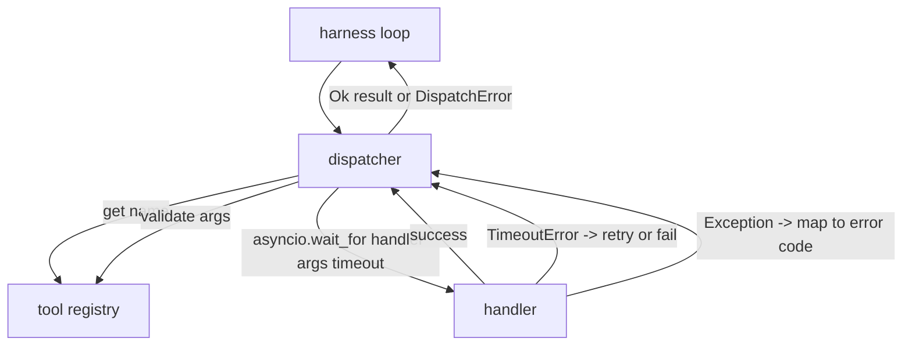
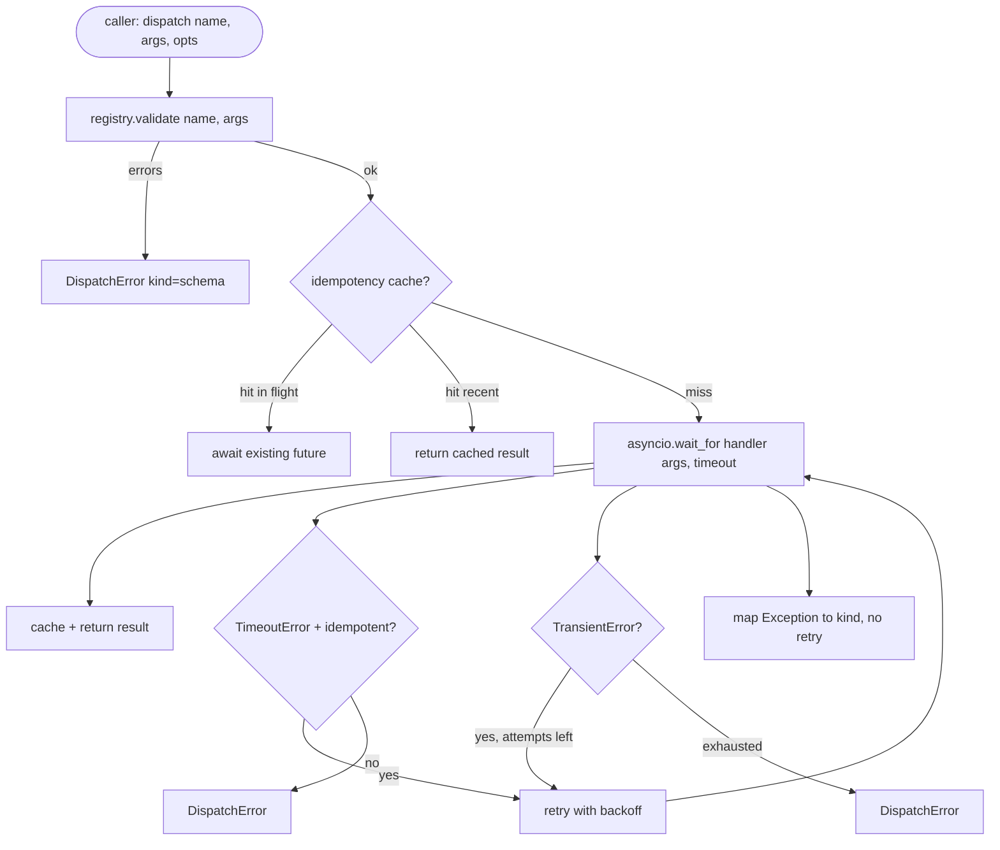

# Dispensador de chamadas de função

> O dispector é onde o arnes paga por todas as promessas feitas pelo esquema, tempo de espera, retemptamentos, dedupção, mapeamento de erros, tudo em uma só função.

**Type:** Build
**Languages:** Python
**Prerequisites:** Phase 13 lessons 01-07, Phase 14 lesson 01
**Time:** ~90 minutes

## Objetivos de aprendizagem
- Envolver um gerador de ferramentas em um timeout por chamada que retorna um erro de digitação em vez de pendurar o loop.
- Aplicar retestes de retrocesso exponenciais com jitter e um número máximo de tentativas.
- Deduplicar retemptadas em uma chave de idempotencia para que uma retemptada que corre com um original lento não seja executada duas vezes.
- As exceções do manipulador de mapas e falhas de transporte em um único envolvente de erro que o loop do arnes já entende.
- Envio paralelo ligado com um limite de simultânea para que um ventilador de quarenta chamadas de ferramenta não esgotar o ciclo de eventos.

```figure
cf-dispatch-retry
```

## Onde o despachador está sentado

Entre o loop de arneses (leção vinte) e o registro de ferramentas (leção vinte e um). O transporte (leção vinte e dois) alimenta o loop. O loop entrega uma chamada de ferramenta ao despachador. O despachador chama o registro, executa o processador e retorna um resultado ou um envelope de erro em forma de JSON-RPC.



O dispecer é a única camada que sabe sobre temporizadores, retries e idempotencia. O loop não sabe. O registo não sabe. O manipulador não sabe. Esse isolamento é o ponto.

## Tempo de execução

Cada ferramenta tem um tempo de espera padrão.`timeout_ms`O despachador desliga-o de uma desligação por chamada quando o arame passa por um.`asyncio.wait_for`No tempo de espera, a tarefa de manipulação é cancelada e o despachador retorna.`DispatchError(kind="timeout")`- Não .

Um timeout não é um erro retryable por padrão para ferramentas não idempotent.`db.write`O despachador honra o despachador e o despachador é o responsável pela entrega de um documento de identidade.`idempotent`As ferramentas idempotentes tentam novamente.

## Retemps com retrocesso exponencial

A política de retest é de três tentativas no máximo.

```text
attempt 1  -> delay 0
attempt 2  -> delay 0.1s * (1 + random[0..0.5])
attempt 3  -> delay 0.4s * (1 + random[0..0.5])
```

Só .`timeout`E ...`transient`Erros retestados.`schema`erro, uma `not_found`, ou um `internal`O erro não é retestado. Os erros de esquema são deterministas.

O ciclo de retest respeita o orçamento do arnes. Se o orçamento do chamador tiver zero chamadas restantes de ferramentas, o despachador falha rapidamente na primeira tentativa e retorna `kind="budget_exceeded"`- Não .

## Determinação da chave de impotência

Uma retenta que dispara enquanto o original ainda está em voo é um erro de produção real. A primeira chamada fica em quatro pontos nove segundos (apenas abaixo do tempo limite). A retenta dispara em cinco segundos. Agora, dois pedidos correm contra o mesmo backend.`payments.charge`- Carregaste duas vezes.

O despachador aceita uma opção .`idempotency_key`Se a mesma chave estiver em voo quando uma chamada chega, o despachador espera o futuro em voo e retorna o seu resultado.

A chave é a responsabilidade do telefonista.`f"{step_id}:{tool_name}:{hash(args)}"`O despachador não inventa chaves, porque derivar uma chave apenas a partir de argumentos faz duas chamadas semanticamente diferentes parecerem as mesmas.

## Envelope de erro

Uma expedição falhada retorna uma única forma.

```text
DispatchError
  kind        : "timeout" | "transient" | "schema" | "not_found" | "internal" | "budget_exceeded"
  message     : str
  attempts    : int
  jsonrpc_code: int   (one of -32601, -32602, -32603)
```

Os mapas do circuito do arame`kind`Para o próximo estado.`schema`E ...`not_found`Vai para o`on_error`e desencadear um replan.`timeout`E ...`transient`Vai para o`on_error`e pode ou não se replanar dependendo das tentativas. `budget_exceeded`Trigers`on_budget_exceeded`- Não .

## Limite de concorrência para o desvio de ventiladores

`gather(*calls)`com quarenta chamadas de ferramenta, ou seja, quarenta tomadas abertas ou quarenta tubos de subprocesso. a maioria dos backends não gosta de quarenta conexões paralelas de um cliente.

O despachador enrola .`gather`O limite de simultânea padrão é oito. Cada chamada adquire o semáforo antes de ser enviado e é liberada no final.`gather`-forma de saída mas a programação real é limitada.

## Flow para uma chamada



## Como ler o código

`code/main.py`define`Dispatcher`- Não .`DispatchError`, e `TransientError`O despachador faz um registo da construção.`dispatch(name, args, ...)`O tempo de entrada é o único ponto de entrada.`_run_with_retries`usando`asyncio.wait_for`- Não .`gather_bounded(calls)`- E o que é? - O que é?

`code/tests/test_dispatcher.py`abrange o timeout, a retest em transiente, a não retest em erro de esquema, a dedupção de idempotencia (dois chamadas simultâneas com o mesmo colapso de chave para uma invocação de manipulador) e a limitação de simultânea (o semáforo em ação).

Os testes usam`asyncio.sleep(0)`e determinista `Counter`- manipuladores baseados, para que terminem em milissegundos e não dependam do tempo do relógio de parede.

## Vai mais longe

Dois extensões de produção de despachadores adicionam. Primeiro, registro estruturado em cada transição (que o fluxo de eventos do loop já lhe dá, mas o despachador também deve emitir `dispatch.attempt`E ...`dispatch.retry`Eventos). Segundo, interruptores de circuito: após N falhas em uma janela, uma ferramenta recebe um período de arrefecimento em que os envio retornam imediatamente com `kind="circuit_open"`Ambos se encaixam no dispecerador sem mudar o contrato.

A lição 24 pega o dispector num agente de planejamento e execução para que vejam as quatro peças em movimento.
