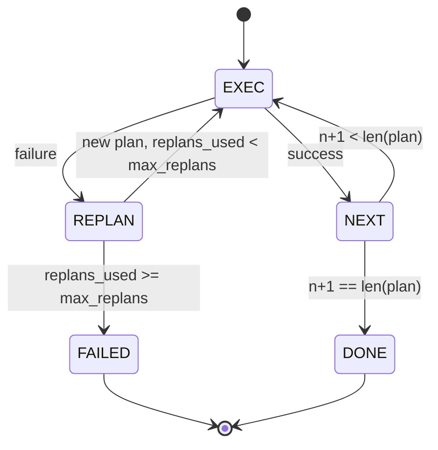

# Fluxo de controlo planeamento-execução

> Um plano que não sobrevive a um fracasso é um script. Um script que pode replanar é um agente.

**Type:** Build
**Languages:** Python
**Prerequisites:** Phase 13 lessons 01-07, Phase 14 lesson 01
**Time:** ~90 minutes

## Objetivos de aprendizagem
- Representa um plano como uma lista ordenada de passos digitados para que o executor possa raciocinar sobre o progresso e o resultado.
- Execute os passos sequencialmente com uma transferência controlada de falha de volta ao planejador.
- Replanar do cursor atual com o erro anterior no contexto para que o próximo plano seja informado.
- Emite um plano diferente em cada revisão para que um rastreador ou UI pode mostrar por que o plano mudou.
- Aplicar dois orçamentos: um teto de degraus rígido e um teto de replanagem rígido.

```figure
cg-plan-replan
```

## Planejar e executar, não ser uma cadeia de pensamentos

Um agente de cadeia de pensamento emite tokens e deixa o loop adivinhar onde a chamada da ferramenta termina. Um agente de plano e execução emite primeiro um plano estruturado, em seguida, executa cada passo deterministicamente. O plano é dados que o arnes pode introspecionar.

Um planejador que produz um plano, um executor que executa o plano, o trabalho interessante é o que acontece quando o executor atinge uma falha.

```text
1. Abort         (return failed, surface the error)
2. Skip          (mark step failed, continue with the rest)
3. Replan        (hand the error to the planner, get a new plan from the cursor)
```

O Replan é aquele que transforma um roteiro em um agente.

## A forma do passo

```text
Step
  id              : int           (monotonic within a plan revision)
  tool_name       : str
  args            : dict
  expected_outcome: str           (planner's stated success condition)
  result          : Any | None
  error           : str | None
```

`expected_outcome`É uma frase curta que o planejador emite ao lado do passo. Não é aplicada pelo executor. É para duas coisas: o replanejador lê-a ao revisar o plano; o fluxo de eventos emite-a para que um rastreador possa mostrar "este passo deveria fazer X".

## A forma do planejador

```python
def planner(goal: str, history: list[Step], last_error: str | None) -> list[Step]:
    ...
```

Uma função pura.`goal`é o objetivo do utilizador. `history`é a fase já executada (com resultados e erros preenchidos). `last_error`Não é nenhum na primeira chamada e a mensagem de falha mais recente em cada chamada subsequente. O planejador retorna o plano seguinte a partir do cursor.

O planeador não sabe do executor, não sabe das retemptadas, não sabe dos tempos de saída, produz um plano, é tudo.

## O executor

O executor é uma pequena máquina de estado. Cada passo passa pelo dispector. O resultado é uma das três coisas: sucesso, falha-replanável, falha-fatal. falhas replanáveis devolver ao planejador. falhas fatais (orçamentamento excedido, o teto de replan atingido) retornar um `FAILED`Resultado da sessão.



## Diferenças de plano em revisão

Quando o planejador retorna um novo plano após um fracasso, o executor emite um `plan.diff`evento com três campos.

```text
removed: list of step ids that were in the old plan and are not in the new
added  : list of step ids in the new plan that were not in the old
revised: list of step ids whose tool_name or args changed
```

Um tracer ou UI pode render isso como um golpe sobre as etapas removidas e um destaque sobre as adicionadas.

## Dois orçamentos, ambos difíceis.

`max_steps`O plano linear de cinco etapas que replaneja duas vezes e adiciona três etapas cada vez que atinge dezesseis execuções e excederia o orçamento. O executor recusará o replanejamento e retornará FAILED.

`max_replans`O plano de planejamento é o de cinco vezes, o que significa que o plano de planejamento é o de cinco vezes, o que significa que o plano de planejamento é o de cinco vezes, o que significa que o plano de planejamento é o de cinco vezes, o que significa que o plano de planejamento é o de cinco vezes, o que significa que o plano de planejamento é o de cinco vezes, o que significa que o plano de planejamento é o de cinco vezes, o que significa que o plano de planejamento é o de cinco vezes, o que significa que o plano de planejamento é o de cinco vezes, o que significa que o plano de planejamento é o de cinco vezes, o que significa que o plano de planejamento é o de cinco vezes, o que significa que o plano de planejamento é o de cinco vezes, o que significa que o plano de planejamento é o de cinco vezes, o que significa que o plano de planejamento é o de cinco vezes, o que significa que o plano de planejamento é mais rápido e o motivo é mais claro.

## O planejador determinista nesta lição

Não chamamos um modelo nesta lição, mas a lição envia um planejador determinista que escolhe um plano baseado em`last_error`- Não .

```text
last_error is None    -> emit a four-step plan
last_error matches X  -> emit a three-step plan that routes around X
last_error matches Y  -> emit a two-step plan that gives up gracefully
otherwise             -> return [] (signals nothing to replan)
```

Isto é suficiente para testar o comportamento do executor em cada caminho de transição: sucesso, replan-once, replan-two, replan-exhaustão, e passo-orçamento de orçamento.

## Forma do resultado

```text
SessionResult
  status      : "completed" | "failed"
  reason      : str     ("goal_met" | "step_budget" | "replan_budget" | "no_plan")
  history     : list[Step]
  revisions   : list[PlanDiff]
  events      : list[Event]
```

O circuito de arnes da lição vinte pode ler isso diretamente. O dispector da lição vinte e três é o que executa cada passo. O registo da lição vinte e um valida os args de cada passo. O transporte da lição vinte e dois fará a superfície de todo esse fluxo sobre JSON-RPC para um cliente modelo.

## Como ler o código

`code/main.py`define`PlanExecuteAgent`- Não .`Step`- Não .`PlanDiff`- Não .`SessionResult`O executor é um único.`run(goal)`método que retorna um `SessionResult`O plano diferencial é calculado comparando os ids de etapa e `(tool_name, args)`- Túples.

`code/tests/test_agent.py`O programa de trabalho de um grupo de trabalho de trabalho de trabalho de trabalho de trabalho de trabalho de trabalho de trabalho de trabalho de trabalho de trabalho de trabalho de trabalho de trabalho de trabalho de trabalho de trabalho de trabalho de trabalho de trabalho de trabalho de trabalho de trabalho de trabalho de trabalho de trabalho de trabalho de trabalho de trabalho de trabalho de trabalho de trabalho de trabalho de trabalho de trabalho de trabalho de trabalho de trabalho de trabalho de trabalho de trabalho de trabalho de trabalho de trabalho de trabalho de trabalho de trabalho de trabalho de trabalho de trabalho de trabalho de trabalho de trabalho de trabalho de trabalho de trabalho de trabalho de trabalho de trabalho de trabalho de trabalho de trabalho de trabalho de trabalho de trabalho de trabalho de trabalho de trabalho de trabalho de trabalho de trabalho de trabalho de trabalho de trabalho de trabalho de trabalho de trabalho de trabalho de trabalho de trabalho de trabalho de trabalho de trabalho de trabalho de trabalho de trabalho de trabalho de trabalho de trabalho de trabalho de trabalho de trabalho de trabalho de trabalho de trabalho de trabalho de trabalho de trabalho de trabalho de trabalho de trabalho de trabalho de trabalho de trabalho de trabalho de trabalho de trabalho de trabalho de trabalho de trabalho de trabalho de trabalho de trabalho de trabalho de trabalho de trabalho de trabalho de trabalho de trabalho de trabalho de trabalho de trabalho de trabalho de trabalho de trabalho de trabalho de trabalho de trabalho de trabalho de trabalho de trabalho de trabalho de trabalho de trabalho de trabalho de trabalho de trabalho de trabalho de trabalho de trabalho de trabalho de trabalho de trabalho de trabalho de trabalho de trabalho de trabalho de trabalho de trabalho de trabalho de trabalho de trabalho de trabalho de trabalho de trabalho de trabalho de trabalho de trabalho de trabalho de trabalho de trabalho de trabalho de trabalho de trabalho de trabalho de trabalho de trabalho de trabalho de trabalho de trabalho de trabalho de trabalho de trabalho de trabalho de trabalho de trabalho de trabalho de trabalho de trabalho de trabalho de trabalho de trabalho de trabalho de trabalho de trabalho de trabalho de trabalho de trabalho de trabalho de trabalho de trabalho de trabalho de trabalho de trabalho de trabalho de trabalho de trabalho de trabalho de trabalho de trabalho de trabalho de trabalho de trabalho de trabalho de trabalho de trabalho de trabalho de trabalho de trabalho de trabalho de trabalho de trabalho de trabalho de trabalho de trabalho de trabalho de trabalho de trabalho de trabalho de trabalho de trabalho de trabalho de trabalho de trabalho de trabalho de trabalho de trabalho de trabalho de trabalho de trabalho de trabalho de trabalho de trabalho de trabalho de trabalho de trabalho de trabalho de trabalho de trabalho de trabalho de trabalho de trabalho de trabalho de trabalho de trabalho de trabalho de trabalho de trabalho de trabalho de trabalho de trabalho de`failed:replan_budget`, o esgotamento de orçamento por etapas e o formato do evento de diferença de planos.

## Vai mais longe

Dois extensões que você vai querer uma vez que você conectar este para um modelo real. Primeiro, caching de plano parcial: quando um plano é bem sucedido para as três primeiras de seis etapas e depois falha, você não quer executar novamente as três primeiras. O executor já mantém o histórico; o planejador só precisa lê-lo. Segundo, ramos paralelos: o executor atual é estritamente sequencial. Um planejador que emite um ramo independente (`gather_step`Em vez de`next_step`) pode executar duas chamadas de ferramenta simultaneamente através do despachador.

Ambos adicionam complexidade real. Ambos são mais fáceis de adicionar uma vez que o executor linear é fixado.
