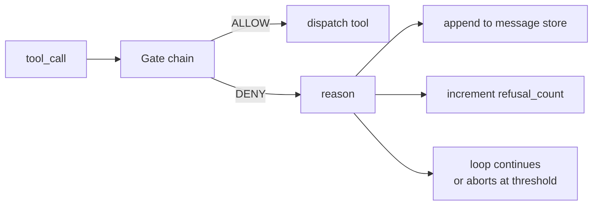
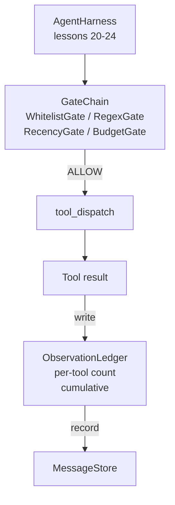

# Lição de Capstone 25: Portas de Verificação e Orçamento de Observação

> Um arame de agente sem uma camada de verificação é um desejo num casaco de trincheira. Esta lição constrói a cadeia de portas determinista que decide se uma chamada de ferramenta é permitida disparar, quanto de sua saída o agente é permitido ver, e quando o loop tem que parar porque o agente leu demais. A cadeia é uma função de pequenos portões nomeados mais um livro de observação que rastreia cada token que o modelo foi mostrado.

**Type:** Build
**Languages:** Python (stdlib)
**Prerequisites:** Phase 19 · 20-24 (Track A1: agent loop, tool registry, message store, prompt builder, model router), Phase 14 · 33 (instructions as constraints), Phase 14 · 36 (scope contracts), Phase 14 · 38 (verification gates)
**Time:** ~90 minutes

## Objetivos de aprendizagem

- Construir um`VerificationGate`Protocolo com determinista`evaluate(call)`- O método.
- Compõem o orçamento, recência, lista branca e regex gates em uma cadeia com semântica de curto circuito.
- Seguir todas as observações através de um `ObservationLedger`teclado por ferramenta e virar.
- Recusar uma chamada de instrumentos quando o orçamento de observação acumulado for excedido.
- Superfície de um estruturado`GateDecision`registar que a observabilidade a jusante pode ingerir.

## O problema

Quando um arnês de agente permite que o modelo convoque as ferramentas livremente, três classes de bugs aparecem dentro da primeira hora de uso real.

O primeiro é a observação ilimitada. Um grep em um repo de linha 200K descarta meio milhão de tokens de saída para a próxima rodada. O modelo vê uma correspondência por kilobite e o resto do contexto é desperdiçado. A conta de token é grande e o agente agora é pior, não melhor, na tarefa.

A segunda é a recência obsoleta. Uma tarefa de longa duração acumula cinquenta chamadas de ferramentas. O modelo lê novamente o primeiro read_file da terceira curva como se fosse estado ao vivo. As edições feitas na curva quarenta e sete nunca aparecem porque o criador de prompt serializou as primeiras observações primeiro.

A terceira é o "privilegio creep". Uma tarefa de investigação começa por ligar`web_search`, e depois , de alguma forma , acaba por fugir .`shell`Porque o modelo inventou um nome de ferramenta e o arnes foi deletado para permissivo. Quando alguém lê o rastro, um arquivo lixo está sentado em /tmp e um curl correu contra uma API privada.

Uma porta de verificação é o componente do arnes que diz não. Não é um modelo. Não é um juiz. É uma função determinista de `(call, history, ledger)`O modelo é contado, o ciclo continua ou se aborta.

## O conceito



Um portão é qualquer coisa com um`evaluate(call, ctx) -> GateDecision`O sistema de avaliação é um sistema de dados de ordem, que é um sistema de dados de ordem, que é um sistema de dados de ordem, que é um sistema de dados de ordem, que é um sistema de dados de ordem, que é um sistema de dados de ordem, que é um sistema de dados de ordem, que é um sistema de dados de ordem, que é um sistema de dados de ordem, que é um sistema de dados de ordem, que é um sistema de dados de ordem, que é um sistema de dados de ordem, que é um sistema de dados de ordem, que é um sistema de dados de ordem, que é um sistema de dados de ordem, que é um sistema de dados de ordem, que é um sistema de dados de ordem, que é um sistema de dados de ordem, que é um sistema de dados de ordem, que é um sistema de dados de ordem, que é um sistema de dados de ordem, que é um sistema de dados de ordem, que é um sistema de dados de ordem, que é um sistema de dados de ordem, que é um sistema de dados de contabilidade, que é um sistema de contabilidade, que é um sistema de contabilidade, que é um sistema de contabilidade, que é um sistema de contabilidade, que é um sistema de contabilidade, que é um sistema de contabilidade, que é um sistema de contabilidade, que é um sistema de contabilidade, que é um sistema de contabilidade, que é um sistema de contabilidade, que é um sistema de contabilidade, que é um sistema de contabilidade, que é um sistema de contabilidade, que é um sistema de contabilidade, que é um sistema de contabilidade, que é um sistema de contabilidade, que é um sistema de contabilidade, que é um sistema de contabilidade, que é um sistema de contabilidade, que é, que é um sistema de acordo com o que é, que é, é, e que é, é, é, é, é, é, é, é, é, é, é, é, é, é, é, é, é, é, é, é, é, é, é, é, é, é, é, é, é, é, é, é, é, é, é, é, é, é, é, é, é, é, é, é, é, é, é, é, é, é, é, é, é, é,

Esta lição tem quatro portas:

- `WhitelistGate`Os nomes permitidos são um conjunto explícito. Tudo fora é negado. Este é o portal mais barato e é executado primeiro.
- `RegexGate`. Argumentos de ferramenta são combinados com um regex. Útil para recusar chamadas shell com `rm -rf`- É só a carga útil das chamadas.
- `RecencyGate`O modelo só vê observações das últimas curvas N. As observações mais antigas são mascaradas. O portal recusa uma chamada de ferramenta cujo resultado estenderia uma janela de observação que já está envelhecida.
- `BudgetGate`Os tokens acumulados que o modelo leu durante a sessão têm um limite.

O livro de observação é a contabilidade. Cada chamada de ferramenta bem-sucedida escreve uma linha: nome da ferramenta, turno, tokens emitidos, cumulativo. O livro de conta responde a duas perguntas: quanto o modelo viu total e quanto viu da ferramenta X. O portão orçamental lê o primeiro. Um portão orçamental por ferramenta, que você escreverá como um exercício, lê o segundo.

```figure
cg-gate-chain
```

## Arquitetura



O arnes pede à cadeia. A cadeia faz o guiño ou recusa. Se o guiño faz, a ferramenta é executada, o livro conta e o resultado é anexado ao armazém de mensagens. Se o arneso recusa, o modelo recebe a recusa como uma mensagem do sistema e o loop decide se tentar ou abortar novamente.

## O que você vai construir

A execução é única `main.py`- E os testes.

1. `Observation`E ...`ToolCall`As classes de dados definem as formas de fio.
2. `ObservationLedger`registos`(turn, tool, tokens)`linhas e respostas `cumulative()`E ...`per_tool(name)`- Não .
3. `GateDecision`Carrega`(allow, reason, gate_name)`- Não .
4. `VerificationGate`Cada porta implementa o protocolo.`evaluate(call, ctx)`- Não .
5. `GateChain`liga a cada porta, retorna a primeira negação ou retorna permitem se cada porta passa.
6. A demonstração faz um pequeno ciclo de agentes sintéticos, três voltas, a terceira volta abate o portão de orçamento e o ciclo relata uma recusa limpa com um número de recusa não zero.

O contador de símbolos é intencionalmente um estúpido .`len(text) // 4`O ponto desta lição é a canalização do portão, não o tokenizer.

## Por que a ordem da cadeia importa

Uma negação é mais barata do que uma autorização.`WhitelistGate`corre em O(1) hash search. `RegexGate`corre em O(patrão * argv). `RecencyGate`lê uma pequena fatia da loja de mensagens. `BudgetGate`O que é que você faz com que o preço suba, para que uma chamada recusada seja cortada antes de fazer o trabalho caro.

O que é mais importante é que o sistema de controlo de dados seja um sistema de controlo de dados que, em qualquer caso, seja o mais eficaz e eficaz possível, e que seja o mais eficaz.

## Como isto se compõe com o resto da pista A

As lições anteriores deram-lhe o loop, o registro de ferramentas, o armazém de mensagens, o construtor de prompt e o modelo de roteador. Esta lição acrescenta a camada entre o modelo e as ferramentas. Lição 26 envia a caixa de areia que o despachador entrega a chamada de ferramenta àquele que a cadeia de portas diz PERMIS. A lição 27 envia o arame de avaliação que registra a recusa conta como um sinal de qualidade. A lição 28 liga as decisões do portal para os espaços da OpenTelemetry. A lição 29 coloca o lote num agente de codificação em funcionamento.

## - Estou a executá-lo.

```bash
cd phases/19-capstone-projects/25-verification-gates-observation-budget
python3 code/main.py
python3 -m pytest code/tests/ -v
```

A demonstração imprime um rastro turno a turno incluindo cada decisão de porta e sai de zero. Os testes cobrem o livro, cada porta isolada, o curto-circuito da cadeia e o loop sintético de ponta a ponta.
