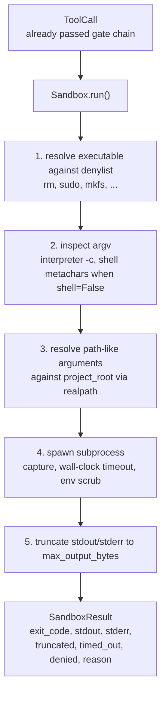
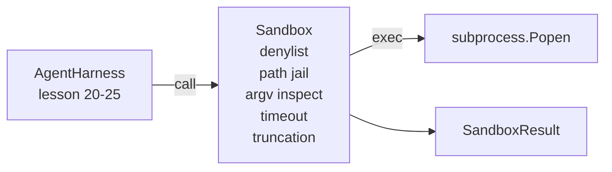

# Lição de Capstone 26: Corredor de Sandbox com Denylist e Path Prison

> O portal de verificação decide se deve ser executada uma chamada de ferramenta. A caixa de areia decide o que acontece quando o faz. Esta lição envia um subprocesso que recusa executáveis perigosos, recusa formas perigosas de argv, prende todos os caminhos de arquivo para uma raiz do projeto, truncada de saída de tamanho excessivo, e mata processos fugitivos em um tempo de tempo de relógio de parede. É a segunda das duas camadas que se encontram entre o modelo e o sistema operacional.

**Type:** Build
**Languages:** Python (stdlib)
**Prerequisites:** Phase 19 · 25 (verification gates and observation budget), Phase 14 · 33 (instructions as constraints), Phase 14 · 38 (verification gates)
**Time:** ~90 minutes

## Objetivos de aprendizagem

- Construir um`Sandbox`embalagem de classe `subprocess.run`com tempo de espera, captura e truncamento.
- Recusar um comando por nome contra um denilista e por estrutura contra um inspetor de argv.
- Rejeitar qualquer argumento de caminho que resolva fora de uma raiz do projeto declarada.
- Rejeitar metacaráteres de shell quando o modo shell estiver desligado.
- Retorna um estruturado `SandboxResult`que a observabilidade a jusante e o arnês de avaliação podem ingerir.

## O problema

Um agente de codificação que pode ser desbloqueado pode instalar portas traseiras, exfiltrar chaves, construir um laptop de desenvolvedor e juntar uma conta de nuvem em uma única vez. A defesa menos cara é não dar um shell.

Três classes de falhas recorrem nas pistas dos agentes.

O primeiro é executável perigoso. Um modelo sob pressão para corrigir um problema de caminho vai tentar.`sudo`- Não .`chmod -R 777`- Não .`rm -rf`- Não .`mkfs`- Não .`dd`Nenhum deles pertence a uma corrida de agentes.

O segundo é o truque de argv. Um modelo que não tem conchas, vai fazer um ataque através de um intérprete.`python3 -c "import os; os.system('rm -rf /')"`- Não .`bash -c '...'`- Não .`node -e '...'`- Não .`perl -e '...'`A caixa de areia precisa saber que qualquer intérprete corre com um`-c`- como a bandeira é apenas uma chamada de shell com passos extras.

O terceiro é a fuga do caminho.`./src/main.py`e em vez disso lê`../../etc/passwd`A caixa de areia prende todos os argumentos resolvendo-os através de um caminho .`os.path.realpath`e a afirmação do prefixo.

A caixa de areia não é um limite de segurança no sentido do sistema operacional. Um atacante determinado com execução de código ainda pode quebrar. A caixa de areia é um guarda-roupa de desenvolvimento: ele faz os modos comuns de falha ruidosos e impede o agente de fazer danos por pura ineptitude.

## O conceito



A caixa de areia tem quatro eixos de recusa: nome, argv, caminho, estrutura. Cada eixo é uma função pura da chamada, não há subprocesso ainda. O subprocesso só gerou depois de cada eixo passou.

O `SandboxResult`Os códigos de saída são os convencionais: 0 sucesso, falha não zero, mais três códigos sentinela para negado (-100), timed_out (-101), e truncado (o código de saída é o real, com um conjunto de bandeiras).

```figure
cg-path-jail
```

## Arquitetura



O denilista é um conjunto de nomes base executables.`/bin/rm`- Não .`/usr/bin/rm`O inspector argv conhece a forma do intérprete: qualquer argv em que argv[0] é um intérprete e qualquer arg posterior começa com `-c`ou `-e`O sistema de dados de dados de dados de dados de dados de dados de dados de dados de dados de dados de dados de dados de dados de dados de dados de dados de dados de dados de dados de dados de dados de dados de dados de dados de dados de dados de dados de dados de dados de dados de dados de dados de dados de dados de dados de dados de dados de dados de dados de dados de dados de dados de dados de dados de dados de dados de dados de dados de dados de dados de dados de dados de dados de dados de dados de dados de dados de dados de dados de dados de dados de dados de dados de dados de dados de dados de dados de dados de dados de dados de dados de dados de dados de dados de dados de dados de dados de dados de dados de dados de dados de dados de dados de dados de dados de dados de dados de dados de dados de dados de dados de dados de dados de dados de dados de dados de dados de dados de dados de dados de dados de dados de dados de dados de dados de dados de dados de dados de dados de dados de dados de dados de dados de dados de dados de dados de dados de dados de dados de dados de dados de dados de dados de dados de dados de dados de dados de dados de dados de dados de dados de dados de dados de dados de dados de dados de dados de dados de dados de dados de dados de dados de dados de dados de dados de dados de dados de dados de dados de dados de dados de dados de dados de dados de dados de dados de dados de dados de dados de dados de dados de dados de dados de dados de dados de dados de dados de dados de dados de dados de dados de dados de dados de dados de dados de dados de dados de dados de dados de dados de dados de dados de dados de dados de dados de dados de dados de dados de dados de dados de dados de dados de dados de dados de dados de dados de dados de dados de dados de dados de dados de dados de dados de dados de dados de dados de dados de dados de dados de dados de dados de dados de dados de dados de dados de dados de dados de dados de dados de dados de dados de dados de dados de dados de dados de dados de dados de dados de dados de dados de dados de dados de dados de dados de dados de dados de dados de dados de dados de dados de dados de dados de dados de dados de dados de dados de dados de dados de dados de dados de dados de dados de dados de dados`;`- Não .`|`- Não .`&`- Não .`>`- Não .`<`, costas,`$()`) causa recusa quando a chamada não solicitou explicitamente um concha.

A prisão de caminho é a peça mais sutil.`project_root`Qualquer argumento que pareça um caminho (conte`/`O processo de avaliação de dados (ou de correspondência a um ficheiro existente) é normalizado através de `os.path.realpath`, então verificado contra o realpath da raiz do projeto. Se o alvo resolvido não está sob a raiz, recusa. As tentativas de fuga do Symlink (um link simulante na raiz do projeto que aponta para fora) são bloqueadas verificando o realpath, não o caminho literal.

## O que você vai construir

A execução é `main.py`E um teste de DIR.

1. `SandboxResult`Dataclass: exit_code, stdout, stderr, truncado, timed_out, negado, razão, duração_ms.
2. `SandboxConfig`Dataclass: project_root, max_output_bytes, timeout_seconds, denylist, interpreter_block.
3. `Sandbox`classe: `run(argv, *, shell=False, cwd=None)`Retorna um `SandboxResult`- Não .
4. Auxiliares internos de recusa: `_check_executable_denylist`- Não .`_check_argv_interpreter`- Não .`_check_shell_metachars`- Não .`_check_path_jail`- Não .
5. Truncation de saída com um claro `truncated`bandeira e uma linha marcante no fluxo capturado.
6. Demo na parte inferior: uma sequência de chamadas legítimas e adversárias.

A caixa de areia usa `subprocess.run`com`shell=False`por defeito e `capture_output=True`O tempo de espera do relógio de parede usa o`timeout`- o artigo 2.o`TimeoutExpired`, a caixa de areia mata o grupo de processo e sintetiza um Result de Sandbox.

## Porque não é uma caixa de areia real?

A caixa de areia de lição não usa espaços de nomes, cgroups, seccomp, gVisor, Firecracker ou qualquer isolamento de nível de kernel. Tudo o que o subprocesso pode fazer, a caixa de areia pode fazer. A proteção é estrutural: o agente é negado as invocações perigosas mais comuns, e a recusa alta entra em observabilidade em vez de correr silenciosamente.

Para agentes de produção você coloca em cima: executa dentro de um recipiente Docker não privilegiado, executa dentro de uma microVM, solte recursos, monte o projeto raiz somente leitura e um arranhão dir leitura-escrita, definir limite na memória e CPU, esfregar o ambiente para uma lista branca segura conhecida.

## - Estou a executá-lo.

```bash
cd phases/19-capstone-projects/26-sandbox-runner-denylist
python3 code/main.py
python3 -m pytest code/tests/ -v
```

A demonstração cria um diretório temporário, coloca um arquivo limpo nele, em seguida, executa uma bateria de chamadas. chamadas legais são bem sucedidas. chamadas negadas retornar SandboxResult com `denied=True`E uma razão.`timed_out=True`- Setos de truncamento`truncated=True`A demonstração imprime uma tabela JSON de resultados e sai de zero.

## Como isto se compõe com o resto da pista A

A lição 25 produziu a cadeia de gate. A lição 26 é o executor que executa após um gate ALLOW. O valor de avaliação da lição 27 compara os resultados da caixa de areia com o código de saída esperado por tarefa.`gen_ai.tool.execution`Espanha em torno de cada um `Sandbox.run`A demonstração de ponta a ponta da lição 29 transmite um agente de codificação através de ambas as camadas.
