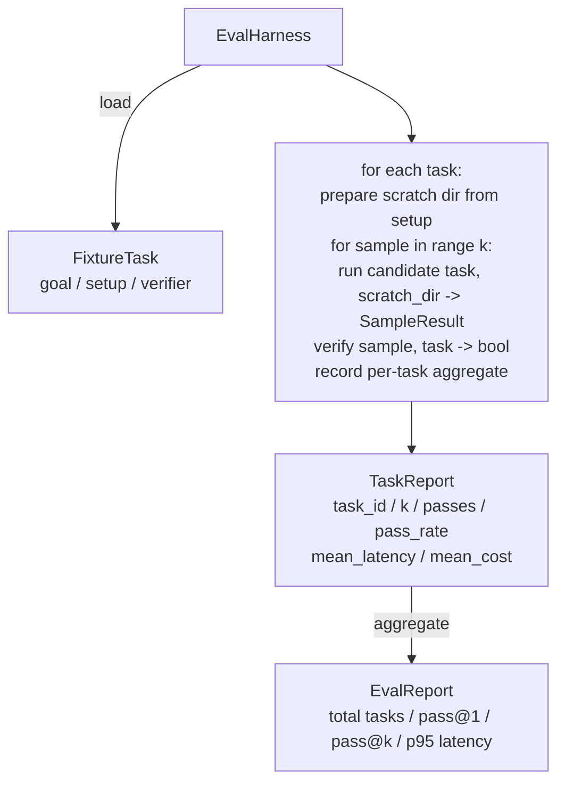

# Lição de Capstone 27: Arranja igual com tarefas fixas

> Um agente de codificação é tão bom quanto o conjunto de tarefas contra as quais o medes. Esta lição constrói um arame de avaliação que toma uma pasta de tarefas de fixação, executa cada uma através de um agente candidato, as pontuações passam ou falham através de um verificador determinístico, e agrega os resultados em pass@1, pass@k, latência média e custo médio. O arame é a fonte da verdade que permite dizer uma regressão de um refator.

**Type:** Build
**Languages:** Python (stdlib)
**Prerequisites:** Phase 19 · 25 (verification gates), Phase 19 · 26 (sandbox runner), Phase 14 · 30 (eval-driven agent development), Phase 14 · 19 (SWE-bench and GAIA benchmarks)
**Time:** ~90 minutes

## Objetivos de aprendizagem

- Defina uma tarefa fixa como um triplo de meta, configuração e verificador.
- Marque várias corridas de amostra por tarefa e compute pass@1 e pass@k.
- A latência e o custo são agregados em métricas médias e 95 percentiis.
- Verificadores determinísticos de fios (diferência de arquivo, código de saída, correspondência regex) em funções reutilizáveis.
- Emite um relatório JSON estruturado que um script de rastreamento de regressão possa ingerir.

## O problema

Três modos de falha de agentes de praga de referência construídos sem um arnés de avaliação.

O agente diz que corrigido o bug, os olhares humanos no diferencial, o conjunto é marcado de verde, e três semanas depois o teste de regressão aparece o mesmo bug.

A segunda é a regressão não detectada. Uma mudança no modelo de prompt faz com que o agente seja 4% melhor na tarefa alta e 14% pior na silenciosa. Sem um conjunto de ouro e uma pontuação por tarefa, a regressão entra no principal e surge apenas quando um cliente se queixa.

A terceira é a deriva por tarefa. A avaliação foi realizada na segunda-feira com 100 tarefas e na sexta-feira com 95 delas, porque alguém renomeou cinco equipamentos. A taxa de aprovação parece uma melhoria de 5%.

O arnes é o programa que transforma essas falhas em fatos, e corre cada vez, em uma ordem reprodutiva, contra um verificador que retorna verdade ou falso numa verificação determinista.

## O conceito

```mermaid
flowchart LR
  F1[fixtures/task_001/<br/>task.json + expected/] --> Harness
  F2[fixtures/task_002/<br/>...] --> Harness
  Harness[Harness<br/>for each task:<br/>setup / run agent k samples /<br/>verify each sample /<br/>record latency, cost]
  Harness --> Report[EvalReport<br/>pass@1 / pass@k<br/>mean ms / p95 ms<br/>mean cost]
```

A.`FixtureTask`é um pequeno arquivo JSON mais um opcional `expected/`O JSON declara um`id`, a `goal`(a indicação enviada ao agente), um `setup`Bloco (arquivos para cair no rescaldo dir), e um `verifier`Bloco: o bloco de verificação nomeia uma função no registo de verificação do arnes e fornece os seus argumentos.

Três formas de verificador cobrem a maioria das tarefas úteis.

O primeiro é:`file_equals`Depois que o agente for executado, compare um arquivo com nome com um conteúdo esperado.

O segundo é:`regex_match`O conteúdo do arquivo nomeado é combinado com um regex. Isto capta "a função deve existir e retornar X" tarefas onde existem muitas soluções aceitáveis.

O terceiro é:`shell_exit_zero`O arnes executa um comando de shell (através da caixa de areia da lição 26) e passa a tarefa somente se o comando sair de zero.

O arame executa todas as tarefas .`k`Pass@k é `1 - (1 - p)^k`onde p é a taxa de passagem empírica; o arnes também relata contagens brutas para que você possa detectar a variância. A latência é o relógio de parede por amostra. O custo é o que o agente auto-reporte (contagem de tokens, USD ou ambos); o arnes soma-o entre as amostras e apresenta os números por tarefa e agregados.

```figure
pass-at-k
```

## Arquitetura



O candidato é um convocável:`Callable[[FixtureTask, str], SampleResult]`O arnes cria o diretório de arranhões através de`tempfile.mkdtemp()`O arnes não se importa como o candidato funciona. O candidato pode ser um aplicador de parches deterministas (útil para auto-testes de arneses), um agente real de LLM, um fuzzer. O contrato é o SampleResult.

## O que você vai construir

`main.py`Navios:

1. `FixtureTask`Dataclass.
2. `SampleResult`Dataclass: success_self_reported, latência_ms, cost_units, edições.
3. `TaskReport`- Não .`EvalReport`Classe de dados com `to_dict()`- Não .
4. `VerifierRegistry`Verificadores integrados: file_equals, regex_match, shell_exit_zero.
5. `EvalHarness`- Classe. Executa um diretório de tarefas contra um candidato. Retorna o EvalReport.
6. Cinco tarefas de fixação em conjunto `tasks/`- Não .
   - - Um por um .`fizzbuzz`
   - - Não .`factorial`
   - erro de digitação na mensagem de erro
   - corpo de função vazia
   - Oficinas de transmissão de lista ligada
7. Um candidato de referência determinista (`apply_known_fixes`) o arame utiliza para demonstrar uma passagem limpa@1 de 1.0.
8. A demo imprime o JSON do EvalReport e sai do zero.

As tarefas de fixação são agrupadas como arquivos JSON em `tasks/`+ ficheiros de origem em par`tasks/<id>/buggy/`E ...`tasks/<id>/expected/`O arneses copia o buggy num rescalço, entrega-o ao candidato e verifica contra o esperado.

## Por que pass@k e não apenas pass@1

Os agentes de LLM reais são estocásticos. Um pass@1 de 0,6 parece um fracasso. Um pass@5 de 0,95 diz que o agente recebe a resposta certa a maior parte do tempo, mas está escolhendo errado em amostras iniciais. A solução é a amostragem e classificação, não sempre mais treinamento. Pass@k torna isso visível.

Pass@k é relatado ao lado de pass@1 porque pass@k apresenta uma falha real: se o modelo recebe a resposta certa uma vez em vinte tentativas, você não tem um agente útil.

## Como isto se compõe com o resto da pista A

A lição 25 produziu a cadeia de portas. A lição 26 produziu a caixa de areia.`shell_exit_zero`A lição 28 envolve cada arneses executados em um rastro OTel. A lição 29 executa a demonstração de ponta a ponta contra um dos dispositivos em conjunto e afirma pass@1 = 1,0 para o candidato de referência.

## - Estou a executá-lo.

```bash
cd phases/19-capstone-projects/27-eval-harness-fixture-tasks
python3 code/main.py
python3 -m pytest code/tests/ -v
```

A demonstração imprime o EvalReport em JSON, incluindo pass@1, pass@5, latencia média e desvio por tarefa. O código de saída é zero. Os testes cobrem as funções de verificador, a matemática pass@k, carregamento de dispositivos e o arnes de ponta a ponta contra o candidato de referência em conjunto.
