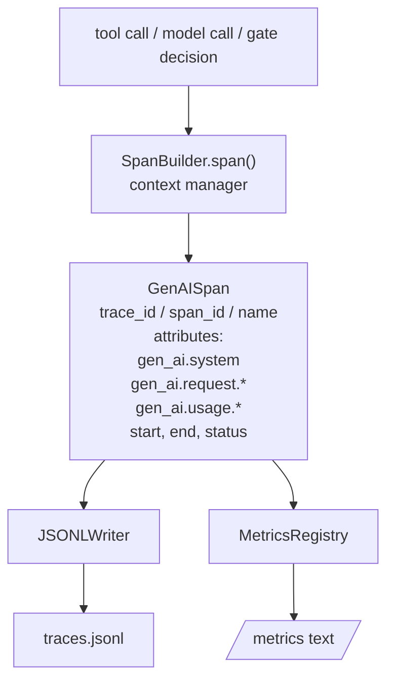
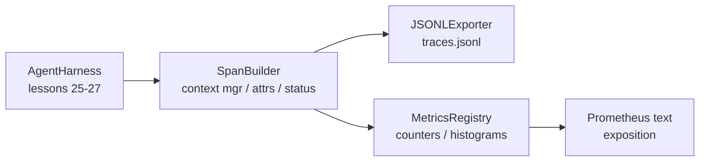

# Lição de Capstone 28: Observabilidade com OTel GenAI Spans e Metricas Prometheus

> Um arnes de agente sem observabilidade é uma caixa preta que custa dinheiro. Esta lição rola manualmente um construtor de espaço que emite registros compatíveis com as convenções semânticas OpenTelemetry GenAI, escreve-os para um arquivo JSON-Lines um espaço por linha, e expõe contadores e histogramas no formato de texto Prometheus.

**Type:** Build
**Languages:** Python (stdlib)
**Prerequisites:** Phase 19 · 25 (verification gates), Phase 19 · 26 (sandbox), Phase 19 · 27 (eval harness), Phase 13 · 20 (OpenTelemetry GenAI), Phase 14 · 23 (OTel GenAI conventions)
**Time:** ~90 minutes

## Objetivos de aprendizagem

- Construir uma classe de dados de espaço moldada para as convenções semânticas OpenTelemetry GenAI.
- Implementar um exportador JSONL que escreve um espaço autónomo por linha.
- Construir contadores e histogramas com rótulos e exposição de formato de texto Prometheus.
- Envolver qualquer chamada em um gerenciador de contexto de tempo que registra duração, status e exceções.
- Verifique se os espaços emitidos viajam de volta para volta através `json.loads`e correspondem à forma da especificação.

## O problema

Um agente de codificação em produção produz três classes de artefatos a cada turno: uma chamada de modelo, uma execução de ferramenta e uma decisão de verificação.

O primeiro modo de falha é o rastro perdido. Algo correu mal na terça-feira, mas o único registro é um log de bate-papo de 500 linhas. Não há registro de qual ferramenta foi executada, quanto tempo levou, quantos tokens entraram no prompt, ou se o portal recusou qualquer coisa.

O segundo modo de falha é o rastro impermeável. O arnes escreveu intervalos, mas usou seus próprios nomes de campo ad hoc. Nada em Grafana, Honeycomb, Jaeger ou o CLI local pode lê-los. Qualquer ferramenta existente na pilha da equipe é desperdiçada porque os intervalos não são padrão.

O terceiro modo de falha é a métrica não agregada. Você pode ver uma chamada lenta de ferramenta no rastreamento, mas você não pode responder "qual é a latência p95 das chamadas de read_file na última hora?" porque não há métricas, apenas vestígios.

Os convenções semânticas OpenTelemetry GenAI existem exatamente para isso. Eles definem um pequeno conjunto de atributos padrão que os emissores de extensão em quadros LLM compartilham.

## O conceito



Cada operação do arnes produz um span. Uma span tem um trace id (a invocação de todo o agente), um span id (esta única operação), um nome (por exemplo `gen_ai.chat`- Não .`gen_ai.tool.execution`), atributos que seguem as convenções da GenAI, um tempo de início e fim e um status.

As convenções da GenAI padronizam estas chaves de atributos: `gen_ai.system`(que fornecedor, por exemplo `anthropic`- Não .`openai`), `gen_ai.request.model`(identificação do modelo), `gen_ai.request.max_tokens`- Não .`gen_ai.usage.input_tokens`- Não .`gen_ai.usage.output_tokens`- Não .`gen_ai.response.model`- Não .`gen_ai.response.id`- Não .`gen_ai.operation.name`, mais chaves específicas de ferramentas `gen_ai.tool.name`E ...`gen_ai.tool.call.id`- Não .

O exportador escreve JSONL. Um objeto JSON por linha. Este é o formato mais simples possível que ferramentas ao longo do fluxo podem transmitir, captar e importar. Um exportador real OTel fala OTLP gRPC; o exportador JSONL da lição é o equivalente offline e sai de zero em cada estação de trabalho.

Metricas vivem ao lado de vestígios. Um contra-incrementos em cada chamada de ferramenta: `tools_called_total{tool="read_file"}`Um histograma registra a latência observada: `tool_latency_ms{tool="read_file"}`Ambos se seriam no formato de exposição de texto Prometheus, que é o padrão de facto para métricas baseadas em puxão.

```figure
trace-spans
```

## Arquitetura



O constructor de espaçamento é uma pequena classe com um `span(name, attrs)`O gestor de contexto registra a hora de início na entrada, registra a hora de fim na saída, anexa uma exceção se uma tiver sido levantada e transmite a duração final ao exportador.

O registo de métricas é de dois díctos.`{(name, frozen_labels): int}`Os histogramas guardam amostras crudas numa lista e seriam para baldes de histogramas Prometheus no momento da exposição.

## O que você vai construir

`main.py`Navios:

1. `GenAISpan`Dataclass: trace_id, span_id, parent_span_id, nome, atributos, start_unix_nano, end_unix_nano, status, status_message, eventos.
2. `SpanBuilder`classe com `span(name, attrs, parent=None)`Gestor de contexto.
3. `JSONLExporter`classe com `export(span)`que acrescenta uma linha.
4. `Counter`E ...`Histogram`classes mais `MetricsRegistry`- Não .
5. `prometheus_exposition(registry)`que produz a saída de formato de texto.
6. `wrap_tool_call(name)`um decorador que emite um espaço e atualiza as métricas.
7. Demo: sintetiza uma invocação completa de agente (gen_ai.chat span em torno de extensões de ferramentas), escreve traces.jsonl, imprime a exposição Prometheus, sai de zero.

O ID de espaço e o ID de rastreamento são cadeias hex de 16 bytes, geradas a partir de `os.urandom`O exportador nunca lança, os erros de IO aparecem, mas o arame continua a funcionar.

O histograma tem um conjunto de baldes fixo (a OTel padrão para a latência em milissegundos: 5, 10, 25, 50, 100, 250, 500, 1000, 2500, 5000, 10000, +Inf). As amostras são armazenadas como uma lista; a exposição calcula as contagens por balde sob demanda.

## Por que rolado à mão em vez de opentelemetry-sdk

O OTel Python SDK é uma dependência real. É também várias milhas de linhas de código, múltiplos processos para o exportador OTLP, e um custo de tempo de execução que inunda um orçamento de lição. A versão rolada à mão ensina o formato de fio. Na produção você envia os mesmos atributos para o SDK real e obtém o exportador OTLP, batch e detecção de recursos gratuitamente.

As convenções são estáveis. O formato de fio emitido pela lição continuará a ser analisado em 2030, porque a OTel nunca quebra nomes de atributos da GenAI; eles só adicionam novos.

## Como isto se compõe com o resto da pista A

A lição 25 produziu a cadeia de portas. A lição 26 produziu a caixa de areia. A lição 27 produziu o arnés de avaliação. A lição 28 torna os três observáveis. A lição 29 envolve cada passo da demonstração de ponta a ponta em intervalos e imprime o texto Prometheus no final.

## - Estou a executá-lo.

```bash
cd phases/19-capstone-projects/28-observability-otel-traces
python3 code/main.py
python3 -m pytest code/tests/ -v
```

A demonstração emite um `traces.jsonl`Em seguida, a tela de teste de teste de teste de teste de teste de teste de teste de teste de teste de teste de teste de teste de teste de teste de teste de teste de teste de teste de teste de teste de teste de teste de teste de teste de teste de teste de teste de teste de teste de teste de teste de teste de teste de teste de teste de teste de teste de teste de teste de teste de teste de teste de teste de teste de teste de teste de teste de teste de teste de teste de teste de teste de teste de teste de teste de teste de teste de teste de teste de teste de teste de teste de teste de teste de teste de teste de teste de teste de teste de teste de teste de teste de teste de teste de teste de teste de teste de teste de teste de teste de teste de teste de teste de teste de teste de teste de teste de teste de teste de teste de teste de teste de teste de teste de teste de teste de teste de teste de teste de teste de teste de teste de teste de teste de teste de teste de teste de teste de teste de teste de teste de teste de teste de teste de teste de teste de teste de teste de teste de teste de teste de teste de teste de teste de teste de teste de teste de teste de teste de teste de teste de teste de teste de teste de teste de teste de teste de teste de teste de teste de teste de teste de teste de teste de teste de teste de teste de teste de teste de teste de teste de teste de teste de teste de teste de teste de teste de teste de teste de teste de teste de teste de teste de teste de teste de teste de teste de teste de teste de teste de teste de teste de teste de teste de teste de teste de teste de teste de teste de teste de teste de teste de teste de teste de teste de teste de teste de teste de teste de teste de teste de teste de teste de teste de teste de teste de teste de teste de teste de teste de teste de teste de teste de teste de teste de teste de teste de teste de teste de teste de teste de teste de teste de teste de teste de teste de teste de teste de teste de teste de teste de teste de teste de teste de teste de teste de teste de teste de teste de teste de teste de teste de teste de teste de teste de teste de teste de teste de teste de teste de teste de teste de teste de teste de teste de teste de teste de teste de teste de teste de teste de teste de
