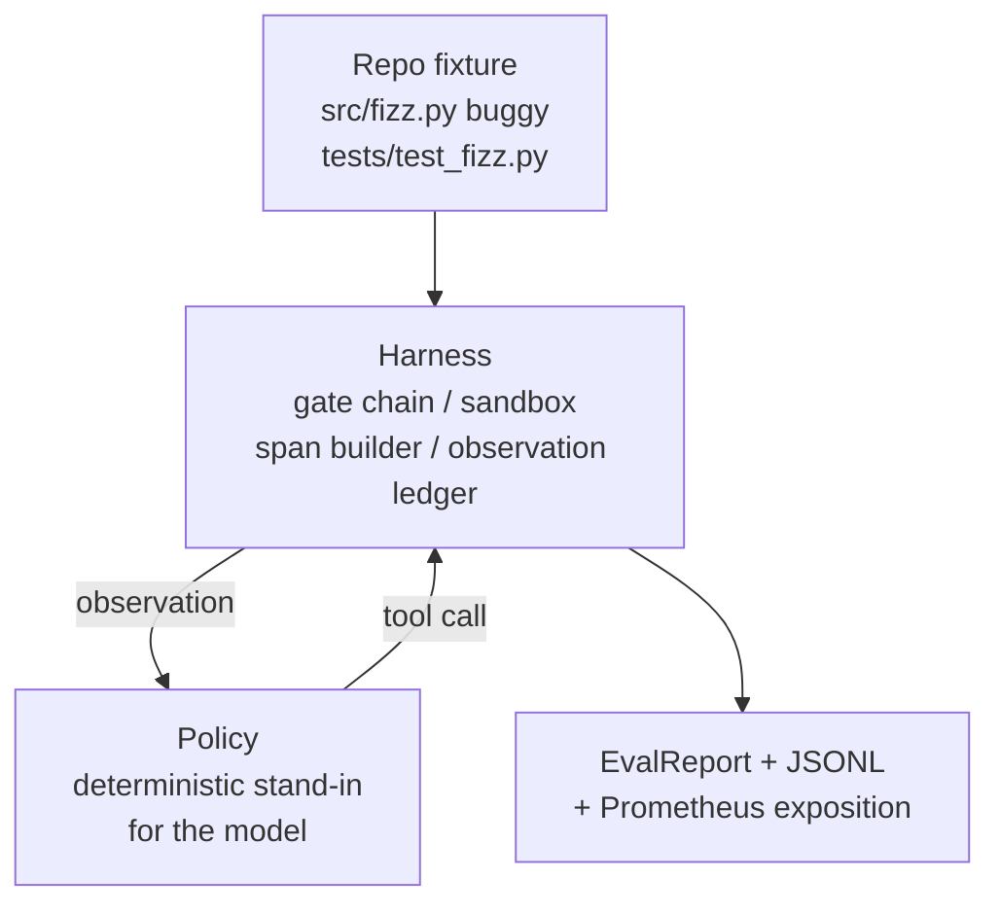
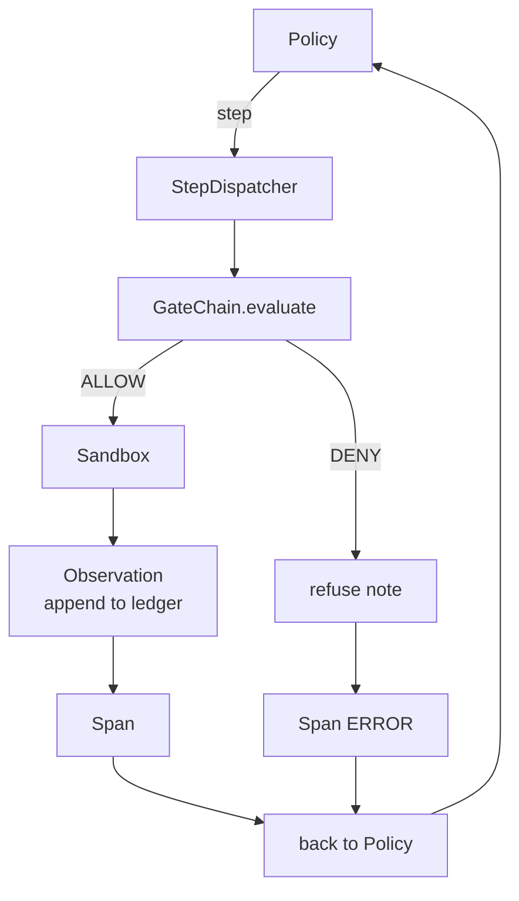

# Lição Capstone 29: Agente de codificação de ponta a ponta no arnes

> A recompensa da pista A. Esta lição sutura a cadeia de portas, a caixa de areia, o arnês de eval e o OTel se estende em um agente de codificação que corrige um bug real (pequeno, em escala fixa) em um projeto Python de vários arquivos. O agente é uma política determinista, não um LLM; a substituição torna a lição reprodutiva e mostra que o arnés foi a parte interessante durante todo o tempo. O contrato é idêntico: um modelo real se conecta à costura da política.

**Type:** Build
**Languages:** Python (stdlib)
**Prerequisites:** Phase 19 · 25 (verification gates), Phase 19 · 26 (sandbox), Phase 19 · 27 (eval harness), Phase 19 · 28 (observability), Phase 14 · 38 (verification gates), Phase 14 · 41 (workbench for real repos), Phase 14 · 42 (agent workbench capstone)
**Time:** ~90 minutes

## Objetivos de aprendizagem

- Compõem a cadeia de portas, a caixa de areia, o arnês de avaliação e o constructor de espaçamento em um único ciclo de agentes.
- Implementar uma política determinista que usa read_file, run_tests e write_file para corrigir um bug de fixação.
- Implementar um orçamento global de etapas mais um orçamento de tokens de observação em uma execução de ponta a ponta.
- Emite traços completos da OTel GenAI e métricas Prometheus para a execução completa.
- Verifique se o agente resolve a fixação em menos de 12 passos com zero viagens de porta nas ferramentas legais.

## O problema

A maioria das demonstrações de agentes trabalham isoladamente: uma caixa de areia por si mesma, um arnes de avaliação por si só, um emissor de espaço por si só.

A cadeia de portas diz PERMISSO, mas a caixa de areia recusa por uma razão que a cadeia não antecipou. O arnés de avaliação registra uma passagem, mas os portões do OTel dizem que o portal recusou uma ferramenta que o agente diz que usou. O contador Prometheus é incrementado duas vezes quando deve ser incrementado uma vez. O orçamento da observação foi excedido, mas o agente continuou porque o orçamento estava localizado na cadeia e a caixa de areia não sabia.

Esta lição é o teste de integração para toda a faixa. O agente tem que fazer quatro coisas para o fim: ler o projeto, executar os testes, identificar o bug da falha do teste, escrever a correção, reiniciar os testes e parar. Cada operação passa pela cadeia de portas. Cada execução de ferramenta passa pela caixa de areia. Cada passo é envolto em um espaço. O arame de avaliação marca a coisa toda no final.

## O conceito



A política do agente é uma máquina estatal.

`SURVEY`O seguinte estado é RUN_TESTS.

`RUN_TESTS`Se os testes passarem, a máquina de estado parará com sucesso.

`INSPECT`O agente lê o arquivo de origem falhado.

`FIX`O agente escreve o arquivo corrigido.

`VERIFY`Se os testes passarem, pare com o sucesso.

Cada estado corresponde a uma chamada de ferramenta. Cada chamada de ferramenta passa pela cadeia de portas. Se uma chamada de ferramenta é negada, o agente informa a recusa no rastreamento e para.

O bug do equipamento é um off-by-one em `fizz.py`A política determinista detecta o bug da mensagem de falha do teste através de um regex e emite o arquivo corrigido.

```figure
cg-harness-weave
```

## Arquitetura



A lição é autônoma. Cada lição anterior primitiva é reimplementada em escala mínima em`main.py`(gate, sandbox, ledger, span) para que a lição seja executada sem importar irmãos. Os nomes correspondem às lições 25-28 exatamente para que o mapeamento conceitual seja inequívoco.

## O que você vai construir

`main.py`Navios:

1. Os primitivos do arame mínimo, copiados com os mesmos nomes das lições 25-28:`GateChain`- Não .`Sandbox`- Não .`ObservationLedger`- Não .`SpanBuilder`- Não .`MetricsRegistry`- Não .
2. `CodingAgentPolicy`classe: máquina de estado com cinco estados.
3. `Repo`auxiliar: prepara um arranhão dir com o equipamento de buggy embutidos.
4. `AgentRun`classe: conduz a política, envia através do arame, retorna um `AgentRunReport`- Não .
5. Uma fixação em conjunto (`fixture_repo/`) com src/fizz.py, tests/test_fizz.py e uma árvore/previsto para o arnês de avaliação.
6. Demo: executa a política de ponta a ponta, imprime o rastreamento passo a passo, afirma o pass, imprime métricas.

A fixação em conjunto tem a mesma forma que a estrutura de tarefas da lição 27: um arquivo de buggy e um arquivo de testes. A mensagem de falha do teste contém informações suficientes para a política determinista identificar a correção. Um LLM real faria o mesmo trabalho, mais lentamente e com uma recuperação mais ampla, mas não mudaria as expectativas do arnes.

## Por que a política não é um LLM

Um LLM real requer uma chave API, uma chamada de rede e uma stochasticidade não verificável. O arnes é a parte que a lição se importa. Subbing em uma política determinista permite que a lição seja executada em qualquer laptop de desenvolvedor com dependências externas zero e permite que o conjunto de testes afirme contagens exatas de etapas.

A política da lição é um subconjunto rigoroso do que um agente LLM faz. A política lê o repo, vê o teste falhado, identifica a linha e emite uma correção. Um LLM passa pelo mesmo ciclo com o mesmo contrato de arremesso; a contabilidade é idêntica.

## O que a demonstração afirma

A demonstração de ponta a ponta afirma cinco coisas no momento da saída, e o conjunto de testes reafirma-as programaticamente.

A política resolveu a situação em menos de 12 passos.

O orçamento de observação nunca foi excedido.

A negação do portal zero foi lançada contra ferramentas legais.

Cada passo tem um período correspondente nas traças. jsonl.

A exposição Prometheus contém um`tools_called_total{tool="read_file"}`entrada e um `tool_latency_ms`Histograma.

## Como isto se compõe com o resto da pista A

A lição 25 escreveu a cadeia de portas. A lição 26 escreveu a caixa de areia. A lição 27 escreveu o arnês de avaliação. A lição 28 escreveu a observabilidade. A lição 29 prova que eles funcionam como um sistema. A partir daqui, um arnês de agente real se estende: troca a política determinista por um modelo, troca o conjunto fixo por uma tarefa de reposição real, troca o exportador JSONL por OTLP.

## - Estou a executá-lo.

```bash
cd phases/19-capstone-projects/29-end-to-end-coding-task-demo
python3 code/main.py
python3 -m pytest code/tests/ -v
```

A demonstração imprime um rastreamento por etapa, o relatório de avaliação final e a exposição Prometheus. O código de saída é zero. Os testes cobrem as transições de estado de política, as recusas de gate em chamadas de ferramentas sintéticas, a execução de ponta a ponta no dispositivo em conjunto e as invariantes de orçamento de passo.
