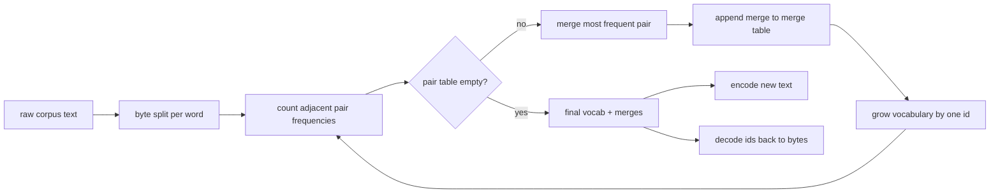
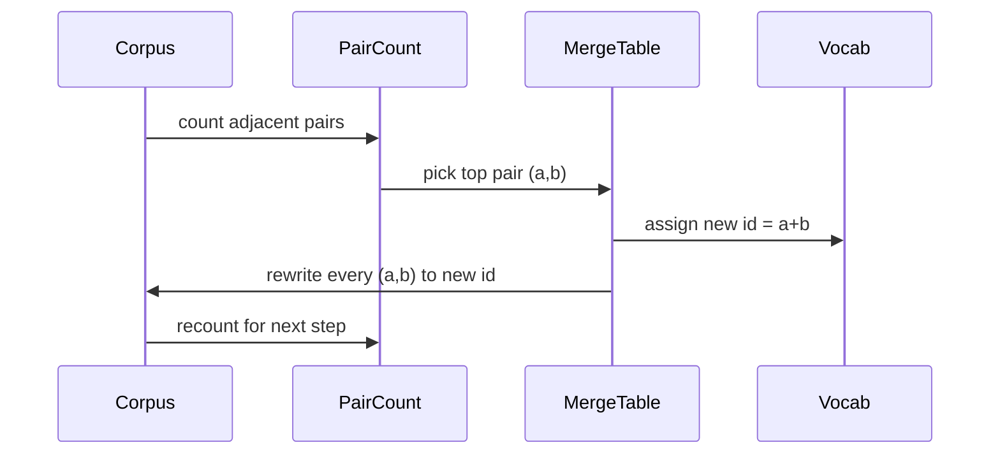

# Tokenizer BPE do zero

> Bytes dentro, IDs fora, IDs de volta para os mesmos bytes. Construir o tokenizer que todos os modelos de texto modernos ainda começa a partir.

**Type:** Build
**Languages:** Python
**Prerequisites:** Phase 04 lessons, Phase 07 transformer lessons
**Time:** ~90 minutes

## Objetivos de aprendizagem
- Treinar um par de byte Encoding vocabulário de um corpus de texto bruto através da fusão repetidamente do par de símbolos adjacentes mais frequentes.
- Implementar uma tabela de fusão determinista e aplicá-la a texto fresco para produzir um fluxo de ids de subpalavras.
- Entrada de volta e volta arbitrária UTF-8 para ids e de volta sem perda de informações.
- Reservar e proteger tokens especiais (`<|endoftext|>`- Não .`<|pad|>`) para que possam sobreviver ao treinamento e à decodificação.
- Razão por que um alfabeto de nível de byte é o piso certo para um tokenizer de uso geral.

```figure
cap-bpe-merge
```

## O quadro

Um modelo de linguagem nunca vê texto. Ele vê números inteiros. O mapa de uma cadeia para uma lista de números inteiros e de volta é o tokenizer.

A família dominante de tokenizadores de subpalas para modelos de texto gerais é a codificação de pares de byte. A ideia é pequena. Comece a partir de um alfabeto conhecido. Encontre o par de símbolos adjacentes que aparece mais frequentemente no corpo de treinamento. Combine-o em um novo símbolo. Repita até que o vocabulário atinja o tamanho alvo. A codificação de novo texto reutiliza a mesma lista de fusão na mesma ordem.

A variante de nível de byte é criada pelo alfabeto, que é de 256 bytes brutos, não por pontos de código Unicode.

## O oleoduto



O lado de treinamento e o lado de inferência compartilham a tabela de fusão. Essa partilha é o contrato. Se você mudar a ordem de fusão na inferência, você decodifica um fluxo diferente de ids.

## O alfabeto byte

Os primeiros 256 ids são reservados para os bytes brutos 0x00 até 0xFF. Isso garante que cada cadeia de entrada pode ser expressa no vocabulário antes de qualquer fusão acontecer. Depois do bloco de byte reservamos uma pequena faixa para tokens especiais. O loop de treinamento nunca propõe esses ids como alvos de fusão porque os mantemos fora do fluxo pré-tokenizado inteiramente.

O pretokenizer divide o corpus em espaços brancos e fronteiras de pontuação antes que o treinamento o veja. Sem essa divisão, o passo de fusão BPE aprenderia felizmente fusões que cruzam os limites de palavras e o vocabulário se enche de frases comuns inteiras. Com a divisão, as fusões permanecem dentro de uma palavra e o resultado generaliza.

## O ciclo de treinamento

Para cada passo de treinamento, o loop faz três coisas. Ele caminha cada palavra no corpus e conta a frequência com que cada par de símbolos atuais adjacentes aparece, ponderado pela frequência com que a palavra em si aparece. Ele escolhe o par com a maior contagem. Ele reescreve cada ocorrência desse par em um único novo símbolo cujo id é o próximo espaço livre no vocabulário.



O custo de cada passo é linear no tamanho do corpus expresso como uma lista de sequências de símbolos. Para um milhão de palavras e um vocabulário de destino de dez mil ids, o loop corre para a conclusão em segundos porque as sequências de símbolos encolhem à medida que as fusões aterram.

## Encodificação de texto fresco

A Inferência não chama o contador de fusão. Aplica a tabela de fusão na mesma ordem que foi aprendida. Para uma palavra nova o codificador começa a partir da divisão de byte. Escreve a sequência atual para a fusão de menor classificação (a mais antiga que se aplica). Realiza essa fusão. Escreve novamente. O loop termina quando nenhuma fusão na tabela se aplica à sequência atual.

A ordem por grau é a propriedade que torna a codificação determinista e combina o comportamento de treinamento na mesma entrada. Uma fusão que foi aprendida primeiro fica no topo da tabela e é aplicada primeiro. Se duas fusões pudessem ser aplicadas na mesma posição, a mais baixa posição ganha.

## Tokens especiais

Tokens especiais são IDs que o fluxo de byte nunca pode produzir.

- `<|endoftext|>`O modelo é informado de que "um novo documento começa aqui, não deixe o contexto do anterior entrar".
- `<|pad|>`O mascarão de perda esconde-o durante o treino.

O codificador aceita uma bandeira para permitir tokens especiais na entrada.`<|endoftext|>`E ...`<|pad|>`Com a bandeira ligada, as cadeias literais são mapeadas para os seus ids reservados e não estão sujeitas a nenhuma fusão.

## Garantia de ida e volta

A codificação deve retornar os bytes de entrada exatamente. O decodificador concatenar a expansão de byte de cada id em ordem. Como cada id é um byte bruto ou a concatenagem de dois ids conhecidos anteriormente, a expansão recursiva termina sempre em bytes brutos. A decodificação então retorna a cadeia UTF-8 que esses bytes ortografam.

A suite de testes nesta lição verifica essa propriedade em uma frase invisível, em uma frase com um emoji Unicode e em uma frase que contém uma letra `<|endoftext|>`- O sinal.

## O que esta lição não faz

Não constrói um pretokenizer regex-driven no estilo dos maiores tokenizeres de produção. O pretokenizer aqui é um pequeno espaço branco e pontuação dividido. Basta produzir fusões sensíveis num pequeno corpo de formação e o contrato com o resto da cadeia de lições permanece o mesmo. A próxima lição trata o tokenizer como uma caixa negra e constrói o conjunto de dados da janela deslizante em cima dele.

O contador de pares não é paralelalizado. Um ciclo em Python sobre um corpus de alguns milhares de palavras termina em muito menos de um segundo. Para corpora maiores o movimento óbvio é contar pares por palavra em paralelo e reduzir.

## Como ler o código

`main.py`define quatro objetos.`BPETokenizer`contém o vocabulário, a tabela de fusão e a tabela de tokens especiais. `train`É o ciclo de treinamento.`encode`É o caminho da inferência.`decode`A demonstração na parte inferior treina um pequeno tokenizer em um corpus incorporado, codifica uma frase prolongada, decodifica os ids de volta e imprime ambos.`code/tests/test_bpe.py`Pin a propriedade de ida e volta, a reserva de tokens especiais e a ordem de fusão.

Exerça a demonstração. Então altere o tamanho do vocabulário de destino na demonstração de 300 para 600 e observe como o comprimento codificado da frase mantida cair. Essa curva é a curva de compressão BPE.
