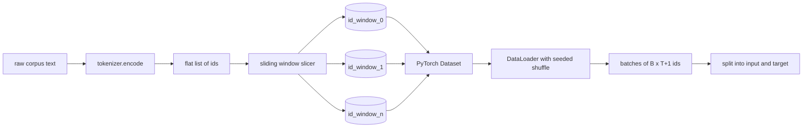
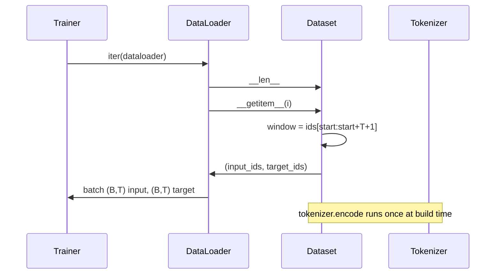

# Set de dados Tokenized com janela deslizante

> Uma corrida de pré-treino é uma função de identidades simbólicas para gradientes. Esta lição constrói o transportador que alimenta as identidades.

**Type:** Build
**Languages:** Python
**Prerequisites:** Phase 04 lessons, Phase 07 transformer lessons, Lesson 30 of this phase
**Time:** ~90 minutes

## Objetivos de aprendizagem
- Converte um corpus bruto em um fluxo de identidades simbólicas chamando o tokenizador uma vez.
- Cortar o fluxo de id em janelas de comprimento fixo com um passo de sobreposição configurável.
- Construir um conjunto de dados PyTorch que retorna tensores de entrada e alvo para previsão de next-token.
- Envolver o conjunto de dados em um DataLoader com uma mistura determinista sementeada por época.
- Razão sobre a compensação entre o passo, a redundância e o tamanho efetivo do conjunto de dados.

```figure
cap-sliding-window
```

## O quadro

Uma corrida de pré-treino lê um lote de identidades de token de cada vez e atualiza o modelo. A forma de cada lote é fixada pelo contrato de treinamento.`(B, T)`Identificadores de entrada e `(B, T)`O trabalho do pipeline de dados é produzir esse contrato à procura, de forma determinista e reprodutível, a partir de um corpus que pode ser de vários gigabytes de texto bruto.

Esta lição constrói o pipeline. O tokenizer da lição anterior transforma o texto em uma longa lista plana de ids. Uma janela deslizante corta essa lista em exemplos de treinamento. Um conjunto de dados personalizado expõe os exemplos como tensores. Um DataLoader os enrola e os mistura com uma semente conhecida.

## O contrato de forma

Uma LM causal consome ids de forma `(B, T)`onde`B`é o tamanho do lote e `T`O objetivo na posição `t`é a entrada em posição `t+1`Isso significa que cada exemplo de treinamento cobre`T+1`O passo da janela controla a quantidade de sobreposição existente entre exemplos consecutivos.



O cortador nunca se sobrepõe com o limite do corpus.`T+1`Posições, o cortador deixa cair.`<|pad|>`É também uma escolha válida, mas complica a máscara de perda.

## Por que uma janela deslizante

Um corpus de pré-treino é um longo fluxo de identidades. Se o modelo só visse janelas não sobrepostas, cada exemplo de treinamento ensinaria o mesmo.`T`O ajuste do passo move essas fronteiras em torno para que o modelo veja mais diversas tarefas de previsão-segundo-token.

Um passo de`T`O processo de produção de janelas não sobrepostas.`T // 2`O resultado é uma duplicação do conjunto de dados efetivos.`1`O conjunto de dados é elevado em um fator de `T`O custo é mais calculado por época. O benefício é mais diversidade de fronteiras. A maioria das corridas de pré-treino usa um passo igual ao comprimento do contexto porque o corpus já é muito maior do que o modelo pode terminar em uma época, de modo que o argumento de diversidade de fronteira é mais fraco.

## A classe de conjunto de dados

Um conjunto de dados PyTorch tem dois métodos necessários. `__len__`Retorna o número de exemplos. `__getitem__`O nosso conjunto de dados armazena o fluxo de id codificado e o passo. Indicando nele calcula o início da janela em movimento, de modo que o custo de memória é uma cópia do fluxo de id, independentemente de quantos exemplos o passo produz.



O turno por turno acontece dentro .`__getitem__`O conjunto de dados retorna .`(input, target)`onde`input = window[:-1]`E ...`target = window[1:]`Ambos são tensores longos PyTorch.

## Interferência determinista

Um DataLoader com `shuffle=True`Ele é um gerador aleatório PyTorch.`torch.Generator`sem sementes por época, obtemos a mesma mistura cada vez que a corrida é reiniciada. essa propriedade importa quando você quer comparar duas corridas que diferem apenas em um único hiperparâmetro. sem uma semente, duas corridas vêem os dados em diferentes ordens e as curvas de perda divergem por razões não relacionadas à mudança.

O contrato de semente nesta lição é simples.`epoch_seed = base_seed + epoch_index`A semente base é passada na construção. O índice de época é incrementado pelo treinador no topo de cada época. Uma re-corrida com a mesma semente base vê sempre a mesma ordem em cada época.

## Amostragem de lote

O amostragem padrão no PyTorch seleciona índices uniformemente aleatoriamente com a substituição desativada. É o que queremos para o pré-treino. Para a fine tuning em um conjunto de dados pequeno o contrato é o mesmo. O DataLoader montagem um lote chamando `__getitem__` `B`Como cada exemplo é o mesmo comprimento por construção, não é necessária lógica de empolgação.

A lição continua .`num_workers=0`Em uma produção, os trabalhadores paralelam as`__getitem__`Com o nosso pipeline que é principalmente um no-op porque o trabalho é apenas uma fatia de um tensor na memória, mas a mesma API do Dataset suporta os trabalhadores limpo.

## Exemplos de contagem

Para um fluxo de id de comprimento `N`, um comprimento de contexto `T`, e um passo `S`, o número de exemplos é `max(0, 1 + (N - (T + 1)) // S)`A lição expõe esse cálculo como um método estático no conjunto de dados para que o treinador possa calcular os passos totais por época sem iteração.

## O que esta lição não faz

O corpus é completamente codificado na memória e mantido como um único tensor. Para um corpus de alguns milhões de ids que é bem abaixo de cem megabytes e é a forma certa para a lição.

O corpus é tratado como um fluxo de identificação contínuo. O limite do documento seguinte é codificado inserindo `<|endoftext|>`O modelo aprende a prever em torno da fronteira.

## Como ler o código

`main.py`define duas classes e um auxiliar. `SlidingWindowDataset`é o conjunto de dados PyTorch. `make_dataloader`Retorna um DataLoader configurado com um gerador sementeado. `_encode_corpus_to_ids`A demonstração na parte inferior constrói um pequeno tokenizer em processo, codifica um corpus incorporado, constrói o conjunto de dados e o carregador de dados, imprime um lote e afirma o contrato de forma.`code/tests/test_dataset.py`Pin a fórmula da contagem de janelas, a propriedade de deslocamento por um, o deslocamento determinista e o troco de passos.

Exerça a demonstração. Então, mude o comprimento do contexto de 16 para 32 e veja como o número de exemplos por época cai. Esse número é o seu orçamento passo por época.
