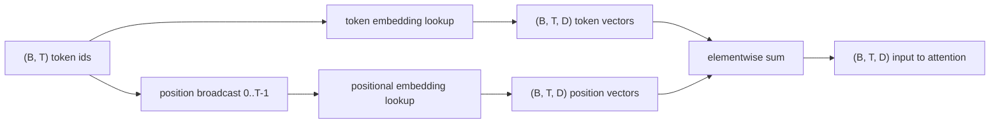
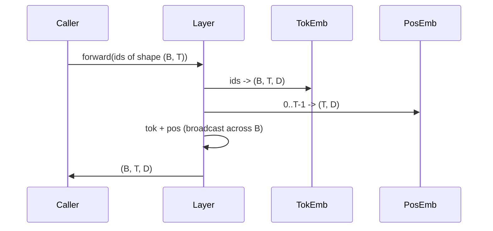

# Marcas e inserções positionais

> Os ids são números inteiros. O modelo quer vetores. Duas tabelas de busca estão entre elas, e a escolha do posicional molda o que o modelo pode aprender.

**Type:** Build
**Languages:** Python
**Prerequisites:** Phase 04 lessons, Phase 07 transformer lessons, Lessons 30 and 31 of this phase
**Time:** ~90 minutes

## Objetivos de aprendizagem
- Construa uma tabela de busca com símbolos que mapeie os ids do vocabulário para vetores densos.
- Construir uma tabela de busca de inserção posicional aprendida indexada por posição.
- Construir um inserimento posicional sinusoidal fixo indexado por posição sem parâmetros.
- Compõem as incorporações de tokens e posições em uma única entrada para um bloco de transformador.
- Embedings de contraste aprendidos e sinusoidais na generalização de comprimento e contagem de parâmetros.

```figure
cc-embedding-lookup
```

## O quadro

O primeiro contato do modelo com um token id é uma busca de fila na matriz de inserção de token. A matriz tem uma linha por id de vocabulário e uma coluna por dimensão do modelo. A busca retorna um vetor que o resto do modelo trata como o significado do id. Backprop atualiza as filas que foram usadas na passagem para frente. Durante o treinamento, a geometria dessas filas aprende a codificar similaridade nas direções.

Só os tokens não têm ordem. O modelo precisa de um segundo sinal que lhe diga que a posição um é diferente da posição dezessete. As duas opções dominantes para esse sinal são um inserimento posicional aprendido (uma segunda tabela de busca, uma linha por posição) e um inserimento posicional sinusoidal fixo (uma fórmula matemática sem parâmetros). A escolha tem consequências. Uma tabela aprendida é um parâmetro e é limitada pelo comprimento máximo de contexto no qual o modelo foi treinado. Uma tabela sinusoidal é sem parâmetros em teoria e a fórmula se estende a qualquer posição, mas esta lição é `SinusoidalPositionalEmbedding`Precomputa uma tabela fixa em `max_context_length`e seu `forward`O modelo pode ainda lutar para ultrapassar a sua duração de treinamento mesmo quando a tabela é grande o suficiente para indexar.

Esta lição constrói ambos e compõe-os com o token incorporado em uma única entrada para o bloco de atenção da próxima lição.

## O contrato de forma

A entrada para a fase de incorporação é um lote de identidades simbólicas de forma `(B, T)`A saída é um tensor de forma .`(B, T, D)`onde`D`Cada elemento de lote tem o mesmo comprimento de contexto.`T`Cada posição tem a mesma dimensão vetorial .`D`- Não .



A composição é uma soma, não uma concatenação.`D`A posição do símbolo é a mesma que a posição do símbolo.

## A matriz de incorporação de tokens

O embedding do token é um tensor de forma de parâmetro `(V, D)`onde`V`O PyTorch expõe-o como`nn.Embedding(V, D)`. Na init as entradas são tiradas de um pequeno gaussiano, tradicionalmente com média zero e desvio padrão em torno `0.02`O init exato importa menos do que manter-se consistente em todas as corridas.

O passe para a frente é uma única operação de indexação.`(B, T)`int64 ids para `(B, T, D)`A passagem para trás acumula gradientes apenas nas filas que foram tocadas na passagem para frente.

O embedding do token e a projeção de saída no final do modelo geralmente compartilham pesos (ligamento de peso). Quando isso acontece, cada passagem para trás toca cada linha do embedding através do lado de saída. A lição aqui expõe ambos como módulos separados, mas a mesma matriz poderia desempenhar ambos os papéis em um modelo completo.

## A incorporação posicional aprendida

A inserção posicional aprendida é um segundo `nn.Embedding`de forma`(max_context_length, D)`A busca é selecionada por posição id`0, 1, 2, ..., T-1`A passagem avançada transmite o vector de posição através da dimensão do lote.

A desvantagem da mesa aprendida é que não pode ser interrogada em posição.`T`Se o modelo só for treinado para a posição `T-1`Os modelos de produção com apenas decodificador que utilizam este esquema cozinham o comprimento máximo de contexto na arquitetura e recusam-se a processar entradas mais longas.

## A inserção posicional sinusoidal

A inserção posicional sinusoidal é uma função de posição para vetor.`p`e característica `i`Produtos

```python
angle = p / (10000 ** (2 * (i // 2) / D))
emb[p, 2k]     = sin(angle)
emb[p, 2k + 1] = cos(angle)
```

A função não tem parâmetros. Cada posição tem um vetor único. O comprimento de onda varia geométricamente entre as dimensões das características, então as dimensões inferiores codificam a posição grosseira e as dimensões superiores codificam a posição fina.

A propriedade que resulta da escolha de `sin`E ...`cos`juntos é que o vetor na posição `p + k`é uma função linear do vetor em posição `p`O modelo não precisa de um parâmetro separado para expressar "olhar cinco tokens de volta".

A lição calcula a tabela sinusoidal completa uma vez na construção e indexa-a no tempo adiante.

## A composição

O pipeline de entrada faz três coisas em ordem. Ler os IDs do token. procurar os vetores do token. Adicionar os vetores posicionais. Retornar a soma.



A transmissão no passo sum replica o `(T, D)`O PyTorch manipula isso automaticamente porque o tensor posicional tem forma`(1, T, D)`Depois de despressação.

## Análise de contraste

A lição apresenta ambas as variantes sobre as mesmas entradas e imprime dois diagnósticos.

A primeira é a contagem de parâmetros.`max_context_length * D`A variante sinusoidal adiciona zero.

A segunda é a semelhança cosínica entre os incorporados em posições vizinhas. A variante sinusoidal tem uma decadência suave e previsível porque a função é contínua. A variante aprendida na inicialização tem semelhança quase aleatória porque as fileiras são desenhadas de forma independente. Após o treinamento, a variante aprendida geralmente desenvolve uma estrutura lisa semelhante, mas tem que descobrir essa estrutura a partir de dados.

## O que esta lição não faz

Não constrói codificação posicional rotativa (RoPE) ou AliBi. Estas são as escolhas modernas em transformadores de produção. Ambos seguem o mesmo contrato de forma que os embebimentos aqui (aplique uma transformação dependente da posição para vetores de forma `(B, T, D)`A próxima lição é construir o bloco de atenção, e uma das extensões opcionais é dobrar rotativamente nas projeções de chave de consulta lá.

Não treina a incorporação, o treinamento requer uma perda, que requer uma saída de modelo, que requer atenção e uma cabeça LM. Essa é a próxima lição e a seguinte.

## Como ler o código

`main.py`define três módulos. `TokenEmbedding`Envolvas`nn.Embedding(V, D)`- Não .`LearnedPositionalEmbedding`Envolvas`nn.Embedding(L, D)`- Não .`SinusoidalPositionalEmbedding`Precomputa a tabela e expõe-a como um tampão. `EmbeddingComposer`A demonstração em baixo imprime as formas, os parâmetros contados e o diagnóstico de similaridade de posição vizinha.`code/tests/test_embeddings.py`Forma do pin, comportamento de transmissão, contagem de parâmetros e fórmula sinusoidal.

Execute a demonstração e depois mude a dimensão do modelo.`D`de 64 para 32 e observar como as bandas de comprimento de onda sinusoidais mudam.
