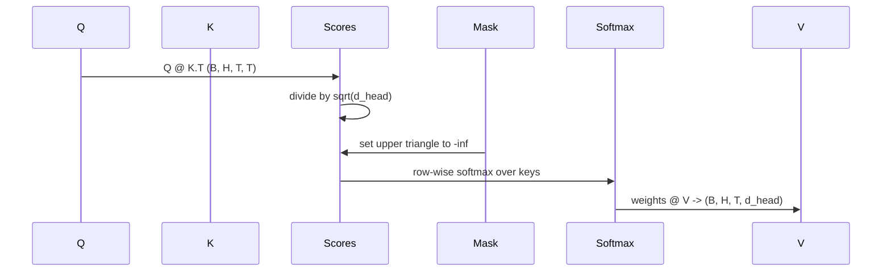

# Atenção à própria vida

> Uma projeção linear, três visões, cabeças paralelas H, uma máscara.

**Type:** Build
**Languages:** Python
**Prerequisites:** Phase 04 lessons, Phase 07 transformer lessons, Lessons 30 through 32 of this phase
**Time:** ~90 minutes

## Objetivos de aprendizagem
- Implementar uma projeção de Query/Key/Value em lote como uma única camada linear dividida em cabeças H.
- Computação escalada atenção ponto-produto com a normalização correta e manipulação dtype.
- Aplicar uma máscara causal que impeda que uma posição atenda a posições futuras.
- Inspecte os pesos de atenção por cabeça para obter uma entrada fixa e raciocinar sobre o que cada cabeça olha.
- Treinar um pequeno bloqueio de atenção em uma tarefa de brinquedo e assistir a perda cair à medida que as cabeças se especializam.

```figure
cap-multihead-attention
```

## O quadro

A atenção é a função que permite que a representação de um token tire informações de outros tokens na mesma sequência. A auto-atenção significa que consultas, chaves e valores são todos derivados da mesma entrada. Multi-head significa que a projeção é dividida em problemas de atenção paralelas H cujas saídas são concatenadas e projetadas de volta.

O padrão de implementação eficiente é uma camada linear que projeta de `D`- Não .`3 * D`e é cortado em três vistas, e depois remodelado em cabeças de tamanho H.`D // H`A soma matmul, softmax e ponderada ocorrem como operações tensoriais em lote para que as cabeças corram em paralelo no acelerador.

Esta lição constrói esse bloco. Ele também adiciona a máscara causal para que o mesmo código funcione como a camada de atenção em um modelo de linguagem apenas para decodificador. A próxima lição empilha o bloco em um transformador completo e a lição depois treina-o.

## O contrato de forma

A entrada é `(B, T, D)`A saída é de`(B, T, D)`A máscara é ...`(T, T)`No interior do bloco os tensores intermediários têm forma`(B, H, T, d_head)`onde`d_head = D // H`A restrição é:`D % H == 0`- Não .

```mermaid
flowchart LR
    A["(B, T, D) input"] --> B[Linear D -> 3D]
    B --> C["split into Q, K, V"]
    C --> D["reshape to (B, H, T, d_head)"]
    D --> E["scores = Q @ K.T / sqrt(d_head)"]
    E --> F[apply causal mask]
    F --> G[softmax over keys]
    G --> H["context = weights @ V"]
    H --> I["reshape to (B, T, D)"]
    I --> J[output Linear D -> D]
    J --> K["(B, T, D) output"]
```



As duas camadas lineares (a projeção QKV e a projeção de saída) são os únicos parâmetros no bloco.

## A divisão do QKV

A implementação ingênua tem três camadas lineares separadas, uma cada para Q, K e V. A eficiente tem uma única camada que produz.`3 * D`Os dois são matematicamente equivalentes porque três multiplicidades de matriz separadas por`(D, D)`pesos são exatamente uma matriz multiplicação por um `(3D, D)`peso empilhado deles.

A versão eficiente é mais rápida porque o acelerador lança um matmul em vez de três. Também é mais fácil de inicializar porque as três sub-matrícias vivem no mesmo tensor de parâmetros e podem ser inicializadas juntas.

## A cabeça remodela-se

Depois da divisão, cada um de Q, K, V é `(B, T, D)`Para transformar isso em problemas de atenção paralelas, reformulamos para`(B, T, H, d_head)`e transpor para `(B, H, T, d_head)`A dimensão da cabeça agora fica ao lado da dimensão do lote , por isso a PyTorch trata a atenção por cabeça como uma operação em lote em toda a parte .`B * H`instâncias independentes.

A dimensão da cabeça permanece para o final, então a pontuação é igual.`Q @ K.transpose(-2, -1)`O resultado é que o`(B, H, T, T)`pontuações de atenção por cabeça.

## Escalada

As pontuações são divididas por`sqrt(d_head)`Sem essa escala, os produtos dot crescem como`d_head`O sistema de transferência de massa é um sistema de transferência de massa de massa de massa de massa de massa de massa de massa de massa de massa de massa de massa de massa de massa de massa de massa de massa de massa de massa de massa de massa de massa de massa de massa de massa de massa de massa de massa de massa de massa de massa de massa de massa de massa de massa de massa de massa de massa de massa de massa de massa de massa de massa de massa de massa de massa de massa de massa de massa de massa de massa de massa de massa de massa de massa de massa de massa de massa de massa de massa de massa de massa de massa de massa de massa de massa de massa de massa de massa de massa de massa de massa de massa de massa de massa de massa de massa de massa de massa de massa de massa de massa de massa de massa de massa de massa de massa de massa de massa de massa de massa de massa de massa de massa de massa de massa de massa de massa de massa de massa de massa de massa de massa de massa de massa de massa de massa de massa de massa de massa de massa de massa de massa de massa de massa de massa de massa de massa de massa de massa de massa de massa de massa de massa de massa de massa de massa de massa de massa de massa de massa de massa de massa de massa de massa de massa de massa de massa de massa de massa de massa de massa de massa de massa de massa de massa de massa de massa de massa de massa de massa de massa de massa de massa de massa de massa de massa de massa de massa de massa de massa de massa de massa de massa de massa de massa de massa de massa de massa de massa de massa de massa de massa de massa de massa de massa de massa de massa de massa de massa de massa de massa de massa de massa de massa de massa de massa de massa de massa de massa de massa de massa de massa de massa de massa de massa de massa de massa de massa de massa de massa de massa de massa de massa de massa de massa de massa de massa de massa de massa de massa de massa de massa de massa de massa de massa de massa de massa de massa de massa de massa de massa de massa de massa de massa de massa de massa de massa de massa de massa de massa de massa de massa de massa de massa de massa de massa de massa de massa de massa de massa de massa de massa de massa de massa de massa de massa de massa de massa de`sqrt(d_head)`Mantém a variação das pontuações praticamente constante em tamanhos de cabeças.

## A máscara causal

Um modelo de linguagem apenas para decodificador só pode condicionar o passado quando prever o próximo token. A máscara impõe isso.`(T, T)`A matriz de pontuação é substituída por infinito negativo.



A máscara é registrada como um tampão na construção para que viva no mesmo dispositivo que o modelo e não faça parte do gráfico de gradiente. A máscara cobre o comprimento máximo de contexto que o bloco verá.`(T, T)`- É a esquina.

## A projeção de saída

Depois de vetores de contexto por cabeça `(B, H, T, d_head)`, nós transposamos de volta para `(B, T, H, d_head)`, remodelar para `(B, T, D)`, e aplicar um final `(D, D)`A projeção de saída permite que o modelo misture as cabeças. sem ele, as cabeças H só se recombinarão através de camadas posteriores e o bloco seria artificialmente restringido.

## Inspecção de peso de atenção

A lição expõe uma `return_weights=True`O bloco retorna os pesos de atenção por cabeça da forma.`(B, H, T, T)`O demo imprime um mapa de calor dos pesos de uma cabeça em uma entrada curta para que você possa ver a estrutura do triângulo causal e o foco por posição.

Em um modelo treinado, diferentes cabeças aprendem padrões diferentes. Algumas cabeças atendem ao token imediatamente anterior. Algumas cabeças atendem ao início da sequência. Algumas cabeças espalham a atenção quase uniformemente. O gancho de inspeção é o ponto de entrada para esse trabalho de interpretação.

## A demonstração de treinamento

A demonstração no fundo do`main.py`O modelo deve aprender que o próximo token é o mesmo que o token anterior. A perda é entropia cruzada. Com H=4, D=32, T=12, e um vocabulário de 64, a perda cai do aleatório (cerca de`log(64) ~ 4.16`) para baixo para bem abaixo `1.0`Mais de três épocas na CPU.

O objetivo da demonstração não é treinar um modelo útil, o objetivo é confirmar o fluxo dos gradientes através de cada peça do bloco e as cabeças aprendem algo sobre um problema onde a resposta é óbvia.

## O que esta lição não faz

Não adiciona um bloco de alimentação. A camada transformadora em um modelo real é a atenção seguida por um MLP de duas camadas com uma conexão residual e uma norma de camada em torno de cada uma.

Não implementa codificação rotativa ou posicional AliBi. Ambos aplicam-se no passo de projeção QKV no mesmo bloco, mas são uma unidade de ensino separada.

Não implementa cache KV para inferência. Caching de chaves e valores em passes avançados é a otimização que torna a decodificação autoregressiva rápida. Altera o contrato de forma nos tensores K e V, mas não no Q. Ele pertence à lição de inferência.

## Como ler o código

`main.py`define`MultiHeadSelfAttention`- Não . A classe tem duas camadas lineares e um tampão de máscara registrado. Os passes avançados projetam, remodelações, pontuações, máscaras, softmaxes, pesos, remodelações e projetos novamente. A demonstração na parte inferior constrói um pequeno modelo que envolve a atenção com embeddings de token e posições e uma cabeça LM, treina-a em uma tarefa de cópia por três épocas, e imprime a curva de perda e um heatmap de atenção por cabeça. Os testes em `code/tests/test_attention.py`Pin o contrato de forma, a propriedade de causalidade, a propriedade de softmax, a propriedade de cabeça-dividida e o fluxo de gradiente.

Execute a demonstração e depois aumenta.`n_heads`de 4 a 8 (manutenção `d_model=32`- Então ...`d_head=4`) e observar a mudança do mapa de calor.
