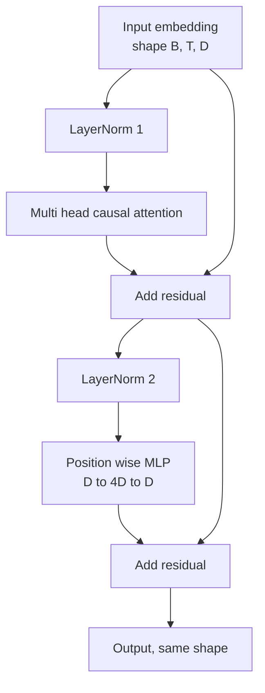
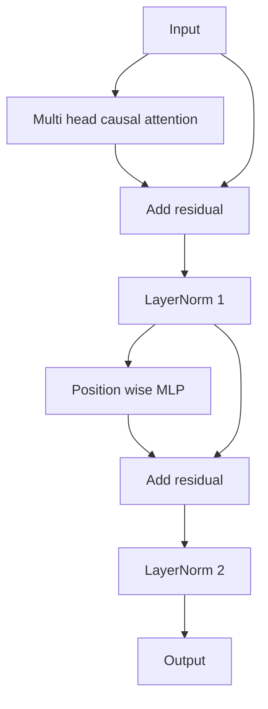

# Bloco de transformador a partir do zero

> O bloco é a unidade de cada decodificador moderno LLM. Norma de camada, atenção de várias cabeças, residual, MLP, residual. A variante pré-LN treina com estabilidade sem aquecimento. A variante pós-LN é o que o papel original enviou. Esta lição constrói ambos, lado a lado, e mostra qual sobrevive a uma pilha de 12 camadas a taxas de aprendizagem comuns.

**Type:** Build
**Languages:** Python
**Prerequisites:** Phase 19 lessons 30 to 33 (tokenizer, embeddings, attention math, batched data loader)
**Time:** ~90 minutes

## Objetivos de aprendizagem

- Construir um bloco transformador em PyTorch a partir das quatro peças em movimento: LayerNorm, atenção causal de várias cabeças, conexões residuais, MLP de posição.
- Colocar as LayerNorms em duas configurações (pré-LN e pós-LN) e explicar por que um treina estável sem aquecimento.
- Implementar a mascaragem causal dentro da atenção multi-cabeça , para que seja simbólico .`i`Não posso ver tokens .`j > i`- Não .
- A pista de fluxo de gradiente através de ambas as variantes em uma pilha de 12 camadas e ler o resultado sem agitar a mão.
- Reutilizar o bloco como uma unidade de entrada quando a próxima lição reunir um GPT de parâmetros de 124 milhões.

## O problema

Um transformador é um bloco repetido. Se errarmos o bloco uma vez, repitamos 12 vezes, e enviamos um modelo que diverge na primeira época ou que precisa de aquecimento durante o resto do caminho. Os dois modos de falha que verão nesta lição não são exóticos. Eles aparecem a primeira vez que um aprendiz apila blocos ingenuamente. Uma é a camada de atenção que atende ao futuro. A outra é a LayerNorm colocada onde não pode domar o sinal residual na profundidade.

O bloco tem exatamente dois caminhos residuais e exatamente duas posições de normalização. Escolha as posições corretamente e o resto da pilha é apenas contabilidade.

## O conceito

Cada bloco de decodificador transformador é uma função que assume um tensor de forma `(batch, sequence, embedding)`E retorna um tensor da mesma forma.



Esta é a variante pré-LN. A LayerNorm fica dentro do ramo residual, antes da subcamada. A conexão residual transporta o sinal não normalizado para a frente.

A variante pós-LN move a LayerNorm para após a adição residual.



A forma é idêntica. O comportamento de treinamento não é. Com pós-LN, o gradiente que flui de volta através do caminho residual deve passar através da LayerNorm.`3e-4`O pré-LN deixa o caminho residual não normalizado, então os gradientes se propagam limpo para a camada de incorporação.

### Atenção multi- cabeças causal

A subcamada de atenção projeta a entrada de três formas em tensores de consulta, chave e valor.`(B, T, D)`- Não .`(B, H, T, D/H)`onde`H`O número de pontos é o número de cabeças.`softmax(Q K^T / sqrt(d_k))`por cabeça, mascara o triângulo superior para infinito negativo, aplica a máscara através de softmax, e depois multiplica por `V`As cabeças são encadeadas de volta em uma única .`(B, T, D)`Mas a máscara é a única peça que faz o modelo causal. Esqueça a máscara e treina um modelo que engana.

### O MLP

O MLP de posição inteligente aplica a mesma rede de duas camadas a cada token de forma independente. A largura oculta é quatro vezes a largura de incorporação, a ativação é GELU, e um abandono segue a segunda linear. Nenhum token fala entre si dentro do MLP. Toda mistura de tokens acontece em atenção.

### As conexões residuais fazem duas coisas.

Eles tornam o caminho de gradiente aditivo em toda a profundidade, o que mantém a norma de gradiente em escala através de doze camadas. Eles também permitem que cada bloco aprenda uma atualização aditiva da representação em execução em vez de uma substituição completa.

```figure
cc-transformer-block
```

## Construí-lo

`code/main.py`Implementos:

- `class LayerNorm`com escala e deslocamento apropriados, eps tendenciosos, aplicados por vetor de token.
- `class MultiHeadAttention`com`num_heads`- Não .`head_dim = d_model // num_heads`, projecção de QKV fundida, mascareta causal registada, atenção e abandono residual.
- `class FeedForward`com duas camadas lineares, GELU ativação, desistência.
- `class TransformerBlock`com um `pre_ln`bandeira que se alternar entre as duas variantes.
- Uma demonstração que constrói uma pilha de 6 camadas pré-LN e uma pilha de 6 camadas pós-LN com entradas e impressões idênticas (a) forma de saída, (b) norma de gradiente no incorporado após uma passagem para trás.

- É o que é ?

```bash
python3 code/main.py
```

Output: verificação de forma em ambas as pilhas, normas de gradiente lado a lado. O gradiente de incorporação da pilha pré-LN é maior do que a pilha pós-LN na mesma taxa de aprendizagem, que é o sinal empírico dos trens pré-LN sem aquecimento.

## Estaca

- `torch`para a matemática tensorial, autogrado, e `nn.Module`- Escancar.
- Não , não .`transformers`O bloco é implementado a partir de primitivos.

## Padrões de produção em silêncio

Três padrões transformam o bloco de livros em algo que se pode enviar.

**Fused QKV projection.**Três camadas lineares separadas custam três lançamentos de núcleo e três matmuls.`3 * d_model`O caminho fundido é mais rápido em cada acelerador e corresponde às implementações de referência de GPT-2, LLaMA e Mistral.

**Registered causal mask buffer.**A máscara depende apenas do comprimento máximo do contexto.`register_buffer`O que é que se faz é esquecer que a máscara se torna um ponto de alocação em longo contexto.

**Dropout in two places, not three.**O abandono pertence após o softmax da atenção (abandonamento da atenção) e após o segundo linear do MLP (abandonamento residual).

## Usá-lo

- O bloco nesta lição é conectado diretamente ao conjunto GPT na lição 35 sem modificações.
- A variante pré-LN é o que cada LLM moderno de pesos abertos usa. A variante pós-LN é o que o papel de atenção original de 2017 usou. Sabendo ambos é suficiente para ler qualquer arquitetura de decodificador que você encontrará.
- Troca o GELU por SiLU e tens a ativação da família LLaMA, troca a LayerNorm por RMSNorm e tens a normalização da família LLaMA, o mesmo esqueleto.

## Exercícios

1. Adicionar um`bias=False`A linha de referência é a linha de referência de cada linha do bloco.
2. Substitui`nn.LayerNorm`com um RMSNorm laminado à mão e verificar se a forma de saída não mudou.
3. Adicione uma bandeira que retorna os pesos de atenção para a primeira cabeça como um `(B, T, T)`Descreva o triângulo superior para confirmar que é zero após softmax.
4. Construir um teste de saúde mental que alimente um`(2, 16, 384)`tensor com `H=6`As variações e as afirmações dos resultados futuros são diferentes (por exemplo, `not torch.allclose`) quando os pesos são iniciados de forma idêntica e o ponto de abandono é definido como zero.

## Termos-chave

| Term | What people say | What it actually means |
|------|-----------------|------------------------|
| Pre-LN | "Pre norm" | LayerNorm inside the residual branch, before each sublayer; the residual carries the unnormalized signal |
| Post-LN | "Post norm" | LayerNorm after the residual add; what the 2017 paper shipped and what needs warmup |
| Causal mask | "Triangle mask" | The upper triangle of the attention logits set to negative infinity so token i cannot read token j when j is greater than i |
| Fused QKV | "Combined projection" | One linear of width 3D instead of three linears of width D; one kernel, one matmul |
| Residual stream | "Skip connection" | The unnormalized tensor that flows top to bottom through every block; what each block adds to |

## Mais leitura

- Fase 7 lição 02 (auto atenção a partir do zero) para a matemática da atenção abaixo deste bloco.
- Fase 7 lição 05 (transformador completo) para a versão de decodificador do mesmo esqueleto.
- Fase 10 lição 04 (mini-GPT pré-treino) para o procedimento de formação que este bloco integra.
- Fase 19 lição 35 (esta faixa) que empilha doze desses blocos num modelo GPT.
