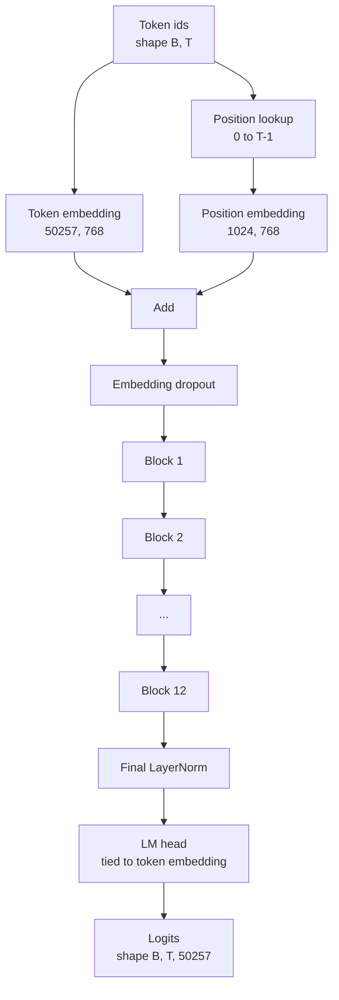
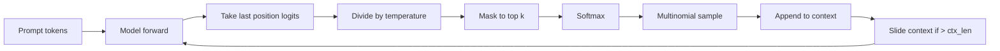

# Assembléia de modelo GPT

> Doze blocos empilhados, um embedding token, um embedding de posição aprendido, uma última LayerNorm e uma cabeça de modelo de linguagem amarrada. Isso é todo o modelo GPT de 124 milhões de parâmetros. Esta lição ensambla essas peças em uma classe trabalhadora, conta os parâmetros para confirmar que o modelo corresponde à forma 124M de referência e gera texto com amostragem multinomial, temperatura e top-k.

**Type:** Build
**Languages:** Python
**Prerequisites:** Phase 19 lessons 30 to 34
**Time:** ~90 minutes

## Objetivos de aprendizagem

- Assemble o bloco transformador da lição 34 em um modelo GPT completo: embedding token, position embedding, blocos N, final LayerNorm, cabeça de modelo de linguagem.
- Reproduzir a configuração de 124 milhões de parâmetros: vocabulário 50257, contexto 1024, incorporando 768, doze cabeças, doze camadas.
- Atire os pesos do modelo de idioma para o embedding do token e explique por que isso salva ~ 38 milhões de parâmetros nesta escala.
- Gerar texto a partir de um prompt com amostragem multinomial, escala de temperatura e truncamento top-k, segurando o comprimento do contexto com uma janela deslizante.
- Meter o número de parâmetros e o custo de passagem avançada em relação ao alvo de 124 M.

## O problema

Um bloco transformador não faz nada por si só. Você precisa transformar ids de token em vetores, misturar informações posicionais, executá-las através da pilha e projetá-las de volta para logits de vocabulário. Esqueça qualquer um desses quatro passos e o modelo ou não consegue encaminhar, deriva em informações de posição, ou não pode falar.

A forma do modelo também importa. O pequeno GPT-2 de referência é de 124 milhões de parâmetros na configuração exata acima. Os números não são mágicos. Vocab 50257 vezes inserindo 768 é a tabela simbólica. A posição 1024 por 768 é a tabela de posições. Doze blocos com cerca de 7 milhões de parâmetros cada um são 84 milhões. A cabeça final reutiliza a tabela simbólica por gravidade. Sumem as peças e aterrissam em 124 milhões. Construir um modelo cujo número de parâmetros não corresponde à referência é um sinal de que você acoplou algo errado.

## O conceito



Os tokens ids tornam-se vetores de tokens. os tokens de posição tornam-se vetores de posição. Os dois são adicionados e enviados através da pilha. a LayerNorm final é a única peça fora dos blocos que sobrevive a cada variante moderna. a cabeça LM reutiliza a matriz de incorporação de tokens, que é o que significa gravidade.

### A ligação de peso

A incorporação do símbolo tem forma .`(vocab, d_model)`O modelo de linguagem deve ser projetado a partir de `d_model`De volta para `vocab`. Esses são transposos um do outro. Atar os dois significa literalmente o mesmo tensor de parâmetros, usado duas vezes. Na vocabulária 50257 e d_modelo 768, a matriz é de 38 milhões de parâmetros. Desligado, você paga por ele duas vezes. Atado, você paga por ele uma vez e você também obtém um sinal de gradiente ligeiramente mais limpo porque a incorporação e atualização da cabeça juntos.

### A inserção de posição é aprendida, não sinusoidal

O GPT-2 envia uma posição aprendida embutida.`(1024, 768)`O modelo busca a posição 0 a T-1 em cada prossecução e adiciona a busca à incorporação do token. Este é o mais simples dos esquemas de posição (RoPE, ALiBi, T5 bias relativo são as alternativas) e é o que a referência 124M usa.

### Geração: temperatura, top-k, multinomal

A geração é autoregressiva. Em cada passo, o modelo retorna logits sobre o vocabulário completo em cada posição. Você toma apenas a última posição, divide pela temperatura, opcionalmente mascara todos os logits acima k para infinito negativo, softmax para obter probabilidades, e amostra um token da distribuição resultante.



Três botões, três comportamentos diferentes. A temperatura próxima ao zero desabou para ganância. A temperatura um corresponde à distribuição natural do modelo. Top-k um é ganância. Top-k quarenta filtra a cauda longa. As combinações importam; a próxima lição sobre treinamento usa geração como um sinal de avaliação qualitativa.

```figure
cc-gpt-assembly
```

## Construí-lo

`code/main.py`Implementos:

- `class GPTConfig`Dataclass com as configurações padrão de 124M: `vocab_size=50257`- Não .`context_length=1024`- Não .`d_model=768`- Não .`num_heads=12`- Não .`num_layers=12`- Não .`mlp_expansion=4`- Não .`dropout=0.1`- Não .`use_bias=True`- Não .`weight_tying=True`- Não .
- `class GPTModel`com embedding simbólico, posicionamento embebed, embebedamento abandonado, doze `TransformerBlock`S, LayerNorm final e um `lm_head`que se liga ao embedding do símbolo quando a bandeira é definida.
- A.`count_parameters`auxiliar que retorna a contagem de parâmetros única (de modo que a ligação de peso é honrada na contagem).
- A.`generate`função que faz temperatura, top-k, multinomiais, e deslizante contexto de janela.
- Uma demonstração que constrói o modelo, imprime a contagem de parâmetros ao lado do 124M de referência e gera uma curta sequência a partir de um prompt fixo para mostrar o pipeline termina para o fim.

- É o que é ?

```bash
python3 code/main.py
```

Saída: contagem de parâmetros ao lado da referência 124M, ids de token gerados a partir de um prompt aleatório e uma confirmação de que a cabeça LM e o token de incorporação compartilham armazenamento quando a ligação está ligada.

Para manter a demonstração rápida, o script também executa uma pequena configuração (`d_model=64`- Não .`num_layers=2`O sistema de configuração 124M é construído, mas apenas o número de parâmetros e uma passagem para a frente são exercidos.

## Estaca

- `torch`para a matemática tensorial, autogrado e canalização de módulos.
- `code/main.py`reimplementa o mesmo padrão de blocos da lição 34 localmente.

## Padrões de produção em silêncio

Três padrões fazem a diferença entre um modelo que corre e um modelo que envia.

**Initialize the residual projections small.**A projeção de saída da atenção e o segundo linear do MLP ambos alimentam diretamente um adicionamento residual. Iniciar aqueles com o mesmo desvio padrão que cada outro linear dá um fluxo residual que cresce com a profundidade e empurra o LayerNorm final para um regime quente. Escala o std por `1 / sqrt(2 * num_layers)`Para essas duas projeções, o fluxo residual permanece numa faixa sensata através de doze camadas.

**Cache the position id tensor, do not recompute.** `torch.arange(T)`A atribuição de memória nova em cada avanço.`__init__`Para o contexto máximo, cortar as primeiras entradas T por chamada e ignorar a viagem de ida e volta do alocador.

**Tie weights at parameter level, not just by copying.**Configuração`lm_head.weight = token_embedding.weight`O optimizador precisa atualizar um parâmetro e o gráfico de autogrado precisa de uma acumulação. Se você copiar, a cabeça se afasta do incorporado e a ligação de peso não lhe compra nada.

## Usá-lo

- A classe modelo nesta lição tem a mesma forma que a que a lição seguinte treina.
- Substituir a posição aprendida com RoPE dá-lhe a família LLaMA sem tocar no bloco ou na cabeça.
- Substituir o GELU com o SiLU e o LayerNorm com o RMSNorm dá-lhe o resto das mudanças da família LLaMA.
- A função de geração funciona com qualquer fonte de logits, não apenas este modelo. Você pode extrair logits de um arquivo GPT-2 pré-treinado na lição 37 e reutilizar o mesmo ciclo de geração.

## Exercícios

1. Desligue a cabeça LM do token e conte os parâmetros. Verifique o delta é 50257 vezes 768 = 38 milhões.
2. Substitua a posição aprendida por uma tabela sinusoidal calculada no momento da construção. Confirme o modelo ainda avançando e a contagem de parâmetros cai em 786.432.
3. Adicionar um`greedy=True`A sequência é determinista em todas as corridas.
4. Adicionar um`repetition_penalty`botão que divide a logit de qualquer token no prompt ou histórico gerado por uma constante antes de softmax. Mostre em um prompt fixo que valores acima de um reduzem as contagens de repetições na saída.
5. Adicionar`top_p`(núcleo) amostragem ao lado de `top_k`Verificação de duas linhas de que a soma das probabilidades dos tokens mantidos exceda `top_p`- Não .

## Termos-chave

| Term | What people say | What it actually means |
|------|-----------------|------------------------|
| Weight tying | "Tied embeddings" | The LM head and the token embedding share the same parameter tensor; saves vocab times d_model parameters and matches the GPT-2 reference |
| Position embedding | "Learned positions" | A separate table of shape (context length, d_model) added to token vectors; learned end to end |
| Sliding window context | "Context cap" | When the prompt plus generated tokens exceed the context length, drop the oldest tokens so the active window fits |
| Top-k sampling | "K truncation" | Keep the K logits with the highest values, mask the rest to negative infinity, softmax over the remainder |
| Temperature | "Sampling temperature" | Divide logits by T before softmax; T less than 1 sharpens, T equal to 1 keeps the natural distribution, T greater than 1 flattens |

## Mais leitura

- Fase 19 lição 34 para o bloco deste modelo.
- Fase 19 lição 36 para o ciclo de treinamento que impulsiona este modelo com perda de entropia cruzada.
- Fase 19 lição 37 para carregar pesos pré-treinados GPT-2 nesta arquitetura exata.
- Fase 7 lição 07 (GPT modelagem de linguagem causal) para a matemática da próxima previsão token.
- Fase 10 lição 04 (mini GPT pré-formação) para o procedimento de formação original sobre a mesma arquitetura.
