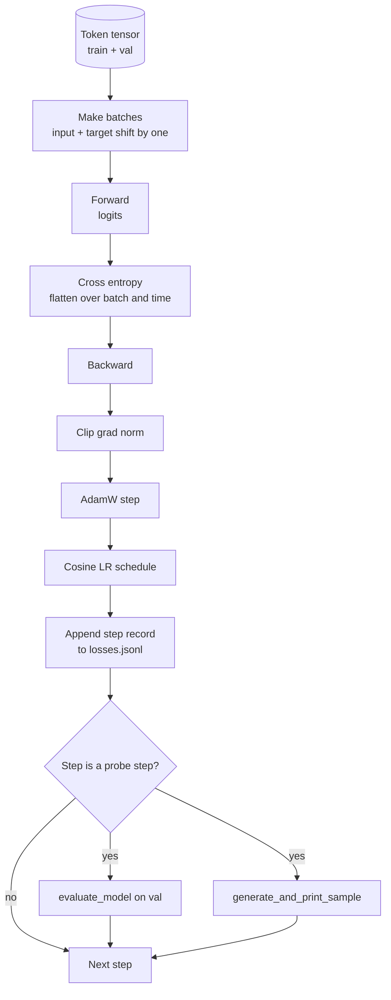

# Circuito de formação e avaliação

> Uma ciclação que não mede é uma ciclação que está em falso. Esta lição constrói a ciclação de treinamento que impulsiona o modelo GPT: AdamW com divisão de declínio de peso, um aquecimento mais um cronograma de taxa de aprendizagem cosínica, um `calc_loss_batch`assistente, um `evaluate_model`Transmitir dados mantidos, a`generate_and_print_sample`Uma sonda qualitativa em cada passo K, e um registro JSONL de perdas que você pode traçar depois.

**Type:** Build
**Languages:** Python
**Prerequisites:** Phase 19 lessons 30 to 35
**Time:** ~90 minutes

## Objetivos de aprendizagem

- Construir um loop de treinamento que calcula a perda de entropia cruzada com a entrada correta e alinhamento de alvos para a próxima previsão de token.
- Configurar o AdamW com desintegração de peso aplicada a tensores de peso e não a tensores de LayerNorm ou de bias.
- Implementar um cronograma de taxa de aprendizagem com aquecimento linear e declínio cosínico, e ler o LR resultante ao longo do tempo.
- Avaliação em uma divisão prolongada com `evaluate_model`Então a perda de avaliação é comparável em todas as corridas.
- Gerar uma amostra qualitativa a cada K passo com `generate_and_print_sample`Para detectar a divergência antes da curva de perdas.
- Persiste por perda de passo para JSONL para que você possa recarregá-lo, traçar e enviar o registro de treinamento como um delivravel.

## O problema

Um roteiro de treinamento que imprime a perda mas não faz nada mais falha de três maneiras. Não pode dizer se a perda está diminuindo pela razão certa (o modelo pode ultrapassar o conjunto de treinamento e nunca aprender). Não pode dizer se uma divergência está começando (a perda pode aumentar por um passo e recuperar, ou um passo e cair). Não pode dizer o que o modelo aprendeu (perda é um escalario; uma amostra gerada é um parágrafo). As três falhas escondem-se a menos que o ciclo se medra.

O ciclo nesta lição mede três maneiras: perda no lote de treinamento a cada passo. perda em um lote de treinamento a cada passo K. Uma continuação gerada a partir de um prompt fixo a cada passo K. O registro de treinamento atinge JSONL, então o artefato é o testemunho do ciclo.

## O conceito



As duas peças não óbvias são o alinhamento de perdas e a separação de decomposição do AdamW.

### Alinhamento de perdas

O modelo prevê o próximo token em cada posição.`[t0, t1, t2, t3]`, o lote-alvo deve ser `[t1, t2, t3, t4]`A entropia cruzada é calculada na forma plana .`(batch * seq, vocab)`contra o alvo plano `(batch * seq,)`Esqueça o turno e treina o modelo a prever-se, que converge para perda zero, sem aprender nada útil.

### A divisão de decomposição de AdamW

A decadência de peso regulariza tensores de peso, mas não balanças ou preconceitos de normalização. Colocar decadência na escala LayerNorm leva lentamente a escala a zero e quebra a normalização. Colocar decadência em um preconceito é matematicamente inofensivo, mas um desperdício de ciclos. A divisão padrão é: tensores em forma de matriz (pesos lineares, tabelas de incorporação) decadem, qualquer coisa que pareça uma escala ou mudança não.

### Calor e horário de cosin

O aquecimento aumenta a taxa de aprendizagem de zero para o alvo em algumas centenas de passos para que o estado de otimização tenha tempo para popularizar. A decadência do cosino reduz a taxa de aprendizagem de volta para zero sobre os passos restantes para que a fase final sintonize os pesos em um pequeno tamanho de passo. A combinação é o horário mais comum no treinamento LLM em peso aberto, porque elimina a maioria dos momentos frágeis nos primeiros mil passos e nos últimos mil passos.

### Avaliação realizada

`evaluate_model`O número é reprodutível em todas as corridas, dado a mesma semente e a mesma divisão.

### Amostragem qualitativa como sinal precoce

Um modelo cuja perda de treinamento cai bem, mas cujas amostras geradas são todas o mesmo token é quebrado. Um modelo cuja curva de perda parece plana, mas cujas amostras geradas se acentuam em palavras coerentes é aprendizagem. A sonda qualitativa corre mais rápido do que a leitura da curva completa e pega modos que o escalar perde.

```figure
cap-training-loop
```

## Construí-lo

`code/main.py`Implementos:

- `make_batches(token_ids, batch_size, context_length)`que corta um tensor de token longo em pares de entrada e de alvo.
- `calc_loss_batch(model, inputs, targets)`que avança, aplania e retorna a entropia de cruzamento escalar.
- `evaluate_model(model, val_loader, max_batches)`que retrata um número fixo de lotes de validação sem graduação e retorna a perda média.
- `generate_and_print_sample(model, prompt, max_new_tokens)`que executa a função de geração de lição 35 em um prompt fixo e imprime o resultado.
- `build_param_groups(model, weight_decay)`que produz a lista de parâmetros AdamW de dois grupos.
- `cosine_with_warmup(step, warmup_steps, total_steps, max_lr, min_lr)`que retorna a LR a um dado passo.
- `train(...)`que corre o ciclo, persiste.`outputs/losses.jsonl`, e imprime a perda de avaliação e uma amostra cada `eval_every`Passo.
- Uma demonstração que treina um pequeno modelo em dados sintéticos para um pequeno número de passos, escreve um registro JSONL, e imprime a perda de avaliação e uma amostra nos pontos da sonda.

- É o que é ?

```bash
python3 code/main.py
```

Resultado: por linha de perda de passo, perda de avaliação a cada passo da sonda, uma amostra gerada a cada passo da sonda e uma final `outputs/losses.jsonl`- Não .`json.loads`Por linha.

## Estaca

- `torch`para autograd, optimizador e módulos.
- `main.py`reaprende a lição 35 `GPTModel`e módulos de apoio localmente.

## Padrões de produção em silêncio

Três padrões transformam o ciclo do livro em algo que pode ser deixado correr durante a noite.

**Gradient norm clipping is non negotiable.**Um lote ruim (dados anómalicos, um spike LR, um caso de borda numérica) produz um gradiente enorme que elimina horas de treinamento. `torch.nn.utils.clip_grad_norm_(params, max_norm=1.0)`Depois`backward`E antes .`step`O valor de corte é um parâmetro livre; um é o padrão que sobrevive à maioria das configurações.

**Resumable JSONL logging, not pickled state.**Registros de perda por passo como `{"step": int, "train_loss": float, "lr": float}`As linhas em JSONL são duráveis: qualquer crash deixa um artefato legível, você pode grapar, você pode traçar com trinta linhas de Python, e você pode retomar o treinamento lendo a última etapa.

**Eval batches drawn from a fixed slice.**Os tokens de validação são cortados em lotes no início do script, não na fuga. A reproducibilidade depende de os lotes de avaliação serem idênticos de execução para execução; caso contrário, comparar a perda de avaliação entre duas corridas mede o misturamento de lote tanto quanto o modelo.

## Usá-lo

- O ciclo nesta lição é o mesmo esqueleto que treina um modelo 124M em dados reais.`datasets`- estilo de carregador e o circuito funciona inalterado.
- O registro JSONL é o resultado que transforma uma execução de treinamento em evidência.
- A sonda de amostra qualitativa é o que a perda escalar não pode substituir.

## Exercícios

1. Adicionar`weight_decay_groups()`Os testes unitários que confirmem os parâmetros de escala e de viés de aterragem no grupo sem decadência e os pesos lineares e incorporados no grupo de decadência.
2. Substitua tokens aleatórios sintéticos por bytes de um pequeno arquivo de texto para que a demonstração se exerça em algo legível. Verifique que a amostra gerada usa caracteres presentes no arquivo.
3. Adicionar um`min_lr`- 10% do total de`max_lr`Para o cronograma cosínico e a re-cultura.
4. Guarda um posto de controlo a cada vez .`eval_every`passos adicionais ao log JSONL. Adicionar um `resume_from`bandeira que recarregue o estado do modelo e o estado do optimizador.
5. Registre o throughput por passo (tokens por segundo) ao lado da perda e confirme que permanece em uma banda estável.

## Termos-chave

| Term | What people say | What it actually means |
|------|-----------------|------------------------|
| Loss alignment | "Shift by one" | Input tokens at positions 0..T-1, target tokens at positions 1..T; cross entropy is computed on flattened shapes |
| Decay split | "Two groups" | AdamW receives matrix shaped tensors with weight decay and scale or bias tensors with none |
| Warmup | "Ramp" | The learning rate climbs from zero to its target over a fixed number of steps so the optimizer state can populate |
| Eval batches | "Held out batches" | A fixed slice of the validation token tensor, sliced once at script start, used identically every probe |
| Qualitative probe | "Sample print" | A short generation from a fixed prompt printed every K steps to catch failure modes loss alone hides |

## Mais leitura

- Fase 19 lição 35 para o modelo que o circuito dirige.
- Fase 19 lição 37 para carga de pesos pré-treinados no mesmo modelo.
- Fase 10 lição 04 (mini-GPT pré-treino) para o procedimento de dados reais.
- Fase 10 lição 10 (avaliação) para a superfície de avaliação mais ampla além da perda de entropia cruzada.
