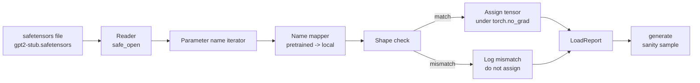

# Carregando Pesos Pré-Ensentados

> A formação de um modelo de parâmetros de 124 milhões a partir do zero é uma decisão orçamental; carregar um checkpoint publicado é uma terça-feira. Esta lição carrega pesos de estilo GPT-2 pré-entrenados de um arquivo de segurança para a arquitetura exata da lição 35, percorre o mapeamento de nomes de parâmetros peça por peça, e a sanidade gera uma continuação para provar que a carga funcionou.

**Type:** Build
**Languages:** Python
**Prerequisites:** Phase 19 lessons 30 to 36
**Time:** ~90 minutes

## Objetivos de aprendizagem

- Leia um ficheiro de segredos com o `safetensors`Biblioteca Python e inspecionar os nomes e formas dos tensores.
- Mapa de cada nome de parâmetro pré-treinado em um parâmetro dentro do modelo GPT lição 35.
- Manusear as duas convenções de nome que diferem entre os pesos publicados GPT-2 e o modelo nesta pista: `wte/wpe/h.N.attn.c_attn/c_proj`E ...`mlp.c_fc/c_proj`contra os nomes locais `tok_embed/pos_embed/blocks.N.attn.qkv/out_proj`E ...`mlp.fc1/fc2`- Não .
- Detectar e recusar uma desajuste de forma com um erro claro antes de qualquer atribuição de peso acontecer.
- Gerencie uma curta continuação com os pesos carregados e confirme que os tokens vêm da distribuição carregada, não da inicializada aleatoriamente.

## O problema

Os pesos publicados não são embalados para a sua arquitetura. Eles carregam os nomes da implementação original usada.`transformer.h.0.attn.c_attn.weight`de forma`(2304, 768)`O seu modelo espera`blocks.0.attn.qkv.weight`de forma`(2304, 768)`(que é a mesma matriz em uma convenção de layout diferente) ou o seu modelo usa `nn.Linear`O mesmo parâmetro aparece com três identidades sutilmente diferentes (nome, forma, layout de byte) e o carregador tem que conciliar os três.

Um carregador que copia cegamente coloca o tensor certo no lugar errado e você obtém um modelo que gera disparates. Um carregador que se recusa a copiar quando a forma difere, mas não registra nada deixa você adivinhando qual tensor não conseguiu aterrar. O carregador nesta lição é explícito: cada atribuição é registrada, cada forma é verificada, e um `LoadReport`Resuma os hits, as falhas e as desatividade para que possa ler o que aconteceu.

## O conceito



O nome de mapeador é apenas uma função de cadeia para cadeia. A verificação de forma é um se. A atribuição acontece dentro `torch.no_grad()`O relatório contém o resultado de todos os nomes.

### Convenção de denominação GPT-2

Pesos GPT-2 publicados vivem sob nomes como:

| Pretrained name | Shape | Meaning |
|-----------------|-------|---------|
| `wte.weight` | (50257, 768) | Token embedding |
| `wpe.weight` | (1024, 768) | Position embedding |
| `h.N.ln_1.weight` | (768,) | LayerNorm 1 scale at block N |
| `h.N.ln_1.bias` | (768,) | LayerNorm 1 shift at block N |
| `h.N.attn.c_attn.weight` | (768, 2304) | Fused QKV linear weight |
| `h.N.attn.c_attn.bias` | (2304,) | Fused QKV linear bias |
| `h.N.attn.c_proj.weight` | (768, 768) | Attention output projection |
| `h.N.attn.c_proj.bias` | (768,) | Attention output projection bias |
| `h.N.ln_2.weight` | (768,) | LayerNorm 2 scale |
| `h.N.ln_2.bias` | (768,) | LayerNorm 2 shift |
| `h.N.mlp.c_fc.weight` | (768, 3072) | MLP fc1 weight |
| `h.N.mlp.c_fc.bias` | (3072,) | MLP fc1 bias |
| `h.N.mlp.c_proj.weight` | (3072, 768) | MLP fc2 weight |
| `h.N.mlp.c_proj.bias` | (768,) | MLP fc2 bias |
| `ln_f.weight` | (768,) | Final LayerNorm scale |
| `ln_f.bias` | (768,) | Final LayerNorm shift |

Duas surpresas para planear.`c_attn`- Não .`c_proj`- Não .`c_fc`Os lineares são armazenados com a matriz transposta em relação ao que `nn.Linear.weight`O carregador transpora durante a atribuição. A cabeça LM não está no arquivo; o modelo depende da ligação de peso com `wte`, então a cabeça é definida por alias uma vez `wte`Terras.

### A convenção local de nomeação

O modelo desta faixa usa nomes descritivos:

| Local name | Meaning |
|------------|---------|
| `tok_embed.weight` | Token embedding |
| `pos_embed.weight` | Position embedding |
| `blocks.N.ln1.scale` | LayerNorm 1 scale at block N |
| `blocks.N.ln1.shift` | LayerNorm 1 shift |
| `blocks.N.attn.qkv.weight` | Fused QKV |
| `blocks.N.attn.qkv.bias` | Fused QKV bias |
| `blocks.N.attn.out_proj.weight` | Attention output projection |
| `blocks.N.attn.out_proj.bias` | Output projection bias |
| `blocks.N.ln2.scale` | LayerNorm 2 scale |
| `blocks.N.ln2.shift` | LayerNorm 2 shift |
| `blocks.N.mlp.fc1.weight` | MLP fc1 |
| `blocks.N.mlp.fc1.bias` | MLP fc1 bias |
| `blocks.N.mlp.fc2.weight` | MLP fc2 |
| `blocks.N.mlp.fc2.bias` | MLP fc2 bias |
| `final_ln.scale` | Final LayerNorm scale |
| `final_ln.shift` | Final LayerNorm shift |

O mapeamento é uma função fixa. A lição envia-o como um ditado que o carregador retrata.

### O aparelho de estúdio

Os pesos reais do GPT-2 são de 0,5 GB. A demonstração não os descarregue; gera um pequeno dispositivo de segurança no primeiro jogo, com a convenção exata de nomeação do GPT-2 e formas adequadas a um modelo de 12 blocos em d_model 192 em vez de 768.

```figure
cc-weight-remap
```

## Construí-lo

`code/main.py`Implementos:

- Uma pequena réplica da lição 35 `GPTModel`Então esta lição é autocontida.
- `make_pretrained_to_local(num_layers)`que amplia as entradas por camada.
- `load_safetensors(model, path)`que itera nomes, mapeia-os, verifica a forma, transpõe os pesos de estilo conv1d e atribui-os sob `torch.no_grad()`Retorna um`LoadReport`- Não .
- `make_stub_safetensors(path, cfg)`que gera um arquivo fixo com a convenção de nomeação pré-treinada exata.
- Uma demonstração que cria`outputs/gpt2-stub.safetensors`na primeira execução, constrói um modelo novo, capta uma continuação gerada a partir de init aleatório, carrega o estúdio, capta outra continuação, imprime ambas e verifica se as duas são diferentes (a carga realmente mudou o modelo).

- É o que é ?

```bash
python3 code/main.py
```

Output: o caminho de fixação, um registro de carga por nome, um `LoadReport`Resumo, uma continuação antes da carga, uma continuação após a carga e uma desajuste de forma num único tensor intencionalmente ruim injetado na fixação para que o caminho de falha seja exercido.

## Estaca

- `safetensors`para o formato em disco e um leitor de streaming.
- `torch`para o modelo e a matemática da tarefa.
- Não , não .`transformers`Não , não .`huggingface_hub`Não há ligações de rede.

## Padrões de produção em silêncio

Três padrões fazem o carregador sobreviver ao contato com pesos que não criaste.

**Always validate the file before any assignment.**Abra o arquivo, lista todos os nomes do tensor com seu dtype e forma, execute o mapeamento completo com verificações de forma e só com sucesso começa a atribuir.

**Log every assignment with the source name and the destination name.**Quando algo parece errado, o registro diz-lhe qual tensor aterrou onde; a alternativa é ler hexdumps.`LoadReport`Dataclass nesta lição segue `loaded`- Não .`missing`- Não .`unexpected`, e `shape_mismatch`Lista e publica um resumo no final.

**The LM head is a weight tying alias, not a separate copy.**Configuração`model.lm_head.weight = model.tok_embed.weight`após o carregamento `tok_embed`É o padrão canônico.`lm_head.weight`O parâmetro quebra a ligação e duplica silenciosamente a contagem de parâmetros.

## Usá-lo

- O carregador funciona para qualquer arquivo de segurança que use a convenção de nomeação pré-treinada. Arquivos GPT-2 reais (pequeno / médio / grande / xl) funcionam sem alterações de código; apenas a configuração do modelo difere.
- O mesmo padrão se estende aos pesos LLaMA, Mistral, Qwen uma vez que você atualizar o mapa de nome.
- A geração de sanidade após uma carga é um portal rápido: se as amostras pós-carga se parecem com as amostras pré-carga, a carga não mudou o modelo, o que significa que o mapeamento silenciosamente perdeu todos os tensores.

## Exercícios

1. Adicionar um`dtype`Argumento para o carregador que lança cada tensor para um tipo de destino (`bfloat16`- Não .`float16`- Não .`float32`- a) durante a atribuição.`float32`O modelo pode ser reduzido para `bfloat16`e ainda gerar.
2. Adicionar um`expected_layers`argumento que recusa a carga de um ponto de controlo cujo`h.N`Os índices não correspondem aos do modelo `num_layers`- Não .
3. Conecte o carregador na função de geração lição 35 e produzir duas amostras lado a lado: uma da iniciação aleatória, outra da fixação carregada.
4. Adicionar um caminho de exportação: escrever o estado atual do modelo em um arquivo de safetensores frescos usando a convenção de nomeação pré-entrenada.
5. Extensão`NAME_MAP`para lidar com a convenção de nomeação LLaMA (sem preconceitos, RMSNorm, layout qkv fusível) e re-exercer o carregador em um dispositivo LLaMA de estúdio que você gera.

## Termos-chave

| Term | What people say | What it actually means |
|------|-----------------|------------------------|
| Name map | "Key remapping" | The function from pretrained tensor names to local parameter names; usually a literal dict with one entry per layer index expanded over a loop |
| Shape mismatch | "Bad shape" | The pretrained tensor exists under the mapped name but its dimensions disagree with the local parameter; the loader refuses to assign and logs the pair |
| Transpose-on-load | "Conv1d layout" | Published GPT-2 stores attention and MLP projections in the transpose of what nn.Linear expects; the loader transposes during assignment |
| Weight tying alias | "Shared LM head" | Setting model.lm_head.weight = model.tok_embed.weight so the head and embedding share storage; the head is not in the file because of this |
| Load report | "Coverage summary" | A small dataclass that tracks loaded, missing, unexpected, and shape_mismatch lists; printing it is how you tell whether the load succeeded |

## Mais leitura

- Fase 19 lição 35 para a arquitetura que recebe os pesos.
- Fase 19 lição 36 para o ciclo de treinamento que produz um ponto de controlo da mesma forma.
- Fase 10 lição 11 (quantização) para o que fazer com os pesos carregados quando a memória é apertada.
- Fase 10 lição 13 (construção de um conjunto completo de LLM) para todo o ciclo de vida em torno da carga e da inferência.
