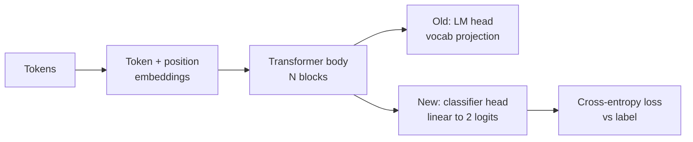
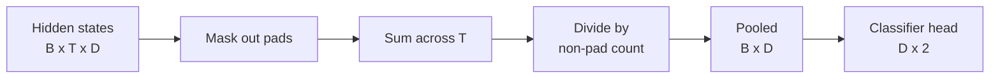
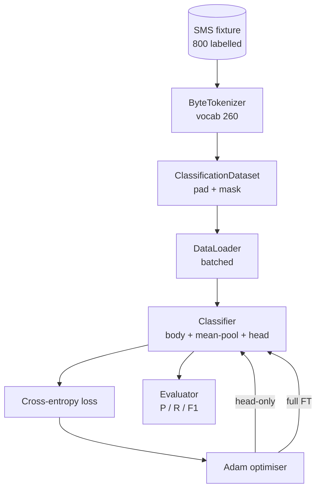

# Lição 38: Classificador - Ajuste perfeito por troca de cabeça

> A primeira pedra final da pista B. Um modelo de linguagem pré-treinado é uma pilha de blocos de auto-atenção que terminam em uma cabeça de previsão de token. Quando queremos spam vs. presunto, a cabeça está errada, mas o corpo está na maior parte certa. Esta lição arranca a cabeça, pega uma camada linear de duas classes na representação conjunta e treina o classificador de duas maneiras diferentes: apenas a camada final e o ajuste fino completo. A avaliação é de precisão, de recall e F1 em uma divisão prolongada. Aprende o que cada estratégia lhe compra e o que custa.

**Type:** Build
**Languages:** Python (torch, numpy)
**Prerequisites:** Phase 19 lessons 30-37 (NLP LLM track: tokenizer, embedding table, attention block, transformer body, pre-training loop, checkpointing, generation, perplexity)
**Time:** ~90 minutes

## Objetivos de aprendizagem

- Substituir um cabeçalho de modelo de linguagem por um cabeçalho de classificação sem reiniciar o corpo.
- Implementar dois regimes de formação: corpo congelado (apenas cabeça) e ajuste fino completo, compartilhando um ciclo de formação.
- Construir um pipeline de dados consciente do tokeniser que pads, mascarar padding, e concentra a saída de atenção.
- Computa precisão, recall, F1, e uma matriz de confusão a partir de logits brutos.
- Razão sobre a troca entre o número de parâmetros, o tempo de treinamento e o espaço de frente.

## O problema

Você pre-treinou um pequeno transformador em um corpus genérico. A cabeça de saída projeta o último estado oculto para um vocabulário de 1000 tokens. Agora você tem 800 mensagens SMS rotuladas spam ou ham e você quer um classificador binário. Existem três opções.

A opção errada é treinar um novo classificador a partir de zero em 800 exemplos. O corpo do modelo pré-treinado já codifica estrutura útil: identidade de palavras, posição, co-ocorrência simples.

As duas opções certas são o head swap com o corpo congelado e o head swap com o corpo treinável. O treinamento com a cabeça é rápido, quase livre na memória e raramente supera em detalhes.

Esta lição constrói as duas, para que possam comparar-se no mesmo dispositivo.

## O conceito



O modelo é uma função.`f_theta(tokens) -> hidden_states`A cabeça é uma função .`g_phi(hidden) -> logits`Trocar cabeças significa manter .`theta`e substituindo`g_phi`Os parâmetros do corpo são a parte mais cara.

Dois conjuntos de parâmetros treinaveis são importantes:

- `theta`(o corpo): dezenas de milhares de pesos por bloco de atenção.
- `phi`(a cabeça): `hidden_dim * num_classes`Peso mais preconceito.

No treinamento só para a cabeça , você calcula gradientes contra`phi`E os empurrar contra eles.`theta`O PyTorch permite-lhe fazer isto , configurando-o .`requires_grad=False`O optimista vê apenas a cabeça e o corpo fica congelado.

No processo de ajuste perfeito, os gradientes são deixados fluir de volta através de toda a pilha. Os pesos do corpo desviam para se adequarem ao objetivo de classificação. O risco é catastrófico se esquecer de pequenos dados: o pré-treino do corpo é eliminado pelo ruído excessivo.

## A questão da unificação

Um classificador precisa de um vetor por sequência, não um vetor por token.

- **Mean pool**: média dos estados ocultos em toda a sequência, ponderada pela máscara de atenção.
- **CLS pool**O BERT faz isso.
- **Last-token pool**A classificação da classe GPT é feita por um tipo de classificação.

Esta lição usa um pooling de meios com ponderação explícita de máscara de atenção. É a mais simples, dá um sinal estável em comprimentos de sequência, e não requer o treinamento prévio de um token CLS.



## Os dados

800 mensagens de SMS, equilibradas 400 spam e 400 ham, são geradas deterministicamente em `code/main.py`O gerador usa uma semente fixa, seleciona modelos e substitui preenchimentos de slots, e emite mensagens de 5 a 25 tokens de comprimento.

Os dados dividem 80/20: 640 tren, 160 test. As divisões são estratificadas para que o conjunto de teste mantenha o equilíbrio 50/50. Um conjunto de balança conhecido permite que a precisão e a recordação sejam lidas como números honestos.

## As métricas

Classificação binária com classe 1 como classe positiva (spam).

- `TP`O spam previsto, era spam.
- `FP`O spam previsto foi o presunto.
- `FN`- O presunto presunto foi spam.
- `TN`O presunto presunto foi presunto.

As três métricas principais:

- `precision = TP / (TP + FP)`Das mensagens marcadas por spam, qual é a fração que são?
- `recall = TP / (TP + FN)`Do spam real, qual é a fração do modelo?
- `F1 = 2 * P * R / (P + R)`A média harmonica dos dois.

Uma matriz de confusão imprime as quatro contagens como uma grade 2x2.

```figure
cap-classifier-head-swap
```

## Arquitetura



O corpo é um transformador deliberadamente pequeno: vocabulário 260, escondido 64, 4 cabeças, 2 blocos, sequência máxima 32. É pequeno o suficiente para treinar ambos os regimes para a convergência dentro de noventa segundos na CPU.`pretrain_quick`O assistente faz cinco épocas de treinamento de LM no texto do mesmo dispositivo para dar ao corpo um ponto de partida não trivial.

## O que você vai construir

A execução é uma das `main.py`mais um módulo de ensaio (`code/tests/test_main.py`)).

1. `ByteTokenizer`: mapas bytes para IDs, reserva um pad ID.
2. `Block`O sistema de transmissão de dados é um bloco de transmissão com atenção de várias cabeças e uma camada de alimentação.
3. `LMBody`: token + posições de inserção mais uma pilha de blocos. Retorna estados ocultos.
4. `MeanPool`: média ponderada de máscara sobre o eixo de sequência.
5. `Classifier`O corpo é o mesmo em todos os regimes.
6. `freeze_body`E ...`unfreeze_body`: toggle `requires_grad`sobre os parâmetros do corpo.
7. `train_classifier`O modelo e o optimizador são configurados para qualquer grupo de parâmetros que seja treinável.
8. `evaluate`: executa o conjunto de ensaio e retorna `Metrics(precision, recall, f1, confusion)`- Não .
9. `run_demo`O corpo é treinado brevemente, depois treinado e avaliado apenas com a cabeça, depois cheio, imprime os dois relatórios e sai de zero.

## Por que a comparação é importante

O regime de cabeça-só treina geralmente mais rápido e se encaixa mais graciosamente. Neste dispositivo você normalmente vê precisão perto de 0,9 e lembra cerca de 0,85 após vinte épocas de treinamento apenas cabeça.

A lição não escolhe um vencedor. Ela ensina você a ler os números e o custo. Em 800 exemplos e um corpo pequeno, apenas a cabeça é a chamada certa. Em 80.000 exemplos e um corpo maior, o ajuste fino completo começa a pagar. O contrato que você tira desta lição é a API: o mesmo `train_classifier`Função lida com ambos, e a ligação é uma chamada.

## Objetivos de desenvolvimento

- Adicione um terceiro regime que descongele apenas o último bloco. Isto é às vezes chamado de ajuste fino parcial.
- Adicione um cronograma de taxa de aprendizagem. Um cronograma cosínico na cabeça mais uma taxa constante menor no corpo é uma configuração de produção comum.
- Substitua o pooling médio por um pool de atenção aprendido: uma pequena camada de atenção com uma consulta aprendida.

A implementação dá-lhe os ganchos, os testes fixam o contrato, os números são seus para empurrar.
