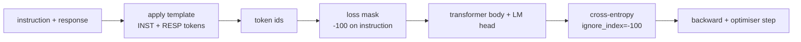
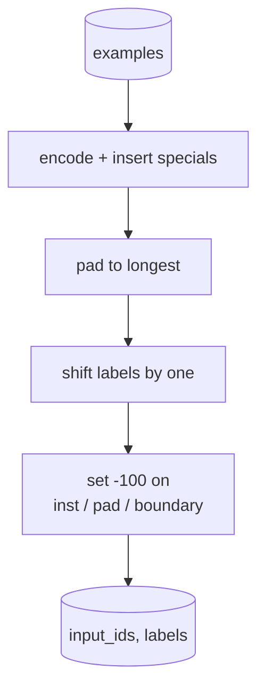
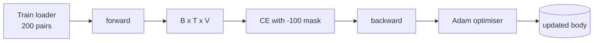

# Lição Capstone 39: A sintonia de instruções por meio de sintonia supervisionada

> Um modelo base pré-treinado pode estender uma sequência, mas não pode seguir uma instrução. O ajuste fino supervisionado é a menor mudança que corrige isso: alimentar o modelo com exemplos emparelhados de uma instrução e uma resposta desejada, e treinar o corpo para prever os tokens de resposta. O truque é que só queres que a perda conte a resposta, não a instrução. Esta lição constrói um ciclo SFT de estilo Alpaca com uma função de collage personalizada que enmascara tokens de instrução com `ignore_index=-100`, treina em 200 pares de instrução-resposta e avalia em uma divisão prolongada usando a correspondência exacta.

**Type:** Build
**Languages:** Python (torch, numpy)
**Prerequisites:** Phase 19 lessons 30-37 (NLP LLM track: tokenizer, embedding table, attention block, transformer body, pre-training loop, checkpointing, generation, perplexity)
**Time:** ~90 minutes

## Objetivos de aprendizagem

- Formatar dados de instrução-resposta em par em uma única sequência causal com tokens de limites explícitos.
- Construir uma função de collate que masque os tokens de instrução para que a entropia cruzada apenas conte os tokens de resposta.
- Treinar um pequeno corpo transformador sob o objetivo SFT e observar o movimento da métrica de avaliação.
- Implementar a geração gananciosa e de temperatura de amostragem que respeite o limite de resposta-iniciada.
- Calcule a correspondência exata das conclusões geradas.

## O problema

Um modelo base treinado em previsão de next-token não tem ideia do que é uma instrução. Mostre-lhe a cadeia `"What is the capital of France?"`O modelo tem a linguagem mas não o contrato de formato.

O contrato SFT é um modelo de cadeia.

```text
<INST> What is the capital of France? <RESP> The capital of France is Paris.
```

Os tokens de limite são tokens especiais reservados no tempo de treinamento.`<RESP>`O objetivo da marca base ainda se aplica; é apenas treinado em um corpus onde cada exemplo tem essa forma.

Mas há uma coisa que não é certo. Se você alimentar toda a sequência para uma perda de entropia cruzada de vainilha, você está treinando o modelo para também prever os tokens de instrução.

## O conceito



`ignore_index`é uma característica de `torch.nn.functional.cross_entropy`Qualquer posição-alvo igual a `ignore_index`A convenção em PyTorch é a seguinte:`-100`A função collate cria dois tensores , por exemplo: `input_ids`(a sequência completa) e `labels`(uma cópia de `input_ids`com as posições de instrução sobrecritas por `-100`)).

O modelo vê toda a sequência durante a passagem para a frente; a atenção pode atender à instrução. A perda só conta os tokens de resposta. É exatamente isso que você quer: condição na instrução, prever a resposta.

## Os dados

Doiscentos pares de instrução-resposta são gerados deterministicamente em `main.py`- abrangem seis tipos de tarefas:

- O valor de um valor de um valor de um valor de um valor de um valor de um valor de um valor de um valor de um valor de um valor de um valor de um valor de um valor de um valor de um valor de um valor de um valor de um valor de um valor de um valor de um valor de um valor de um valor de um valor de um valor de um valor de um valor de um valor de um valor de um valor de um valor de um valor de um valor de um valor de um valor de um valor de um valor de um valor de um valor de um valor de um valor de um valor de um valor de um valor de um valor de um valor de um valor de um valor de um valor de um valor de um valor de um valor de um valor de um valor de um valor de um valor de um valor de um valor de um valor de um valor de um valor de um valor de um valor de um valor de um valor de um valor de um valor de um valor de um valor de um valor de um valor de um valor de um valor de um valor de um valor de um valor de um valor de um valor de um valor de um valor de um valor de um valor de um valor de um valor de um valor de um valor de um valor de um valor de um valor de um valor de um valor de um valor de um valor de um valor de um valor de um valor de um valor de um valor de um valor de um valor de um valor de um valor de um valor de um valor de um valor de um valor de um valor de um valor de um valor de um valor de um valor de um valor de um valor de um valor de um valor de um valor de um valor de um valor de um valor de um valor de um valor de um valor de um valor de valor de valor de valor de um valor de valor de valor de um valor de valor de valor de valor de valor de valor de valor de valor de valor de valor de valor de valor de valor de valor de valor de valor de valor de valor de valor de valor de valor de valor de valor de valor de valor de valor de valor de valor de valor de valor de valor de valor de valor de valor de valor de valor de valor de valor de valor de valor de valor de valor de valor de valor de valor de valor de valor de valor de valor de valor de valor de valor de valor de valor de valor de valor de valor de valor de valor de valor de valor de valor de
- Aritmética
- Extração de listas
- Resumo de uma frase
- código (impressão, classificação)
- definição

Cada tarefa tem uma instrução templada e uma resposta determinista. Isso é intencionalmente simples. A correspondência exata é frágil, e a lição usa um ajuste onde a resposta certa é uma cadeia específica.

O conjunto de testes abrange todos os seis tipos de tarefas para que possa ser relatado o correspondimento exacto por categoria.

## Tokenização e empolgação

O tokeniser é de nível byte com três especiais reservados:

- `INST_ID = 256`A primeira fase é a de formação.
- `RESP_ID = 257`A resposta é a fronteira entre instrução e resposta.
- `PAD_ID = 258`: empilhadeira para lotes de comprimento variável.

A sequência é `[INST] inst_bytes [RESP] resp_bytes [PAD]*`A função de collagem:

1. - É um símbolo de cada exemplo.
2. Peda todos os exemplos do lote para a sequência mais longa do lote.
3. Construções `labels`- Não .`input_ids`A taxa de mortalidade deve ser de um ponto a outro.
   - A região de instrução é substituída por `-100`- Não .
   - A região de enchimento foi substituída por `-100`- Não .
   - O `RESP_ID`A posição de limite em si foi substituída por `-100`(Você não treina o modelo para prever o sinal de fronteira; ele prevê o que segue).



O turno é o truque causal padrão: posição .`i`de`input_ids`Previsão de posição`i+1`- Então ...`labels[i] = input_ids[i+1]`(com a posição final retirada da entrada e a primeira retirada do alvo).

## Formação



O loop é o loop SFT padrão PyTorch. Adam, taxa de aprendizagem em torno de 3e-4 a 1e-3, dez a vinte épocas neste dispositivo, sem cronógrafo. O modelo é pequeno o suficiente (escondido 96, 2 blocos, comprimento máximo 64) para treinar para convergência na CPU dentro de dois minutos.

A cada quinta época, o loop executa uma pequena avaliação no conjunto de dados e imprime a correspondência exata.

## Geração

No momento de avaliação o modelo recebe o prefixo de instrução `[INST] inst_bytes [RESP]`e gera tokens até que:

- A sequência chega a`max_len`, ou
- O modelo emite uma heurística especial de parada: dois bytes consecutivos que terminam sentenças (`.`- Não .`!`- Não .`?`)).

A lição envia a codificação gananciosa mais um amostragem de temperatura opcional. A combinação exacta usa a ganância porque a temperatura faria a métrica estocástica. Os sistemas reais geralmente amostram, depois julgam confusamente; esse pipeline é lição 41.

## Avaliação de correspondência exata

A linha de resposta prevista é normalizada (marca baixa, espaço branco de tira, espaços duplos de colapso) e comparada com a resposta de referência, normalizada da mesma forma. A métrica é 1 ou 0, por exemplo.

As realidades de SFT complementam a correspondência exata com o nível de token F1 (leção 41) e um modelo de juiz. A correspondência exata continua útil porque é inequívoca; se diz 0,7, exatamente 70% das instruções de teste produziram o caracter de resposta dourado para o personagem.

```figure
cc-sft-loss-mask
```

## O que você vai construir

A execução é uma das `main.py`- E os testes.

1. `InstructionTokenizer`O código de código é um código de código de código de código de código de código de código de código de código de código de código de código de código de código de código de código de código de código de código de código de código de código de código de código de código de código de código de código de código de código de código de código de código de código de código de código de código de código de código de código de código de código de código de código de código de código de código de código de código de código de código de código de código de código de código de código de código de código de código de código de código de código de código de código de código de código de código de código de código de código de código de código de código de código de código de código de código de código de código de código de código de código de código de código de código de código de código de código de código de código de código de código de código de código de código de código de código de código de código de código de código de código de código de código de código de código de código de código de código de código de código de código de código de código de código de código de código de código de código de código de código de código de código de código de código de código de código de código de código de código de código de código de código de código de código de código de código de código de código de código de código de código de código de código de código de código de código de código de código de código de código de código de código de código de código de código de código de código de código de código de código de código de código de código de código de código de código de código de código de código de código de código de código de código de código de código de código de código de código de código de código de código de código de código de código de código de código de código de código de código de código de código de código de código de código de código de código de código de código de código de código de código de código de código de código de código de código de código de código de código de código de código de código de código de código de código de código de código de código de código de código de código de código de código de código de código de código de código de código de código de código de código de código de código de código de código de código de código de código de código de código de código de código de código de código de código de código de código de código de código de código de código de
2. `make_dataset`A produção de 200 pares em seis tipos de tarefas com uma semente fixa.
3. `SFTDataset`: devoluções `(input_ids, labels)`Por exemplo, já preparada com máscara.
4. `sft_collate`: empolgação dinâmica, construi o tensor de lote, conjuntos `-100`sobre as posições de instrução e de almofada.
5. `TinyGPT`: corpo do transformador mais cabeça de LM amarrada ou desamarrada.
6. `train_sft`: o ciclo SFT, com ganchos de avaliação por época.
7. `generate`: decodificação causal de um prefixo, ganancioso ou amostragado, com a heurística de parada.
8. `exact_match`: comparação normalizada de cadeias, retornos flutuam em `[0, 1]`- Não .
9. `run_demo`A Comissão Europeia, em nome da Comissão, tem como objectivo:

## Por que a máscara importa

Sem a máscara, a perda trata os tokens de instrução como alvos. O modelo aprende a prever a instrução. Este é um objectivo diferente e produz um modelo pior de duas maneiras. Primeiro, a capacidade do modelo é desperdiçada reconstruindo as entradas que o usuário sempre fornece. Em segundo lugar, a perda de resposta é menor na soma do gradiente porque os tokens de instrução superam em número os tokens de resposta na maioria dos lotes; a taxa de aprendizagem eficaz do optimizador na parte que você se importa é menor do que pretendia. A máscara não é um polir, é o objetivo.

## Objetivos de desenvolvimento

- Adicione um aquecimento da taxa de aprendizagem seguido de decadência cosina.
- Adicionar registro de perdas por token e traçar a curva de perdas sobre o treinamento.`<RESP>`As respostas são dominadas pelos tokens reais.
- Extender a avaliação para BLEU-1 ou chrF. A correspondência exacta subestima os modelos que produzem uma paráfrase com a mesma resposta.
- Adicione um modelo de bate-papo com formatamento de várias voltas e treine em um dispositivo que inclua acompanhamentos.

A implementação dá-lhe o contrato de formato, a máscara e o loop. A mudança objetiva do modelo base para seguidor de instruções é uma função de collage.
