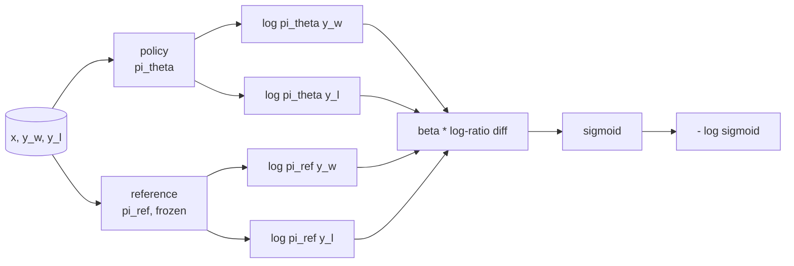
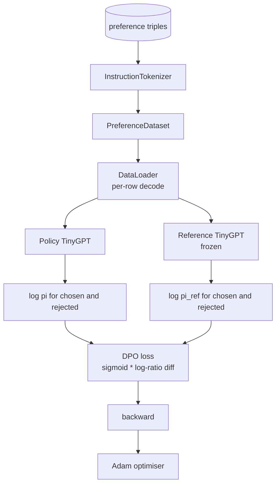

# Capstone Lição 40: Optimização direta de preferências a partir do zero

> Os modelos de recompensa e PPO são a pilha clássica de RLHF. O DPO desmorona essa pilha em uma única perda supervisionada que se encaixa diretamente numa política contra pares de preferências. Esta lição deriva a perda de DPO da identidade da diferença de recompensa, envia um modelo de referência de trabalho mais um modelo de política, calcula probabilidades de registro por token e treina um pequeno transformador em uma fixação de preferência de conclusões escolhidas e rejeitadas. Os testes fixam a matemática de perdas e a direção do gradiente para que você saiba que a implementação corresponde ao papel.

**Type:** Build
**Languages:** Python (torch, numpy)
**Prerequisites:** Phase 19 lessons 30-37 (NLP LLM track: tokenizer, embedding table, attention block, transformer body, pre-training loop, checkpointing, generation, perplexity)
**Time:** ~90 minutes

## Objetivos de aprendizagem

- Derivar a perda de DPO como sigmoide sobre uma diferença de log-ratio escalado e conectá-la à recompensa implícita.
- Construir um modelo de referência + modelo de política com uma referência congelada e uma política treinable.
- Compute probabilidades de registro de nível de sequência em ambos os modelos, mascando os tokens de prompt.
- Formar a política de`(prompt, chosen, rejected)`triplicando e observando a elevação do log-prob em relação ao rejeitado.
- Comportamento de pin com testes sobre a matemática de perda, o sinal de gradiente e a invariância de referência.

## O problema

Você tem um modelo SFT. Ele segue instruções, mas suas saídas são desiguais; algumas conclusões são claras, outras são verbais ou erradas. Você também tem um pequeno conjunto de dados de pares de preferências: para o mesmo prompt, um humano marcou uma conclusão como escolhida e a outra como rejeitada.

A resposta clássica RLHF é um pipeline de duas etapas. Treinar um modelo de recompensa sobre as preferências. Optimizar a política contra a recompensa com PPO. Isso funciona, mas é caro: dois modelos na memória durante PPO, controle KL para manter a política perto da referência, hacking de recompensa quando o modelo de recompensa é frágil.

O DPO substitui ambas as etapas com uma única perda supervisionada. O modelo de recompensa nunca existe explícitamente. A política é treinada diretamente nos pares de preferências, com uma penalidade KL explícita em relação à referência SFT. A mesma solução ideal sob o modelo de preferência Bradley-Terry, muito menos código.

## O conceito

Comece com o modelo Bradley-Terry.`x`e duas conclusões `y_w`(escolhido) e `y_l`(rejeitado), a probabilidade que o ser humano prefere `y_w`é

```text
P(y_w > y_l | x) = sigmoid( r(x, y_w) - r(x, y_l) )
```

onde`r`É uma função de recompensa latente.`r`O que é que é o que é?`pi`para maximizar `r`com âncora KL:

```text
max_pi   E_{x, y~pi} [ r(x, y) ] - beta * KL(pi || pi_ref)
```

A derivação do DPO observa que a política óptima `pi*`O objectivo de esta acção é de forma fechada em termos de`r`- Não .

```text
pi*(y | x) = (1/Z(x)) * pi_ref(y | x) * exp( r(x, y) / beta )
```

Reorganizar para `r`- Não .

```text
r(x, y) = beta * ( log pi*(y | x) - log pi_ref(y | x) ) + beta * log Z(x)
```

O `log Z(x)`O termo é o mesmo para ambos `y_w`E ...`y_l`(depende de)`x`Não , não .`y`), por isso, é cancelado quando se calcula a diferença de preferências:

```text
r(x, y_w) - r(x, y_l) = beta * ( log pi_theta(y_w|x) - log pi_ref(y_w|x)
                                - log pi_theta(y_l|x) + log pi_ref(y_l|x) )
```

Substituir no sigmoide Bradley-Terry e tomar probabilidade de registro negativo sobre pares de preferência:

```text
L_DPO(theta) = - E_{(x, y_w, y_l)} [
  log sigmoid( beta * ( log pi_theta(y_w|x) - log pi_ref(y_w|x)
                       - log pi_theta(y_l|x) + log pi_ref(y_l|x) ) )
]
```

Esta é a perda. É um sigmoide sobre um único escalar, por exemplo, calculado a partir de quatro log-probabilidades. Não há modelo de recompensa separado. Não há PPO. Não há termo KL na perda; a restrição KL é cozida na derivação de forma fechada.



## O sinal do gradiente

Uma boa verificação de sanidade mental antes de qualquer treino.`log pi_theta(y_w | x)`- Não .

```text
d L_DPO / d log pi_theta(y_w | x) = - beta * (1 - sigmoid(z))
```

onde`z`É o argumento para o sigmoide.`z`O aumento da probabilidade de log da política de conclusão escolhida diminui a perda.`log pi_theta(y_l | x)`O processo de formação é positivo: o aumento da probabilidade de log rejeitado aumenta a perda.

## Os dados

Doze preferências triplicam a lição.`(prompt, chosen, rejected)`. A conclusão escolhida é curta e precisa. O rejeitado é verbal, fora do tópico ou errado. Os pares cobrem as mesmas famílias de tarefas que a lição 39 (capital, aritmética, lista), de modo que uma política que começou a partir de uma base de SFT tem um ponto de partida razoável.

O DPO trabalha em dezenas de milhares de pares em produção; aqui, o ponto é que a matemática de perdas e o loop correm de ponta a ponta em um conjunto de dados minúsculo e a diferença entre o log-prob escolhido e o rejeitado aumenta visível.

## Invariância de referência

A implementação de DPO deve lidar com o modelo de referência com cuidado. O modelo de referência é o modelo SFT congelado no local.

- Os parâmetros de referência nunca recebem gradientes.
- As probabilidades de registro de referência nunca mudam entre épocas.
- A política de política de investimento é baseada nos mesmos pesos que a referência.`theta`é a referência mais uma actualização aprendida; inicializar a política como uma cópia da referência é o início bem definido.)

A execução impõe-as através:

- Envolver a referência em `torch.no_grad()`durante as passagens dianteiras.
- Configuração`requires_grad=False`em cada parâmetro de referência.
- Construção da política através de `policy.load_state_dict(reference.state_dict())`após a criação da referência.

```figure
cap-dpo-preference
```

## Arquitetura



O modelo é o mesmo TinyGPT utilizado na lição 39 (apenas para decodificadores, causal, tokeniser de byte).

## O que você vai construir

A execução é uma das `main.py`- E os testes.

1. `InstructionTokenizer`: tokenizador de byte com `INST`E ...`RESP`A mesma forma que a lição 39.
2. `TinyGPT`A mesma forma que a lição 39, então a lição é autocontenida mesmo que você salte 39.
3. `make_preferences`: retorna doze `(prompt, chosen, rejected)`- Três vezes.
4. `sequence_log_prob`: dado o modelo, um prefixo de ponta e uma conclusão, retorna a soma das probabilidades de log do token seguinte sobre a conclusão (sem contribuição de posição de ponta).
5. `dpo_loss`: toma as quatro probabilidades de registro e `beta`, retorna o tensor de perda por exemplo e o delta de recompensa implícita para registro.
6. `train_dpo`O processo de cálculo de um log-probe é um processo de cálculo de um log-probe de um log-probe de um log-probe de um log-probe de um log-probe de um log-probe de um log-probe de um log-probe de um log-probe de um log-probe de um log-probe de um log-probe de um log-probe de um log-probe de um log-probe de um log-probe de um log-probe de um log-probe de um log-probe de um log-probe.
7. `evaluate_margins`: retorna a margem média de probabilidade de registro escolhida por rejeição no âmbito da política em qualquer momento.
8. `run_demo`A Comissão propõe que a Comissão tome medidas para que a Comissão possa tomar medidas para garantir que a Comissão não se comprometa com a aplicação da legislação comunitária.

## Por que funciona a DPO

O DPO é matematicamente equivalente ao RLHF sob o modelo de preferência Bradley-Terry, até a parâmetricação da recompensa.`r(x, y) = beta * (log pi(y|x) - log pi_ref(y|x))`é identificável a partir de preferências até uma função de `x`A política de formulário fechado permite que você saia do modelo de recompensa explícito.`pi`de`pi_ref`O que é que é o que faz com que a relação de log maior e o sigmoide saturado, que amortece a gradiência quando a política se move muito longe.

## Objetivos de desenvolvimento

- Adicionar uma normalização de comprimento à soma de probabilidade de registro: dividir por comprimento de conclusão.
- Adicionar a variante de IPO da perda: substituir o sigmoide + log por `(z - 1)^2`Comparar a convergência na fixação.
- Adicionar um parâmetro de suavizamento de rótulos que interpola entre a rótulo rejeitada com dificuldade e um uniforme 0,5.
- Substituir a referência por um modelo menor e mais barato (sabor de destilação de conhecimento).

A implementação dá-lhe a perda, a invariância de referência e o ciclo de treinamento.
