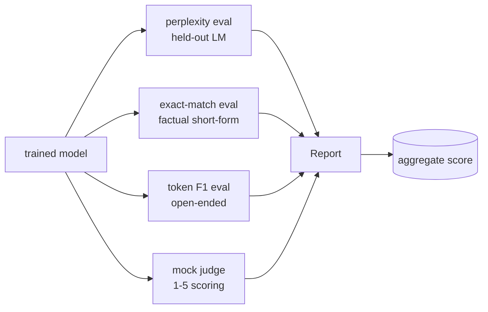
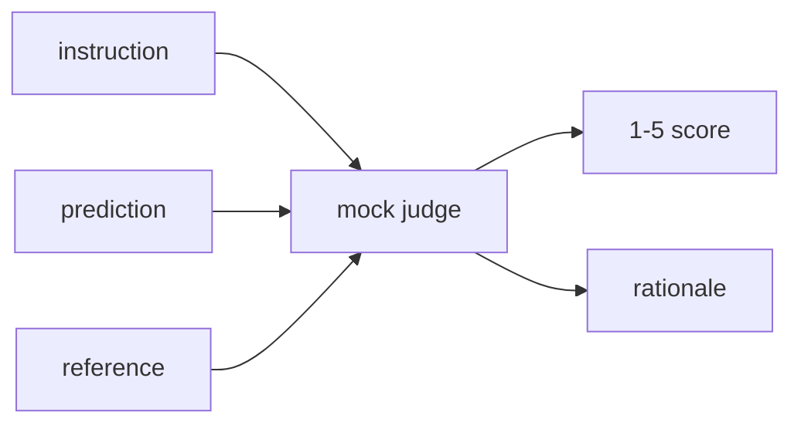
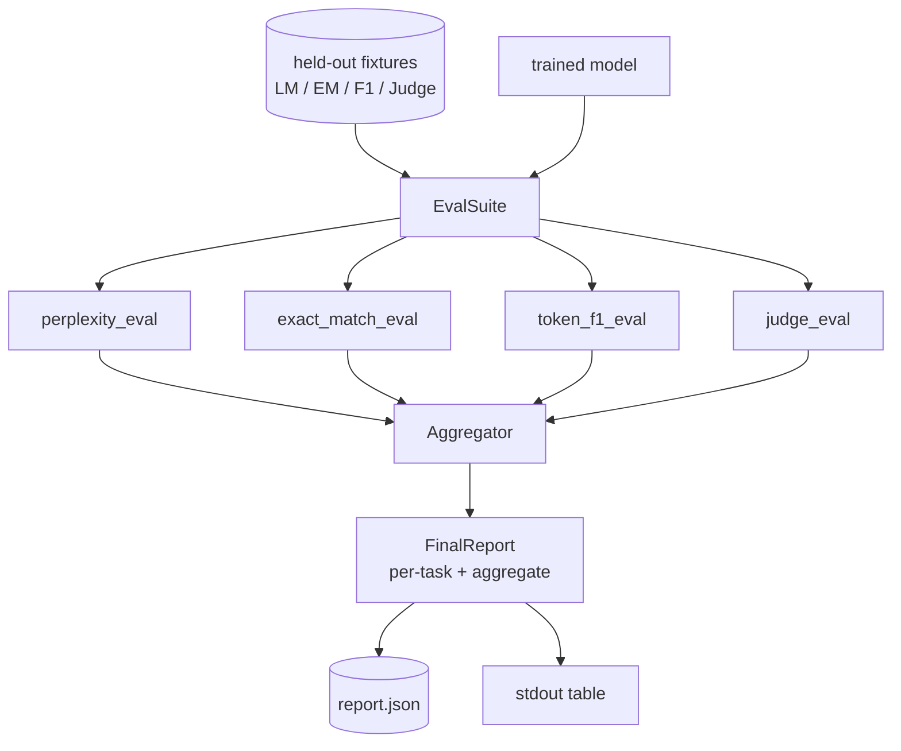

# Lição Capstone 41: Pipeline de Avaliação Completa

> O treino é a parte que se pode monitorar com curvas de perda. A avaliação é a parte que você tem que projetar. Esta lição constrói um pipeline de avaliação unificada que toma qualquer modelo de linguagem treinado, executa quatro avaliações heterogêneas sobre ele, agrega os resultados em um relatório por tarefa e envia um LLM local simulado como juiz para que o loop funcione sem uma rede. As quatro avaliações abrangem as dimensões necessárias a cada modelo de transporte: modelagem de linguagem (perplexidade), corretura de forma curta (em correspondência exata), semelhança de forma aberta (token F1) e pontuação qualitativa (julgamento).

**Type:** Build
**Languages:** Python (torch, numpy)
**Prerequisites:** Phase 19 lessons 30-37 (NLP LLM track: tokenizer, embedding table, attention block, transformer body, pre-training loop, checkpointing, generation, perplexity)
**Time:** ~90 minutes

## Objetivos de aprendizagem

- Computa perplexidade prolongada com a contabilidade de tokens mascarados em um transformador minúsculo.
- Faça uma avaliação de correspondência exata em pedidos factuais de forma curta.
- Calcule o nível de token F1 entre as cadeias de referência e previsão com normalização.
- Construir um simulado LLM local como juiz que pontua resultados de modelos em uma escala de 1 a 5.
- Agrega as quatro avaliações num único relatório ponderado, com a repartição por tarefa.

## O problema

Uma única métrica nunca descreve um modelo de linguagem. A perplexidade diz o quão bem o modelo se encaixa na distribuição da linguagem, mas não diz nada sobre se responde a perguntas. A correspondência exacta diz se o modelo produz a corda de ouro, mas pede parafrases corretas. O Token F1 perdoa parafrase, mas é enganado pela sobreposição léxica com conteúdo errado. O LLM como juiz capta dimensões qualitativas, mas é caro e estoquístico.

O pipeline que você realmente quer tem os quatro. Cada avaliação cobre uma dimensão que os outros não têm. Cada um é executado em um subconjunto diferente de dados mantidos em forma para essa métrica. O relatório final mostra os números por tarefa lado a lado e um agregado, para que um revisor possa ver em um olhar que compensações o modelo está fazendo.

Esta lição constrói esse pipeline, de ponta a ponta, num único arquivo.

## O conceito



Cada eval é uma função de `(model, dataset) -> EvalResult`O resultado contém o valor métrico, os detalhes por exemplo para inspecção e um nome para o agregado.

## Perplexidade, devidamente contada

A perplexidade é `exp(mean negative log-likelihood per token)`A implementação tem duas armadilhas:

- A média deve ser sobre posições reais de tokens, não sobre a sequência de lote *.
- O modelo prevê o próximo token, então logita em posição `i`Previr o token em posição `i+1`Os erros simples aqui são silenciosos: a perda continua a correr, mas a métrica torna-se sem sentido.

O avaliador calcula somas por lote de `-log p(token)`Em termos numéricos, é mais seguro que a média de perplexidades por lote (que subpõe a seqüências curtas) e corresponde à definição do livro de texto.

## A correspondência exacta com a normalização

O arnes normaliza a previsão e a referência antes de comparar:

- - Em minúsculas.
- - A banda em torno do espaço branco.
- O espaço interno de colapso corre para um único espaço.
- Puntuação terminal de queda (`.`- Não .`!`- Não .`?`) se os dois lados diferirem apenas por pontuação.

A normalização torna a correspondência exacta útil na prática.`"Paris"`É certo; um que diz `"Paris."`Também está certo; um que diz `"  paris  "`A métrica ainda exige que a resposta seja a mesma cadeia após a normalização.

## Token F1, para o caminho certo

O token F1 é a média harmônica de precisão e de recall calculada sobre os sacos de tokens.

1. Normalizar a previsão e a referência (as mesmas regras que a correspondência exata).
2. Dividir cada um em uma lista de tokens (tokenização de espaço branco).
3. Conta a intersecção de múltiplos conjuntos.
4. Precision = `intersection_count / len(pred_tokens)`- Recordo .`intersection_count / len(ref_tokens)`F1 = média harmonica.

Se a previsão e a referência são vazias, F1 é 1 (combinação vazia). Se apenas uma é vazia, F1 é 0. Este padrão corresponde à referência de avaliação SQuAD e produz números estáveis em todas as paráfrases.

## Local Falso LLM como Juiz

Um juiz real é um modelo de fronteira por trás de uma API. Para esta lição o juiz tem que executar offline. O juiz simulado é um marcador determinista que toma uma instrução, a previsão do modelo e a referência, e retorna uma pontuação em `{1, 2, 3, 4, 5}`As regras de pontuação são explícitas:

- 5 se a previsão normalizada for igual à referência normalizada.
- 4 se o token F1 entre previsão e referência for pelo menos 0,8.
- 3 se o token F1 estiver em `[0.5, 0.8)`- Não .
- 2 se o token F1 estiver em `[0.2, 0.5)`- Não .
- 1 caso contrário.

Não é um juiz real, mas tem a interface certa.



## Agrupamento

O agregado é uma média ponderada de pontuações normalizadas de avaliação.`[0, 1]`- Não .

- Perplexidade: normalização como `1 / (1 + log(perplexity))`Uma perplexidade de 1 mapas para 1, mapas infinitos para 0.
- - Sim , sim .`[0, 1]`- Não .
- Token F1: já em `[0, 1]`- Não .
- Juiz: Divida por 5.

Os pesos são configuráveis. A mistura padrão é de 0,2 perplexidade, 0,3 correspondência exata, 0,3 token F1, 0,2 juiz. A escolha dos pesos é uma decisão do produto; a lição expõe o botão para que você possa experimentar.

```figure
cg-eval-quadrant
```

## Arquitetura



O `EvalSuite`Cada avaliação individual é uma função livre que leva`(model, tokenizer, dataset, config)`e retorna um `EvalResult`- O .`Aggregator`A demonstração imprime a tabela e escreve uma cópia JSON que o CI pode ingerir.

## O que você vai construir

A execução é uma das `main.py`- E os testes.

1. `TinyGPT`A mesma arquitetura de apenas decodificador utilizada nas lições 38-40, incluída, para que a lição se mantenha sozinha.
2. `InstructionTokenizer`: tokenizador de byte com especialistas INST / RESP / PAD.
3. Quatro equipamentos: um corpus LM, um conjunto EM, um conjunto F1, e um conjunto de juízes.
4. `perplexity_eval`: devoluções `EvalResult`com o valor de perplexidade e o histograma de perda por token.
5. `exact_match_eval`: retorna a média de registos EM e por exemplo.
6. `token_f1_eval`: retorna a média de tokens F1 e registos por exemplo.
7. `mock_judge`E ...`judge_eval`: por exemplo, pontuação e racionalização, pontuação média em todo o conjunto.
8. `Aggregator.normalise`A normalização perpétua.
9. `Aggregator.aggregate`: média ponderada e relatório conjunto.
10. `run_demo`: treina um pequeno modelo brevemente, executa todas as quatro avaliações, imprime a tabela de relatório e escreve o JSON, sai de zero no sucesso.

## Leitura do relatório

O relatório tem três camadas. O topo é a pontuação agregada. Abaixo são os quatro números por eval. Abaixo são as desintegrações por exemplo para diagnóstico. Uma execução de CI que falha normalmente quer o agregado, mas um revisor que persegue uma regressão quer a desintegração por exemplo para ver quais entradas o modelo errou.

O JSON dump usa chaves estáveis para que um painel de controle de dados possa traçar linhas de tendência em todas as versões.

## Objetivos de desenvolvimento

- Adicione uma avaliação de calibração: as probabilidades de softmax do modelo correspondem à sua precisão?
- Adicionar uma avaliação de robustez: etiquetar cada exemplo com uma perturbação (tipo, parafrase, distractor) e relatar queda métrica por perturbação.
- Substitua o juiz simulado por um modelo real por trás de uma chamada HTTP. A assinatura da função não muda.
- Adicionar o aprendizado de peso por tarefa: em vez de pesos fixos, ajuste os pesos a uma ordem de preferência alvo sobre os modelos.

A implementação dá-lhe as quatro avaliações, o agregador e o relatório. As pipelines reais de avaliação cobrem muitas dimensões mais no topo; o padrão permanece o mesmo: uma função por avaliação, um agregador, um relatório.
