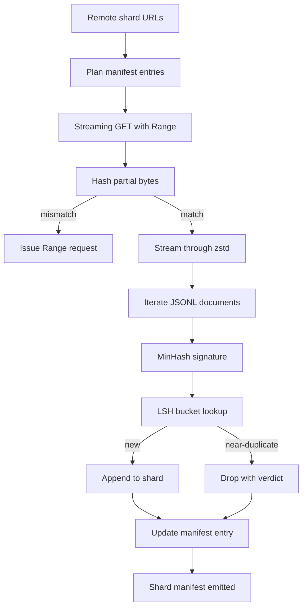

# Grande Descarregador de Corpus

> O treinamento de um modelo de linguagem começa muito antes do primeiro passo. O corpus tem de aterrar no disco, descomprimido, deduplicado e endereçável, com a história do currículo já trabalhada antes que a rede caia em 4%. Esta lição constrói um download de streaming que tira fragmentos comprimidos, descomprime em voo com o Zstandard, duplica impressões digitais quase através do MinHash e hashing sensível à localidade, e escreve um manifesto de fragmentos que o resto do pipeline pode confiar.

**Type:** Build
**Languages:** Python
**Prerequisites:** Phase 19 lessons 30-37
**Time:** ~90 minutes

## Objetivos de aprendizagem

- Transmitir fragmentos remotos com `urllib`e descomprimir com `zstandard`sem fazer um buffer no arquivo inteiro na memória.
- Resumir downloads parciais emitindo HTTP `Range`Os pedidos de compensação de byte verificada.
- Construir uma assinatura MinHash por documento e enfiá-la com LSH para que duplicados quase choquem.
- Emite um manifesto de fragmentos com hash de conteúdo, tamanho de byte, contagem de documentos e veredicto dedup.

## O problema

A primeira vez que se treina num corpo de 200 GB a rede cai em 41% e o script sai com um `urllib`A segunda vez que ele cai em 78%, você reescreveu o ciclo três vezes. Os dois erros que você tem que projetar a partir do primeiro minuto são o currículo de download parcial e a remoção duplicada de documentos. Ambos têm soluções bem conhecidas; ambos são rotineiramente ignorados porque o pipeline começa como uma linha.`requests.get`Chama-o que cresceu os dentes.

O servidor tem de respeitar o código de acesso.`Range`O cliente tem que rastrear o offset verificado contra um registro no disco, e o offset verificado tem que sobreviver à morte do processo. Se o offset e o arquivo divergem até mesmo um byte o download retomado escreve lixo e o corpus é corrompo de uma forma que só aparece durante a tokenization.

A deduplicação é um problema de assinatura. A dedupção exacta-hash perde duplicados quase: o mesmo artigo da Wikipédia aparece com três footer de placa de caldeira diferentes, o mesmo arquivo de código com um cabeçalho de licença diferente, o mesmo post no blog com um parâmetro de rastreamento em cada link. MinHash mais LSH capta estes a um custo sublinear. O custo é uma assinatura por documento e uma pesquisa de balde por assinatura.

## O conceito



### A transmitir com `urllib`

A biblioteca padrão .`urllib.request.urlopen`Retorna um objeto semelhante a um arquivo. Envolve-o em um `zstandard.ZstdDecompressor().stream_reader`Os bytes fluem da rede através do descompressor para o iterador de documentos sem nunca materializar o fragmento comprimido ou o fragmento descomprimido na memória.

### Resume com `Range`

O downloader escreve dois arquivos por fragmento: o fragmento em si e um `.partial.json`Os registos dos pontos de controlo.`verified_bytes`- Não .`expected_size`- Não .`sha256_prefix`(computado em relação ao primeiro `verified_bytes`O downloader lê o ponto de verificação, recalcula `sha256_prefix`O hash é errado, o parcial é descartado e o download reinicia a partir de byte zero. A corrupção silenciosa é impossível porque os bytes verificados são verificados, não assumidos.

### MinHash mais LSH

MinHash estima a similaridade Jaccard de dois conjuntos em espaço fixo. Para um documento, o conjunto é o baralho (n-gramas superpuestos) do seu texto.`k`Valores mínimos de hash, um por função de hash independente. Dois documentos com similaridade Jaccard `s`Têm uma probabilidade .`s`de concordar em qualquer componente da assinatura.

LSH então agrupa os`k`componentes em `b`bandas de `r`cada linha, onde `k = b * r`Dois documentos chocam em pelo menos uma faixa com probabilidade .`1 - (1 - s^r)^b`, que é um limiar acentuado em torno do valor de `s`Tu sintonizas .`(b, r)`O limiar para o corpus dedup típico é `s = 0.8`, que a literatura de investigação da LSH alcança com `k = 128`- Não .`b = 32`- Não .`r = 4`- Não .

### Manifesto de fragmentos como contrato

A única saída durável do download é o manifesto. O manifesto contém, por fragmento, o URL, a contagem de bytes descomprimida, a contagem de documentos, a contagem de documentos únicos após dedup, e o sha256 do arquivo final do fragmento. A tokenization downstream lê o manifesto, não a listagem do diretório. Se uma fragmentação estiver faltando ou se o seu sha256 estiver errado, o manifesto indica à próxima fase que se recuse a iniciar. O manifesto é a vantagem decisiva entre "os dados são baixados" e "os dados são baixados e verificáveis".

```figure
cap-corpus-downloader
```

## Construí-lo

`code/main.py`Implementos:

- `ShardPlanner`- lê uma lista de URLs de fragmentos e produz entradas de manifesto planejadas.
- `StreamingDownloader`- abre um`urllib`fluxo com opcional `Range`, escreve para um arquivo temporário, actualiza o `.partial.json`Ponto de verificação em cada pedaço, e verifica o prefixo Sha256 no currículo.
- `ZstdDocIterator`- Envolve o fluxo de arquivo em`zstandard.ZstdDecompressor`e produz um documento por linha.
- `MinHasher`- produz um `k`- assinatura de componente para uma cadeia que utiliza uma família fixa de sementes de hash.
- `LSHIndex`- registos de assinaturas por banda e relatórios de colisões.
- `Dedup`- combina hasher e índice para etiquetar cada documento `keep`ou `near_duplicate`juntamente com a identificação de fragmentos correspondente.
- `ManifestWriter`- recolhe estatísticas por parcela e escreve `manifest.json`- Não .

Uma demonstração na parte inferior do arquivo cria um pequeno corpo sintético no disco, comprime-o com `zstandard`, descarregue-o através de um `file://`URL, deduplica e imprime o manifesto.

- É o que é ?

```bash
python3 code/main.py
```

O roteiro sai do zero e imprime um resumo manifesto.

## Padrões de produção

Quatro padrões escalam esta lição para corpos reais.

**Checkpoint before write.**O `.partial.json`Deve ser .`fsync`-ed antes que os bytes sejam anexados ao fragmento. caso contrário, uma perda de energia inverte a ordem: bytes de fragmento no disco, ponto de verificação sem eles, o próximo currículo acredita que tem menos bytes verificados do que ele faz, os bytes de sufixo duplicados corromper o arquivo.

**Sharded LSH index.**Um único índice LSH em todo o corpo não cabe na RAM na escala de 200 GB. Partir o índice LSH pelo primeiro hash de banda, armazenar partições no disco e consultar apenas a partição em que uma nova assinatura pousaria pousar. O custo é um disco extra lido por documento; o benefício é que o índice LSH não é mais um limite de memória rígida.

**Tombstone, not delete.**Duplicados abandonados são gravados no manifesto com veredicto .`near_duplicate`A eliminação deles perde o vínculo entre o duplicado e o seu detentor.

**Per-shard sha256 in the manifest, plus a manifest sha256.**O próprio manifesto recebe um hash de conteúdo. Os estágios do downstream verificam o hash do manifesto antes de confiar nas entradas por parcela. Sem isso, o manifesto é a superfície silenciosa de ataque: um atacante que pode editar um único arquivo pode corromper todo o pipeline.

## Usá-lo

Padrões de produção:

- **Resume on every CI run.**Os executores de dados informáticos são efêmeres. O baixador tem que assumir um disco novo em cada execução e recuperar do cache ou remoto.`--cache-dir`É uma bandeira de primeira classe.
- **Dedup before tokenization.**A tokenization é cara. executá-la duas vezes no mesmo documento é o dobro do custo para a mesma curva de perda. Dedup é a montante da tokenization, não a jusante.
- **Manifest as merge gate.**A execução de treinamento lê o manifesto sha256 de um commit fixado. Uma nova versão do conjunto de dados requer um novo manifesto commit. O vínculo entre código e dados é git, não folclore.

## Envia-o

`outputs/skill-corpus-downloader.md`O projeto real descreveria quais URLs alimentam o download, como é definido o diretório de pontos de controlo, que largura e `(k, b, r)`A lição é que o motor é capaz de controlar o que está a acontecer.

## Exercícios

1. Adicionar um`--shingle-width`A posição do valor de um valor de valor é igual a uma posição de valor de um valor de valor de um valor de valor de um valor de valor de um valor de valor de um valor de valor de um valor de valor de um valor de um valor de valor de um valor de um valor de um valor de um valor de um valor de um valor de um valor de um valor de um valor de um valor de um valor de um valor de um valor de um valor de um valor de um valor de um valor de um valor de um valor de um valor de um valor de um valor de um valor de um valor de um valor de um valor de um valor de um valor de um valor de um valor de um valor de um valor de um valor de um valor de um valor de um valor de um valor de um valor de um valor de um valor de um valor de um valor de um valor de um valor de um valor de um valor.
2. Adicione suporte gzip ao lado do zstd sniffing os bytes mágicos. O baixador não deve exigir que o chamador especifique o codec.
3. Adicionar um`--resume-only`modo que recusa-se a iniciar um novo download se não for encontrado ponto de controlo. Útil em CI para evitar que uma execução retira acidentalmente 200 GB.
4. Mover o índice LSH para um arquivo de prateleira ou sqlite e medir o throughput versus a variante em memória.
5. Adicione um manifesto sha256 para verificar quando iniciar. O downloader deve não fechar se o manifesto no disco não concordar com o hash do manifesto em `manifest.lock`- Não .

## Termos-chave

| Term | What people say | What it actually means |
|------|-----------------|------------------------|
| Shard | "A file" | A self-contained slice of the corpus with its own sha256, used as the unit of resume and dedup |
| MinHash signature | "Fingerprint" | A `k`-component sketch of a set, where each component is the minimum of one independent hash over the set |
| LSH band | "Bucket" | A group of `r` signature components used as a single bucket key for collision detection |
| Verified bytes | "Resume offset" | Bytes on disk whose sha256 prefix matches the checkpoint; the only safe offset to resume from |
| Manifest | "The index" | The single durable record of what the downloader produced, including content hashes |

## Mais leitura

- [RFC 7233](https://datatracker.ietf.org/doc/html/rfc7233)- Requisitos de Rango HTTP, o protocolo de currículo
- [Zstandard format specification](https://datatracker.ietf.org/doc/html/rfc8478)- formato de quadro que torne a descompressão de transmissão segura
- [MinHash](https://en.wikipedia.org/wiki/MinHash)- a família de assinatura que esta lição usa
- [Locality-sensitive hashing](https://en.wikipedia.org/wiki/Locality-sensitive_hashing)- o regime de bandagem por trás do limiar de dedução
- Fase 19 · 43 - o corpus tokenizado HDF5 alimenta o downloader
- Fase 19 · 44 - o cronograma cosino que treina no corpus
- Fase 19 · 45 - o ciclo AMP que consome o cronograma
