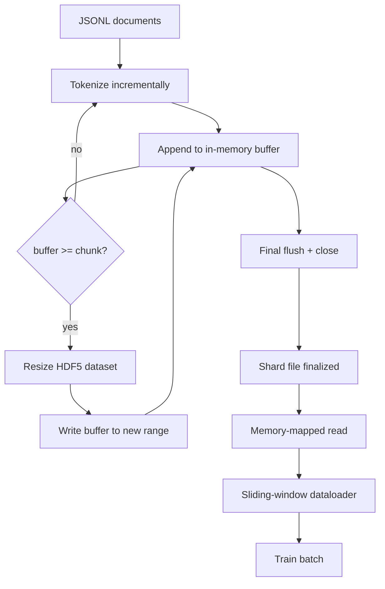

# Corpus Tokenizado HDF5

> O corpus baixado tem de aterrar num layout que o treinador pode transmitir a velocidade da linha. JSONL no disco não sobrevive a 16 trabalhadores do carregador de dados. HDF5 com um conjunto de dados inteiros dimensionáveis, em pedaços. Esta lição constrói a tokenization de streaming em um conjunto de dados HDF5 dimensionável, escrita fragmentada em vários arquivos, leitura de memória mapeada no tempo de treinamento e um carregador de dados de janela deslizante que produz sequências de comprimento fixo com a embalagem certa.

**Type:** Build
**Languages:** Python
**Prerequisites:** Phase 19 lessons 30-37
**Time:** ~90 minutes

## Objetivos de aprendizagem

- Transmite documentos para um conjunto de dados HDF5 inteiros dimensionáveis com fragmentação determinista.
- Divide a escrita em vários arquivos HDF5 para que a falha seja limitada e o paralelismo seja possível.
- Leia os tokens através do layout em pedaços da HDF5 apoiado pela página cache, para que o carregador de dados copie para os tampões de lote apenas no momento do lote.
- Implementar um carregador de dados de janela deslizante que emita sequências de treinamento de comprimento fixo com regras de embalagem explícitas.

## O problema

Uma formação moderna de modelos de linguagem lê tokens a centenas de milhares de amostras por segundo em dezenas de trabalhadores. O JSONL no disco morre na primeira falha da página de cache frio: o parsementa JSON é lento, os limites do documento não são endereçáveis, e procurar "sampulhar 4.217.884" requer escanear o arquivo. Mesmo o Parquet, que comprime bem, é um apto ruim porque o treinador não quer colunas; ele quer um fluxo de tokens plano com acesso aleatório O(1).

O HDF5 se encaixa porque oferece um conjunto de dados fragmentado, dimensionável, apenas num número inteiro cujos fragmentos são amigáveis ao cache de páginas no momento da leitura.`tokens[3,200,000 : 3,200,8192]`O custo é um manuseio de arquivo aberto e uma pegada de página de caché de tamanho de pedaço por trabalhador, o que é insignificante em comparação com o custo de decodificação JSONL.

O problema da construção é fazer o lado de escrever honesto. Os conjuntos de dados dimensionáveis são fáceis de usar de forma indevida: escreva um documento de cada vez e o arquivo HDF5 é fragmentado até o ponto de ser inutilizável. Escreva todos os documentos em um único tamanho e uma morte processo perde todo o fragmento. A disciplina certa é o buffer-then-extend, com um tamanho de buffer que corresponde ao tamanho do pedaço, e uma escrita fragmentada que divide a carga de trabalho em arquivos para que um crash perca no máximo um fragmento.

## O conceito



### HDF5 dimensionável feito corretamente

O conjunto de dados de token é criado com `maxshape=(None,)`e um fixo `chunks=(chunk_size,)`Escrever receitas através de tampões de tokens em uma matriz NumPy de comprimento `chunk_size`Quando o buffer se enche, o conjunto de dados é redimensionado por exatamente `chunk_size`O buffer residual é escrito em uma faixa parcial final. Cada escrita é contiguosa e em pedaços alinhados, exceto o último, que o leitor é dito para truncar no registro.`token_count`Os dados de dados de dados são dados por meio de dados de dados de dados de dados de dados de dados de dados de dados de dados de dados de dados de dados de dados de dados de dados de dados de dados de dados de dados de dados de dados de dados de dados de dados de dados de dados de dados de dados de dados de dados de dados de dados de dados de dados de dados de dados de dados de dados de dados de dados de dados de dados de dados de dados de dados de dados de dados de dados de dados de dados de dados de dados de dados de dados de dados de dados de dados de dados de dados de dados de dados de dados de dados de dados de dados de dados de dados de dados de dados de dados de dados de dados de dados de dados de dados de dados de dados de dados de dados de dados de dados de dados de dados de dados de dados de dados de dados de dados de dados de dados de dados de dados de dados de dados de dados de dados de dados de dados de dados de dados de dados de dados de dados de dados de dados de dados de dados de dados de dados de dados de dados de dados de dados de dados de dados de dados de dados de dados de dados de dados de dados de dados de dados de dados de dados de dados de dados de dados de dados de dados de dados de dados de dados de dados de dados de dados de dados de dados de dados de dados de dados de dados de dados de dados de dados de dados de dados de dados de dados de dados de dados de dados de dados de dados de dados de dados de dados de dados de dados de dados de dados de dados de dados de dados de dados de dados de dados de dados de dados de dados de dados de dados de dados de dados de dados de dados de dados de dados de dados de dados de dados de dados de dados de dados de dados de dados de dados de dados de dados de dados de dados de dados de dados de dados de dados de dados de dados de dados de dados de dados de dados de dados de dados de dados de dados de dados de dados de dados de dados de dados de dados de dados de dados de dados de dados de dados de dados de dados de dados de dados de dados de dados de dados de dados de dados de dados de dados de dados de dados de dados de dados de dados de dados de dados de dados de dados de dados de dados de dados de dados de dados de dados de dados de dados de dados de dados de dados de dados de dados de dados

### Escrito em pedaços

Um único arquivo HDF5 é um único ponto de falha. O pipeline escreve fragmentos em paralelo: cada fragmento de entrada da lição 42 da fase 19 produz um fragmento de saída HDF5.`shards.json`registros de índice, por fragmento, o caminho do arquivo, a contagem de tokens, a contagem de documentos e um sha256 sobre os tokens.`shards.json`Para calcular compensações globais e validar o corpus.

### Leitura em memória

Durante o período de formação, cada trabalhador abre a sua quota de ficheiros HDF5 em `swmr=True`modo e pede para`tokens[start:stop]`O trabalho nunca materializa o arquivo inteiro: a fatia é copiada no buffer de lote do carregador de dados, que o carregador de dados copia em um tensor de treinamento de memória fixa no momento do lote. O caminho de caché tem um syscall por transição de lote; tudo o resto é acesso à RAM.

### Carregador de dados de janela deslizante

O carregador de dados é o único estágio que sabe sobre o comprimento da sequência de treinamento.`window_size + 1`Tokens e devoluções `(input, target) = (tokens[:-1], tokens[1:])`. Os limites dos documentos não são aplicados: uma janela pode estar sobre dois documentos, com uma expressão `boundary_token_id`entre eles para que o modelo aprenda a usar o separador. Esta é a regra padrão de embalagem; também é a regra que um iniciante esquece, terminando com um corpus que é 8% de tokens de treinamento de fronteira e 92% de texto natural.

```figure
cc-hdf5-corpus
```

## Construí-lo

`code/main.py`Implementos:

- `Tokenizer`- um tokenizer determinista de nível de byte bom o suficiente para a demonstração.`encode(text) -> list[int]`E ...`vocab_size`- Não .
- `HDF5ShardWriter`- abre um conjunto de dados inteiros dimensionáveis, reserva tokens para tamanho de pedaço, redimensionou e escreve em passos de tamanho fixo, registros `token_count`E ...`sha256`como atributos HDF5 em close.
- `ShardedTokenizationPipeline`- retrata os documentos de entrada, encaminha-os para um escritor e emite um `shards.json`Indice.
- `MmapTokenStore`- abre arquivos de fragmentos para leituras de memória, calcula offsets globais, expõe um único `get_slice(start, stop)`- A API.
- `SlidingWindowDataloader`- seleciona janelas aleatórias do fluxo global e dá resultados `(input_ids, target_ids)`Arrays NumPy.

Uma demonstração na parte inferior do arquivo constrói um pequeno corpus de memória, tokeniza em dois fragmentos, abre-os através de um mapa de memória, executa o carregador de dados por 10 lotes e imprime a forma por lotes e uma soma de verificação.

- É o que é ?

```bash
python3 code/main.py
```

O roteiro sai do zero e imprime os números de verificação.

## Padrões de produção

Quatro padrões escalam esta lição para uma verdadeira formação.

**Chunk size equals the typical read.**O treinador diz:`window_size + 1`Define a peça HDF5 para um múltiplo de `window_size`Os pedaços incompatíveis reduzem a metade a capacidade de produção porque cada amostra toca dois pedaços.

**Token count in attributes, not in the dataset.**A fatia posterior do conjunto de dados pode estar parcialmente cheia porque o tamanho da peça não divide o limite do documento.`token_count`O modelo de dados é um conjunto de dados HDF5 e o leitor é cortado nesse valor.

**Sharded sha256 with parallel verification.**Cada fragmento tem seu próprio sha256 sobre os bytes de token. O treinador pode verificar todos os fragmentos em paralelo antes do início do treinamento.

**`swmr=True` on both sides, with `libver="latest"` on the writer.**O modo Single-Writer-Multiple-Reader exige que o escritor abra com `libver="latest"`, criar todos os conjuntos de dados de antemão, e depois definir `file.swmr_mode = True`Depois disso , o escritor deve ligar .`dataset.flush()`Depois de cada redimensionamento, os leitores trabalham (aberto com `swmr=True`- ver dados consistentes.`libver="latest"`ou a habilitação do SWMR após alterações estruturais é uma fonte comum de falhas de "arquivo bloqueado".

## Usá-lo

Padrões de produção:

- **One HDF5 per source shard.**O downloader (leção 42) emite um fragmento por URL; a tokenization (esta lição) emite um HDF5 por fragmento fonte. O mapeamento de 1:1 torna trivial o currículo e a recuperação de falhas parciais.
- **Boundary token id.**O token de fronteira é parte do vocabulário do tokenizer e é o único token que o dataloader injeta.
- **`shards.json` as the source of truth.**Adicionar um novo fragmento significa escrever o HDF5, calcular o sha256 e anexar uma entrada.

## Envia-o

`outputs/skill-hdf5-tokenized-corpus.md`Em um projeto real, descreveria qual tokenizador alimenta o pipeline, qual tamanho de peça corresponde à janela do treinador, onde `shards.json`A lição é a que o motor é capaz de fazer.

## Exercícios

1. Adicionar um`--compression gzip`A marca para o HDF5 e medir o custo de transmissão no corpus de demonstração. Defender o padrão escolhido.
2. Adicionar uma semente determinista ao carregador de dados da janela deslizante e verificar duas corridas com a mesma semente produzindo lotes idênticos.
3. Adicionar um`--validate`modo que lê cada fragmento, recalcula o sha256 sobre os seus tokens, e compara contra`shards.json`A CI deve fazer isto antes do início do treino.
4. Compare a capacidade de carregamento de dados em tamanhos de pedaços iguais, metade e duas vezes o tamanho da janela.
5. Adicionar um`--max-document-tokens`A Comissão deve apoiar a proposta de directiva que, em conformidade com o artigo 108.°, n.° 1, do Tratado, é aplicável aos Estados-Membros.

## Termos-chave

| Term | What people say | What it actually means |
|------|-----------------|------------------------|
| Resizable dataset | "Append-only" | An HDF5 dataset with `maxshape=(None,)` that grows via `resize` calls in chunk-sized strides |
| Chunked layout | "How HDF5 stores it" | Fixed-size on-disk pages that the kernel can memory-map and the dataloader can read contiguously |
| `swmr` mode | "Read-while-write" | Single-Writer-Multiple-Reader mode that lets dataloader workers share the file safely |
| Shard index | "shards.json" | The durable index of all token shards with offsets and content hashes |
| Sliding window | "Training sample" | A fixed-length slice of the global token stream that the trainer pairs with its shift-by-one target |

## Mais leitura

- [HDF5 chunking documentation](https://support.hdfgroup.org/documentation/hdf5/latest/hdf5_chunking.html)- o layout de conjunto de dados em pedaços, dimensionável que esta lição usa
- [h5py user guide](https://docs.h5py.org/en/stable/)- Ligações Python para HDF5
- [NumPy memory mapping](https://numpy.org/doc/stable/reference/generated/numpy.memmap.html)- a exposição primitiva do lado de leitura HDF5 através de h5py
- Fase 19 · 42 - o download cuja saída esta lição tokeniza
- Fase 19 · 44 - o cronograma cosínico que consome este carregador de dados
- Fase 19 · 45 - o ciclo AMP que encerra a etapa de treinamento
