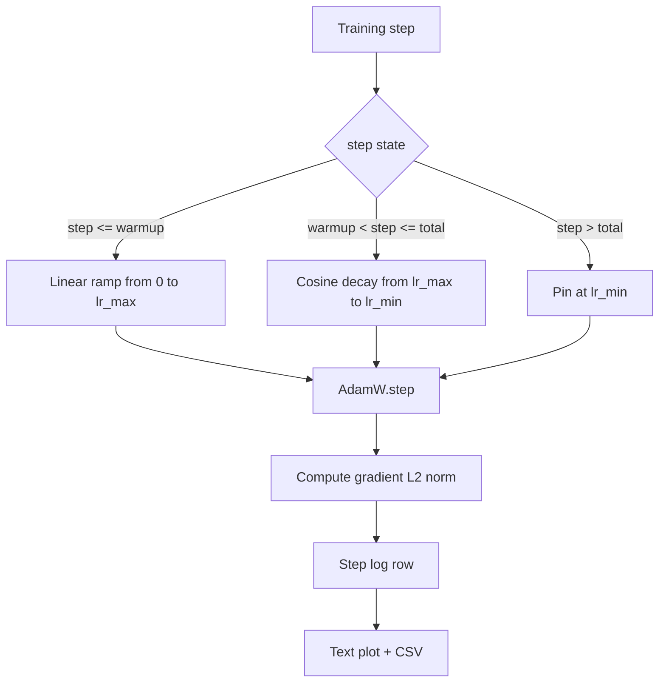

# Cósseo LR com aquecimento linear

> O calendário da taxa de aprendizagem é a segunda decisão mais importante após a função de perda. O AdamW com uma decadência cosínica e um aquecimento linear é o padrão moderno para o treinamento de modelo de linguagem porque permite que o modelo veja um pequeno tamanho efetivo de passo durante as frágeis primeiras mil atualizações, sobe para um pico configurado e declina suavemente de volta para zero. Esta lição constrói esse cronograma, traça a curva sobre os passos de treinamento, registra as normas de gradiente ao lado do cronograma e prova que o cronograma honra os limites de aquecimento, pico e decomposição.

**Type:** Build
**Languages:** Python
**Prerequisites:** Phase 19 lessons 30-37
**Time:** ~90 minutes

## Objetivos de aprendizagem

- Implementar um optimizador AdamW conectado a um cronograma de taxa de aprendizagem cosínea com aquecimento linear.
- Calcule o valor exato do cronograma em qualquer etapa sem a deriva de ponto flutuante através das corridas.
- O gradiente de registro L2 é normalizado ao lado da taxa de aprendizagem para que a saúde do treino seja observável.
- Retorna o cronograma para um gráfico de texto que o olho pode ler e um CSV que qualquer ferramenta pode consumir.

## O problema

As primeiras mil atualizações de treinamento são as mais barulhentas. Os pesos do modelo ainda estão perto da inicialização. A estimativa de segundo momento do optimizador não está estabilizada. A norma de gradiente é grande e barulhenta. Se a taxa de aprendizagem estiver no seu pico durante estas atualizações, o modelo diverge ou se instala num planalto de perdas, nunca escapando. As duas soluções bem conhecidas são o corte de gradientes, que é o assunto da lição 45 da Fase 19, e um cronograma de taxa de aprendizagem que começa pequeno e sobe.

O calendário de cosinagem com aquecimento tem três regiões.`warmup_steps`A taxa de aprendizagem varia linearmente de zero para o pico configurado `lr_max`- Do passo .`warmup_steps`Para pisar`total_steps`A taxa de aprendizagem segue a metade superior de uma curva cosínica, decadindo a partir de `lr_max`- Não .`lr_min`Depois de ...`total_steps`A taxa de aprendizagem está fixa em `lr_min`Assim, um treinador mal configurado que ultrapassa não sai silenciosamente do horário.

O problema é que os horários são fáceis de enganar-se por um. O off-by-one aparece seis horas após uma corrida de treinamento como uma taxa de aprendizagem que é 1% muito alta ou muito baixa no momento em que o modelo começa a se encaixar demais, o que é invisível a menos que o horário seja exaustivamente testado em limites.

## O conceito



### Formulário de aquecimento

Para o`step`em `[0, warmup_steps]`com`warmup_steps > 0`, a taxa de aprendizagem é `lr_max * step / warmup_steps`Os degenerados .`warmup_steps = 0`O caso é tratado como "sem aquecimento": o horário começa directamente em `lr_max`A fase zero entra imediatamente em decomposição cosina.`warmup_steps = 0`Para verificar o cronograma ainda produz uma curva utilizável.

### Formulário de cosina

Para o`step`em `(warmup_steps, total_steps]`A taxa de aprendizagem é `lr_min + 0.5 * (lr_max - lr_min) * (1 + cos(pi * progress))`onde`progress = (step - warmup_steps) / max(1, total_steps - warmup_steps)`- Em .`step = warmup_steps`O cosino avalia a`cos(0) = 1`, o que dá `lr_max`, que corresponde exatamente ao ponto final do aquecimento.`step = total_steps`O cosino avalia a`cos(pi) = -1`, o que dá `lr_min`, que corresponde exatamente ao ponto final da decomposição.

A continuidade em ambos os pontos finais não é um acidente, por isso o calendário é implementado como uma única função em todos os pontos.`step`Uma programação colada perde um limite na primeira vez.`lr_max`- Não.

### Pavimento após os degraus totais

Para o`step > total_steps`A taxa de aprendizagem permanece em `lr_min`O contrato é explícito: o programa não exclui erros e não extrapola; ele fixa no chão e deixa o treinador registrar um aviso.`total_steps`Não o ciclo.

### Registo de norma gradual ao lado da taxa

O horário é metade da saúde do treino. A norma de gradiente é a outra metade. O ciclo de treinamento registra ambos por passo. Uma corrida de treinamento divergente mostra o pico da norma de gradiente antes da perda; um aquecimento bem sintonizado mantém a norma aumentando linearmente com a taxa; um pico muito agressivo aparece como uma norma que permanece alta após o aquecimento. O conjunto de dados no disco é`step, lr, grad_l2_norm, loss`O CSV é o único registro duradouro.

```figure
cap-cosine-warmup
```

## Construí-lo

`code/main.py`Implementos:

- `CosineWithWarmup`- uma função sem estado .`lr(step) -> float`sobre o cronograma configurado.
- `TrainState`- envolve um modelo, um`AdamW`Otimizador, e o cronograma em uma função de um único passo.
- `TrainState.step`- executar uma passagem para frente, uma passagem para trás, registar a norma de gradiente L2, e aplica-se `lr(step)`para o optimizador.
- `plot_schedule_ascii`- torna o cronograma como um gráfico de texto que o olho pode ler.
- `write_schedule_csv`- emitir uma linha por passo com a taxa de aprendizagem.

Uma demonstração na parte inferior do arquivo cria um pequeno`nn.Linear`O modelo, os trens por 20 passos sobre um lote de entrada fixo, e imprime a taxa de aprendizagem por passo, norma de gradiente e perda.

- É o que é ?

```bash
python3 code/main.py
```

O roteiro sai do zero e imprime um registro de treinamento por passo, mais o plano de programação.

## Padrões de produção

Quatro padrões elevam o horário a um artefato de produção.

**Schedule lives in a config, not in code.**O treinador diz:`warmup_steps`- Não .`total_steps`- Não .`lr_max`- Não .`lr_min`O cronograma é reprodutivel porque o cronograma é endereçado por conteúdo; o cronograma é auditável porque o cronograma é parte da diferença de relações públicas.

**Step counter is monotonic and decoupled from epochs.**Alguns quadros confundem etapa e época quando o conjunto de dados é fragmentado ou o carregador de dados reinicia.`global_step`A corrida continua na posição correta do cronograma, pois o contador de passos é o eixo durável.

**Schedule plot in the run directory.**Cada treinamento escreve:`outputs/lr_schedule.png`Um revisor que escaneia o diretório pode verificar a programação sem re-exercer nada. Isso pega a classe de bugs de programação mal configurada no tempo de relações públicas.

**Log row schema is fixed.** `step, lr, grad_l2_norm, loss`Um notebook ou painel de controle para baixo lê o esquema; renomear uma coluna sem bater uma versão inválida todos os painéis existentes.

## Usá-lo

Padrões de produção:

- **Sweep peak before sweeping anything else.** `lr_max`O botão é o mais sensível.`lr_max`A balança é fraca com o tamanho do modelo, por isso a varredura do modelo pequeno é um forte antecedente.
- **Warmup is a fraction of total steps, not an absolute count.**Uma corrida de 200 milhões de passos com 2.000 passos de aquecimento começa no pico quase imediatamente; uma corrida de 20.000 passos com o mesmo número aquece em 10 por cento. Configure o aquecimento como uma fração (típica: 1-3 por cento) para que o cronograma se balanceie com a duração do treinamento.
- **`lr_min` is non-zero on purpose.**Um piso que é 10% de`lr_max`A melhor forma de melhorar a qualidade do trabalho é de manter o aprendizagem do optimizador durante a longa cauda.`lr_min = 0`O programa produz uma curva de treinamento que se parece muito bem com um plano e um modelo que não terminou o treinamento.

## Envia-o

`outputs/skill-cosine-warmup.md`O programa de formação é um programa de formação de formação de formação de formação de formação de formação de formação de formação de formação de formação de formação de formação de formação de formação de formação de formação de formação de formação de formação de formação de formação de formação de formação de formação de formação de formação de formação de formação de formação de formação de formação de formação de formação de formação de formação de formação de formação de formação de formação de formação de formação de formação de formação de formação de formação de formação de formação de formação de formação de formação de formação de formação de formação de formação de formação de formação de formação de formação de formação de formação de formação de formação de formação de formação de formação de formação de formação de formação de formação de formação de formação de formação de formação de formação de formação de formação de formação de formação de formação de formação de formação de formação de formação de formação de formação de formação de formação de formação de formação de formação de formação de formação de formação de formação de formação de formação de formação de formação de formação de formação de formação de formação de formação de formação de formação de formação de formação de formação de formação de formação.`lr_max`A lição dá-nos um motor.

## Exercícios

1. Adicione uma variante inversa da raiz quadrada do cronograma e compare-a em uma corrida de treino de brinquedos de 200 passos.
2. Adicionar um`--restart`bandeira que adiciona um segundo aquecimento em `total_steps / 2`Defender se o reinicio quente melhora ou magoa na corrida do brinquedo.
3. Adicionar um teste unitário que o cronograma é contínuo: para cada passo em `[0, total_steps]`A diferença`|lr(step+1) - lr(step)|`é limitada por `lr_max / warmup_steps`- Não .
4. Transmitir o cronograma em um `torch.optim.lr_scheduler.LambdaLR`A lição usa uma função simples de passo; o que a embalagem muda?
5. Adicionar um`--plot-png`bandeira que escreve uma trama real via `matplotlib`Defender se o gráfico de texto da lição ou a PNG é o melhor padrão para executar CI.

## Termos-chave

| Term | What people say | What it actually means |
|------|-----------------|------------------------|
| Warmup | "Slow start" | Linear ramp from zero to `lr_max` over the first `warmup_steps` updates |
| Cosine decay | "Smooth drop" | Upper-half cosine curve from `lr_max` to `lr_min` over the remaining steps |
| Floor | "After training" | The fixed `lr_min` value the schedule pins at past `total_steps` |
| Gradient norm | "L2 of grads" | The Euclidean norm of the concatenated gradient vector, logged each step |
| Global step | "Schedule axis" | A monotonic step counter that survives restarts and drives the schedule |

## Mais leitura

- [Loshchilov and Hutter, SGDR: Stochastic Gradient Descent with Warm Restarts (arXiv 1608.03983)](https://arxiv.org/abs/1608.03983)- papel de referência do calendário cosínico
- [Loshchilov and Hutter, Decoupled Weight Decay Regularization (arXiv 1711.05101)](https://arxiv.org/abs/1711.05101)- O documento de referência do AdamW
- [PyTorch torch.optim.lr_scheduler](https://docs.pytorch.org/docs/stable/optim.html#how-to-adjust-learning-rate)- a forma como as funções de fase se compõem com os agendadores-quadro
- Fase 19 · 42 - o baixador cujo corpo este cronograma consome
- Fase 19 · 43 - o carregador de dados com o qual o calendário evolui em conjunto com
- Fase 19 · 45 - cortes de gradiente e AMP, a próxima camada no ciclo
