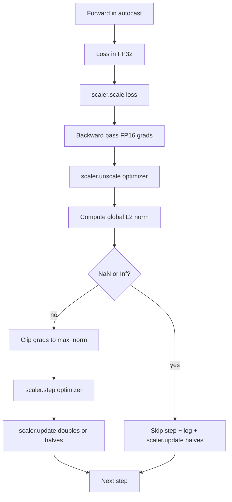

# Cortar gradualmente e precisão mista

> O optimista e o cronograma da aula anterior assumem que os gradientes são sensatos. Normalmente não são. Um único lote ruim pode aumentar a norma de gradiente em três ordens de magnitude. O treinamento de precisão mista amplifica isso introduzindo o sobrefluxo FP16 no lado de perda. Esta lição constrói os dois cintos de segurança sem os quais a formação de produção não pode ser enviada: cortar gradientes para uma norma global L2 configurada, e um ciclo de precisão mista com autocast e GradScaler que detecta NaN e Inf, salta o passo limpo e registra o fator de escala para a forense.

**Type:** Build
**Languages:** Python
**Prerequisites:** Phase 19 lessons 30-37
**Time:** ~90 minutes

## Objetivos de aprendizagem

- Calcular a norma global de L2 sobre todos os gradientes e clip de parâmetros em vigor quando exceder um limiar configurado.
- Envolva um passo de treinamento em autocast e um GradScaler para que as passagens FP16 para frente e para trás sobrevivam ao desbordamento.
- Detectar NaN e Inf na perda ou gradiente, pular o passo de otimização e registrar o pular.
- Relata o fator de escala do GradScaler a cada passo para que uma longa sequência de saltos seja visível imediatamente.

## O problema

Uma corrida de treino que correu limpa ontem produz uma curva de perdas que vai vertical no passo 8.217. O culpado é um único lote cuja norma de gradiente é de 4.200, vinte vezes o pico anterior. Sem cortar o optimizador aplica um passo que resete todo o aprendizado que o modelo tinha feito na hora anterior. Com um clip global de L2 na norma 1.0, o mesmo lote contribui para uma atualização da norma unitária; a perda permanece na sua linha de tendência; a corrida sobrevive.

O treinamento de precisão mista aumenta a capacidade de transferência em 2-3x, computação do passante para a frente e a maior parte do passante para trás no FP16. O custo é que o FP16 tem um intervalo de exponentes estreito. Um gradiente típico que transborda em FP16 avalia para Inf, que se propaga através de camadas subsequentes como NaN, que define cada peso para NaN no próximo passo de otimização. O GradScaler da PyTorch resolve isso multiplicando a perda por um grande fator de escala antes do passo para trás e dividindo os gradientes pelo mesmo fator antes do passo de otimização. Se qualquer gradiente for Inf ou NaN no tempo não escalado, o escalador salta o passo e reduz a metade o fator de escala; se os passos N anteriores estiverem limpos, o escalador duplica o fator. Durante o treino, o fator encontra o valor mais elevado permitido pela gama FP16.

O problema de construção é o acoplamento dos dois corretamente. Clip antes de descalificar e o limiar é em gradientes escalados; clip após unscale e a ordem de operações sobre o GradScaler importa. A ordem correta é: `scaler.scale(loss).backward()`, então`scaler.unscale_(optimizer)`, então`clip_grad_norm_`, então`scaler.step(optimizer)`, então`scaler.update()`Qualquer outra ordem produz um ciclo silenciosamente quebrado.

## O conceito



### Norma global de L2

A norma global L2 é a norma euclidiana do vetor de gradiente concatenado, não a norma por parâmetro.`torch.nn.utils.clip_grad_norm_(parameters, max_norm)`A função retorna a norma pré-clip para que a lição possa registrar tanto o valor natural quanto o valor cortado, o que é necessário para o diagnóstico de "estamos cortando em cada passo".

### autocast e GradScaler

`torch.amp.autocast(device_type)`é o gestor de contexto que executa de forma seletiva operações elegíveis (a maioria das operações da classe matmul) no PQ16. `torch.amp.GradScaler(device_type)`O teste de configuração é um erro de configuração que deve ser detectado.

A lição usa o autocast da CPU porque é o que é executado em CI; o mesmo padrão transfere o CUDA literalmente alterando `device_type="cpu"`- Não .`device_type="cuda"`. O GradScaler na CPU é um stub (o autocast do CPU já opera em BF16 por padrão e não precisa de escala de perda), mas a lição inclui os locais de chamada para que o cablagem seja idêntico ao loop da GPU.

### Detecção de NaN e Inf

A detecção acontece em dois lugares.`torch.isfinite`O valor de um valor de um valor de um valor de um valor de um valor de um valor de um valor de um valor de um valor de um valor de um valor de um valor de um valor de um valor de um valor de um valor de um valor de um valor de um valor de um valor de um valor de um valor de um valor de um valor de um valor de um valor de um valor de um valor de um valor de um valor de um valor de um valor de um valor de um valor de um valor de um valor de um valor de um valor de um valor de um valor de um valor de um valor de um valor de um valor de um valor de um valor de um valor de um valor de um valor de um valor de um valor de um valor de um valor de um valor de um valor de um valor de um valor de um valor de um valor de um valor de um valor de um valor de um valor de um valor de um valor de um valor de um valor de um valor de um valor de um valor de um valor de um valor de um valor de um valor de um valor de um valor de um valor de um valor de um valor de um valor de um valor de um valor de um valor de um valor de um valor de um valor de um valor de um valor de um valor de um valor de um valor de um valor de um valor de um valor de um valor de um valor de um valor de um valor de um valor de um valor de um valor de um valor de um valor de um valor de um valor de um valor de um valor de um valor de um valor de um valor de um valor de um valor de um valor de um valor de um valor de um valor de um valor de um valor de um valor de um valor de um valor de um valor de um valor de um valor de um valor de um valor de um valor de um valor de um valor de um valor de um valor de um valor de um valor de um valor de um valor de um valor de um valor de um valor de um valor de um valor de um valor de um valor de um valor de um valor de um valor de um valor de um valor de um valor de um valor de um valor de um valor de um valor de um valor de um valor de valor de valor de um valor de um valor de valor de um valor de valor de valor de um valor de valor de valor de valor de valor de valor de valor de valor de valor de valor de valor de valor de valor`scaler.unscale_(optimizer)`A lição escaneia os gradientes não escalados com `has_non_finite_grad(...)`Os dois controlos juntos cobrem tanto os modos de falha de passagem avançada como os de passagem retrógrada.

### Diagnosticismo de fatores de escalagem

O fator de escalagem é o estado interno do GradScaler.`scaler.get_scale()`Uma corrida saudável mostra o fator de escalagem subindo em potências de dois até saturar perto`2^17`ou `2^18`Uma corrida de comportamento erróneo mostra o fator oscilador entre valores altos e baixos, o que é o sinal de que os gradientes do modelo estão às vezes no intervalo e às vezes não.

```figure
grad-clip-monitor
```

## Construí-lo

`code/main.py`Implementos:

- `clip_global_l2_norm`- um envolvente por perto `torch.nn.utils.clip_grad_norm_`que retorna a norma de pré-clip e pós-clip.
- `has_non_finite_grad`- um auxiliar que escaneia gradientes para NaN e Inf.
- `AmpTrainState`- envolve um modelo, um`AdamW`Otimizador, GradScaler e dispositivo de lançamento automático.`step(inputs, targets)`que opera todo o corte, escala e salto-em-NaN pipeline.
- `StepLog`E ...`SkipLog`- registos estruturados por etapas.
- Uma demonstração que treina um pequeno`nn.Linear`O modelo de 20 passos, injeta um inf no gradiente no passo 5 para exercer o caminho de salto e imprime o registro resultante.

- É o que é ?

```bash
python3 code/main.py
```

O script sai de zero e imprime um log por passo com cada linha marcada `STEP`ou `SKIP`; pelo menos uma linha é `SKIP`- Não .

## Padrões de produção

Quatro padrões elevam o ciclo para um estágio de formação de produção.

**Skip counter as an alert, not a log line.**Uma série de passos saltados por corrida de treinamento é saudável. Centenas de saltos por época são um alerta difícil: o modelo está em um regime FP16 não pode aguentar e o ciclo está silenciosamente falhando.

**Clip threshold lives in the config.** `max_norm = 1.0`O limite de um modelo de linguagem é o padrão moderno para o treinamento de um modelo de linguagem.

**Norm log goes to a CSV with the schedule.**As colunas CSV são `step, lr, grad_l2_pre_clip, grad_l2_post_clip, loss, skipped, skip_reason, scaler_scale`O revisor que abre o arquivo vê o cronograma, a história do gradiente, o fator de escala e o resultado do skip (com a sua razão) numa linha.

**`scaler.update()` runs every step, even on skip.**Em um passo limpo, o escalador lê o contador sem informações, aumenta-o e possivelmente duplica o fator. Em um passo saltado, o escalador reduz o fator em metade e redefine o contador. Esquecendo `update()`no caminho de salto é o bug que produz "o fator de escalagem nunca mudou".

## Usá-lo

Padrões de produção:

- **Autocast device matches optimizer device.** `torch.amp.autocast(device_type="cuda")`para formação em GPU; `torch.amp.autocast(device_type="cpu")`Para a CPU. os dispositivos de mistura produzem um erro de tipo silencioso que aparece como uma curva de perda que parece bem, mas um modelo que não está aprendendo.
- **Loss check before backward.** `torch.isfinite(loss).all()`A redução de tensores é um custo insignificante e as poupanças em uma perda de NaN são um passo de treinamento completo.
- **`set_to_none=True` in `zero_grad`.**Define gradientes para `None`Em vez de zero, o que permite que o optimizador salte o cálculo para grupos de parâmetros não afetados.

## Envia-o

`outputs/skill-clip-amp.md`O sistema de controlo de versão de cada passo deve ser utilizado para determinar quais são os limites de clipe e dispositivos de lançamento automático utilizados no passo de treinamento, onde o CSV por passo vive no controlo de versão e qual é o limite de alerta de velocidade de saída de produção.

## Exercícios

1. Substituir a injecção de Inf sintética por um aumento real da perda (multiplicar o alvo de um lote por 1e8) e verificar os gatilhos do caminho de saída.
2. Adicionar um`--bf16`modo que muda o autocast para BF16 em vez de FP16. BF16 tem uma faixa de exponentes mais ampla do que FP16 e raramente precisa de escala de perda; verifique a queda da taxa de saltos para zero na mesma demonstração.
3. Adicionar um teste unitário que indique que a embalagem de clip de gradiente retorna corretamente a norma de pré-clip e pós-clip quando não ocorre nenhum clip.
4. Adicionar um cálculo da taxa de saltos da janela de rolagem e uma bandeira CLI que falhe na execução se a taxa exceder um limiar configurado por 100 passos consecutivos.
5. Cablear o loop para escrever o CSV canônico (`step, lr, grad_l2_pre_clip, grad_l2_post_clip, loss, skipped, skip_reason, scaler_scale`) e confirmar que o arquivo sobrevive a um Ctrl-C, lavando após cada linha.

## Termos-chave

| Term | What people say | What it actually means |
|------|-----------------|------------------------|
| Global L2 norm | "Clip target" | Euclidean norm of the concatenated gradient vector across all trainable parameters |
| autocast | "Mixed precision" | Selective FP16 (or BF16) execution of eligible operations inside a `with` block |
| GradScaler | "Loss scaler" | Helper that multiplies the loss before backward and inverse-scales gradients before the optimizer step |
| Skip | "Bad step" | An optimizer step refused because the gradient or loss was non-finite; the scaler halves the factor |
| Scaling factor | "Scaler state" | The GradScaler's current multiplier; doubles after clean stretches and halves on every skip |

## Mais leitura

- [Micikevicius et al., Mixed Precision Training (arXiv 1710.03740)](https://arxiv.org/abs/1710.03740)- a proposta original de escalação das perdas
- [Pascanu, Mikolov, Bengio, On the difficulty of training recurrent neural networks (arXiv 1211.5063)](https://arxiv.org/abs/1211.5063)- papel de referência de corte de gradientes
- [PyTorch torch.amp.GradScaler](https://docs.pytorch.org/docs/stable/amp.html)- a API de escalação que esta lição envolve
- [PyTorch torch.nn.utils.clip_grad_norm_](https://docs.pytorch.org/docs/stable/generated/torch.nn.utils.clip_grad_norm_.html)- o corte primitivo que esta lição usa
- Fase 19 · 42 - o baixador cujo corpus alimenta o ciclo
- Fase 19 · 43 - o carregador de dados que o ciclo consome
- Fase 19 · 44 - o cronograma que este ciclo compõe com
