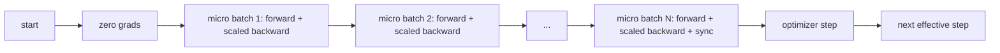
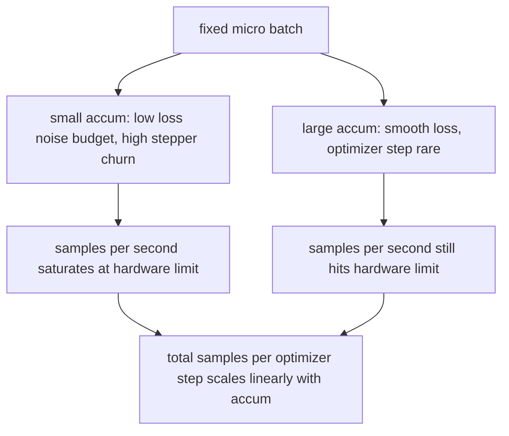

# Acumulação gradual

> Treine em um lote eficaz que não pode pagar, um micro-batch por vez. Escala a perda, mantenha o passo de otimização e deixe os gradientes se acumularem.

**Type:** Build
**Languages:** Python
**Prerequisites:** Phase 19 lessons 42 to 45
**Time:** ~90 minutes

## Objetivos de aprendizagem

- Derivar a identidade de lote efetiva: `effective_batch = micro_batch * accum_steps`- Não .
- Implementar a escalação de perda por micro-parcela para que o gradiente acumulado coincida com um único lote completo para trás.
- Escapar a sincronização do optimizador até o último micro-batch (sincronização no último passo).
- Leia uma passagem contra a curva de lote efetiva e explique o retorno decrescente.

## O problema

Quer treinar em um lote eficaz de 512 porque a curva de perda é mais suave e o passo de otimização faz mais sentido nessa escala. O acelerador na secretária tem 32 exemplos antes de ficar sem memória. Dobrar o lote não é uma opção. A redução do modelo à metade não é uma opção. O truque que o campo alcançou em 2017 e nunca deixou de usar é executar 16 passes para trás, deixar que os gradientes se acumulem dentro dos tampões de parâmetros e apenas pisar o optimizador quando a contagem atinge o alvo.

O risco é que a perda não seja mais o mesmo número que era no lote maior. A entropia cruzada de 16 mini-batches somada ingenuamente é 16 vezes a perda de um lote completo. Sem escalar, a direção do gradiente é correta, mas a magnitude é errada, e o passo de otimização é 16 vezes grande demais. A correção é uma divisão. A correção também é fácil de esquecer.

## O conceito



O contrato é curto:

- A perda para cada micro-parcela é dividida por `accum_steps`Antes de`backward()`O PyTorch soma os gradientes em`param.grad`por padrão; a divisão empurra a soma corrente de volta para a escala certa.
- O passo de otimização dispara uma vez por lote efetivo, após o último micro-batch de retrocesso.
- O estado do optimizador (buffers de momento, momentos de Adam) avança uma vez por passo efetivo, não uma vez por micro-batch.
- Em um único dispositivo, isto é contabilidade. num grupo de vários ramos, o mesmo padrão envolve os micro-batches não finais em um`no_sync`O último micro-parceio reduz o gradiente acumulado completo em uma passagem em vez de pagar o custo da rede N vezes.

### A prova de equivalência no código

```python
loss = criterion(model(x_full), y_full)
loss.backward()
opt.step()
```

é equivalente a

```python
for x, y in chunks(x_full, y_full, n):
    scaled = criterion(model(x), y) / n
    scaled.backward()
opt.step()
```

O gradiente acumulado no final do loop é o mesmo tensor que um único lote completo para trás produziria.`equivalence_check`- Não .

### Onde vai o custo

Cada micro-parcela custa um para frente e um para trás.`outputs/accum-curve.json`Mostra o que acontece quando o lote efetivo cresce em micro lote fixo:



Não há almoço grátis.`accum_steps`O que muda é a variação da estimativa do gradiente: no mesmo orçamento de parede você fez menos passos de otimização, mas cada um foi mediado em mais amostras. A literatura trata grandes lotes e pequenos lotes como diferentes problemas de otimização; a lição aqui é mecânica, não estatística.

```figure
cc-grad-accumulation
```

## Construí-lo

`code/main.py`É um artefato que funciona. Faz três coisas.

### Passo 1: Verificação da equivalência

`equivalence_check()`A função compara os tampões de gradiente antes da etapa de otimização e os parâmetros depois. A afirmação é `max_abs_diff < 1e-4`- Não .

### Passo 2: padrão de sincronização no último passo

`train_one_optimizer_step`Para cada micro-parcela, exceto a última que entra.`no_sync_context(model)`. Em um único processo o contexto é um no-op; em DDP é onde o gradiente todo-redução é saltado.`sync_counter`registra quantas vezes deixamos o escopo no_sync; para N micro-partidos a contagem é uma por passo efetivo, não N.

### Passo 3: a curva de transmissão

`sweep_effective_batches`O sistema opera o mesmo modelo com um micro-parcelamento fixo e uma lista de etapas de acumulação.

- `samples_per_sec`: total de amostras vistas divididas pelo tempo de parede
- `median_step_ms`: 50o percentil por etapa efetiva
- `sync_calls`: pontos coletivos exercidos
- `avg_loss`: média através dos passos de otimização da varredura

A produção cai em `outputs/accum-curve.json`e é reutiliável a partir de um caderno.

- É o que é ?

```bash
python3 code/main.py
```

O script imprime a diferença de equivalência, depois a tabela de varredura, depois o caminho JSON.

## Usá-lo

No treinamento de produção, a acumulação de gradientes vive atrás de um botão.`accumulation_steps = effective_batch // (micro_batch * world_size)`Os quadros que não são autorizados a utilizar aqui envolvem o mesmo ciclo, mas os passos são os mesmos: escala a perda, pular sincronização em micros não finais, acumular, passo uma.

Três padrões na natureza:

- O tamanho do micro lote é escolhido para saturar a memória do dispositivo. Qualquer coisa menor desperdiça ciclos de aceleração. Qualquer coisa maior cai.
- O lote efetivo é escolhido a partir de um cronograma de taxa de aprendizagem.
- A contagem de acumulação é a ponte entre os dois e o único botão que você pode sintonizar em tempo de execução sem reescrever o carregador de dados.

## Envia-o

`outputs/skill-gradient-accumulation.md`Captura a receita para que um colega possa deixá-la em um novo repo: perda de escala por `accum_steps`, saltar sincronização do optimizador em micros não finais, passo o optimizador uma vez por lote efetivo, registro de throughput contra lote efetivo como JSON para que o comércio seja visível.

## Exercícios

1. Repete a varredura com `--num-steps 100`E as amostras de gráfico por segundo contra o lote efetivo.
2. Adicionar uma variante de escala incorreta (sem divisão) e mostrar o parâmetro diferencial na etapa 1 contra a referência.
3. Troque SGD por AdamW e confirme o avanço do estado do optimizador uma vez por etapa efetiva, não uma vez por micro-parcela.
4. Introduza um real`DistributedDataParallel`embalagem e rotação do `no_sync_context`Confirmar que as chamadas de sincronização caem em N-1 por lote efetivo.
5. Modifique o check de equivalência para comparar duas micro-splits diferentes (2 por 8 vs 4 por 4) e explique qualquer tolerância que você precise para relaxar.

## Termos-chave

| Term | What people say | What it actually means |
|------|-----------------|------------------------|
| Micro batch | The batch you forward | The slice that fits in memory in a single forward pass |
| Accum steps | Backward passes per step | Number of backwards summed before one optimizer step |
| Effective batch | The batch | Micro batch times accum steps times data parallel world size |
| Loss scaling | Divide by N | Per-micro-batch division so summed gradients match full batch |
| Sync on last | Skip the rest | Only run the gradient collective on the last backward in the window |

## Mais leitura

- Documents de PyTorch em `DistributedDataParallel.no_sync`Para a versão de produção do truque de sincronização no último passo.
- Goyal et al., 2017, sobre escala linear para treinamento de grandes lotes, a razão canônica para se preocupar com lote eficaz.
- PyTorch tracker de emissões sobre as interações de acumulação de gradientes com descalculação de precisão mista.
- As lições da fase 19 42 a 45 cobrem o modelo, o carregador de dados, o optimizador e o andamento do treinador que esta lição assume.
- A lição 47 da fase 19 abrange o ponto de controlo e a reestruturação para que uma longa corrida de acumulação sobreviva a um limite de relógio.
