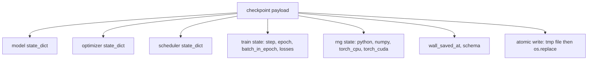
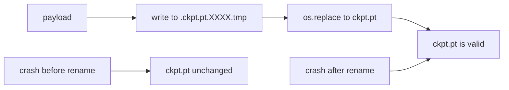
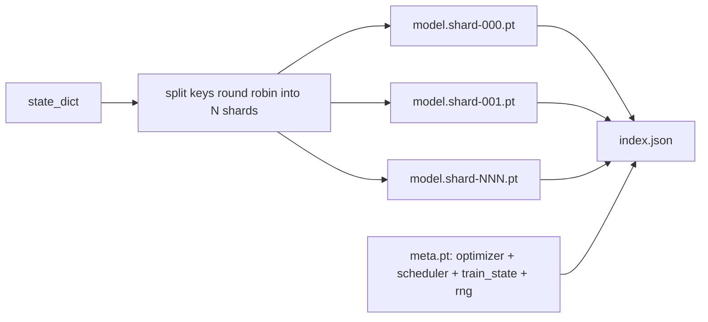

# Ponto de verificação Salvar e Relançar

> O trem interrompe as corridas de morte; os pontos de controle permitem que continuem. Salve o modelo, otimizador, cronógrafo, histórico de perdas, contador de passos e estado de RNG, de forma atômica, para que uma morte em qualquer momento deixe um arquivo válido no disco.

**Type:** Build
**Languages:** Python
**Prerequisites:** Phase 19 lessons 42 to 45
**Time:** ~90 minutes

## Objetivos de aprendizagem

- Capturar o estado de treinamento completo em uma única carga útil que pode ser recarregada em um processo novo.
- Implementar armazenamento atômico com write-to-temp e renomear para que um crash nunca deixe um arquivo meio escrito.
- Restaurar o estado de RNG para Python, NumPy e PyTorch para que a perda após o resumo corresponda à linha de base ininterrupta.
- Construa um layout de checkpoint fragmentado para modelos que não cabem mais em um único arquivo, com fragmentos verificados por hash e um índice JSON.

## O problema

Tu estabeleceste um emprego de treinamento por 18 horas. O tapete do relógio de parede é de 4 horas. O cluster reinicia às 11h porque alguém acima do seu nível de remuneração aprovou uma atualização do kernel. Sem pontos de controlo, começa de novo. Sem currículo, você também perde o estado de otimização que levou as primeiras 11 horas para aprender, então mesmo que os pesos do modelo sobrevivam, os momentos AdamW desapareceram e o próximo passo se espreita em uma direção que a trajetória de treinamento já tinha passado.

O artefato certo é um único arquivo que contém tudo o que é necessário para continuar: parâmetros do modelo, estado do optimizador, estado do cronista, o histórico de perdas para as parámetros, o passo atual e os contadores de época e batch-in-epoch, e o estado de RNG para cada fonte de aleatoriedade. Sem o estado RNG, a curva de perda retomada é uma curva diferente. O mesmo modelo, os mesmos dados, diferentes misturas, diferentes máscaras de abandono, diferentes números no painel.

A armazenagem atômica é a outra metade do contrato. Escrever no nome do arquivo final significa que uma missão de redação no meio deixa um arquivo corrupto; o currículo lê lixo. Escrever em um arquivo temporário no mesmo diretório e depois renomear significa que uma missão de redação no meio deixa o arquivo bom anterior intocado. O renome é atômico em sistemas de arquivos POSIX.

## O conceito



### Os cinco baldes do estado

| Bucket | Why it matters |
|--------|----------------|
| Model | Weights and buffers; what the model is. |
| Optimizer | Momentum and adaptive moments; without these the next step is a different optimization problem. |
| Scheduler | Where the learning rate is on its curve; cosine schedules in particular care. |
| Train counters | Step, epoch, batch-in-epoch, plus the loss history that draws the dashboard. |
| RNG state | Determinism for dropout, data shuffling, and any sampling inside the model. |

### Salvo atômico



Duas regras. Primeiro, o arquivo temporário vive no mesmo diretório do alvo, de modo que o renome permanece dentro do mesmo sistema de arquivos; renomeamento entre dispositivos não são atômicos.

### Pontos de controlo em fragmentos

Quando o modelo fica grande, a carga útil de um único arquivo se torna grande demais para carregar rapidamente, grande demais para inspecionar e dolorosa demais quando uma rede compartilha soluções no meio da leitura.



O índice registra a contagem de fragmentos, o sha256 de cada fragmento e o sha256 do arquivo meta. O carregador falha em voz alta quando qualquer hash não se encaixa. Os fragmentos podem aterrar em diferentes discos físicos; o meta é pequeno e lê primeiro.

### Resumo continua no meio da época

Um currículo que se encaixa no início da próxima época de resíduos, de minutos a um dia.`(epoch, batch_in_epoch)`O ciclo de treinamento avança rapidamente o gerador de números aleatórios para além dos lotes já consumidos na época atual e continua a partir de`batch_in_epoch`O código da lição faz exactamente isso; a afirmação é que a trajetória de perda após a reestruturação corresponde à linha de base ininterrupta dentro de 1e-4.

```figure
cc-atomic-checkpoint
```

## Construí-lo

`code/main.py`fornece quatro primitivos e um driver demo.

### Passo 1: captura e restauração do estado de RNG

`capture_rng_state`Retorna um ditado com Python `random.getstate`NumPy's.`np.random.get_state`, e CPU PyTorch e CUDA RNG bytes. `restore_rng_state`O tensor da CPU é um buffer de 8 bytes que o RNG da PyTorch sabe como consumir.

### Passo 2: Salvo atômico

`atomic_save`escreve a carga útil para um arquivo temporário no diretório de destino, então `os.replace`- E o nome final.`atomic_write_json`O mesmo acontece com o índice fragmentado.

### Passo 3: viagem completa de ida e volta ao posto de controlo

`save_checkpoint`O modelo, o optimizador, o cronógrafo, o estado do trem e o RNG são combinados num único dict. `load_checkpoint`inverte e retorna um `TrainState`. O campo de esquema é o gancho de atualização: alterações futuras no formato acidentam a cadeia de versões e o carregador despeça.

### Passo 4: variante em fragmentos

`save_sharded_checkpoint`rotula as chaves de parâmetro em N fragmentos, escreve cada fragmento com seu próprio salvo atômico, escreve um arquivo meta com otimizador e cronógrafo e estado de trem, e escreve o índice JSON com fragmentos sha256s. `load_sharded_checkpoint`Verifica cada fragmento antes de se fundir.

### Passo 5: Demo de resumados

`run_resume_demo`Trens de um modelo pequeno para `total_steps`, guarda um ponto de controlo em `interrupt_at`O processo de recuperação de RNG é o máximo de diferença absoluta entre as duas trajetórias de perda após o ponto de interrupção.

- É o que é ?

```bash
python3 code/main.py
```

Os dados de um único arquivo e os dados em fragmentos afirmam a diferença máxima em 1e-4.`outputs/resume-demo.json`- Não .

## Usá-lo

O treinamento de produção empilha o ponto de checagem do navio como parte do treinador. A forma é a mesma: modelo + optimizador + agendador + contadores + RNG, escrito atomicamente, nomeado por passo para que o mais recente seja fácil de encontrar.

Três padrões a aplicar:

- **Schema is a string in the payload.**Sem ele não se pode evoluir o formato sem quebrar as velhas corridas.
- **Sha256 every shard.**Um download silenciosamente truncado é o pior tipo de bug; o carregador falha rápido ou falha tarde.
- **Keep checkpoint cadence honest.**Salva todos os passos N e cada minuto de relógio, o que for mais curto.

## Envia-o

`outputs/skill-checkpoint-save-resume.md`É a receita para qualquer novo script de treinamento: forma de carga útil, escrita atômica, captura de RNG, índice fragmentado.`save_checkpoint`no local de salvação periódica, por fio `load_checkpoint`No início, e a corrida sobrevive às mortes.

## Exercícios

1. Substituir a fragmentação rotundina por fragmentação por grupo de parâmetros (camadas que terminam em `.weight`- Não .`.bias`Quando é preferível cada layout?
2. Extender o loop de salvação para manter os últimos pontos de controle K e podar os mais antigos.
3. Adicionar um`--ckpt-every-seconds`bandeira que desencadeia uma salva num intervalo de relógio de parede, não apenas contagem de passos.
4. Adicione um caminho de verificação da soma de checks que corre no início, digitaliza todos os pontos de verificação no diretório e relata quais estão corruptos.
5. Implementar um `migrate_v1_to_v2`função que adiciona um novo campo à carga útil e empurra a cadeia de esquema. Faça a carga tolerar ambas as versões.

## Termos-chave

| Term | What people say | What it actually means |
|------|-----------------|------------------------|
| Atomic save | "Write and pray" | Write to a temp file in the same directory, then os.replace into the target name |
| State dict | "The weights" | Model parameters and buffers, keyed by parameter name |
| Sharded checkpoint | "Big model file" | Multiple files, one per shard, plus a meta file and a JSON index with sha256s |
| RNG state | "Random seed" | Captured state for python random, numpy, torch CPU, torch CUDA; not just the seed |
| Mid-epoch resume | "Restart" | Fast-forward the RNG and continue from the next batch in the same epoch |

## Mais leitura

- POSIX `rename`Semântica para a atomização afirma que `os.replace`- Depende.
- Documentação da PyTorch sobre `torch.save`E ...`torch.load`, incluindo `map_location`para restaurações transversais de dispositivos.
- A lição 46 da fase 19 abrange a acumulação de gradientes que a carga útil do ponto de controlo desta lição sobrevive.
- A fase 19 lição 48 abrange as embalagens distribuídas cujo formato de instrução estatal este esquema abriga.
- O kernel do Linux `fsync`documentação relativa à garantia de durabilidade por trás da renomeação atómica.
