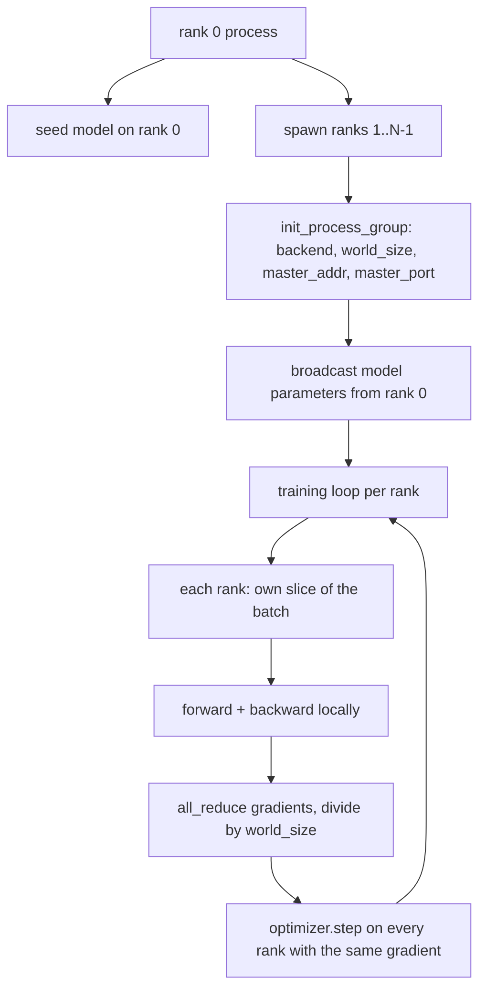
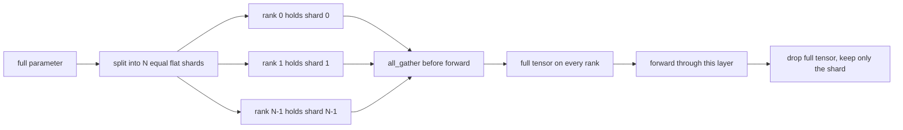

# Dados paralelas distribuídos e FSDP a partir de zero

> O treinamento de vários grados é dois coletivos e uma regra.

**Type:** Build
**Languages:** Python
**Prerequisites:** Phase 19 lessons 42 to 45
**Time:** ~90 minutes

## Objetivos de aprendizagem

- Trazer um grupo de processos em N filas com o `gloo`- Não há hardware especial.
- Implementar um envolvente DDP mínimo que transmita os parâmetros na construção e reduz completamente os gradientes após o retorno.
- Prova que a redução total dos gradientes por grau corresponde a um gradiente de processo único na entrada concatena.
- Esboço de fragmentação de parâmetros FSDP: cada linha contém uma fatia, o tensor completo é coletado para a passagem para a frente e caído depois.

## O problema

O modelo cabe a um dispositivo. O conjunto de dados não. O orçamento de otimização diz que você quer ver N vezes os exemplos por segundo. A primeira alavanca é o paralelo de dados: cada rank executa o mesmo modelo em uma fatia diferente do lote, em seguida, medias gradientes antes do passo de otimização. A segunda alavanca é a FSDP: o modelo não se encaixa em um dispositivo também, por isso cada classificação mantém uma fração de cada parâmetro e reconstrui o tensor completo camada por camada durante a passagem para a frente.

A dor é a contabilidade. Se os parâmetros deslizarem através das fileiras, a corrida é silenciosamente corrompida. Se você mediar gradientes, mas não a perda, o painel de instrumentos está mentir. Se o backend colectivo não conseguir concordar com uma topologia, a corrida fica pendurada para sempre. A solução é escrever os coletivos à mão uma vez e nunca confiar em um envolvente que você não pode reproduzir.

Esta lição é executada na CPU.`gloo`Naves de backend com cada PyTorch construído e aceita`torch.multiprocessing`trabalhadores; o mesmo código passa para `nccl`em um nó de GPU múltipla sem alteração de estrutura.

## O conceito



### Os dois coletivos que importam

| Collective | What it does | When |
|------------|--------------|------|
| `broadcast` | Copy a tensor from one rank to all others | Parameter init, scheduler state, any one-to-all sync |
| `all_reduce` | Sum (or mean, or max) a tensor across all ranks, every rank gets the result | Gradient averaging after backward |
| `all_gather` | Each rank contributes a tensor, every rank gets the concatenation | Logits collection, FSDP parameter unshard |

O contrato do DDP é`broadcast`na construção e `all_reduce`O esboço do FSDP acrescenta:`all_gather`antes de cada camada passar para a frente.

### A média de gradientes corresponde a gradiente de processo único

Um modelo treinado em um lote de exemplos B em N fileiras deve produzir o mesmo gradiente que um único treinamento de processo em um lote de N * B. O truque é que somando os gradientes por rank e dividindo por N dá o gradiente médio de perda, que é o que a entropia cruzada com redução média produziria no lote completo.`max-abs-diff < 1e-3`entre o gradiente manual de redução total e o gradiente de referência de processo único.

### Esboço do FSDP



A memória ganha é exata: a memória por rank para parâmetros cai para 1/N. O custo é o gather, que é pago a cada passagem para a frente. A produção FSDP sobrepõe o gather com o cálculo da camada anterior, de modo que o custo do relógio de parede é muito menor do que a previsão da contabilidade ingênua. A lição faz a viagem de ida e volta em cada parâmetro e afirma que a reconstrução é bit-igual ao original.

### CPU e o backend do gloo

A CUDA é o alvo de produção, mas os mesmos caminhos de código existem na CPU. `gloo`É o backend coletivo da CPU. É mais lento do que`nccl`O grupo de processos da lição é iniciado com `backend="gloo"`e as fileiras são geradas com `torch.multiprocessing`Em vez de`torchrun`Os dois acabam no mesmo lugar .`torch.distributed`Em um nó multi-GPU, as únicas mudanças são `backend="nccl"`, tensores de dispositivo, e `torchrun`para lançar.

```figure
cg-allreduce-ring
```

## Construí-lo

`code/main.py`é o artefato de corrida.

### Passo 1: apresentar o grupo de processos

```python
os.environ["MASTER_ADDR"] = "127.0.0.1"
os.environ["MASTER_PORT"] = str(port)
dist.init_process_group(backend="gloo", rank=rank, world_size=world_size)
```

`MASTER_ADDR`E ...`MASTER_PORT`A lição escolhe uma porta livre através de um truque de ligação e fechamento para evitar colisões quando várias corridas compartilham uma máquina.

### Passo 2: transmissão na construção

`MinimalDDP.__init__`anda todos os parâmetros e buffer e chamadas `dist.broadcast(tensor, src=0)`Os valores da classificação 0 tornam-se o init canônico. sem isso, cada classificação inicializa-se com sua própria semente e as classificações divergem do primeiro passo.

### Passo 3: reduzir completamente os gradientes após o atraso

```python
def all_reduce_grads_(module, world_size):
    for p in module.parameters():
        if p.grad is None:
            p.grad = torch.zeros_like(p.data)
        dist.all_reduce(p.grad.data, op=dist.ReduceOp.SUM)
        p.grad.data.div_(world_size)
```

Cada rank termina com o mesmo gradiente médio. O passo de otimização é agora uma função da mesma entrada em cada rank, e é por isso que os parâmetros permanecem sincronizados ao longo da execução.

### Passo 4: provar a equivalência

`manual_all_reduce_matches_single_process`construiu o mesmo modelo em classificação 0 e compara o gradiente pós-todo-redução contra o gradiente que um único processo calcularia na entrada concatena.

### Passo 5: Viagem de ida e volta do FSDP

`fsdp_round_trip_sketch`Aplania cada parâmetro, acopla para um múltiplo de `world_size`A construção de cada linha é igual ao original. Este é o passo não dividido; o inverso (re-dividido após o avançado) é uma fatia do tensor reunido.

- É o que é ?

```bash
python3 code/main.py
```

O tamanho do mundo padrão é 2. Dois processos CPU gerar, falar um com o outro através de `gloo`, e saída zero.`outputs/ddp-demo.json`Captura as somas de parâmetros por categoria, a norma de gradiente após a redução total, o resultado de ida e volta do FSDP e a diferença de gradiente manual versus referência.

## Usá-lo

As pilhas de treinamento de produção chamam os mesmos primitivos.`DistributedDataParallel`Adiciona: ganchos de gradiente pós-retrasto que se sobrepõem com todos os redução retrasado, em cubos todos os redução que combina vários pequenos gradientes em um colectivo, e o `no_sync`contexto da lição 46 utilizada.

O FSDP da PyTorch adiciona: uma visão de parâmetros plana por camada para que cada rank contenha um tampão contíguo, sobreposição do fragmento da camada seguinte com o cálculo da camada atual, e descarga opcional da CPU para os fragmentos.

A forma permanece a mesma: transmissão no início, redução após o retorno, fragmentação dos parâmetros quando não se encaixam mais.

## Envia-o

`outputs/skill-distributed-fsdp-ddp.md`O programa de formação é um programa de formação de formação de formação de formação de formação de formação de formação de formação de formação de formação de formação de formação de formação de formação de formação de formação de formação de formação de formação de formação de formação de formação de formação de formação de formação de formação de formação de formação de formação de formação de formação de formação de formação de formação de formação de formação de formação de formação de formação de formação de formação de formação de formação de formação de formação de formação de formação de formação de formação de formação de formação de formação de formação de formação de formação de formação de formação de formação de formação de formação de formação de formação de formação de formação de formação de formação de formação de formação de formação de formação de formação de formação de formação de formação de formação de formação de formação de formação de formação de formação de formação de formação de formação de formação de formação de formação de formação de formação de formação de formação de formação de formação de formação de formação de formação de formação de formação de formação de formação de formação de formação de formação de formação de formação de formação de formação de formação de formação de formação de formação de formação de formação de formação de formação de formação de formação de formação de formação de formação de formação de formação de formação de formação de formação de formação de formação de formação de formação de formação de formação de formação de formação de formação de formação de formação de formação de formação de formação de formação de formação de formação de formação de formação de formação de formação de formação de formação de formação de formação de formação de formação de formação de formação de formação de formação de formação de formação de formação de formação de formação de formação de formação de formação de formação de formação de formação de formação de formação de formação de formação de formação de formação de formação de formação de formação de formação de formação de formação de formação de formação de formação de formação de formação de formação de formação de formação de formação de formação de formação de formação de formação de formação de formação de formação de formação de formação de formação de formação de formação de formação de formação de formação de formação de formação de formação de formação de formação de formação de formação de formação de formação de formação de formação de formação de formação de formação de formação de formação de formação de formação de formação de formação de formação de formação de formação de formação de formação de formação de formação de formação de formação de formação de formação de formação de formação de formação de formação de formação de formação de formação de formação de formação de formação de formação de formação de formação de formação de formação de formação de formação de formação de`gloo`para CPU e `nccl`Para GPU, envolver o modelo em uma concha DDP que transmite na construção e reduz depois para trás, opcionalmente fragmentar os parâmetros com o padrão all_gather do esboço FSDP.

## Exercícios

1. Corra com `--world-size 4`e confirmar que o spread param permanece abaixo de 1e-3 durante a corrida.
2. Substitua a média manual por `dist.all_reduce(op=dist.ReduceOp.AVG)`e o tempo a diferença.
3. Adicione um gancho pós-retraso à embalagem DDP para que o tudo reduzir se sobrepõe ao resto do retraso; medir a melhoria do relógio de parede.
4. Implementar a etapa de re-shard FSDP: após a passagem para a frente, substituir o tensor completo com o shard local novamente.
5. Passe o backend para `nccl`Observe quais variáveis de ambiente mudam e quais permanecem as mesmas.

## Termos-chave

| Term | What people say | What it actually means |
|------|-----------------|------------------------|
| Backend | "gloo or nccl" | The library that implements the collective ops; gloo is CPU, nccl is GPU |
| World size | "Total ranks" | Number of processes in the group; the group is the unit collectives operate on |
| Rank | "Worker id" | Process identifier within the group, zero indexed |
| All-reduce | "Sum the grads" | Sum a tensor across all ranks, every rank ends with the same result |
| Unshard | "Gather the params" | Reconstruct the full tensor from per-rank slices via all_gather |

## Mais leitura

- PyTorch `torch.distributed`A documentação para a semântica coletiva que esta lição baseia-se.
- O `gloo`Lista coletiva da biblioteca, idêntica à forma do CUDA `nccl`primitivos.
- Fase 19 lição 46 para o padrão de acumulação de gradientes que envolve o DDP total-redução em `no_sync`- Não .
- Fase 19 lição 47 para o layout do ponto de controlo que sobrevive às corridas DDP e FSDP.
- Documentação do PyTorch FSDP para a implementação de produção do fragmentação de parâmetros aqui esboçado.
