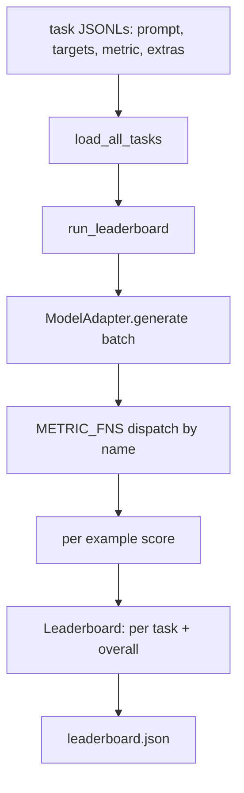
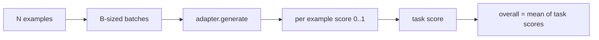

# Arnesamento de Avaliação de Modelos de Língua

> Um modelo que faz bem uma tarefa que não pode ser definida é um modelo que faz bem por acaso.

**Type:** Build
**Languages:** Python
**Prerequisites:** Phase 19 lessons 42 to 45
**Time:** ~90 minutes

## Objetivos de aprendizagem

- Defina uma tarefa como um arquivo JSONL com `prompt`- Não .`targets`- Não .`metric`, e opcionais `extras`- Por exemplo.
- Implementar cinco métricas: correspondência exata, rouge-l F1, verificação executável, escolha múltipla e conteúdo de substring.
- Construir um runner que encomenda exemplos por tarefa e envia para um adaptador de modelo trocável.
- Emite um JSON de classificação com pontuações por tarefa, latência e uma média geral reprodutível.

## O problema

Um novo modelo de linguagem chega todas as semanas. A afirmação de marketing é que ele faz bem. A pergunta honesta é: bem em que? A resposta honesta é o ranking que você escreveu, porque o ranking do fornecedor é aquele a que eles sintonizaram.

Sem um arnes no seu repo você compara dois modelos por vibrações. Com um arnes você compara-los por pontuação em um conjunto de tarefas fixo com uma métrica fixa, em uma saída JSON você pode diferir. O arnes é o contrato entre a execução de ontem e a execução de hoje. Sem ele, regressões nave.

A armadilha é o excesso de montagem do arame para um único modelo. A solução é a mesma armadilha ao contrário: o arnes é pequeno o suficiente para ler em quinze minutos, as tarefas são pequenas o suficiente para enviar no repo, as métricas são escritas a partir do zero para que um colega possa auditá-las, e o adaptador é o único lugar onde o código específico do modelo vive. Troca o adaptador, o quadro de liderança muda; troca as tarefas, o quadro de liderança muda. Nada mais deve se mover.

## O conceito



### Especificações de tarefas

Cada exemplo é uma linha JSONL:

```json
{"id": "arith-00", "prompt": "compute: 2 + 2", "targets": ["4"], "metric": "exact_match"}
```

Para métricas que precisam de assistentes de pontuação,`extras`Carrega a carga útil lateral:

```json
{
  "id": "code-00",
  "prompt": "python: write a function f that doubles its input",
  "targets": ["ok"],
  "metric": "code_exec",
  "extras": {"io_pairs": [[1, 2], [3, 6]]}
}
```

Uma tarefa é uma tarefa .`.jsonl`arquivo em `outputs/tasks/`O nome do arquivo é o nome da tarefa. Todos os exemplos em um arquivo compartilham uma métrica.

### As cinco tarefas do dispositivo

| Task | Metric | What it tests |
|------|--------|---------------|
| arithmetic | exact_match | Token-level correctness on a deterministic answer |
| summary | rouge_l | Longest common subsequence F1 against a one-line reference summary |
| code-exec | code_exec | Executable test: the predicted function must satisfy a list of input-output pairs |
| multiple-choice | multiple_choice | First letter of the prediction must match an allowed letter |
| generation | substring_contains | Free-form text must contain at least one target substring |

### O contrato métrico

Cada métrica é uma função de `(prediction, targets, extras) -> float in [0.0, 1.0]`O arnes calcula a média das pontuações por exemplo para obter uma pontuação de tarefa, e depois calcula a média das pontuações de tarefa para obter a pontuação geral.

- `exact_match`: minúsculas, colapso do espaço branco, igualdade.
- `substring_contains`: mesma normalização, substring test.
- `multiple_choice`: primeiro personagem em cima.
- `rouge_l`: Longo da LCS dividida por comprimentos de previsão e de referência, F1 de precisão e de recall.
- `code_exec`: executar a previsão num espaço de nomes restrito, ligar `f(x)`Em cada par de entrada e saída, conte coincidências.

A métrica code_exec executa a previsão em um espaço de nomes de buildins despojado.`import os`Explode porque`os`Não está no espaço de nomes; não pode chegar ao sistema de arquivos a partir de uma previsão de código.

### O adaptador do modelo

```python
class ModelAdapter(Protocol):
    def generate(self, prompts: Sequence[str]) -> List[str]: ...
    @property
    def name(self) -> str: ...
```

O adaptador é a costura.`ToyAdapter`O arnes não importa qual.

### O corredor

`run_task`lotes `batch_size`As instruções são enviadas simultaneamente e enviadas para a função métrica. `run_leaderboard`Ele faz todas as tarefas e medias.`write_leaderboard`emite JSON com uma cadeia de esquema para que futuras alterações de formato não quebrem silenciosamente os painéis de controle.



```figure
eval-harness-matrix
```

## Construí-lo

`code/main.py`é o artefato de corrida.

### Passo 1: tarefas de fixação de sementes

`seed_fixture_tasks(target_dir)`escreve os cinco `.jsonl`O primeiro ciclo de`main.py`Seeds-os quando o diretório está vazio.

### Passo 2: tarefas de carga

`load_all_tasks(task_dir)`Leia todos.`.jsonl`e retorna um ditado do nome da tarefa para uma lista de `Example`Registros. Linhas de comentários começando com `#`e as linhas em branco são ignoradas para que os colaboradores possam anotar os arquivos.

### Passo 3: Implementar métricas

Cada métrica é uma pequena função com um teste unitário. A série de testes da lição inclui 13 casos que cobrem normalização, sobreposição parcial, execução de código e rejeição de código inseguro.

### Passo 4: escrever o corredor

`run_task`Itera lotes e produz um `TaskResult`com pontuação, contagem correta, contagem total e latência. `run_leaderboard`- O que é que é?`Leaderboard`com a média geral.

### Passo 5: emitir JSON

`write_leaderboard`A série serializa o quadro.`--include-per-example`A flag descarta os registos por exemplo para que você possa diferenciar as previsões da corrida anterior quando as pontuações se movem.

- É o que é ?

```bash
python3 code/main.py
```

O roteiro semeia os aparelhos na primeira corrida, os marca com o adaptador de brinquedos (que dá cada aparelho direito), e escreve `outputs/leaderboard.json`. A pontuação geral é de 1,0 com o adaptador de brinquedo; o teste de adaptador de estúdio em `test_main.py`mostra o mesmo arame produz 0,0 quando o adaptador não pode responder.

## Usá-lo

Para ligar um modelo real, escreva um adaptador.

```python
class HttpAdapter:
    name = "vendor.v1"

    def __init__(self, endpoint, api_key):
        self.endpoint = endpoint
        self.api_key = api_key

    def generate(self, prompts):
        out = []
        for prompt in prompts:
            response = http_post(self.endpoint, prompt, self.api_key)
            out.append(response["text"])
        return out
```

Troca de dinheiro`ToyAdapter`Para`HttpAdapter`No topo de `main()`O arnés, as tarefas, as métricas e o ranking permanecem iguais.

Três padrões a aplicar ao enviar o arnes em um projeto real:

- **Pin the task files.**O leaderboard.json carrega conteúdo de tarefa com hash pin ou carrega os JSONLs ao lado; caso contrário, a pontuação se move quando o arquivo de tarefa faz, e você não pode dizer qual.
- **Diff predictions, not just scores.**O `--include-per-example`A bandeira permite ver o que o modelo disse no dia em que a pontuação caiu.
- **Cap the batch size.**Os adaptadores reais têm limites de taxa, e um pequeno lote mantém o arame compatível entre os fornecedores.

## Envia-o

`outputs/skill-lm-eval-harness.md`Carrega a receita: JSONL especificação de tarefa, cinco métricas, adaptador intercambiável, batch runner, quadro de liderança JSON com cadeia de esquema.`outputs/tasks/`As instalações são as instalações; copiá-las num projecto real como iniciantes.

## Exercícios

1. Adicione uma sexta tarefa com uma métrica personalizada que você escreve a partir do zero (overlape semelhante a BLEU, pontuação de referência semelhante a BLEURT, qualquer coisa com um contrato claro).
2. Extensão`code_exec`Para capturar o estudo e aceitar uma lista de estudo esperados como alvos.
3. Adicionar um comando de diferença de classificação: dado dois `leaderboard.json`Os ficheiros, imprimir quais tarefas foram movidas e quanto.
4. Por exemplo, a latência de limite. Envolver a chamada do adaptador em um timeout; superfície separada `timeouts`coluna no quadro de resultados.
5. Pin o conteúdo da tarefa com um sha256 na tabela de classificação para que um futuro leitor possa verificar que obteve as mesmas tarefas.

## Termos-chave

| Term | What people say | What it actually means |
|------|-----------------|------------------------|
| Task spec | "The eval format" | JSONL file with prompt, targets, metric, optional extras per example |
| Metric | "How you score" | Function from (prediction, targets, extras) to a float in [0, 1] |
| Adapter | "The model client" | Object with a generate(prompts) -> list[str] method; the only model-specific code |
| Leaderboard | "The scoreboard" | JSON with per-task scores, total counts, latency, and an overall average |
| Code exec metric | "Run it and check" | Execute the prediction in a restricted namespace, compare against input-output pairs |

## Mais leitura

- O arame de avaliação de lm original para a referência de produção, muito maior, mas com a mesma forma.
- A HuggingFace está a dar um passo à frente para uma aplicação alternativa do mesmo contrato.
- A lição 46 da fase 19 abrange os padrões de acumulação de gradientes utilizados na pilha de treinamento e as pontuações do arnes.
- A lição 47 da fase 19 abrange o formato do ponto de verificação contra o qual você marcou; pinhe o hash do ponto de verificação na tabela de classificação.
- A lição 48 da fase 19 abrange a pilha de treinamento distribuída que produziu o modelo em ensaio.
