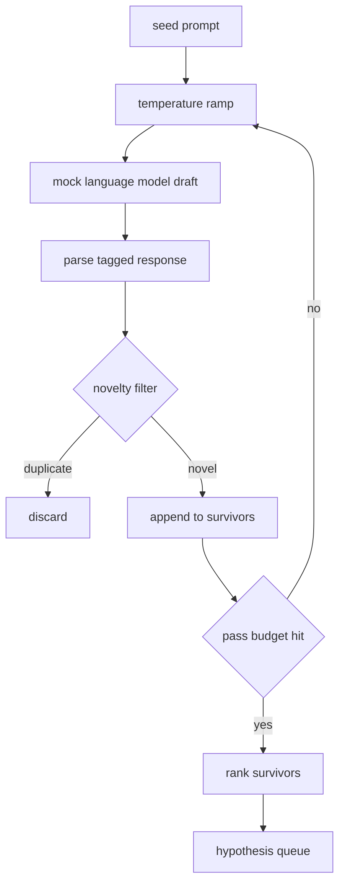

# Gerador de hipóteses

> Um agente de pesquisa que faz a mesma pergunta duas vezes está a desperdiçar tokens.

**Type:** Build
**Languages:** Python
**Prerequisites:** Phase 19 Track A lessons 20-29
**Time:** ~90 minutes

## Objetivos de aprendizagem
- Conduza um amostragem de uma semente de sementes e torne as suas saídas em registros de hipóteses digitais.
- Ramp a temperatura do amostragem em cada passagem para que o próximo rasto se afaste mais do último.
- Filtro próximo a duplicados com um pequeno modelo de inserção e um limiar de distância cosínea.
- Classifique os sobreviventes com uma função de pontuação que mistura novidade, especificidade e testabilidade.
- Mantém cada passo determinista para que a mesma semente sempre produz a mesma fila.

## Por que gerar, depois filtrar

Um planejador que pergunta a um modelo uma vez recebe uma hipótese. Isso é bom para um exemplo trabalhado. Para um ciclo de pesquisa é a forma errada. O ciclo quer uma fila classificada com profundidade, então quando a primeira hipótese falha, o corredor tem o próximo pronto sem pagar por outro passo de amostragem completo.

As duas ideias se combinam para produzir essa fila. A primeira é a temperatura de ramping: cada passagem através do amostragem aumenta a temperatura um corte, então os projetos posteriores são encorajados a vaguear. A segunda é a filtragem de novidade: após cada projecto, o gerador mede a distância de inserção de cada sobrevivente anterior e rejeita qualquer coisa dentro do aglomerado.

A lição envia um modelo de linguagem simulada que retorna sequências de tokens scripted para pedidos fixos. A simulação é suficiente para exercer o caminho completo: pedido de semente, rampa de temperatura aplicada, candidatos analisados, filtro de novidade executado, fila de classificação.

## A forma da hipótese

```text
Hypothesis
  id             : int           (monotonic within a run)
  text           : str           (the claim)
  variables      : list[str]     (what changes between conditions)
  metric         : str           (what the runner will measure)
  baseline_ref   : str | None    (which paper or run the comparison cites)
  draft_pass     : int           (which sampler pass produced this)
  temperature    : float         (the sampler setting at draft time)
  novelty_score  : float         (distance from prior survivors, 0..1)
  rank_score     : float         (weighted sum used for ordering)
```

`variables`E ...`metric`O cursor na lição 52 lê esses campos diretamente quando ele constrói a configuração do experimento.

`baseline_ref`A avaliação da lição 53 precisa de uma linha de base para comparar. Se a hipótese omite uma, a avaliação volta à corrida anterior na mesma métrica.

```figure
cg-novelty-ramp
```

## Arquitetura



O ciclo é direto para a frente. A parte interessante é que cada caixa tem um contrato duro.

## Rampada de temperatura

Começa em`t_min`, final em `t_max`, passo `(t_max - t_min) / (n_passes - 1)`Cada passagem chama o amostragem à temperatura corrente, produzindo`n_passes`valores uniformemente espaçados de `GeneratorConfig.schedule()`O modelo simulado honra a temperatura alternando entre um pequeno conjunto de respostas scriptadas ligadas `(prompt, temp_bucket)`Os baldes são intervalos abertos, de modo que uma pequena alteração na temperatura escolhe um balde diferente e produz um esboço diferente.`temperature=t`- Passou por lá.

O cronograma padrão é de seis passes de `0.2`- Não .`1.2`Seis é suficiente para preencher a fila sem pagar por amostras que o filtro de novidade rejeitará de qualquer maneira.`0.2`O modelo retorna a semente.`1.2`As respostas tendem a desviar-se do tópico e falham no analisador.

## Filtro de novidade

Depois de cada rascunho ser analisado, o gerador incorpora o texto e compara contra todas as hipóteses aceitas.`1 - dot(a, b)`Um projecto passa se a sua distância mínima a qualquer sobrevivente anterior for superior .`novelty_threshold`- Default é`0.25`- Não .

A incorporação hash não é sofisticada. É determinista, tem dependências zero, e é suficiente para capturar o caso óbvio: dois rascunhos que compartilham a maioria de seus substantivos.

## Ponto de classificação

```text
rank_score = w_novelty * novelty_score
           + w_specificity * specificity_score
           + w_testability * testability_score
```

Três sub-puntuações.`novelty_score`é a distância mínima de inserção dos sobreviventes anteriores. `specificity_score`é o número de variáveis concretas na hipótese dividido por um número-alvo. `testability_score`é um se a hipótese especifica tanto uma métrica quanto uma linha de base, metade se só tem uma métrica, zero de outra forma.

Os pesos por defeito são `0.4`- Não .`0.3`- Não .`0.3`Os pesos vivem na configuração do gerador para que uma lição para baixo possa mudar sem forjar o código.

## Modelo de linguagem falsa

```python
class MockLLM:
    def sample(self, prompt: str, temperature: float, seed: int) -> str:
        ...
```

O amostragem é determinista dado um `(prompt, temperature, seed)`A simulação mantém uma tabela de resposta guiada.`(prompt_signature, temperature_bucket)`Se a tabela não tiver entrada para uma chave, o amostragador retorna um fallback que falha no parser.

A semente é misturada na resposta , assim é o mesmo .`(prompt, temperature)`Em testes, nós pinhamos a semente para manter os resultados reprodutíveis. em uma implantação real a semente viria de um relógio do sistema ou um contador.

## Cota de saída

A saída é uma lista de `Hypothesis`registos classificados por `rank_score`O corredor na lição 52 bate a cabeça, faz o experimento, e o avaliador na lição 53 escreve um veredicto.

Quando está vazia, o orquestrador pode ampliar o comando de semente e voltar a executar o gerador ou parar e relatar o orçamento esgotado.

## Como ler o código

`code/main.py`define`Hypothesis`- Não .`MockLLM`- Não .`HypothesisGenerator`O gerador expõe um único`run(seed_prompt)`método que retorna uma fila ordenada; o número de passes é lido a partir de `GeneratorConfig.n_passes`O filtro de novidade é uma única função. A pontuação de classificação é uma única função. Nada depende de`numpy`A matemática de incorporação é simples, por isso a lição permanece portátil.

`code/tests/test_generator.py`abrange o caminho linear, o caminho de rejeição duplicada, o caminho de falha do parser, os limites da rampa de temperatura e a ordem de classificação.

## Onde esta entrada

A lição cinquenta produz a fila. A lição cinquenta e um toma a cabeça da fila e realiza uma pesquisa literária para confirmar ou refutar. A lição cinquenta e dois toma a mesma cabeça e realiza um experimento real. A lição cinquenta e três lê ambos os resultados e escreve um veredicto. As quatro lições compõem um ciclo de pesquisa sem nenhum ser humano nele; um ser humano pode entrar em qualquer fronteira.
