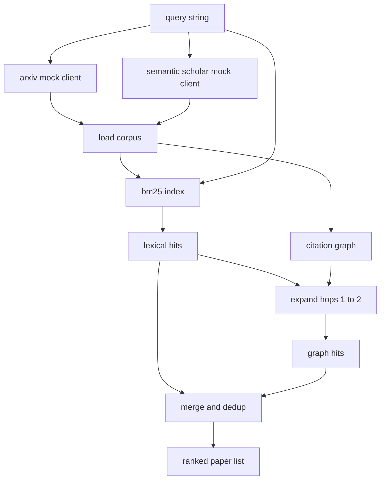

# Recuperação de literatura

> Uma hipótese é barata, saber se alguém já provou que é a parte cara é construir a camada de recuperação que responde a essa pergunta antes que o corredor torne uma caixa de areia.

**Type:** Build
**Languages:** Python
**Prerequisites:** Phase 19 Track A lessons 20-29
**Time:** ~90 minutes

## Objetivos de aprendizagem
- Modela um pequeno registro de papel com os campos que o loop vai ler para baixo.
- Construir um índice BM25 sobre resumos com estruturas de dados apenas.
- Passe um gráfico de citações para a superfície dos papéis que a busca léxica perdeu.
- O deduplicado atinge o léxico e o gráfico passa por um id de papel estável.
- Envolver duas APIs externas falsas atrás de um único cliente para que o site de chamada upstream permaneça o mesmo quando os endpoints reais aterram.

## Por que duas passagens de recuperação

Uma pesquisa de palavras-chave em resumos retorna artigos que compartilham vocabulário com a consulta. Isso cobre a maior parte da superfície. Não há dois casos. O primeiro é quando o documento de base usa vocabulário diferente; por exemplo, uma consulta para "atentação escassa" perde um artigo intitulado "seleção de blocos no encaminhamento de transformadores". O segundo é quando o documento relevante é um seguimento que cita uma âncora conhecida; é mais eficiente encontrar a âncora e avançar do que forçar a força bruta do conjunto abstrato.

A lição constrói ambos os passes. BM25 sobre resumos capta os hits léxicos. Um gráfico de citação de passagem expande uma semente colocada para frente e para trás por um ou dois saltos. A união é deduplicada por id de papel e classificada por uma pequena pontuação combinada.

## A forma do papel

```text
Paper
  id          : str           (stable identifier, "p001" for the mock corpus)
  title       : str
  abstract    : str
  year        : int
  authors     : list[str]
  references  : list[str]     (paper ids this paper cites)
  citations   : list[str]     (paper ids that cite this paper)
  source      : str           (which mock api supplied it, "arxiv" or "s2")
```

Os dois APIs falsos retornam campos superpuestos mas não idênticos, por isso o carregador de corpus unifica-os em `id`- Não .

```figure
cg-citation-hops
```

## Arquitetura



O cliente de recuperação possui os dois passes e a fusão. O chamador lhe entrega uma consulta e retorna uma lista classificada onde cada entrada contém campos de pontuação por papel (`bm25_score`- Não .`graph_distance`- Não .`recency_score`- Não .`final_score`) que explicam a classificação.

## BM25 a partir do zero

A implementação é a norma Okapi BM25 com parâmetros padrão `k1=1.5`- Não .`b=0.75`O índice é constituído por dois dicionários:`term -> doc_frequency`E ...`term -> list of (doc_id, term_count)`O comprimento do documento é o número de símbolos do resumo. O comprimento médio do documento é calculado uma vez no tempo de construção do índice.`idf * tf_norm`onde`tf_norm`é a frequência normalizada de termo de comprimento BM25 padrão.

O tokeniser é`lower`O sistema de produção trocaria em um pequeno votor.

```text
idf(t)      = log((N - df + 0.5) / (df + 0.5) + 1.0)
tf_norm(t)  = (f * (k1 + 1)) / (f + k1 * (1 - b + b * dl / avgdl))
score(d, q) = sum over t in q of idf(t) * tf_norm(t)
```

## Transversalidade do gráfico de citações

O gráfico é construído uma vez a partir do corpus. As bordas dianteiras vão de um papel para suas referências. As bordas traseiras vão de um papel para suas citações. A travessia é uma ampla primeira busca semeada pelos principais hits BM25, capados em dois saltos.

Dois saltos é um teto deliberado. Um saltos é muito raso; o agente muitas vezes quer o antepassado imediato ou descendente. Três saltos aumenta o tamanho do resultado em um gráfico conectado e tende a desviar-se do tópico. A lição expõe o limite de saltos como um botão de configuração para que um loop aguçado possa apertar.

## Descarga e classificação

As duas passes retornam conjuntos sobrepostos. As chaves de fusão no papel id. Para cada papel a pontuação final é uma mistura ponderada.

```text
final_score = w_bm25 * bm25_score_norm
            + w_graph * graph_score
            + w_recency * recency_score
```

`bm25_score_norm`é a pontuação BM25 dividida pela pontuação máxima BM25 no conjunto combinado (de modo que o campo vive em zero a um). `graph_score`É um para hits directos de léxico, então `0.6`por um salto, `0.3`Se não for o caso, zero.`recency_score`é uma rampa linear que vai do zero no ano mínimo do corpus para um no máximo.

Os pesos por defeito são `0.5`- Não .`0.3`- Não .`0.2`Os pesos são config; um tópico obsoleto pode diminuir a recência enquanto um tópico em movimento rápido o eleva.

## Fim de corpus

O corpus é de cem artigos, gerados por`build_corpus()`Cada artigo tem um título escrito à mão e um resumo sobre um dos cinco tópicos: escassez de atenção, aumento da recuperação, adaptadores de baixa classificação, destilação de conjuntos de dados e arnes de avaliação.

Os dois clientes de API falsos (`ArxivMockClient`- Não .`SemanticScholarMockClient`O Arxiv retorna o título, resumo, ano, autores. O Semantic Scholar adiciona referências e citações. As uniões de clientes de recuperação no id; o tratamento de desacordo entre os campos de clientes é adiado para uma lição de acompanhamento.

## Que lições 52 e 53

O corredor na aula 52 diz:`paper.id`- Não .`paper.title`O avaliador na lição 53 lê:`paper.year`E ...`paper.references`atribuir uma linha de base a um documento específico.

O cliente de recuperação retorna um `RetrievalResult`O corredor registra estes dados para que um passe de observabilidade para baixo possa traçar a qualidade ao longo do tempo.

## Como ler o código

`code/main.py`define`Paper`- Não .`ArxivMockClient`- Não .`SemanticScholarMockClient`- Não .`BM25Index`- Não .`CitationGraph`- Não .`RetrievalClient`O modelo de instrução é o modelo de instrução de instrução de instrução de instrução de instrução de instrução de instrução de instrução de instrução de instrução de instrução de instrução de instrução de instrução de instrução de instrução de instrução de instrução de instrução de instrução de instrução de instrução de instrução de instrução de instrução de instrução de instrução de instrução de instrução de instrução de instrução de instrução de instrução de instrução de instrução de instrução de instrução de instrução de instrução de instrução de instrução de instrução de instrução de instrução de instrução de instrução de instrução de instrução de instrução de instrução de instrução de instrução de instrução de instrução de instrução de instrução de instrução de instrução de instrução de instrução de instrução de instrução de instrução de instrução de instrução de instrução de instrução de instrução de instrução de instrução de instrução de instrução de instrução de instrução de instrução de instrução de instrução de instrução de instrução de instrução de instrução de instrução de instrução de instrução de instrução de instrução de instrução de instrução de instrução de instrução de instrução de instrução de instrução de instrução de instrução de instrução de instrução de instrução de instrução de instrução de instrução de instrução de instrução de instrução de instrução de instrução de instrução de instrução de instrução de instrução de instrução de instrução de instrução de instrução de instrução de instrução de instrução de instrução de instrução de instrução de instrução de instrução de instrução de instrução de instrução de instrução de instrução de instrução de instrução de instrução de instrução de instrução de instrução de instrução de instrução de instrução de instrução de instrução de instrução de instrução de instrução de instrução de instrução de instrução de instrução de instrução de instrução de instrução de instrução de instrução de instrução de instrução de instrução de instrução de instrução de instrução de instrução de instrução de instrução de instrução de instrução de instrução de instrução de instrução de instrução de instrução de instrução de

`code/tests/test_retrieval.py`abrange o caminho lexical, o caminho gráfico, a fusão, o dedup e a consulta vazia.

## Onde esta entrada

A lição cinquenta produz uma hipótese. A lição cinquenta e um procura na literatura para ver se essa hipótese já está estabelecida. A lição cinquenta e dois executa o experimento se não for. A lição cinquenta e três lê tanto o resultado da recuperação quanto as métricas do experimento para escrever o veredicto. O cliente de recuperação é o mais barato dos quatro estágios e é o primeiro a executar no orquestrador.
