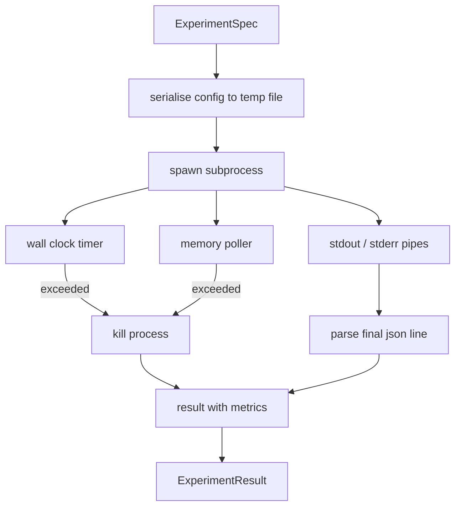

# Corredor de Experimento

> A faixa é tão honesta quanto as suas medições. Construir o corredor que pega uma especificação, executa-a em um subprocesso sandboxed, e emite uma mancha de métricas json que o avaliador pode confiar.

**Type:** Build
**Languages:** Python
**Prerequisites:** Phase 19 Track A lessons 20-29
**Time:** ~90 minutes

## Objetivos de aprendizagem
- Encodear um experimento como uma especificação tipografada que o corredor pode sererizar para um subprocesso.
- Lançar um subprocesso com um tempo de tempo de parede duro e um capacete de memória macio, e surgir ambos como condições terminais.
- Capture stdout, stderr, e as métricas estruturadas blob em um único registro de resultados.
- Construir uma tabela de ablação que varrer um botão de configuração de cada vez sobre uma especificação base fixa.
- Mantenha cada resultado determinista dado uma semente para que o avaliador veja os mesmos números em todas as corridas.

## Por que um subprocesso

Um ciclo de pesquisa executa código não confiável. A hipótese veio de um sampler, o script experimental veio do mesmo caminho; tratar qualquer um como seguro no processo é pedir um acidente que leva o orquestador para baixo. Subprocessos são o isolamento mais simples que a linguagem navega: um processo separado, um espaço de endereço independente, um cabo de sinal no lado da mãe.

O corredor aqui não implementa sandboxing completo. Não há cgroup, não há filtro de seccomp, não há remapagem do espaço de nomes. O que ele tem é um tempo de cronograma de parede, um ciclo de pesquisa para o crescimento da memória e um caminho de execução que termina o processo em qualquer limite. Esse é o contrato de tempo de execução a cada mais elaborado sandbox se estende. A lição mantém o contrato pequeno o suficiente para ser lido em uma sessão.

## A forma do ExperimentSpec

```text
ExperimentSpec
  spec_id        : str            (stable id, "exp_001")
  hypothesis_id  : int            (link back to the queue from lesson 50)
  script_path    : str            (path to the python script to run)
  config         : dict           (passed to the script as one json arg)
  seed           : int            (deterministic seed for the experiment)
  wall_timeout_s : float          (hard timeout, killed on exceed)
  memory_cap_mb  : int            (soft cap, polled; killed on exceed)
  metric_keys    : list[str]      (which fields the evaluator will read)
```

O script vive no disco; o executor escreve a configuração para um caminho de arquivo temporário que o script lê. O script deve imprimir uma única linha json em stdout cujas chaves são um superconjunto de `metric_keys`Qualquer outra coisa no Stdout é capturada mas ignorada pelo analisador de métricas.

```figure
cg-runner-limits
```

## Arquitetura



O corredor é uma classe com um método principal. O polerador é um pequeno fio que acorda uma vez a cada intervalo de pesquisa e lê o subprocesso `psutil`O sistema de arquivos proc, quando disponível, é equivalente, mas não é utilizado quando não é exposto pela plataforma.

## Por que um capacete de memória macio

Os capacetes de memória rígida precisam`resource.setrlimit`A lição envia uma abordagem portátil: pesquisa do tamanho do conjunto residente da plataforma e mate o subprocesso se ele exceder o limite. O limite é macio porque o pesquisador tem um intervalo não zero; um processo pode subir acima do limite entre as pesquisas e depois cair para trás. O corredor registra o RSS máximo observado para que o avaliador possa ver quão perto a corrida chegou ao limite.

Em sistemas sem suporte de inspecção de processos, o pesquisador registra um aviso único e desativa-se. O tempo limite do relógio de parede ainda se aplica.

## Capturando o estudo e o esterro

O corredor lê ambos os tubos drenados na conclusão. Stdout é escaneado linha por linha; a última linha que analisa como json com todos os necessários `metric_keys`As linhas anteriores de json são mantidas no resultado como`intermediate_metrics`O avaliador pode utilizar estes dados para curvas de aprendizagem.

O corredor nunca aumenta um código de saída não zero; em vez disso, ele registra o código no resultado.`"crash"`Mesmo quando o script imprimiu métricas, então o avaliador trata partial runs como falhas por padrão.

## Tabela de ablação

```python
def ablate(base: ExperimentSpec, knob: str, values: list[Any]) -> list[ExperimentSpec]:
    ...
```

Dado um especificação base e um nome de botão, o auxiliar retorna um especificação por valor com `config[knob]`Cada especificação recebe uma derivação.`spec_id`(`f"{base.spec_id}_{knob}_{value}"`O corredor lança um barco .`AblationRunner`que os corre em ordem e retorna um `AblationTable`- O número de teclado é de um botão.

Por que um botão de cada vez. Esvazios fatoriais completos explodem exponencialmente e produzem resultados que o avaliador não pode interpretar. Um botão de cada vez produz um eixo limpo que o avaliador pode traçar. A lição suporta esvazios de vários botões apenas como ablações repetidas de um único botão, compostas pelo chamador.

## Determinismo

Cada especificação carrega uma semente.`config["__seed"] = spec.seed`O simulado experimento está escrito em`code/experiments/`A avaliação da lição 53 depende disso; sem determinismo uma "regressão" pode ser uma inicialização aleatória diferente.

## O roteiro do simulado experimento

A lição envia um guião de experimento:`code/experiments/sparsity_experiment.py`É um script real que lê o seu arquivo de configuração, simula uma pequena execução de treinamento com um passe aleatório numfoco e imprime uma mancha de métricas json.`sleep_s`- um botão para testes de tempo e um`allocate_mb`botão para testar o sondagem de memória.

A simulação não é um treinamento real. É um cálculo numérico que imita a forma de um ciclo de treinamento: uma curva de perda, uma perplexidade final, um tempo de parede. O ponto da lição é o corredor, não a simulação. Um roteiro de experimento real importaria um modelo.

## Forma do resultado

```text
ExperimentResult
  spec_id              : str
  hypothesis_id        : int
  exit_code            : int
  terminal             : "ok" | "timeout" | "oom" | "crash"
  wall_time_s          : float
  peak_rss_mb          : float | None
  metrics              : dict
  intermediate_metrics : list[dict]
  stdout_tail          : str
  stderr_tail          : str
```

O avaliador diz:`metrics`E ...`terminal`Se o terminal é qualquer coisa além de...`"ok"`O experimento conta como uma corrida falhada e o veredicto do avaliador é automático.

## Como ler o código

`code/main.py`define`ExperimentSpec`- Não .`ExperimentResult`- Não .`ExperimentRunner`- Não .`AblationRunner`O gerenciamento de subprocessos é uma classe. o polsor de memória é um fio pequeno. o auxiliar de ablação é uma única função.

`code/experiments/sparsity_experiment.py`É o experimento simulado usado em testes. Ele lê o seu caminho do arquivo de configuração a partir do argv e escreve uma única linha de métricas json no final.

`code/tests/test_runner.py`abrange o caminho do sucesso, o caminho do timeout, o caminho da queda, a tabela de ablação e o controle do determinismo em duas corridas.

## Onde esta entrada

A lição cinquenta gera a hipótese. A lição cinquenta e um filtra tudo o que a literatura já resolveu. A lição cinquenta e dois executa o experimento pelo que resta. A lição cinquenta e três lê o resultado, executa o teste de significância e escreve o veredicto que o orquestrador armazena contra a id da hipótese.
