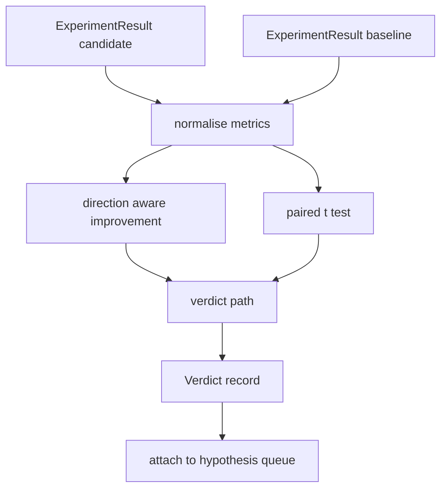

# Avaliação de resultados

> O corredor produziu números. O avaliador decide se esses números são uma melhora, uma regressão ou ruído. Construir o caminho do veredicto que transforma as métricas em uma conclusão de uma linha.

**Type:** Build
**Languages:** Python
**Prerequisites:** Phase 19 Track A lessons 20-29
**Time:** ~90 minutes

## Objetivos de aprendizagem
- Compare uma corrida de candidato com uma linha de base, utilizando melhoria consciente da direcção e um limiar fixo.
- Execute um teste de t emparelhado a partir do zero por semente e leia o valor p resultante.
- Normalizar as métricas em escala de registro para que um relatório a jusante possa misturá-las com métricas lineares.
- Emitir um veredicto por hipótese que o orquestrador pode anexar à fila da lição 50.
- Mantém cada passo puro para que as mesmas entradas produzam sempre o mesmo veredicto.

## Por que um teste em par

Um único número do corredor não diz se a mudança é real. A mesma configuração com uma semente diferente dá uma perplexidade diferente. A mudança pode ser ruído. A comparação correta é combinada: as mesmas sementes com os mesmos dados, executadas uma vez com o candidato e uma vez com a linha de base. Cada semente contribui com uma diferença. A média dessas diferenças é o efeito. O erro padrão dessas diferenças é o piso de ruído.

A lição implementa o teste do zero.`scipy.stats`A matemática é pequena o suficiente para ler numa tela.

```text
diffs    = [a_i - b_i for i in seeds]
mean     = sum(diffs) / n
variance = sum((d - mean) ** 2 for d in diffs) / (n - 1)
t_stat   = mean / sqrt(variance / n)
df       = n - 1
p_value  = two_sided_p(t_stat, df)
```

O valor p de dois lados usa uma função beta regularmente incompleta. A lição envia uma pequena implementação que usa a fração Lentz continuada.

## Melhoria da consciência de direcção

Algumas métricas melhoram quando aumentam (acurateza, rendimento), outras melhoram quando diminuem (perda, perplexidade, tempo de parede).`direction`campo em cada métrica.

```text
if direction == "higher_is_better":
    improvement = (candidate - baseline) / abs(baseline)
elif direction == "lower_is_better":
    improvement = (baseline - candidate) / abs(baseline)
```

Uma melhoria negativa em uma métrica superior é melhor significa que o candidato é pior.

Um limiar plano (`improvement_threshold=0.02`A solução é a solução de um processo de "p" (p) que é um processo de "p" (p) (p) (p) (p) (p) (p) (p) (p) (p) (p) (p) (p) (p) (p) (p) (p) (p) (p) (p) (p) (p) (p) (p) (p) (p) (p) (p) (p) (p) (p) (p) (p) (p) (p) (p) (p) (p) (p) (p) (p) (p) (p) (p) (p) (p) (p) (p) (p) (p) (p) (p) (p) (p) (p) (p) (p) (p) (p) (p) (p) (p) (p) (p) (p) (p) (p) (p) (p) (p) (p) (p) (p) (p) (p) (p) (p) (p) (p) (p) (p) (p) (p) (p) (p) (p) (p) (p) (p) (p) (p) (p) (p) (p) (p) (p) (p) (p) (p) (p) (p) (p) (p) (p) (p) (p) (p) (p) (p) (p) (p) (p) (p) (p) (p) (p) (p) (p) (p) (p) (p) (p) (p) (p) (p) (p) (p) (p) (p) (p) (p) (p) (p) (p) (p) (p) (p) (p) (p) (p) (p) (p) (p) (p) (p) (p) (p) (), (p) (p) (), (), (), (), (), (), (), (), (), (), (), (), (), (), (), (), (), (), (), (

```figure
cg-paired-verdict
```

## Arquitetura



O avaliador executa três cálculos independentes e os junta no caminho do veredicto.

## Normalização do registro

A perplexidade é exponencial na perda. Uma queda de 0,1 na perda é uma queda muito maior na perplexidade. Comparar perplexidade diretamente entre duas configurações é bom, mas misturá-la com métricas lineares em um único relatório requer normalização.

A lição normaliza qualquer métrica cujo`scale`campo é `"log"`O limite é aplicado em espaço de registro. Uma queda de perplexidade de 32 para 28 é `log(28) - log(32) = -0.133`em um nível inferior é melhor métrica, que está bem acima do limiar de dois por cento.

```text
if scale == "log":
    a = log(candidate)
    b = log(baseline)
else:
    a = candidate
    b = baseline
```

Metricas com `scale="linear"`O mesmo código de traçado lida com ambos.

## Ensaios em paragem por semente

O corredor da lição 52 emite uma mancha de métricas finais por corrida. Para o teste emparelhado, o avaliador precisa de uma mancha por semente para o candidato e uma por semente para a linha de base. O orquestrador executa o mesmo experimento sob ambas as configurações em uma lista de sementes e entrega ao avaliador duas listas de sementes.`ExperimentResult`- Os registos.

O avaliador as associa por semente (a semente vive em `result.metrics["seed"]`Se as sementes não coincidirem nas duas listas, o avaliador eleva um `PairingError`O orquestrador deve voltar a correr.

## A forma do veredicto

```text
Verdict
  hypothesis_id          : int
  metric                 : str
  direction              : "higher_is_better" | "lower_is_better"
  scale                  : "linear" | "log"
  candidate_mean         : float
  baseline_mean          : float
  improvement            : float       (signed, fraction; see direction rules)
  p_value                : float | None  (None if n < 2)
  significance_threshold : float
  improvement_threshold  : float
  verdict                : "improved" | "regressed" | "noise" | "failed"
  rationale              : str
```

O caminho do veredicto é uma pequena tabela de decisões:

```text
1. If any candidate result has terminal != "ok": verdict = "failed"
2. else if |improvement| < improvement_threshold:  verdict = "noise"
3. else if p_value is None or p_value > significance: verdict = "noise"
4. else if improvement > 0:                          verdict = "improved"
5. else:                                             verdict = "regressed"
```

Racionalização é uma frase legível por um homem de uma linha que o orquestrador pode registrar contra a id da hipótese.

## Como ler o código

`code/main.py`define`MetricSpec`- Não .`Verdict`- Não .`Evaluator`O teste t é implementado em matemática pura stdlib; numpy é usado apenas para ler a lista de métricas e os meios de cálculo e variações.

`code/tests/test_evaluator.py`Abrange o caminho melhorado, o caminho regressado, o caminho de ruído (uma pequena melhoria), o caminho de ruído (baixo n), o caminho terminal falhado, o caminho normalizado do registro, o teste t contra um valor de referência conhecido e o erro de acoplamento.

## Onde esta entrada

A lição cinquenta produziu a fila de hipóteses. A lição cinquenta e um filtrou tudo o que a literatura resolveu. A lição cinquenta e dois executou o experimento sob configurações de candidato e linha de base em sementes. A lição cinquenta e três lê essas corridas e escreve o veredicto. O orquestrador costura as quatro juntas:

```text
for hypothesis in queue:
    literature = retrieval.search(hypothesis.text)
    if literature_settles(hypothesis, literature):
        attach(hypothesis, verdict="settled")
        continue
    candidates = runner.run_all(specs_for(hypothesis))
    baselines  = runner.run_all(baseline_specs_for(hypothesis))
    metric_spec = MetricSpec("perplexity", direction=LOWER, scale=LOG)
    verdict = evaluator.evaluate(hypothesis.id, metric_spec, candidates, baselines)
    attach(hypothesis, verdict)
```

Esse orquestrador não está nesta lição; as quatro lições compõem-na sem qualquer cola além das classes de dados definidas por cada uma.
