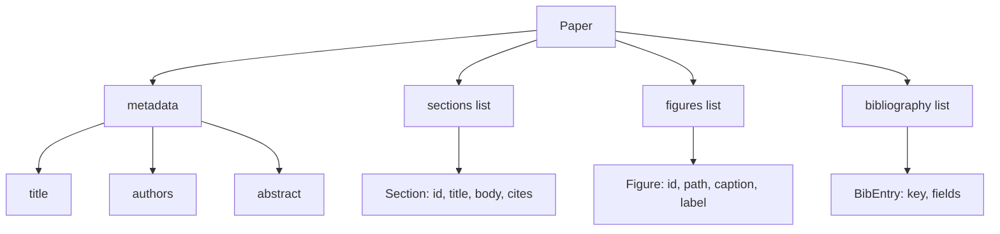
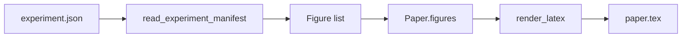
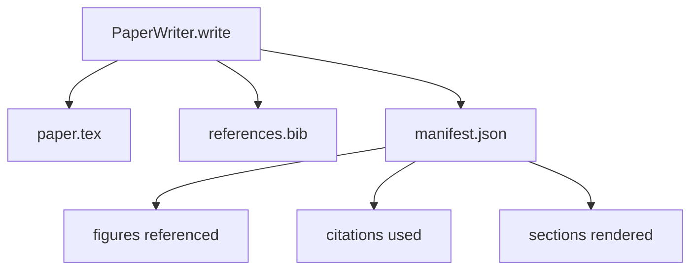

# Escritor de papel

> Um esqueleto LaTeX é um contrato entre o pesquisador e o tipógrafo. Se o contrato for quebrado, o documento não é compilado e a falha é alta.

**Type:** Build
**Languages:** Python
**Prerequisites:** Phase 19 lessons 50-53
**Time:** ~90 minutes

## Objetivos de aprendizagem

- Trate um artigo de investigação como um artefato estruturado com um gráfico de secção conhecido, não como um documento de forma livre.
- Gerar um esqueleto LaTeX que declara o seu resumo, seções, espaços de figuras e chaves bibliográficas antes de qualquer prosa ser escrita.
- Injectar figuras de saídas de experimentação (caminhos e legendas) no esqueleto através de um mecanismo de slot determinista.
- Enfiar um gerador de prosa simulado que enche cada seção de um contorno estruturado para que o arame seja testável sem um modelo.
- Emite um único .`paper.tex`+ um `references.bib`Mais um manifesto que enumera todas as figuras referenciadas e todas as citações usadas.

```figure
ch-paper-skeleton
```

## Por que um esqueleto primeiro

Uma proa que começa como prosa acumula dívidas estruturais. A introdução aumenta três parágrafos que devem estar em trabalhos relacionados. Uma figura é referenciada antes de ser definida. A bibliografia termina com três chaves para o mesmo artigo. Quando o autor percebe, o custo de reescritura é maior do que o custo de escrita.

Um esqueleto inverte isso. A estrutura é declarada como dados. Seções são vagas com nomes e ordem. Os números são slots com identidades e legendas. As chaves bibliográficas são declaradas no topo com as entradas que apontam. A prosa é gerada nessas vagas uma a uma. O arnes pode validar, antes de qualquer prosa ser escrita, que cada figura tem um espaço, cada citação tem uma entrada, e cada seção aparece na tabela de conteúdo.

Esta é a mesma disciplina que as lições anteriores aplicaram aos planos, ferramentas e traços.

## A forma do papel



Cada campo é simples dados Python. O renderizado é uma função pura de `Paper`O arnes pode observar o papel antes de render: contar seções, listar arquivos de figuras faltantes, verificar que cada `\cite{key}`Tem um correspondente .`BibEntry`- Não .

## O contrato de renderização

O renderizado garante três propriedades.`\begin{figure}`Bloco com um rótulo estável do formulário `fig:<id>`Segundo, cada secção emite um`\section{}`com um rótulo estável do formulário `sec:<id>`A primeira é a de que a bibliografia é um elemento de referência.`\bibliography`Bloco cujo `references.bib`Conta exatamente as entradas declaradas no papel, nem mais nem menos.

O esqueleto é o contrato; um render que silenciosamente cai uma figura é uma ruptura do contrato.

## Injecção de figuras de experiências

As lições anteriores nesta faixa produziram resultados experimentais como manifestações JSON. Cada manifesto carrega uma lista de artefatos com caminhos e legendas curtas.`Figure`- Os registos.



A injeção é determinista. Os ids da figura são derivados do nome do experimento mais um contador monótono. As legendas vêm do manifesto. Os caminhos são normalizados em relação ao diretório de saída do papel para que o LaTeX compile mesmo quando as saídas do experimento estão em outro lugar no disco.

## O generador de prosa ridicularizado

A lição não chama um modelo.`MockProseGenerator`O gerador de dados é um gerador de dados que pode ser usado para criar uma linha de texto que é uma linha curta por seção.

A aplicação real substituiria o gerador por um modelo de chamada. O arame ao seu redor não muda. Esse é o valor de declarar o gerador de prosa como um chamado: o teste substitui um determinista, a produção substitui um modelo, o resto do pipeline é idêntico.

## A saída manifesto

O escritor emite três arquivos para o diretório de saída.



O manifesto é o que um avaliador ou ciclo crítico de baixa corrente lê. Ele não analisa o LaTeX; ele lê o manifesto. A próxima lição, o ciclo crítico, toma este manifesto como entrada e produz uma lista de feedback. É por isso que o manifesto faz parte do contrato e o LaTeX não.

## Portas de validação

O escritor corre quatro portas antes de escrever qualquer arquivo.

1. Cada identificação é única dentro do papel.
2. Todas as secções são.`cites`Referências de campo a uma chave bibliográfica que é declarada no papel.
3. O abstracto não é vazio.
4. O título não está vazio.

Um portão falhado sobe .`PaperValidationError`O arnes aparece a razão como o modo de falha. Não há escrita parcial: ou os três arquivos são emitidos, ou nenhum.

## Como ler o código

`code/main.py`define`Paper`- Não .`Section`- Não .`Figure`- Não .`BibEntry`- Não .`PaperValidationError`- Não .`MockProseGenerator`- Não .`PaperWriter`, e um `render_latex`Função.`write`O método toma um diretório de saída e emite `paper.tex`- Não .`references.bib`, e `manifest.json`- O .`read_experiment_manifest`O assistente converte uma lista de manifestos de experimento em `Figure`- Os registos.

`code/tests/test_paper_writer.py`Cobertas: renderização de esqueleto sem secções, renderização completa com duas secções e duas figuras, porta de citação faltante, porta de identificação de figura duplicada, conteúdo manifesto e contrato de cadeia LaTeX (cada seção emite um `\section{}`, cada figura emite um`\begin{figure}`)).

## Vai mais longe

Dois extensões que uma implementação real vai precisar. Primeiro, multi-format render: o mesmo `Paper`O form compil para Markdown para postagens de blog e HTML para visualizações.`Paper`. Segundo, enriquecimento de citações: o escritor obtém entradas BibTeX de uma chave de citação, dada uma cache local de DOIs. Ambos podem ser adicionados sem tocar o contrato esqueleto.

O esqueleto é a aposta. Seções, figuras e citações declaradas como dados, prosa gerada em slots, manifesto emitido ao lado do LaTeX.
