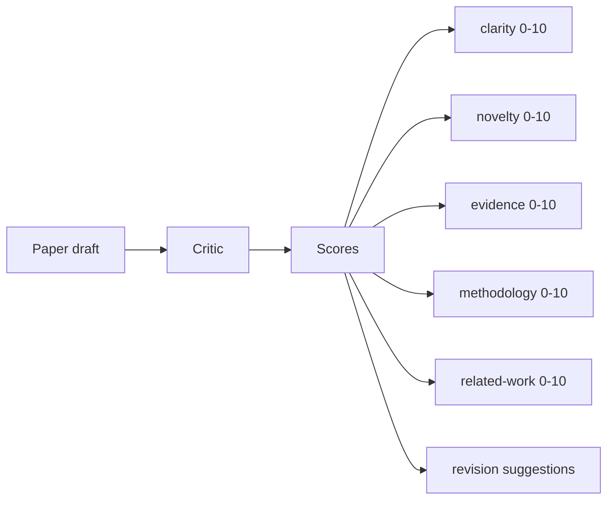
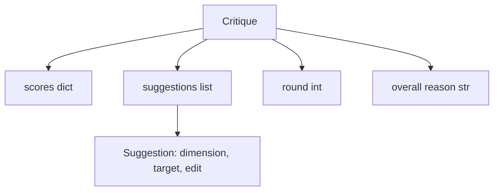
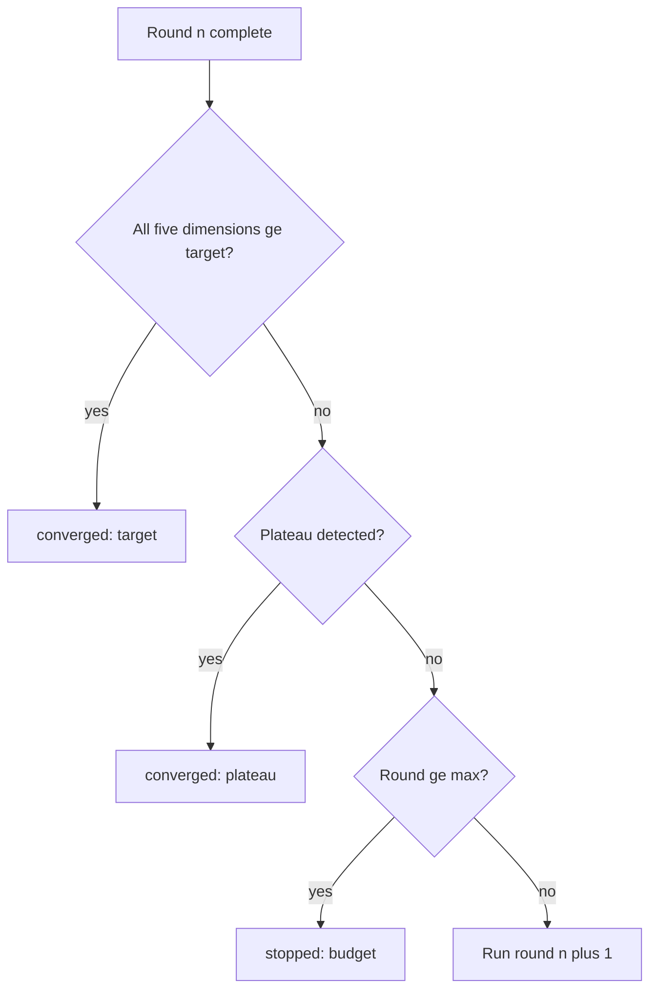
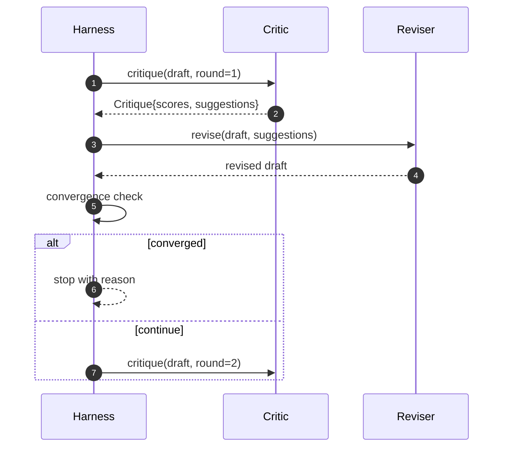

# Loop crítico

> Um crítico que retorna "parece bom" a primeira vez é quebrado. Um crítico que sempre retorna "necessita de trabalho" é quebrado. O crítico interessante é aquele que converge, e você tem que criar convergência.

**Type:** Build
**Languages:** Python
**Prerequisites:** Phase 19 lessons 50-53
**Time:** ~90 minutes

## Objetivos de aprendizagem

- Escolher um esboço de papel em cinco dimensões fixas: clareza, novidade, evidência, metodologia, trabalho relacionado.
- Aplique a crítica de cada rodada como uma revisão estruturada diferente em vez de uma reescritura de forma livre.
- Detectar a convergência comparando as pontuações entre rodadas; parar no planalto, atingir o objetivo ou orçamento esgotado.
- O Cap rodea com um orçamento de maior iteratividade, de modo que um crítico não convergente não corre para sempre.
- Emite um rastro por rodada para que o painel ou a próxima etapa possa representar a trajetória da pontuação.

```figure
ch-critic-converge
```

## Por que cinco dimensões fixas

Um crítico de forma livre é um modelo que retorna um parágrafo de sugestões. A revisão da próxima rodada trata o parágrafo como contexto ambiental.

Cinco dimensões dão ao arnes um contrato.



A pontuação é um vetor. O arnes observa cada dimensão através de rodadas. Uma revisão que aumenta a clareza, mas reserva evidências é uma regressão sobre a evidência, e a verificação de convergência vê. Um crítico apenas modelo não pode oferecer essa garantia.

## A forma da crítica



Cada sugestão tem a dimensão que melhora, a secção que visa e um`edit`A lição envia um revisor determinista que interpreta a instrução de edição como uma operação de apêndice a seção. Um revisor orientado por modelo interpretaria o mesmo campo como um prompt. O contrato não muda.

## Regras de convergência, em ordem

O ciclo crítico termina quando uma das três condições dispara.



O objectivo é o caso mais rigoroso: cada uma das cinco dimensões (claridade, novidade, evidência, metodologia, trabalho relacionado) deve ser atingida `>= target_score`(default `8.0`O resultado é um resultado positivo, mas não é suficiente uma média elevada com uma dimensão fraca.`plateau_epsilon`(default `0.1`) para duas rodadas consecutivas, o ciclo sai com `plateau`O orçamento é um limite máximo de rodadas (default `5`) e sai com `budget`- Não .

A ordem importa. O alvo vence o planalto vence o orçamento. Se a terceira rodada atinge o alvo na mesma iteração que também desencadearia um planalto, o resultado é `target`Não , não .`plateau`- Não .

## Por que a detecção de planalto corre por duas rondas

Um plano de plano único é ruído. Um crítico real retorna uma pontuação ligeiramente diferente a cada iteração mesmo em um rascunho fixo, porque a pontuação determinista ainda depende de quais sugestões foram aplicadas e em que ordem.

## O crítico determinista nesta lição

A lição não chama um modelo. O crítico enviado é um convocador que marca um esboço com base em três sinais: comprimento médio do corpo da seção (claridade), contagem de figuras e contagem de citações (evidência), e um`originality_tag`O revisor sabe como empurrar cada pontuação para cima.

```text
clarity      grows when the average section body length increases
novelty      grows when originality_tag is set to "high"
evidence     grows when a section's figure_refs is non-empty
methodology  grows when a section titled "Method" exists with body
related-work grows when a section titled "Related Work" exists with body
```

O revisor interpreta cada sugestão como um apêndice direcionado. Após a primeira rodada, o arnes pode observar a pontuação subindo. Os testes usam esta propriedade para afirmar que o loop reduz a lacuna.

## O contrato de ciclo completo



O arneso possui o contador redondo, o rastreamento e o controle de convergência. O crítico possui a pontuação. O revisor possui a diferença. Nenhum dos três toca o estado dos outros.

## A saída de Trace

Cada rodada emite um evento de rastreamento com o número de rodada, o vetor de pontuação, a contagem da sugestão e o veredicto de convergência. O rastreamento completo é devolvido ao lado do esboço final. Um painel de controle para baixo pode render o gráfico de pontuação por rodada. A próxima lição, o cronógrafo de iteração, lê o rastreamento para decidir se vale a pena manter o ramo.

## Orçamentos que protegem contra maus críticos

Um crítico que produz sugestões que nunca melhorem a pontuação irá bloquear o ciclo no teto da máxima iteração.`budget`O usuário lê que como um erro crítico, não um erro de rascunho. A alternativa, que aparece apenas no rascunho final, esconde o diagnóstico.

## Como ler o código

`code/main.py`define`Critique`- Não .`Suggestion`- Não .`Critic`Protocolo,`Reviser`Protocolo,`CriticLoop`, e um `make_deterministic_critic_pair`A fábrica que retorna o crítico determinista e um revisor correspondente.`Paper`forma é incluída para que a lição se mantenha sozinha.

`code/tests/test_critic_loop.py`Os pontos de referência são: melhoria monótona após a primeira rodada, convergência de alvos numa versão sintonizada, detecção de planalto após duas rodadas planas, exaustão do orçamento quando não se melhora nenhuma sugestão, aplicação de sugestões pelo revisor e forma de rastreamento.

## Vai mais longe

O estudo de convergência torna-se uma média ponderada. Em segundo lugar, os críticos emparelhados: um crítico marca, um segundo crítico julga as sugestões antes que o revisor as veja. Ambos acrescentam valor, ambos compõem sobre o mesmo.`Critique`- Forma.

A aposta é o vector de pontuação. Uma vez que a crítica é estruturada, todas as outras melhorias, regra de convergência, painel de instrumentos, crítico emparelhado, caem sem mudar o ciclo.
