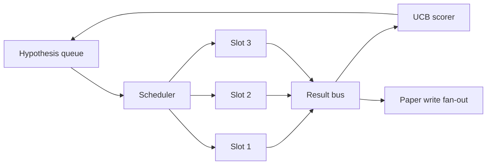
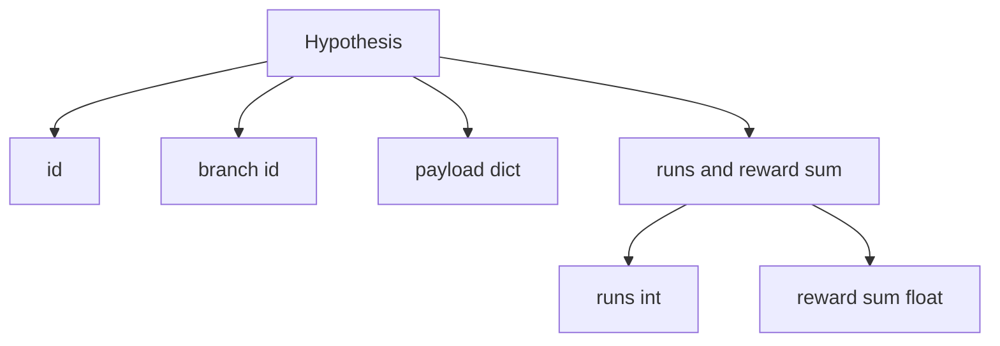
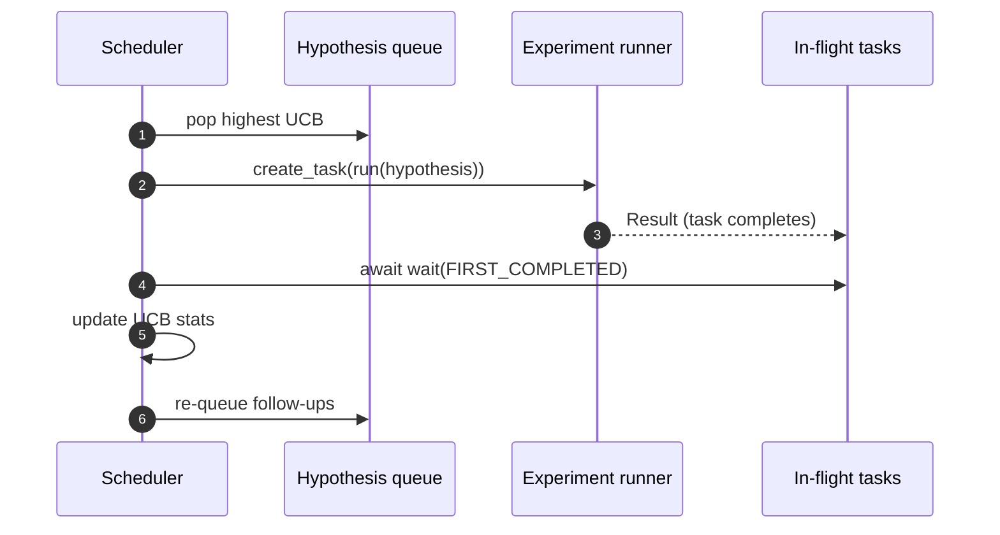

# Programação de Iteração

> Um ciclo de pesquisa sem um cronógrafo é uma fila com delírios. O cronógrafo é onde o ciclo decide o que parar de explorar, e essa decisão é todo o jogo.

**Type:** Build
**Languages:** Python
**Prerequisites:** Phase 19 lessons 50-53
**Time:** ~90 minutes

## Objetivos de aprendizagem

- Modela um fluxo de trabalho de pesquisa como uma fila de hipóteses alimentando espaços paralelas de experimentação cujos resultados se voltam a dar.
- Execute múltiplos experimentos simultaneamente com asyncio para que o programador possa manter todos os slots ocupados.
- Marque cada ramo da hipótese com a UCB para que o programador possa podar ramos de baixo rendimento sem abandonar a exploração.
- Espalhe os resultados acabados para uma fase de escrita em papel e uma fase de re-fileira para que uma filial de alto rendimento produz hipóteses de acompanhamento.
- Superficie um rastro de per-iteration com pontuações de ramificação, ocupação de espaços e decisões de poda.

```figure
ch-ucb-scheduler
```

## Por que um cronógrafo, não uma lista de trabalho

Uma lista de trabalho plana executa trabalhos em ordem de apresentação. Isso é bom quando cada trabalho é independente. A pesquisa não é independente: uma descoberta do experimento três muda a prioridade dos experimentos quatro e cinco. Um cronista que lê o resultado fan-in e reordena a fila obtém mais trabalho útil feito por unidade de computação.

A escolha interessante é a regra de pontuação. Um pontiagista ganancioso sempre escolhe o líder atual e nunca explora. Um pontiagista uniforme nunca explora. UCB (limite de confiança superior) é o caminho médio: explore o líder reservando capacidade para ramos que foram menos testados.

## Forma do sistema



A fila contém hipóteses. O cronista escolhe a hipótese UCB mais alta quando um slot se libera. Cada slot executa um experimento assíncrono. Experimentos concluídos fan seu resultado no ônibus. O ônibus atualiza as estatísticas UCB sobre o ramo originário e os fãs para o estágio de escrita em papel quando o rendimento de um ramo cruza um limiar.

## A forma da hipótese



`branch`O estudo de uma área de estudo em que a análise de dados de um estudo de um estudo de um estudo de um estudo de um estudo de um estudo de um estudo de um estudo de um estudo de um estudo de um estudo de um estudo de um estudo de um estudo de um estudo de um estudo de um estudo de um estudo de um estudo de um estudo de um estudo de um estudo de um estudo de um estudo de um estudo de um estudo de um estudo de um estudo de um estudo de um estudo de um estudo de um estudo de um estudo de um estudo de um estudo de um estudo de um estudo de um estudo de um estudo de um estudo de um estudo de um estudo de um estudo de um estudo de um estudo de um estudo de um estudo de um estudo de um estudo de um estudo de um estudo de um estudo de um estudo de um estudo de um estudo de um estudo de um estudo de um estudo de um estudo de um estudo de um estudo de um estudo de um estudo de um estudo de um estudo de um estudo de um estudo de um estudo de um estudo de um estudo de um estudo de um estudo de um estudo de um estudo de um estudo de um estudo de um estudo de um estudo de um estudo de um estudo de um estudo de um estudo de um estudo de um estudo de um estudo de um estudo de um estudo de um estudo de um estudo de um estudo de um estudo de um estudo de um estudo de um estudo de um estudo de um estudo de um estudo de um estudo de um estudo de um estudo de um estudo de um estudo de um estudo de um estudo de um estudo de um estudo de um estudo de um estudo de um estudo de um estudo de um estudo de um estudo de um estudo de um estudo de um estudo de um estudo de um estudo de um estudo de um estudo de um estudo de um estudo de um estudo de um estudo de um estudo de um estudo de um estudo de um estudo de um estudo de um estudo de um estudo de um estudo de um estudo de um estudo de um estudo de um estudo de um estudo de um estudo de um estudo de um estudo de um estudo de um estudo de um estudo de um estudo de um estudo de um estudo de um dos dos dos dos dos dos dos dos dos dos dos ciências de um dos ciências de um dos ciências de um dos ciências de um dos ciências de um dos ciências de um estudo de um estudo de um estudo de um estudo de um estudo de um estudo de um estudo de`runs`é o número de experimentos concluídos para esse ramo,`reward_sum`O UCB lê ambas as coisas.

## Ponto de pontuação da UCB

A fórmula UCB usada nesta lição é a clássica UCB1.

```text
ucb(branch) = mean_reward(branch) + c * sqrt( ln(total_runs) / runs(branch) )
```

`total_runs`é o número de todos os experimentos realizados em todos os ramos. `c`é o peso da exploração; a lição é por defeito para `sqrt(2)`Um ramo com zero corridas ganha .`+inf`Assim, os ramos não testados são sempre programados primeiro. Um ramos com alta média de recompensa mantém uma pontuação alta até que outros ramos se aproximem; um ramos que funciona muitas vezes sem muita recompensa é eclipsado por alternativas menos executadas.

O portão de poda é separado do selector.`0.2`) pelo menos depois de `prune_after_runs`Ensaios (default `3`Isso mantém a fila limitada.

## Fragmentos paralelas com asíncio

O programador realiza experimentos com `asyncio.create_task`Cada tarefa é executada pelo executor do experimento (um`async def`(callable) que retorna um `Result`O ciclo principal espera no conjunto de tarefas de voo com `asyncio.wait(..., return_when=asyncio.FIRST_COMPLETED)`e dispara a atualização de pontuação em cada conclusão.



Três slots executam simultaneamente. O loop principal nunca bloqueia um único experimento. O programador continua a iniciar novas tarefas assim que um slot se liberta, até que a fila esteja vazia e nenhuma tarefa esteja em voo.

## Dispersão: desencadeadores de papel

Quando a recompensa média de um ramo cruza`paper_threshold`(default `0.7`) e essa filial ainda não produziu um documento, o cronógrafo apoia uma `paper.trigger`O desencadeador é capturado como uma lista para que os testes possam afirmar.

## Propagação: hipóteses de acompanhamento

Quando um resultado de alto rendimento atinge, o programador pode chamar o fornecido pelo usuário `expander`O expansor é uma função pura de `Result`- Não .`list[Hypothesis]`A lição envia um expansor determinista que produz dois seguimentos para qualquer resultado cuja recompensa exceda o limiar de papel.

## Orçamentos

Dois orçamentos protegem o programador de loopes fugitivos.

```text
max_experiments    : total count of experiments run across all branches
max_seconds        : wall-clock cap (asyncio time)
```

Quando um ou outro incide, o programador deixa de programar novas tarefas, aguarda as de voo e retorna o rastro final.`stop_reason`- Não .

## O relatório de rastreamento e o relatório final

Cada decisão de agendamento (pick, dispatch, result, prune, fan-out) emite um evento. O relatório final resume estatísticas por ramo, total de corridas, total de relógio de parede e os gatilhos de papel disparados. A próxima lição, a demonstração de ponta a ponta, lê este relatório para impulsionar o escritor de papel.

## Como ler o código

`code/main.py`define`Hypothesis`- Não .`Result`- Não .`BranchStats`- Não .`IterationScheduler`, e um `make_deterministic_runner`A fábrica que retorna um corredor de experimento assíncio com recompensas previsíveis.`delay_ms`(default `5ms`) para que a concurrença seja observável.

`code/tests/test_scheduler.py`Coberturas: O UCB seleciona primeiro os ramos não testados, ocupação de slots paralelas, desencadeia o papel quando o limiar é cruzado, poda de ramos após ensaios de baixo rendimento, hipóteses de acompanhamento de ventilação e saída do orçamento (contagem de experimento e relógio de parede).

## Vai mais longe

Três extensões serão necessárias para uma real implementação. Primeiro, estatísticas persistentes do UCB em todas as sessões: as estatísticas atuais vivem na memória; um cronista real as verificaria para que um reinicio preservasse o orçamento de exploração já gasto. Em segundo lugar, pontuação multi-objetiva: em vez de uma recompensa escalar, cada resultado emite um vetor e UCB torna-se um selecionador de estilo Pareto. Terceiro, bandidos contextuais: as condições de escolha sobre características da hipótese (longoura, complexidade) por isso hipóteses semelhantes compartilham exploração.

O cronógrafo é o lugar onde a pesquisa se torna mais do que uma lista de trabalho.
