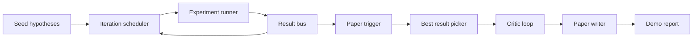
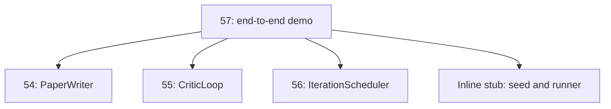
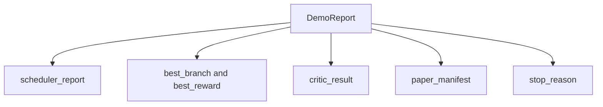

# Demo de pesquisa de ponta a ponta

> Uma demonstração é o lugar onde todos os contratos que escreveu antes têm de ser compostos.

**Type:** Build
**Languages:** Python
**Prerequisites:** Phase 19 lessons 50-53
**Time:** ~90 minutes

## Objetivos de aprendizagem

- Cable o ciclo de auto-investigação de ponta a ponta: semente de hipótese, experimentador, cronista, ciclo crítico, escritor de papel.
- Compõem as primitivas das quatro lições anteriores do Track D através de importações simples do Python, não de uma estrutura.
- Execute o ciclo para um fim auto-terminador e emite um único relatório de demonstração que lista a saída de cada etapa.
- Mantenha a demonstração determinista para que o conjunto de teste possa afirmar a forma final.
- Superficie um modo de falha claro quando o contrato de qualquer estágio rompe, para que a próxima etapa não seja executada com uma entrada quebrada.

```figure
ch-research-pipeline
```

## O que compõe aqui



O cronógrafo realiza seis experimentos em três espaços paralelos. O bus relata um ou mais desencadeadores de papel. O selecionador seleciona o melhor resultado. O ciclo crítico retrata um esboço construído a partir desse resultado. O escritor do papel emite o final LaTeX, BibTeX e manifesto.

## Por que importar, não copiar

Cada aula anterior envia um `main.py`A demonstração importa-los ajustando os dados de um grupo de dados.`sys.path`Não é um sistema de fixação de estrutura, mas é o mesmo que importa os arquivos de teste já utilizados nas aulas anteriores.



O estúdio de linha intercalar representa as lições de cinquenta a cinquenta e três: um pequeno gerador de hipóteses de sementes e uma função de recompensa sincrônica.

## Garantias de determinismo

A demonstração é determinista por construção. O experimentador é sementeado numpy. O revisor do loop crítico percorre dimensões fixas em ordem fixa. O gerador de prosa do escritor de papel é o ridicularizado da lição cinquenta e quatro. O selector UCB do cronista quebra laços na ordem de iteração, não escolha aleatória.

Dado a mesma semente, a demonstração emite o mesmo relatório. O teste afirma esta propriedade executando a demonstração duas vezes e comparando o manifesto.

## Forma do relatório de demonstração



Cada campo vem literalmente do estágio upstream. A demonstração não transforma nenhuma saída; compõe-as. É o teste que a demonstração é.

## Manutenção do modo de falha

Cada etapa é bem sucedida ou produz um erro de digitação.

```text
Scheduler ........ returns SchedulerReport with stop_reason
                   in {queue_empty, max_experiments, deadline}
Best-result pick . raises NoTriggerError if no paper trigger fired
Critic loop ...... returns LoopResult with status converged or stopped
Paper writer ..... raises PaperValidationError on contract break
```

Uma falha em qualquer estágio abrevia a demonstração com uma exceção digitada.`test_no_triggers_raises_typed_error`E ...`test_best_picker_raises_when_no_triggers`Acerta que o selector aumenta `NoTriggerError`- Não .`BestResultError`Quando nenhum ramo disparou um gatilho, e o escritor nunca é invocado.

## O melhor escolhedor de resultados

O cronógrafo emite desencadeadores de papel por ramo. O selecionador seleciona o ramo com a recompensa média mais alta em todos os desencadeadores. As ligações se quebram alfabeticamente por id do ramo, então a demonstração é determinista. O selecionador é uma pequena função pura; os testes o colocam em um relatório de cronógrafo fixo.

## Cablear o circuito crítico

O ciclo crítico na lição 55 opera em um `MiniPaper`A demonstração constrói um`MiniPaper`do ramo escolhido, preenchendo o resumo com o id do ramo, sementeando duas seções (Introdução e Resultados), e definindo `originality_tag`da remuneração média do ramo (alto se `>= 0.8`, média se `>= 0.6`- Baixo , caso contrário).

O revisor então retrata o esboço para convergência.

## A transferir o papel

O escritor de papel na lição 54 opera no total .`Paper`A demonstração de forma com figuras e bibliografia.`MiniPaper`por via `mini_to_full_paper`O documento, que anexa uma figura para o ramo selecionado e uma pequena bibliografia sintética construída a partir da união de chaves de citação sugerida pelo crítico.

## Como ler o código

`code/main.py`define`BestResultError`- Não .`NoTriggerError`- Não .`DemoReport`- Não .`pick_best_branch`- Não .`build_mini_paper`- Não .`mini_to_full_paper`, e `run_demo`- As importações no ajustamento máximo`sys.path`Uma vez e puxa .`PaperWriter`- Não .`CriticLoop`, e `IterationScheduler`das suas lições.

`code/tests/test_e2e.py`Coberturas: demonstrações executadas de ponta a ponta e emitem um relatório com todos os cinco campos preenchidos, determinismo em duas corridas, NoTriggerError quando nenhum ramo atravessa o limiar, PaperValidationError quando o contrato do escritor rompe, manifesto de papel contém a figura do ramo escolhido e o motivo de parada do cronista é um dos valores esperados.

## Vai mais longe

Três extensões que vale a pena cablar quando a demonstração estiver verde. Primeiro, estado persistente: o resultado de cada etapa é escrito para um pequeno armazém JSON para que uma reinicialização possa ser retomada sem re-exercer as etapas baratas. Em segundo lugar, um painel de instrumentos: os eventos de rastreamento do cronograma e do ciclo crítico são renderizados como uma única linha do tempo. Em terceiro lugar, chamadas de modelo reais: troque o gerador de prosa ridicularizado e o crítico determinista por modelos orientados; o cablagem não muda.

A demonstração tem como objetivo provar que a composição é a arquitetura. Cinco lições, quatro importações, um relatório.
