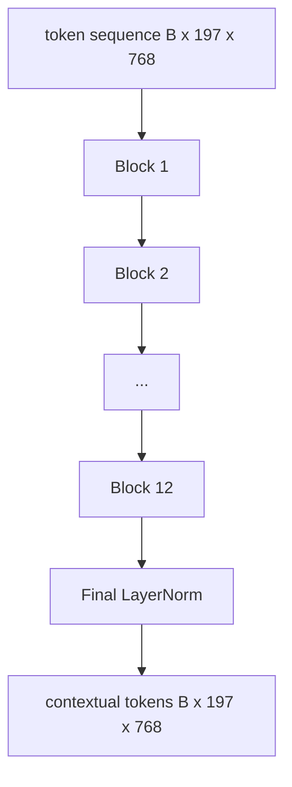
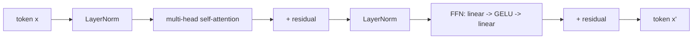

# Encoder de Transformador de Visão

> Os patches sozinhos não veem. Um transformador pré-LN de 12 camadas com 12 cabeças de atenção transforma a sequência de tokens de patch em uma sequência de tokens contextuais, com o token CLS reunindo recursos de imagem inteira em seu estado oculto final. Esta lição é a sala de máquinas de todos os modelos modernos de linguagem de visão.

**Type:** Build
**Languages:** Python
**Prerequisites:** Phase 19 lessons 30-37 (Track B foundations)
**Time:** ~90 minutes

## Objetivos de aprendizagem

- Implementar um bloco de transformador pré-LN com auto-atenção de várias cabeças e uma subcamada de alimentação.
- Apila 12 blocos com 12 cabeças para formar um codificador ViT-Base.
- Enfiar o lado da frente do patch da lição 58 no codificador e executar uma passagem para a frente.
- Verifique se o token CLS agrega informações de cada parche.

## O problema

A incorporação do patch produz uma sequência de 197 tokens, cada um um um vetor sem consciência de qualquer outro patch. Uma foto de gato precisa de cada parche para saber quais parches contêm bigodes, quais contêm fundo e quais contêm o olho. O transformador é o mecanismo que cria essa consciência, uma camada de atenção por vez. Sem ele, o front end do patch é um tokenizador inteligente sem compreensão.

A receita padrão é de 12 blocos de profundidade, 12 cabeças de largura, com colocação pré-LayerNorm, ativação GELU e expansão de 4x. Essa receita é a coluna vertebral do CLIP ViT-L, SigLIP, DINOv2, a família Qwen-VL, InternVL, e todos os outros codificadores de visão de peso aberto de 2025-2026. A receita é suficientemente estável para que você possa ler qualquer um desses artigos e assumir a forma do bloco, a menos que eles digam explicitamente o contrário.

## O conceito





### Pre-LN vs. pós-LN

O Transformer original colocou LayerNorm após o residual. O Pre-LN (LayerNorm antes de cada sub-camada) é a versão que todos os modelos modernos de linguagem de visão usam, porque treina de forma estável sem truques de aquecimento de taxa de aprendizagem. A diferença é uma linha no passe para frente, e o fluxo de gradiente na profundidade 12+ é noite e dia.

### Autoatentação múltipla

Cada cabeça projeta o vetor simbólico para o seu próprio `(query, key, value)`Triplo com dimensão `head_dim = hidden / num_heads`- Com o`hidden = 768`E ...`heads = 12`, cada cabeça tem`dim = 64`. As 12 cabeças assistem em paralelo, então suas saídas se concatenam de volta à dimensão 768 e passam através de uma projeção de saída.

### Por que a expansão de 4x de alimentação

O FFN vai`hidden -> 4 * hidden -> hidden`O fator 4 é empírico e tem sido mantido em transformadores de linguagem e visão desde 2017. menor (2x) sub-ajustes; maior (8x) excessos em orçamento fixo de dados.

| Component | Parameters at ViT-Base scale |
|-----------|------------------------------|
| qkv projection per block | `3 * 768 * 768 = 1.77M` |
| output projection per block | `768 * 768 = 590K` |
| FFN per block (4x expansion) | `2 * 768 * 4 * 768 = 4.72M` |
| LayerNorm per block | `4 * 768 = 3K` |
| Total per block | about 7.1M |
| 12 blocks | about 85M |
| Plus front end | about 86M total |

O ViT-Base é um codificador de 86M. Isso é pequeno para os padrões de 2026 (SigLIP-So400M é 400M, o Qwen-VL ViT é 675M), mas a arquitetura é idêntica até a largura e profundidade.

### Mascara causal ou não?

Os transformadores de visão são apenas codificadores e bidirecionais: token `i`Pode participar de token `j`A atenção cruzada do lado do decodificador na lição 61 usará uma máscara causal, mas dentro do codificador de visão, a atenção está totalmente conectada.

### O que o token CLS aprende

O token CLS começa como um parâmetro aprendido, não tem conteúdo de patch próprio e acumula informações através da atenção em cada bloco.

```figure
ch-cls-funnel
```

## Construí-lo

`code/main.py`Implementos:

- `MultiHeadSelfAttention`, com `qkv`e projeções de saída, a matemática da atenção do produto em escala e as afirmações de forma.
- `FeedForward`, a GELU MLP de expansão 4x.
- `Block`, um bloco pré-LN que compõe as subcamadas de atenção e de alimentação com resíduos.
- `ViT`, uma pilha de 12 quarteirões com uma última LayerNorm.
- `VisionEncoder`, que fios `VisionFrontEnd`da lição 58 até a lição`ViT`empilhar e expõe um `forward()`Retorno da sequência contextual e do vetor CLS combinado.
- Uma demonstração que executa uma imagem de fixação 224x224 sintetizada através do codificador completo e imprime a forma de entrada, a forma de saída, a contagem de parâmetros e a norma CLS em cada outra camada.

- É o que é ?

```bash
python3 code/main.py
```

Output: o dispositivo é codificado em `(1, 197, 768)`A norma CLS desloca-se para cima à medida que as camadas se compõem, depois estabiliza-se na última camada.

## Usá-lo

O codificador definido aqui é, até a largura e profundidade, a mesma pilha de blocos que se envia dentro de cada VLM de peso aberto em 2025-2026.

- **Width and depth.**ViT-Large é`hidden=1024, depth=24, heads=16`; SigLIP So400M é `hidden=1152, depth=27, heads=16`- No mesmo quarteirão.
- **Pooling head.**A concentração de CLS (esta lição) vs media de concentração (SigLIP) vs atenção de concentração (mais tarde VLMs).
- **Position handling.**Fixa sinusoidal (leção 58) vs aprendido 1D vs ALiBi vs 2D RoPE.
- **Register tokens.**DINOv2 prepenetra 4 tokens extra aprendidos.

Esta pilha de blocos é o substrato. As próximas lições (60-63) estão em cima dela.

## Teste

`code/test_main.py`Cobertura:

- um único bloco preserva a forma e é invariante ao tamanho do lote de entrada
- pontuações de atenção somam a um ao longo do eixo chave (sanidade de mente de softmax)
- Os caminhos residuais são cablados (a entrada zero ainda produz saída não zero através do token CLS)
- Uma passagem empilhada para a frente de 4 camadas produz a forma certa
- fluxo de gradientes para a projeção do parche a partir da saída do CLS

- E depois ?

```bash
python3 -m unittest code/test_main.py
```

## Exercícios

1. Adicione tokens de registro (4 vetores aprendidos prependidos após CLS) e repete. Compare a suavidade do mapa de atenção através da entropia da distribuição softmax na última camada.

2. Substitui o pre-LN por o pós-LN e treine por uma época num classificador de forma sintética. Observe qual treina estável sem aquecimento LR.

3. Implementar o enmascaramento causal como um `attn_mask`O bloco pode ser reutilizado como um bloco de decodificação.`(seq, seq)`, triangular inferior.

4. Profila uma passagem para frente em tamanhos de lote 1, 8, 64 com `torch.profiler`A camada MLP domina o tempo das paredes, não a atenção.

5. Substitua as projeções de um cabeçalho de atenção por um adaptador LoRA de baixo nível, congele o resto e verifique que o gradiente só flui onde você espera.

## Termos-chave

| Term | What it means |
|------|---------------|
| Pre-LN | LayerNorm applied before each sub-layer instead of after |
| Self-attention | Each token attends to every other token in the same sequence |
| Multi-head | The hidden dim is split across `H` independent attention heads |
| FFN expansion | The feed-forward layer widens to `4 * hidden` before contracting |
| CLS pooling | Use the first token's final hidden state as the image summary |

## Mais leitura

- Uma imagem vale 16x16 palavras (ViT, 2021) para a receita do codificador.
- DINOv2 (2023) para tokens de registro e o objetivo de pré-formação auto-supervisionado.
- SigLIP (2023) para a variante média de pooling e a perda contrastiva sigmoide usada na lição 62.
