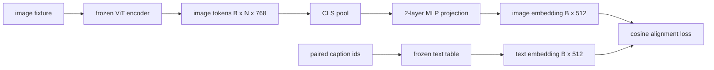

# Layer de projeção para o alinhamento de modalidade

> Um codificador de visão produz tokens de imagem. Um decodificador de texto consome tokens de texto. Os dois vivem em espaços vetoriais diferentes. Um pequeno MLP de duas camadas projeta tokens de imagem no espaço de inserção de texto, e uma perda de alinhamento cosínico contra uma legenda emparelhada atrai os dois espaços para o acordo. Essa projeção é a peça mais pequena de um modelo de linguagem de visão e a que mais importa para a transferência.

**Type:** Build
**Languages:** Python
**Prerequisites:** Phase 19 lessons 30-37 (Track B foundations)
**Time:** ~90 minutes

## Objetivos de aprendizagem

- Construir uma projeção de MLP de duas camadas que mapeia as características da imagem no espaço de inserção de texto.
- Construa uma tabela de inserção de texto simulada (sem tokenizer pré-treinado, sem corpus real).
- Calcule uma perda de alinhamento cosínico entre os tokens de imagem projetados e um incorporado de legenda emparelhado.
- Treinar a projeção sozinha com um codificador de visão congelado e uma tabela de texto congelada.

## O problema

Tem um codificador de visão (leções 58-59) que produz sinais de dimensão .`vision_hidden = 768`Tem um decodificador de texto que quer colocar com dimensão de inserção .`text_hidden = 512`Os tokens de imagem não são de forma textual: eles vivem em uma base que o codificador aprendeu durante o treinamento prévio apenas para visão, sem relação com os vetores de palavras do decodificador.

A projecção de dois camadas de MLP (linear, GELU, linear) faz pontes sobre a lacuna.`768 * 1024 + 1024 * 512 = 1.3M`O encodrador de visão permanece congelado. A tabela de incorporação de texto permanece congelada. Somente a projeção se move. Esta é a receita LLaVA enviada em 2023, que BLIP-2 reformulado como um Q-Former, e que cada VLM de peso aberto desde então adotou de alguma forma.

## O conceito



### Reunião antes da projeção

O codificador de visão emite 197 tokens. O lado de texto tem uma única incorporação de nível de legenda. Para alinhá-los você precisa de um vetor de nível de imagem por amostra. A aglomeração CLS é a mais simples: tire o primeiro token do codificador e projetá-lo. A aglomeração média em todos os 197 tokens é outra opção e é o que o SigLIP usa.

### Por que duas camadas e não uma?

Uma única projeção linear pode girar e reescalar, mas não pode fixar a base se os dois espaços tiverem desajustes de curvatura. O GELU entre duas camadas lineares dá à projeção uma curva não linear, que é empírica o suficiente para alinhar características de estilo CLIP com as incorporações de modelos de linguagem. Projeções mais profundas (LLaVA-NeXT usou GLU; Qwen-VL usou uma pilha de camadas de atenção) são extensões; MLP de duas camadas é a linha de base canônica e é o que as principais naves de projeção Q-Former do BLIP-2 têm sob o capô.

| Layer | Shape | Parameters |
|-------|-------|------------|
| fc1 | `(vision_hidden, projection_hidden)` | `768 * 1024 + 1024` |
| activation | GELU | 0 |
| fc2 | `(projection_hidden, text_hidden)` | `1024 * 512 + 512` |

Aproximadamente 1,3 M de parâmetros para um `768 -> 1024 -> 512`- Não.

### Perda de alinhamento de cosina

Align não significa `image_emb == text_emb`- Alignar significa`image_emb`Pontos na mesma direcção que `text_emb`A perda cosínica é`1 - cos_sim(image, text)`A lição 62 generaliza para um lote contrastante (InfoNCE) onde cada imagem deve ser mais próxima de sua própria legenda do que a qualquer outra legenda no lote; esta lição usa a versão por par para que a dinâmica seja visível.

### O codificador congelado é o truque.

O codificador de visão tem parâmetros de 86M. A tabela de texto tem outros milhões. Treinar todos eles a partir de um corpo falso é um não-iniciador. A congelação de ambos significa que os parâmetros de 1,3M da projeção são a única coisa que muda, e algumas centenas de passos em pares sintéticos são suficientes para reduzir a perda. Esta é exatamente a forma operacional de cada VLM baseado em adaptador: as peças pesadas permanecem congeladas, os trens de ponte leve.

```figure
ch-projection-bridge
```

## Construí-lo

`code/main.py`Implementos:

- `MLPProjector(in_dim, hidden_dim, out_dim)`, MLP linear de duas camadas com ativação GELU.
- `MockTextEmbedding(vocab_size, dim)`, uma tabela de incorporação congelada com determinista init de uma semente.
- `make_pair(seed, vocab_size)`As legendas são curtas sequências de id; a incorporação da legenda é combinada em média em em embutidos de tokens.
- `cosine_alignment_loss(image_emb, text_emb)`, o por par`1 - cos_sim`Objectivo.
- Um ciclo de treinamento que executa a projeção por 200 passos sobre 32 pares sintéticos (ciclados), com o codificador de visão e a tabela de texto congelados, e imprime a perda a cada 25 passos.

- É o que é ?

```bash
python3 code/main.py
```

Resultado: os relatórios de treinamento caem de perda inicial em torno de 1,07 para cerca de 0,80 dentro de 200 passos, demonstrando que a projeção sozinha pode puxar tokens de imagem para o espaço de texto.

## Usá-lo

O mesmo padrão aparece em todos os VLM de peso aberto:

- **LLaVA 1.5.**Projeção de MLP GELU de duas camadas de CLIP-ViT-L oculta em LLaMA incorporando dim. Encoder de visão congelado, LLM congelado, treinar apenas a projeção (em seguida, descongelar o LLM na segunda fase).
- **BLIP-2.**Q-Former toma 32 tokens de consulta aprendidos através da atenção cruzada contra tokens de imagem, em seguida, projetos para o LLM embutida dim.
- **MiniGPT-4.**Projeção linear única da saída BLIP-2 Q-Former para a dim de incorporação de Vicuna.
- **Qwen-VL.**Adaptador de atenção cruzada com várias camadas, mas a peça final é novamente uma projeção para o embedding LM dim.

A forma varia, mas o papel é idêntico: tokens de imagem de pool, projeto a texto incorporado dim, treinamento sozinho.

## Teste

`code/test_main.py`Cobertura:

- forma de saída do projector corresponde à configuração `out_dim`
- Tabela de inserção de texto congelado tem zero `requires_grad`Parâmetros
- A perda de cosino é zero em vetores idênticos e é 2 em vetores antiparalhelos
- fluxos de gradiente do projector após uma passagem para trás
- O ciclo de treinamento reduz as perdas entre a etapa 0 e a etapa 200

- E depois ?

```bash
python3 -m unittest code/test_main.py
```

## Exercícios

1. Substitua o pooling CLS com o pooling médio sobre os 196 tokens de patch e compare a perda final após 200 passos.

2. Adicionar uma temperatura escalar aprendida à perda de coseno (`cos / tau`) e observar o que acontece quando `tau`É demasiado pequeno (ruído gradiente) ou demasiado grande (alto nível de perda).

3. Troque a MLP de duas camadas por uma única camada linear e quantifique a lacuna de perda. A não-linearidade importa mais em características naturais da imagem e menos em sintéticas.

4. Adicione uma pequena penalidade L2 aos pesos do projetor e observe como ela interage com o alinhamento cosínico (o cosínio é invariante em escala, então a penalidade reduz principalmente as direções não utilizadas).

5. Pesos persistentes do projetor, em seguida, recarregando e executando inferência sem o codificador de visão passar para trás para verificar que apenas o projetor é necessário no momento da implantação.

## Termos-chave

| Term | What it means |
|------|---------------|
| Modality alignment | The act of making image and text embeddings comparable in one shared space |
| Projection head | The small module that maps one space to another, usually a 2-layer MLP |
| Cosine similarity | Dot product divided by the product of L2 norms |
| Frozen encoder | The vision (or text) model has all parameters with `requires_grad=False` |
| Mock corpus | Synthetic pairs used so training has no dataset download dependency |

## Mais leitura

- Papel LLaVA para o comboio de duas etapas (projeto, depois descongelamento de LM).
- Papel BLIP-2 para Q-Former como alternativa de projecção apropriada.
- Relatório técnico Qwen-VL para adaptadores de atenção cruzada como cabeças de projecção mais profundas.
