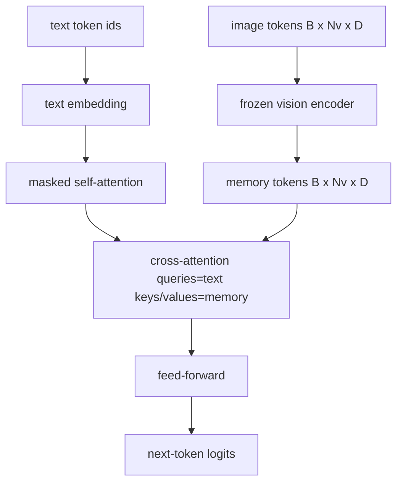
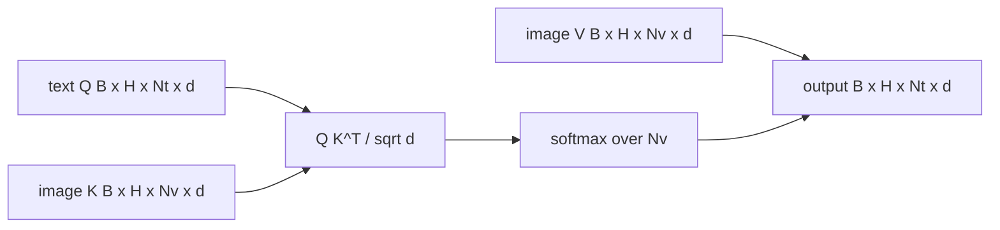

# Fusão de atenção cruzada

> A camada de projeção alinha um vetor de imagem com um vetor de legenda. Um verdadeiro decodificador de linguagem visual precisa de cada token de texto para atender a cada token de parche, para que o modelo possa aterrar cada palavra em uma região. A atenção cruzada é como acontece a aterragem. As perguntas do texto; as chaves de visão e os valores respondem. Esta lição cria o bloqueio de atenção cruzada, a auto-atenção do texto causal e as formas da máscara que mantêm ambos legais.

**Type:** Build
**Languages:** Python
**Prerequisites:** Phase 19 lessons 30-37 (Track B foundations)
**Time:** ~90 minutes

## Objetivos de aprendizagem

- Implementar a atenção cruzada de várias cabeças, onde o fluxo de consulta é texto e o fluxo de chave/valor é visão.
- Compõe um bloco de decodificação: auto-atenção causal + atenção transversal + feed-forward.
- Faça as formas certas da máscara: máscara causal para auto-atentação, sem máscara para atenção cruzada.
- Execute um pass para a frente com tokens de texto em lote e um conjunto fixo de tokens de imagem.

## O problema

Concatetando tokens de imagem e tokens de texto em uma sequência é uma opção de fusão (fusão inicial, o caminho Chameleon e Emu3 tomar). Atensão cruzada é a outra (fusão tardia, o caminho Flamingo introduzido e que cada decodificador em forma de Flamingo desde então copiou).

A fusão tardia tem duas vantagens. Primeiro, o fluxo de texto permanece limpo e o modelo preserva recursos apenas de texto. Segundo, o fluxo de imagem é calculado uma vez por imagem e reutilizado para cada passo de decodificação, de modo que a geração é barata mesmo para legendas longas. O custo é uma subcamada de atenção extra por bloco.

## O conceito





### Formas de máscara

As duas atenções dentro de um bloco de decodificação precisam de máscaras diferentes:

| Attention | Query length | Key length | Mask | Why |
|-----------|--------------|------------|------|-----|
| Self-attention | `Nt` (text) | `Nt` (text) | Causal: lower-triangular `(Nt, Nt)` | Text tokens may not look ahead during autoregression |
| Cross-attention | `Nt` (text) | `Nv` (vision) | No mask | The whole image is visible to every text position |

A lição inclui uma função de validação de forma para que o erro de misturar as superfícies apareça como um `ValueError`em vez de uma curva de perdas silenciosamente quebrada.

### Por que não há máscara na atenção transversal

A imagem é totalmente observada antes de qualquer texto ser gerado.`t`A versão original do Flamingo é uma versão de um sistema de imagem que pode ser usada para qualquer parte da imagem, mas não há ordem temporal em patches de imagem.

### Cachagem de chaves/valores

As chaves e valores da imagem são calculadas uma vez no início da decodificação e mantidas em um cache. Cada novo token de texto usa o cache sem recomputada. Isso é o que torna a subtítulos rápida na inferência: o ViT pesado é executado uma vez; a atenção cruzada reutiliza suas chaves e valores para cada passo. A lição expõe o cache e testa o caminho de cache-hit.

### Compostação de blocos

Um bloco de decodificador funciona: pré-LN -> auto-atenção -> residual -> pré-LN -> atenção cruzada -> residual -> pré-LN -> feed-forward -> residual. Três subcamadas, cada uma com sua própria LayerNorm. O papel Flamingo adicionou um portão aprendido sobre a atenção cruzada para que o modelo pudesse optar pela via de imagem ao custo de estabilidade no tempo de treinamento; a linha de base canônica (usada aqui) não tem portão.

```python
class DecoderBlock:
  def forward(self, text_tokens, image_tokens, text_mask, cross_mask):
      text_tokens = text_tokens + self.self_attn(self.ln1(text_tokens),
                                                 mask=text_mask)
      text_tokens = text_tokens + self.cross_attn(self.ln2(text_tokens),
                                                  image_tokens,
                                                  mask=cross_mask)
      text_tokens = text_tokens + self.ffn(self.ln3(text_tokens))
      return text_tokens
```

```figure
ch-crossattn-fan
```

## Construí-lo

`code/main.py`Implementos:

- `CrossAttention(hidden, heads)`, multi-head inter-attenção com separado `q`E ...`kv`- As projecções.
- `CausalSelfAttention(hidden, heads)`, a auto-atenção mascarada de um decodificador padrão.
- `DecoderBlock`, compondo as três subcamadas com resíduos pré-LN.
- `VisionLanguageDecoder`, um decodificador de quatro camadas alimentado por uma saída de codificador de visão simulada e uma pequena tabela de inserção de texto.
- `causal_mask(length)`Retorno de um `(length, length)`tensor booleano triangular inferior.
- Uma demonstração que alimenta um lote de duas sequências de texto de comprimento 10 com memória de imagem de comprimento 197 e imprime a forma de saída, a forma da máscara de auto-atenção e a norma de saída de atenção cruzada por posição.

- É o que é ?

```bash
python3 code/main.py
```

Output: o decodificador produz um `(2, 10, text_vocab)`O tensor de logite.`(10, 10)`A verificação de reutilização do KV-cache confirma logs idênticos entre os caminhos armazenados em cache e não armazenados em cache.

## Usá-lo

A atenção cruzada aparece em duas famílias de produção:

- **Flamingo and IDEFICS.**Insira uma subcamada de atenção cruzada em cada bloco de modelo de linguagem K, com um LM congelado. O adaptador de linguagem visual é o bloco de atenção cruzada mais seu portão.
- **BLIP-2.**O Q-Former usa a atenção cruzada de um conjunto fixo de 32 tokens de consulta para as características da imagem, e depois projeta as consultas no espaço de incorporação LM.

A forma do bloco nesta lição se faz diretamente em ambos. A disciplina da máscara (causa no eu, nenhuma na cruz) é a mesma.

## Teste

`code/test_main.py`Cobertura:

- Mascara causal é triangular inferior e coincide com a forma booleana esperada
- Forma de saída de atenção cruzada é `(B, Nt, hidden)`independentemente da comprimento da chave
- A rota de cache KV corresponde à rota não caçada com a tolerância à flutuação
- O desajuste de forma entre fluxos de texto e imagem gera uma clara `ValueError`
- uma passagem de decodificação completa para a frente produz a forma correta de lote e sequência

- E depois ?

```bash
python3 -m unittest code/test_main.py
```

## Exercícios

1. Adicione um portão tanh aprendido ao resíduo de atenção cruzada (o truque Flamingo) e verifique convergências de treinamento a partir de um portão inicial próximo a zero. O portão começa em 0; o modelo recupera o comportamento apenas de texto antes de misturar o fluxo de imagem.

2. Implementar atenção intercalada onde o mesmo decodificador consome várias imagens mais vários segmentos de texto. Construir a máscara de atenção cruzada por amostra que impede que o segmento de texto 2 atenda à imagem 1.

3. Profila a camada de atenção cruzada versus a auto-atenção em `Nt=64, Nv=576`O custo da atenção cruzada é `Nt * Nv`e domina em alta resolução de imagem.

4. Adicione um abandono do lado da consulta no mapa de atenção cruzada e mida a diversidade de legendas na demonstração (a variância da amostra de legendas aumenta com o abandono no mapa cruzado).

5. Troque a camada de atenção cruzada para um bloco de atenção de estilo Q-Former onde um conjunto fixo de consultas de 32 tokens atende às características da imagem uma vez por camada.

## Termos-chave

| Term | What it means |
|------|---------------|
| Late fusion | Text and vision stay in separate streams; cross-attention bridges them at every block |
| Cross-attention | Q comes from one stream, K and V from another |
| Causal mask | Lower-triangular boolean mask that prevents looking ahead during autoregression |
| KV cache | Image keys and values stored once and reused for every decode step |
| Memory tokens | The frozen image tokens that the decoder reaches into |

## Mais leitura

- Flamingo (2022) para o design canônico de fusão tardia com atenção cruzada fechada.
- BLIP-2 (2023) para o Q-Former, que é um bloco de atenção cruzada vestido como um pool de consultas aprendidas.
- IDEFICS (2023) para uma reprodução em peso aberto da receita do Flamingo.
