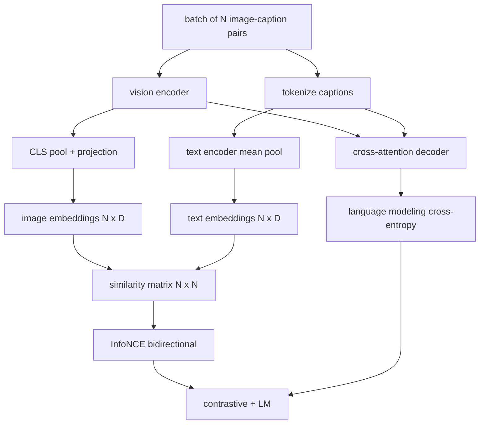

# Pre-treinamento da linguagem visual

> O codificador, a projeção e o decodificador são conectados. Agora treinem-nos juntos. Dois objetivos impulsionam a aprendizagem: uma perda de imagem-texto contrastante (InfoNCE) que puxa pares de correspondência juntos no espaço de inserção conjunta, e uma perda de modelagem de linguagem que pede ao decodificador que subtitule cada imagem. Combinados, eles ensinam a rede tanto para encontrar a imagem certa para uma legenda quanto para escrever uma legenda para a imagem.

**Type:** Build
**Languages:** Python
**Prerequisites:** Phase 19 lessons 30-37 (Track B foundations)
**Time:** ~90 minutes

## Objetivos de aprendizagem

- Implementar a perda de contraste InfoNCE em um lote de pares de imagem-capção.
- Compõem a perda contrastante com a perda de modelagem de linguagem autoregressiva.
- Sintetize um corpo de 200 pares de imagens simuladas sem download de conjuntos de dados reais.
- Execute um ciclo de treinamento demo de 50 passos e observe as perdas diminuindo.

## O problema

Um modelo de linguagem de visão precisa de duas habilidades. Ele deve classificar: dado uma legenda, encontrar a imagem certa entre muitas. Ele deve gerar: dada uma imagem, escrever uma legenda. Pretrainar o modelo em uma habilidade sozinho dá-lhe meio sistema. CLIP classificação pregada, mas não pode subtítulos. GPT-4V pode subtítulos, mas usa uma cabeça de recuperação separada para classificação. Pretrainamento multi-objetivo obtém ambos em uma passagem.

Para um lote de pares N, o modelo trata os pares N correspondentes como positivos e os pares `N^2 - N`par desatendidos como negativos, então corre uma perda de entropia cruzada sobre o resultado `(N, N)`Matriz de semelhança. A perda LM lida com a metade da geração: previsão padrão de next-token condicionada à imagem. Ambas as perdas são diferenciáveis e podem compartilhar o peso do codificador, do projetor e do decodificador.

## O conceito



### Informações sobre o INFONCE num único parágrafo

Aponte as inserções de imagem N como linhas e as inserções de texto N como linhas. L2-normalizar ambos.`N x N`Matriz `S = I T^T / tau`onde`tau`As entradas diagonais são os pares correspondentes; entradas fora de diagonal são negativas. Aplique entropia cruzada com o alvo `argmax`Descer a diagonal: linha `i`deve ter a sua entrada mais alta na coluna `i`Faça o mesmo simetricamente ao longo das colunas. O total é a média das duas. Isto é a perda CLIP em oito linhas.

### Temperatura importa

A temperatura .`tau`O nível de suavidade máxima é muito pequeno (por exemplo:`tau = 0.01`O CLIP aprende que a sua velocidade de transmissão é muito alta e que a sua velocidade de transmissão é muito alta.`tau`Como um parâmetro; a demonstração aqui faz o mesmo.

### Perda de modelagem de linguagem

O decodificador consome tokens de memória de imagem através da atenção cruzada e prevê o próximo token de texto em cada posição. A perda é a entropia cruzada padrão com o alvo da próxima posição.

### Combinação das perdas

`total = contrastive + lm_weight * lm`onde`lm_weight`O sistema de decodificação é um gradiente de perda de LM (muitas vezes 1.0).

| Component | Loss surface | Affects |
|-----------|--------------|---------|
| InfoNCE | Pair ranking in the joint space | Encoder + projection + text head |
| LM | Token prediction conditioned on image | Encoder + projection + decoder |
| Combined | Multi-task | Whole stack |

### Por que 50 passos é suficiente para uma demonstração

O corpo simulado é um conjunto sintético de 200 pares com imagens aleatórias e ids de legenda aleatórias. Após 50 passos SGD com tamanho de lote 16, ambas as perdas caem visível mesmo que os valores absolutos permaneçam acima do que um modelo de dados reais alcançaria.

```figure
ch-infonce-diagonal
```

## Construí-lo

`code/main.py`Implementos:

- `MultimodalModel`, combinando um pequeno codificador ViT, o projeto MLP, um pequeno codificador de lado de texto (pool médio sobre ids embutidos), e o decodificador de atenção cruzada da lição 61.
- `info_nce_loss(image_emb, text_emb, temperature)`, a perda de contraste bidirecional de tipo CLIP.
- `lm_loss(logits, target_ids, padding_id)`, mascarado next-token cross-entropy.
- `make_mock_corpus(seed, n_pairs)`, devolvendo 200 pares deterministas (imagem, capt_ids).
- Um ciclo de treinamento que corre 50 passos com tamanho de lote 16, otimizador Adam e um parâmetro de log-temperatura aprendido. Ambas as perdas são impressas a cada 5 passos.

- É o que é ?

```bash
python3 code/main.py
```

Output: perda contrastavelmente baixa de aproximadamente `ln(16) = 2.77`Para o 2,4; a perda de LM cai de uma linha de base aleatória uniforme de `ln(512) ≈ 6.24`Os modelos reais treinam por milhões de passos, a dinâmica é a mesma.

## Usá-lo

Esta é a mesma receita de perda que foi enviada:

- **CLIP (2021).**Apenas imagem-texto contrastante, com uma sonda de legenda congelada separada.
- **CoCa (2022).**O padrão exato que esta lição constrói.
- **BLIP (2022) and BLIP-2.**Contraste mais LM mais cabeça de correspondência de imagem e texto, três perdas combinadas.
- **SigLIP (2023).**Interface InfoNCE para uma perda de par sigmoide; mesmo papel contrastivo, forma funcional diferente.
- **LLaVA family.**O treinamento em duas etapas, onde o primeiro estágio é o alinhamento (cosina em um LM congelado) e o segundo estágio adiciona a perda de LM com um LM não congelado.

## Teste

`code/test_main.py`Cobertura:

- A perda de InfoNCE é simétrica em todas as linhas de imagem/texto
- A perda InfoNCE retorna 0 quando a matriz de semelhança é uma diagonal perfeita de grandes números positivos
- Perda de LM mascara corretamente as posições de enchimento
- O modelo de passagem avançada produz ambas as perdas sem erros
- O ciclo de treinamento em 5 etapas reduz a perda combinada

- E depois ?

```bash
python3 -m unittest code/test_main.py
```

## Exercícios

1. Substitua o InfoNCE por uma perda de pares sigmoides de estilo SigLIP e compare a convergência no corpo simulado.

2. Adicione um passo de mineração de hard-negativo: em cada outro lote, selecione o par de extra-diagonal mais duro do lote anterior e anexe-o. Treine e verifique se a perda de contraste cai mais rápido.

3. Adicione uma cabeça binária de imagem-texto correspondente na parte superior da incorporação conjunta (verdadeiro/falso: se essas coincidem?) para uma terceira perda, replicando a configuração de três cabeças do BLIP.

4. Substitua o corpo falso por sequências de identificação de legendas tiradas de uma cadeia de Markov cuja matriz de transição é condicionada ao hash de imagem.

5. Treinar o mesmo modelo com `lm_weight = 0`E outra vez com `lm_weight = 1`- Compare a perda contrasta; a perda de LM não deve regredir no objectivo de classificação.

## Termos-chave

| Term | What it means |
|------|---------------|
| InfoNCE | Noise contrastive estimation: cross-entropy on a similarity matrix |
| Temperature | Scalar that controls how peaked the contrastive softmax is |
| Hard negative | An off-diagonal pair the model finds confusing, useful for sampling |
| LM loss | Standard next-token cross-entropy on the captioning side |
| Joint embedding space | The shared space where image and text vectors live after projection |

## Mais leitura

- Papel de CLIP para a receita original.
- Papel de CoCa para contraste e subtítulos num modelo.
- Papel SigLIP para a variante de perda de pares sigmoides e por que se escala melhor.
