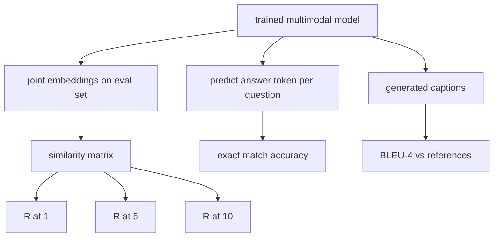

# Avaliação multimodal

> A formação é metade do ciclo. A outra metade é a medição. Esta lição constrói três superfícies de avaliação a partir de primitivas: captura de imagem relatada como R@1, R@5, R@10; resposta de perguntas visuais relatada como precisão exata de correspondência; e subtítulo de imagem relatado como BLEU-4.

**Type:** Build
**Languages:** Python
**Prerequisites:** Phase 19 lessons 58-62 (Track E foundations: encoder, transformer, projection, cross-attention fusion, pretraining)
**Time:** ~90 minutes

## Objetivos de aprendizagem

- Calcule Recall@K a partir de uma matriz de semelhança entre as incorporações de imagem e legenda.
- Calcule a precisão de VQA de correspondência exata a partir de um modelo que mapeia pares (imagem, pergunta) para um vocabulário fixo de respostas.
- Compute o BLEU-4 a partir de sequências de tokens geradas e de referência sem qualquer biblioteca externa.
- Faça as três avaliações contra uma suite sintética construída em cima do modelo treinado da lição 62.

## O problema

A tentação é declarar um modelo multimodal terminado quando os níveis de perda de treinamento se deslocam.

- **Retrieval (R@1, R@5, R@10).**Construir a incorporação conjunta para uma legenda de consulta; classificar cada imagem no pool de avaliação por cosino; relatar se a imagem correspondente cai no topo 1, topo 5, topo 10.
- **Visual question answering (exact match).**Dado (imagem, pergunta), o modelo produz um token de resposta. A correspondência exata é de um bit por amostra: a resposta prevista é igual à resposta de referência?
- **Captioning (BLEU-4).**Crie uma legenda. Calcule a média geométrica de 1 grama a 4 gramas de precisão contra as legendas de referência, com uma penalidade de brevidade.

Cada métrica é uma função fina. A lição constrói todas elas em código para que a matemática seja concreta e a superfície permaneça sob seu controle. Suites de referência reais (MS-COCO, VQA v2, GQA, OK-VQA) se conectam às mesmas formas de função.

## O conceito



### Recall@K de uma matriz de semelhança

Construir o`(N, N)`Matriz de semelhança cosínea entre as incorporações de imagem e legenda. Para cada linha, classifique as colunas por semelhança descendente. Recall@K é a fração de linhas onde o índice de coluna diagonal se encontra dentro das posições superiores de K. Recall@K simétrico (caption-to-image) é calculado na matriz transposta. Ambos os números são relatados. Para uma avaliação N=100, R@1 = 0,6 significa que 60 das 100 legendas recuperaram sua imagem correta como a correspondência superior.

### VQA correspondência exacta

Para cada uma (imagem, pergunta, resposta), codifique a imagem, incrusta a pergunta, combine através do decodificador e leia o próximo token. O id do token previsto é comparado com o id de referência; correto se igual. - Uma média sobre o conjunto de avaliações. Os conjuntos de dados reais de VQA enviam várias respostas anotadas por pessoa por pergunta e usam uma fórmula de precisão suave (1.0 se pelo menos 3 dos 10 anotadores concordarem, escalados abaixo); a lição usa a correspondência exata de resposta única para a clareza.

### BLEU-4

```text
BLEU-4 = BP * exp(mean(log p1, log p2, log p3, log p4))
```

Onde ?`p_n`é a precisão modificada de n-gram (contação reduzida de n-grams gerados que aparecem em qualquer referência, dividida pelo total de n-grams gerados), e `BP`é a pena de brevidade:

```text
BP = 1                if generated length > reference length
   = exp(1 - r/g)     otherwise, where r is reference length and g is generated
```

É necessário suavizar as amostras pequenas, onde algumas`p_n`A implementação usa o "método 1" de Chen e Cherry ( Adicionar 1 ao numerador e denominador para qualquer contagem de zero), que é o padrão mais seguro para regimes de baixa contagem.

### Suíte de avaliação sintética

Uma suite de avaliação de 50 amostras é construída na memória a partir do mesmo modelo de corpus simulado usado na lição 62, com uma semente mantida.

- `pairs`: 50 (imagem, capt_ids) pares para recuperação.
- `vqa`: 50 (imagem, question_id, answer_id) triples.
- `caps`: 50 (imagem, [reference_caption_ids, ...]) entradas com até 3 referências por imagem.

O conjunto é determinista a partir da semente e mantido fora do corpo de treinamento, de modo que as métricas são calculadas a partir de dados que o modelo nunca viu.

| Metric | Range | Random baseline (N=50) |
|--------|-------|------------------------|
| R@1 | 0 to 1 | 0.02 (1 / N) |
| R@5 | 0 to 1 | 0.10 |
| R@10 | 0 to 1 | 0.20 |
| VQA EM | 0 to 1 | 1 / vocab |
| BLEU-4 | 0 to 1 | small but nonzero |

Para uma formação de 50 passos com dados sintéticos, as métricas não devem ser altas; devem estar acima da linha de base aleatória, que é o que a demonstração verifica.

```figure
ch-recall-window
```

## Construí-lo

`code/main.py`Implementos:

- `recall_at_k(sim_matrix, k)`, devolvendo um flutuante em`[0, 1]`- Para ambas as direcções.
- `vqa_exact_match(predictions, references)`, devolvendo a média sobre `int`Igualdade.
- `bleu4(generated, references, smoothing=True)`, com apoio de várias referências.
- `build_eval_suite(seed, n_samples, vocab_size, max_len)`, devolvendo três listas de avaliação determinista.
- `evaluate(model, suite)`, que corre todas as três métricas e retorna um `dict`de números.
- Uma demonstração que carrega um modelo multimodal recém-iniciado da lição 62, avalia-o, depois treina-o por 50 passos e avalia novamente, imprimindo as métricas antes/após.

- É o que é ?

```bash
python3 code/main.py
```

Resultado: a tabela métrica antes/após mostra a recuperação melhorando de quase aleatória para o sinal aprendido do modelo, a VQA melhorando acima do aleatório e a BLEU-4 melhorando (a estrutura sintética é suficiente para um elevador de precisão de 4 gramas).

## Usá-lo

Cada métrica mapeia diretamente um índice de referência de produção:

- **Retrieval.**MS-COCO 5K val, Flickr30K, ImageNet zero-shot são todos problemas R@K na mesma matriz de semelhança.
- **VQA.**VQA v2, GQA, OK-VQA usam a mesma forma de correspondência exata (com ac em vez de EM de resposta única para VQA v2).
- **BLEU-4.**A legenda MS-COCO, NoCaps, Flickr30K, todas usam o BLEU-4 mais CIDER e METEOR.

Para valores de referência reais, swap `build_eval_suite`A matemática é analítica-agnóstica.

## Teste

`code/test_main.py`Cobertura:

- recall@k retorna 1.0 em uma matriz de semelhança de identidade perfeita e 0.0 em uma invertida para k < N
- recall@k respeita `k <= N`limite superior
- bleu4 retorna 1,0 quando gerado é igual a uma das referências exatamente
- bleu4 retorna 0,0 no vocabulário disjunto
- Vqa correspondência exata é igual à fração de pares iguais
- build_eval_suite retorna o número esperado de pares, itens vqa e inscrições de legendas

- E depois ?

```bash
python3 -m unittest code/test_main.py
```

## Exercícios

1. Adicione CIDEr às métricas de legendas. CIDEr usa a ponderação TF-IDF em n-gramas, que recompensa tokens informativos.

2. Implementar VQA de precisão suave: múltiplas respostas humanas por pergunta, precisão é `min(human_count / 3, 1)`Replica VQA v2.

3. Adicionar uma variante segura de NaN de `bleu4`que lida com sequências vazias geradas sem quebrar.

4. Computação média de grau recíproco (MRR) ao lado de R@K. O MRR é sensível aonde o item correto cai além do topo K; o R@K é sensível a se cai no topo K.

5. Execute a avaliação no modelo em cinco pontos de controlo durante o treinamento (passo 0, 10, 20, 30, 40, 50) e trace a curva de aprendizagem.

## Termos-chave

| Term | What it means |
|------|---------------|
| R@K | Fraction of queries where the correct match lands in the top K results |
| Exact match | The simplest VQA scoring: predicted answer equals reference |
| BLEU-4 | Geometric mean of 1- to 4-gram precisions, with brevity penalty |
| Multi-reference | A captioning metric accepts several reference captions per image |
| Held-out | The eval set is sampled from a seed disjoint from the training corpus |

## Mais leitura

- Papel VQA v2 para a fórmula de precisão suave e estatísticas de conjuntos de dados.
- Papel CIDER para subtítulos de n gramas ponderados por TF-IDF.
- O original BLEU (Papineni et al., 2002) para as variantes de suavizamento.
- Os scripts de avaliação de subtítulos MS-COCO para a implementação de referência canônica.
