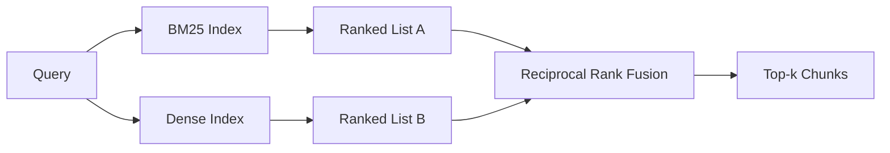

# Retorno híbrido com BM25 e embutidos densos

> A recuperação léxica e semântica falham em distribuições opostas de consultas. A recuperação híbrida com fusão de rango recíproca não interpola, ele vota - e o voto vence em cada classe de consulta.

**Type:** Build
**Languages:** Python
**Prerequisites:** Phase 11 lessons 04 (embeddings), 06 (RAG); Phase 19 Track B foundations (lessons 20-29); Phase 19 lesson 64 (chunking strategies)
**Time:** ~90 minutes

## Objetivos de aprendizagem
- Implementar BM25 a partir do zero a partir da formulação Robertson e Sparck Jones, com ponderação de campo, normalização de comprimento do documento e sintonização k1 e b.
- Construir um retriever denso em cima de uma simulação determinista de inserção para que o loop funcione offline.
- Implemente a fusão de rango recíproco exatamente como Cormack, Clarke e Buettcher publicaram em 2009, e explique por que domina a interpolação ponderada por pontuação.
- Aponta a constante RRF k e os pesos por modalidade e leia as compensações num pequeno corpus de fixação.

## O problema

A pesquisa léxica ganha quando a consulta contém um identificador literal.`AbortMultipartOnFail`a mesma consulta, incorporada, fica na fronteira de três aglomerados de semelhança e um retriever denso classifica o arquivo errado primeiro.

A pesquisa densa ganha quando a consulta é parafraseada longe dos tokens literais do corpus. Um usuário perguntando "como lidamos com uploads cancelados" nunca escreveu a palavra abortar ou multipart. BM25 retorna o pedaço de documentação em "carregar arquivos grandes" porque essa página contém a palavra uploads. A recuperação densa encontra a função abortar cujo resumo menciona cancelamento.

A escolha entre os dois não é estática. A distribuição da consulta é a variável. Um sistema RAG de produção lida com ambas as classes a partir do mesmo ponto final, então a recuperação tem que lidar com ambas ao mesmo tempo. Isso é recuperação híbrida. A etapa de fusão é a parte que tem que ser correta.

## O conceito



### BM25 num único parágrafo

BM25 marca um par de consulta-documento somando, sobre os termos de consulta, um fator de frequência de documento inverso multiplicado por um fator de frequência de termo-saturador que inclui uma correção de normalização de comprimento.`k1`controlos de saturação de frequência termônica; a recomendação de referência de 1, 5 é a publicada e não deve ser movida sem um índice de referência. `b`O valor padrão de 0,75 diz que os documentos mais longos são penalizados, mas não linearmente.

A fórmula das Forças de Defesa do Israel usa a definição suavizada de Robertson e Sparck Jones, que é `log((N - df + 0.5) / (df + 0.5) + 1)`O "plus-one" dentro do registro mantém o IDF positivo quando um termo aparece em mais da metade do corpo.

A ponderação de campo permite que você diga ao BM25 que uma correspondência no nome do símbolo conta mais do que uma correspondência no corpo. A implementação é um multiplicador da quantidade do termo durante a indexação, não no tempo de pontuação. Isso mantém a matemática idêntica e evita uma pontuação separada por campo.

### Recuperação densa num parágrafo

Embed cada peça em um vetor de dimensão fixa com um modelo de embebimento. No momento da consulta, embebebed a consulta, cosine-ranquear cada peça por semelhança, e retornar o top-k. O modelo é a variável que decide a qualidade. O algoritmo de recuperação em si é duas linhas: produto de pontos e classificação.

Esta lição usa um hash baseado em determinação para que você possa ler a matemática de fusão sem uma chamada de rede. O hash soma offsets de chave de token em um vetor 96-dimensional e normaliza. As fileiras cosínicas são deterministas em todas as corridas, o que é o que o conjunto de testes requer.

### Fusão de rango recíproco, fórmula publicada

Dois listas classificadas. Para cada candidato que aparece em qualquer lista, soma as suas contribuições recíprocas de classificação.`1 / (k + rank)`com k igual a 60 como padrão.

A constante publicada k = 60 não é arbitrária. Com k = 60, a contribuição de rank-1 é 1/61 e a contribuição de rank-10 é 1/70. A contribuição decompõe lentamente para que os candidatos mais profundos ainda votem.

Dois botões sintonizáveis na nossa implementação.`k`O valor de um valor de valor de um valor de um valor de um valor de um valor de um valor de um valor de um valor de um valor de um valor de um valor de um valor de um valor de um valor de um valor de um valor de um valor de um valor de um valor de um valor de um valor de um valor de um valor de um valor de um valor de um valor de um valor de um valor de um valor de um valor de um valor de um valor de um valor de um valor de um valor de um valor de um valor de um valor de um valor de um valor de um valor de um valor de um valor de um valor de um valor de um valor de um valor de um valor de um valor de um valor de um valor de um valor de um valor de um valor de um valor de um valor de um valor de um valor de um valor de um valor de um valor de um valor de um valor de um valor de um valor de um valor de um valor de um valor de um valor de um valor de um valor de um valor de um valor de um valor de um valor de um valor de um valor de um valor de um valor de um valor de um valor de um valor de um valor de um valor de um valor de um valor de um valor de um valor de um valor de um valor de um valor de um valor de um valor de um valor de um valor de um valor de um valor de um valor de um valor de um valor de um valor de um valor de um valor de um valor de um valor de um valor de um valor de um valor de um valor de um valor de um valor de um valor de um valor de um valor de um valor de um valor de um valor de um valor de um valor de um valor de um valor de um valor de um valor de um valor de um valor de um valor de um valor de um valor de um valor de um valor de um valor de um valor de um valor de um valor de um valor de um valor de um valor de um valor de um valor de um valor de um valor de um valor de um valor de um valor de um valor de um valor de um valor de um valor de um valor de um valor de um valor de um valor de um valor de um valor de um valor de um valor de um valor de um valor de um valor de um valor de um valor de um valor de um valor de um valor de um valor de um valor de um valor de um valor de valor

### Por que a fusão supera a interpolação ponderada por pontuação

Os pontuações BM25 são ilimitados e corpus-dependentes.`alpha * bm25 + (1 - alpha) * cosine`O sistema de classificação de dados é um sistema de classificação de dados que requer sintonização alfa por corpo e quebra-cabeças a cada vez que você reindexa. A fusão baseada em classificação não.

Este é o mesmo argumento que ouvimos sobre RankFusion vs RRF na documentação da Vespa e da Weaviate.

```figure
rrf-fusion
```

## Construí-lo

`code/main.py`Implementos:

- `tokenize(text)`- um tokenizador rápido de regex.
- `BM25Index`- ponderado em campo, com `add`E ...`search`e sintonizável k1, b.
- `mock_embed`- Não .`DenseIndex`- a mesma incorporação determinista que a lição 64, para que os pedaços sejam comparáveis.
- `rrf(rankings, k, weights)`- a fusão publicada com pesos de multi-modalidade.
- `HybridRetriever`- combina BM25 e denso.
- Uma demonstração .`main()`que carrega um pequeno corpus de dispositivos, executa três consultas que visam as forças e fraquezas de cada retriever, e imprime as classificações de cada modalidade produzida mais a lista fundida.

- É o que é ?

```bash
python3 code/main.py
```

Leia a saída de demonstração lado a lado. A consulta de identificador literal atinge o BM25 rank 1, rank denso 4, rank RRF 1. A consulta parafraseada atinge o BM25 rank 6, rank denso 1, rank RRF 1. A consulta ambígua atinge o BM25 rank 3, rank denso 3, rank RRF 1. A fusão não é um empate; é o sistema que vence em cada classe de consulta.

## A ajustar os botões

| Knob | Default | Move it up when | Move it down when |
|------|---------|----------------|------------------|
| BM25 k1 | 1.5 | Terms repeat in documents and you want frequency to matter more | Documents are short and term repetition is noise |
| BM25 b | 0.75 | Long documents really do say less per word | Document length is uncorrelated with topic |
| RRF k | 60 | Deep candidates should keep voting | The top-1 should dominate |
| BM25 weight | 1.0 | Your corpus contains literal identifiers and queries match them | Your queries are user-paraphrased |
| Dense weight | 1.0 | Queries are paraphrased | Queries are literal |

Ajuste-o re-exercendo o valor da lição 68 no seu conjunto de consultas, não por intuição.

## Modos de falha a demonstração vai esconder

**Out-of-vocabulary tokens.**A IDF do BM25 é calculada a partir do corpus, então apenas os termos na consulta contribuem com zero. Embedings densos alucinam um vetor para o mesmo termo. Nos identificadores fora do corpus a modalidade densa retorna vizinhos plausíveis, mas errados. A fusão absorve isso porque o BM25 não retorna nada e a contribuição de classificação cai, mas apenas se você desduplica por documento, não por pedaço.

**Stop-token domination.**BM25 contra a palavra "o" produz uma classificação uniforme sobre o corpus. Filtra tokens de parada no índice ou aceite que termos de alta IDF dominam naturalmente.

**Identical content across modalities.**Se o seu corpo é pequeno o suficiente para que o top-1 do BM25 seja também o top-1 do denso, RRF lhe dá o mesmo top-1 com os mesmos vizinhos. Isso é comportamento correto, não uma falha, mas faz a fusão parecer invisível. Adicione um par de consulta adversária em sua avaliação para verificar que a fusão está realmente funcionando.

## Usá-lo

Padrões de produção:

- Indice BM25 em processo; o gargalo de engarrafamento é o dicionário de frequência de termos, não os vetores.
- Indice vetores densos em uma loja separada (nesta lição usamos uma lista plana; na produção você usaria HNSW).
- Execute ambas as consultas em paralelo; a fusão é uma fusão constante sobre a união.
- Permaneça a modalidade de cada golpe recuperado para que um re-ranqueador de baixo alcance possa ver qual modalidade votou por ele.

## Envia-o

A lição 66 leva o top-k fundido desta lição e reencode com um cross-encoder. A lição 68 avalia todo o pipeline com precisão, recall, MRR e nDCG. O retriever híbrido nesta lição é a primeira etapa do sistema de ponta a ponta na lição 69.

## Exercícios

1. Substitui`mock_embed`Re-exerça a demonstração e relate como a classificação só densamente muda na consulta parafraseada.
2. Adicionar uma terceira modalidade: resumos de partes indexados separadamente e fundidos como uma terceira lista classificada.
3. Esvaziar RRF k em 10, 30, 60, 100, 200. Traçar a curva recall@k da lição 68. Relatar o valor de k onde a curva alcança o pico no seu corpus.
4. Implemente BM25F corretamente (normalização de comprimento por campo em vez do truque do multiplicador) e compare em um corpus onde os símbolos correspondem são mais importantes.

## Termos-chave

| Term | What people say | What it actually means |
|------|-----------------|------------------------|
| BM25 | "Lexical search" | Probabilistic ranking with idf x saturating tf x length normalization |
| RRF | "Rank fusion" | Sum of 1 / (k + rank) across ranked lists; k = 60 default |
| k1 | "TF saturation" | Controls how fast a repeated term stops adding more score |
| b | "Length penalty" | 0 means ignore document length, 1 means full normalization |
| Field weighting | "Symbol boost" | Repeat tokens during indexing to boost matches in that field |
| Rank-based vs score-based fusion | "Why RRF beats linear" | Ranks are comparable across modalities; scores are not |

## Mais leitura

- Cormack, Clarke, Buettcher, "Fusão de Classe Reciproca supera o Condorcet e os métodos de aprendizagem de Classe Individual", SIGIR 2009
- Robertson, Walker, Beaulieu, Gatford, Payne, "Okapi no TREC-3" (o papel original do BM25)
- [Vespa: Hybrid Retrieval with BM25 and Embeddings](https://docs.vespa.ai/en/tutorials/hybrid-search.html)
- [Weaviate: Hybrid Search](https://weaviate.io/developers/weaviate/search/hybrid)
- Fase 11 lição 06 - Fundamentos do RAG
- Fase 19 lição 64 - chunkers cuja produção é indexada aqui
- Fase 19 lição 66 - reencoder cross-encoder que consome o top-k fundido
