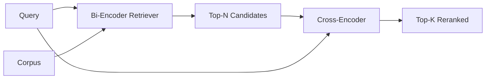

# Reranker de codificação cruzada

> Um bi-encoder incorpora consulta e documento de forma independente. Um cross-encoder os concatenar e lê ambos ao mesmo tempo. O cross-encoder é o leitor mais inteligente e o mais lento.

**Type:** Build
**Languages:** Python
**Prerequisites:** Phase 11 lesson 06 (RAG), Phase 11 lesson 07 (advanced RAG); Phase 19 Track B foundations (lessons 20-29); Phase 19 lesson 65 (hybrid retrieval feeding this stage)
**Time:** ~90 minutes

## Objetivos de aprendizagem
- Distinguir um retriever de bi-encoder de um reencoder de cross-encoder pela sua forma de entrada, contagem de parâmetros e custo por consulta.
- Implementar um pequeno cross-encoder a partir do zero como um bloco transformador que consome uma sequência de pacotes (query, document) e emite um único escalar de relevância.
- Cablear um pipeline de dois estágios de recuperação e depois de re-ranqueamento: recuperar o topo N com um retriever barato, re-ranquear N para o topo K com o cross-encoder, devolver K.
- Meter a diferença entre latência e qualidade em um pequeno corpus de dispositivos e escolher o N certo para um determinado orçamento de latência.

## O problema

Um bi-encoder mapeia a consulta e o documento no mesmo espaço vetorial e classifica por cosino. As duas codificações nunca se vêem. O modelo tem que comprimir tudo o que é útil sobre um documento em um único vetor, cego à consulta. Isso é rápido - um inserimento por documento no tempo de índice e um por consulta no tempo de consulta - e é a única maneira de classificar em escala corpus.

O custo é precisão. Dois documentos que têm o mesmo tema geral podem ter embutições quase idênticas, mesmo quando um deles responde à consulta e o outro não. O bi-encoder não pode distinguir-os.

Um cross-encoder resolve isto lendo a consulta e o documento juntos.`[query] [SEP] [document]`Como uma única sequência, corre toda a atenção através da junção, e produz um escalar de relevância. cada token do documento pode atender a cada token da consulta. O modelo decide a pontuação com todo o contexto.

O custo é o throughput. Onde o bi-encoder incrusta uma vez e quer quer querys para sempre, o cross-encoder é executado uma vez por par (query, documento). Para um corpus de 10 milhões de documentos que é 10 milhões de passes avançados por consulta.

A solução é a fase. Use o bi-encoder para recuperar o N superior. Use o cross-encoder para re-rancar o N para um top-K. N é pequeno (50 a 200) e o elevador de qualidade do cross-encoder é concentrado onde importa. A latência total permanece no orçamento da solicitação. A qualidade total é a qualidade do cross-encoder, limitada pela retirada do bi-encoder em N.

## O conceito



### Forma de entrada do cross-encoder

A embalagem padrão é `[CLS] query_tokens [SEP] document_tokens [SEP]`. A saída de posição CLS é alimentada em uma única cabeça linear que produz o escalar de relevância. Algumas implementações usam o pooling médio em vez do CLS; a diferença é pequena.

Um codificador cruzado de 22M (o`ms-marco-MiniLM-L-6-v2`Os modelos mais pequenos perdem qualidade mais rapidamente do que economizam latência.`bge-reranker-v2-m3`Para a classificação de dados, os dados de dados de dados de dados de dados de dados de dados de dados de dados de dados de dados de dados de dados de dados de dados de dados de dados de dados de dados de dados de dados de dados de dados de dados de dados de dados de dados de dados de dados de dados de dados de dados de dados de dados de dados de dados de dados de dados de dados de dados de dados de dados de dados de dados de dados de dados de dados de dados de dados de dados de dados de dados de dados de dados de dados de dados de dados de dados de dados de dados de dados de dados de dados de dados de dados de dados de dados de dados de dados de dados de dados de dados de dados de dados de dados de dados de dados de dados de dados de dados de dados de dados de dados de dados de dados de dados de dados de dados de dados de dados de dados de dados de dados de dados de dados de dados de dados de dados de dados de dados de dados de dados de dados de dados de dados de dados de dados de dados de dados de dados de dados de dados de dados de dados de dados de dados de dados de dados de dados de dados de dados de dados de dados de dados de dados de dados de dados de dados de dados de dados de dados de dados de dados de dados de dados de dados de dados de dados de dados de dados de dados de dados de dados de dados de dados de dados de dados de dados de dados de dados de dados de dados de dados de dados de dados de dados de dados de dados de dados de dados de dados de dados de dados de dados de dados de dados de dados de dados de dados de dados de dados de dados de dados de dados de dados de dados de dados de dados de dados de dados de dados de dados de dados de dados de dados de dados de dados de dados de dados de dados de dados de dados de dados de dados de dados de dados de dados de dados de dados de dados de dados de dados de dados de dados de dados de dados de dados de dados de dados de dados de dados de dados de dados de dados de dados de dados de dados de dados de dados de dados de dados de dados de dados de dados de dados de dados de dados de dados de dados de dados de dados de dados de dados de dados de dados de dados de dados de dados de dados de dados de dados de dados de dados de dados de dados de dados de dados de dados de dados de dados de dados de

### Por que esta lição treina um pequeno

Um verdadeiro cross-encoder é um transformador de codificador de sintonia fina. Na produção você carrega um ponto de controle e executa-o. Nesta aula, o objetivo é mostrar-lhe a forma do modelo e a forma da curva de qualidade de latência, não para treinar um ranker de última geração. Então, construímos um pequeno `nn.Module`Com um bloco transformador, atenção multi-cabeça (4 cabeças por padrão), e uma cabeça de regressão.

O modelo de brinquedo aprende a forma certa do corpus de dispositivos: os pares relevantes de consulta-documentos têm pontuações previsíveis mais altas do que os pares irrelevantes.

### Latência vs qualidade

O pipeline de dois estágios tem um ajuste: N. Esvaziar N de 5 a 100 em um conjunto de consultas prolongadas e você obtém a curva.

| N | Recall@1 of stage 2 | Cross-encoder forward passes per query | Latency |
|---|--------------------|---------------------------------------|---------|
| 5 | 0.62 | 5 | low |
| 20 | 0.81 | 20 | medium |
| 50 | 0.86 | 50 | high |
| 100 | 0.86 | 100 | very high |

Os números acima ilustram a forma, não as medidas deste dispositivo. A forma é real. Há sempre um joelho em torno de 20 a 50 candidatos onde o elevador de re-ranqueamento satura.

Escolha N da curva de avaliação mais o orçamento de latência. O cross-encoder não pode aumentar a recordação acima da recordação do bi-encoder em N, então um N baixo limita a qualidade, não apenas a latência.

```figure
rerank-funnel
```

## Construí-lo

`code/main.py`Implementos:

- `CrossEncoder`- um pequeno .`torch.nn.Module`: embedding token, um bloco transformador com atenção multi-head e feedforward, cabeça de poled média produzindo um escalar.
- `tokenize_pair(query, document)`- enche as duas cordas numa única sequência de id com id de tipo que marcam o limite, determinista e stdlib.
- `train_tiny(pairs)`- uma passagem de formação supervisada numa lista tripla rotulada manualmente (questionamento, documento, relevância), de modo que o modelo produz pontuações sensíveis no dispositivo.
- `rerank(query, candidates, top_k)`- a interface de produção.
- `pipeline(query, retriever, top_n, top_k)`- o fluxo de dois estágios.
- Uma demonstração .`main()`que carrega o corpus do padrão da lição 65, retira o topo-N, re-ranks para o topo-K, imprime as duas listas lado a lado, e relata a latência de cada etapa.

- É o que é ?

```bash
python3 code/main.py
```

A saída mostra o top-N do bi-encoder, o top-K do cross-encoder e um resumo de tempo. O cross-encoder leva mais tempo por chamada, mas não é executado no corpo completo. O total de duas etapas permanece dentro do orçamento da solicitação enquanto escolhe a resposta que o bi-encoder classificou em segundo ou terceiro.

## Modos de falha a demonstração vai esconder

**Cross-encoder is not symmetric.** `rerank(q, d)`E ...`rerank(d, q)`Sempre entregue a consulta primeiro, se trocares acidentalmente, a chamada desmorona.

**N is too low to expose the bug.**Se você definir N = K, o cross-encoder não pode reordenar; ele só pode reponderar. O elevador parece zero. Escolha N pelo menos três vezes K.

**Training data leaks into the eval.**Se os pares de treinamento rotulados à mão incluem as consultas de avaliação, a re-rangagem parece mágica.

**Production weights are dense.**Um cross-encoder de 22M-parâmetro é de 88 MB em float32. Planejar a memória do servidor modelo antes de prometer sub-100ms p95.

**Batching matters.**Um verdadeiro cross-encoder executa os candidatos N em um lote.`_batch_encode`, que constrói os tensores de batches de id e de tipo de id com `torch.tensor(...)`E corre uma passagem para a frente. Esqueça batching e a latência multiplica-se por N.

## Usá-lo

Padrões de produção:

- Enfiar o bi-encoder, o cross-encoder e o N juntos.
- Cache a saída do reranker por hash (query, document_id). A mesma consulta contra um corpus estável se classifica na mesma ordem; hits do cache compram um corte de latência gratuito.
- Registre a pontuação de codificação cruzada de nível 1. Uma consulta cuja pontuação superior a 1 esteja abaixo de um limiar específico do corpo é um hit fora do domínio; faça-o aparecer no LLM como "Eu não tenho confiança".

## Envia-o

A lição 68 avalia este pipeline de dois estágios de ponta a ponta. A lição 69 liga este re-ranger para trás do retriever híbrido da lição 65 e para frente do gerador de respostas.

## Exercícios

1. Escarnecer N de 5 a 50 e traçar recall@1 da saída re-ranqueada.
2. Treinar o cross-encoder por dez épocas em vez de uma.
3. Substitua o compartilhamento médio por um cabeçalho com token CLS. Compare a convergência neste dispositivo.
4. Adicione um segundo cabeçalho de codificação cruzada que prevê um binário "é esta resposta no documento" rótulo. Use ambos os cabeçalhos na inferência; um para classificar, um para o limiar.
5. Substitua o bi-encoder determinista simulado pelo da lição 65 e encadeie os dois estágios.

## Termos-chave

| Term | What people say | What it actually means |
|------|-----------------|------------------------|
| Bi-encoder | "Vector retriever" | Encodes query and doc independently; cosine ranks them |
| Cross-encoder | "Reranker" | Encodes (query, doc) jointly; outputs one relevance scalar |
| Two-stage pipeline | "Retrieve and rerank" | Cheap retriever returns N, expensive reranker keeps K |
| N (candidate budget) | "Rerank pool" | The number of candidates the cross-encoder scores per query |
| Mean-pooling head | "Mean of last hidden" | Average the encoder's last-layer outputs into one vector |

## Mais leitura

- Nogueira, Cho, "Passage Re-ranking with BERT", 2019 - o papel canônico de ranking de codificação cruzada
- Reimers, Gurevych, "Sentence-BERT: Embedings de sentenças usando redes siamesas BERT", 2019 - sobre bi-encoders vs cross-encoders
- [SentenceTransformers Cross-Encoders documentation](https://www.sbert.net/examples/applications/cross-encoder/README.html)
- [BGE Reranker v2 model card](https://huggingface.co/BAAI/bge-reranker-v2-m3)
- Fase 19 lição 65 - o retriever híbrido alimentando esta fase de re-ranqueamento
- Fase 19 lição 68 - a avaliação que mede o elevador que esta re-ranking oferece
