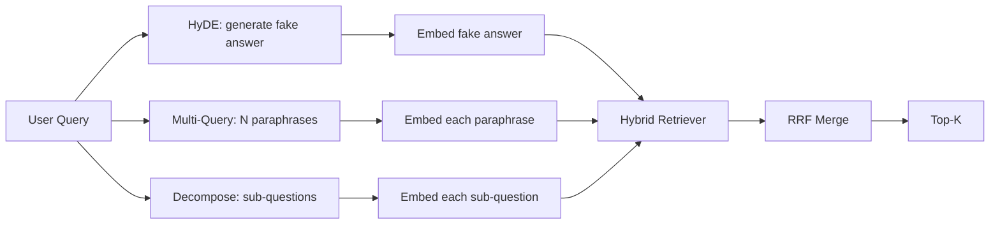

# Reescrever Query: HyDE, Multi-Query e Decomposition

> A consulta que o usuário escreve não é a consulta que o retrovisor quer. Reescrever abre a lacuna antes da recuperação, de modo que o índice vê algo mais próximo do que a resposta parece.

**Type:** Build
**Languages:** Python
**Prerequisites:** Phase 11 lessons 04 (embeddings), 06 (RAG); Phase 19 Track B foundations (lessons 20-29); Phase 19 lessons 64 and 65
**Time:** ~90 minutes

## Objetivos de aprendizagem
- Implementar Embedings de Documentos Hipotéticos (HyDE): gerar uma resposta falsa, incorporá-la, recuperar contra esse vetor em vez do vetor de consulta.
- Implementar expansão de várias consultas: reescrever uma consulta em N parafrases, recuperar com cada uma, fundir a união por fusão de rango recíproca.
- Implementar a decomposição da consulta: dividir uma pergunta complexa em sub-perguntas, recuperar por sub-perguntas, fundir.
- Comparar os três reescritores de cabeça para frente em um dispositivo e explicar quando cada estratégia vence.
- Envia um LLM falso que produz resultados deterministas, em dispositivos, para que o ciclo de reescritor seja desconectado.

## O problema

Um usuário digita "o que faz a nossa equipe quando os uploads falham e o orçamento desaparece?". O corpus contém um documento que diz "AbortMultipartOnFail aborta um upload multipart S3 em voo e diminui o orçamento de retomada por balde quando o upload falha". A consulta e o documento não compartilham uma frase substantiva. BM25 falha. O bi-encoder classifica o documento em terceiro ou quarto porque o vetor de consulta atinge uma região do espaço de inserção que prefere o documento sobre trabalhos cancelados, não o documento sobre uploads abortados. A re-rancada de dois estágios da lição 66 pode salvar a resposta se estiver no topo-N, mas se não chegar até ao topo-N, o re-ranqueador nunca a vê.

A solução é reescrever a consulta antes que toque no retriever. O artigo de 2023 "Precise Zero-Shot Dense Retrieval without Relevance Labels" (Gao et al.) introduziu a HyDE: peça a um LLM para escrever o documento que responderia à consulta, incorporar esse documento hipotético e usar sua incorporação como vetor de recuperação. O documento hipotético fica na região direita do espaço de inserção porque está escrito na voz do corpus. O vetor de consulta não.

Duas técnicas de primo em par com a HyDE. A expansão de consultas múltiplas (o termo usado pelo GraphRAG da Microsoft) gera N parafrases da consulta e retira com cada uma, depois se funde. A descompação (popularizada como "decompação de subquery" no trabalho DSPy de 2024 da Stanford) divide "o que nossa equipe faz quando os uploads falham e o orçamento desaparece" em duas perguntas: "o que acontece quando um upload falha" e "o que acontece quando o orçamento de retestamento desaparece". Duas recuperações, um resultado combinado, ambas as partes da resposta alcançáveis.

Esta lição implementa os três e os corre contra o mesmo corpus de fixação.

## O conceito



### HyDE em detalhes

O HyDE substitui o vetor de consulta do usuário por um vetor de documento hipotético escrito em LLM. O prompt é curto:

```
You are a domain expert. Write a one-paragraph passage that answers the question
below. Use the same vocabulary and phrasing the documentation in this domain would
use. Do not refuse. Do not say you do not know.

Question: {user_query}

Passage:
```

A resposta do LLM é errada como resposta factual porque o LLM não conhece o seu corpus. - Está bem. O retriever não se importa com a corretão factual, apenas com a distribuição simbólica. A passagem hipotética contém as palavras "aborto", "multipart", "bucket", "orçamento", porque é o que uma passagem de documentação sobre este tópico diria. Enraizem essa passagem. O vetor aterra perto da passagem real.

Na produção, você limita o documento hipotético a duas ou três frases.

### Expansão de várias consultas em detalhes

Gerar N parafrases da consulta do usuário.

```
Rewrite the following question in {N} different ways. Each rewrite must preserve
the original intent. Number them 1 to {N}. Do not add explanations.
```

Retirar o top-k para cada paráfrase. Combinar as listas classificadas N com RRF (o mesmo algoritmo da lição 65). Barato, paralelo, determinista.

A multi-query ganha quando a frase do usuário é uma das muitas maneiras igualmente válidas de fazer a pergunta, e qualquer uma das reescrituras teria feito melhor. Perde quando todas as reescrituras são igualmente ruins porque o original era ruim da mesma maneira.

### Decompositividade em detalhes

Uma única recuperação não pode satisfazer uma pergunta multifacetada. A descompação pede ao LLM que divida a pergunta em sub-perguntas e o sistema recupera por sub-perguntas.

```
The following question may require information from multiple distinct topics.
Decompose it into a list of sub-questions. Each sub-question must be answerable
independently. If the question is already atomic, return it unchanged.

Question: {user_query}
```

Retrieve por sub-question. Merge. Decomposition é a ferramenta certa para perguntas que contêm conjunções, comparações de várias cláusulas ou dois tópicos não relacionados. ferramenta errada para perguntas atômicas; o trabalho do decomposer é devolver a única pergunta e não inventar sub-questions falsas.

### Por que existem os três

Os três são complementares. HyDE preenche a lacuna de token query-corpus. Multi-query cobre a variância de parafrase. Decomposison cobre consultas multi-tópicos. Um sistema de produção executa os três e escolhe a estratégia por consulta (o sistema end-to-end da lição 69 mostra o selector).

## O Mestrado em Direito

A lição é executada offline. A simulação LLM é uma pequena tabela de busca teclada na consulta do usuário, além de um fallback para consultas que ele não viu. A tabela de busca contém:

- Para cada consulta fixa: uma passagem hipotética escrita, três parafrases e uma decomposição.
- Para uma consulta desconhecida: uma transformação determinista: pegue as palavras de conteúdo da consulta, expandir-as através de um mapa sinônimo e retornar o resultado.

A forma da simulação é o que importa, não os dados. Na produção você troca a simulação por uma chamada de modelo real.

```figure
cd-hyde-vector
```

## Construí-lo

`code/main.py`Implementos:

- `MockLLM`- a substitução determinista descrita acima.
- `HyDERewriter`- chama o Mestrado em Direito para escrever o documento hipotético, retorna a saída do reescritor como `RewriteResult`com o texto hipotético e a consulta que o retriever deve usar.
- `MultiQueryRewriter`- chama o Mestrado em Direito Jurídico para parafrasear N, retorna uma lista de perguntas.
- `DecomposeRewriter`- pede ao Mestrado que se decompõe, devolve sub-questions.
- `retrieve_with_rewriter`- leva um reescritor e um retriever, executa as reescrituras, mistura os resultados.
- Uma demonstração que executa os três reescritores em um dispositivo e imprime qual estratégia devolveu o documento de resposta dourado primeiro.

A forma do retriever é reutilizada a partir da lição 65 (hybrid BM25 + denso). A fusão é a mesma RRF. A única nova forma é a interface do rewriteer, que é pequena.

- É o que é ?

```bash
python3 code/main.py
```

A saída é uma classificação por estratégia e um resumo final. HyDE vence na consulta de frazes incompatíveis. Multi-query vence na consulta de variação de parafrase. Decomposão vence na consulta de vários tópicos. O fallback (sem reescritor) perde pelo menos uma das três.

## Modos de falha a demonstração vai esconder

**HyDE hallucinates corpus-specific identifiers wrong.**O modelo inventa um nome de função. A pontuação BM25 do hipotético na parte direita do documento desmorona porque o nome inventado é agora um token de alto peso que não aparece no índice.

**Multi-query rewrites all converge.**Um modelo fraco produz três parafrases quase idênticas. As recuperações N retornam o mesmo top-k. A fusão RRF não é melhor do que uma única recuperação. Adicione uma instrução explícita de diversidade ao prompt de reescritura e detecte duplicados por Jaccard.

**Decomposition over-splits.**O decomposer transforma uma pergunta atômica em uma lista. As recuperações todos retornam o mesmo documento, mas com grau reduzido. A fusão é pior do que a original. Detectar isso com um "estão essas sub-questions distinto o suficiente" passar antes de fan-out.

**Latency multiplies.**A HyDE custa uma chamada de LLM. A consulta múltipla custa uma chamada de LLM para gerar N reescrituras, em seguida, N recuperações. A descompação custa uma chamada de LLM para descompor, em seguida, M recuperações. As recuperações executam em paralelo; a chamada de LLM é o piso.

## Usá-lo

Padrões de produção:

- Seleção de estratégia por consulta por comprimento de consulta: consultas curtas atômicas obtêm multisqueries, consultas complexas multi-clause obtêm decomposição, consultas jargão pesadas obtêm HyDE.
- Cache a saída do reescritor por hash de consulta. Muitas consultas repetem-se.
- Execute os três em paralelo e funda os três conjuntos de resultados num só com RRF. O custo é três chamadas de LLM e uma fusão; a qualidade é a união das três estratégias de cobertura.

## Envia-o

A lição 69 coloca esta fase de reescritor antes do retriever da lição 65 e do re-ranqueador da lição 66.

## Exercícios

1. Implementar RAG-Fusion (uma variante de 2024 de multi-query) onde as paráfrases do reescritor são intencionalmente diversas, então o passo de re-ranqueamento (leção 66) escolhe a lista final.
2. Adicionar uma quarta estratégia: incentivo de retorno (pergunte ao MLL a pergunta mais geral, retire sobre isso, em seguida, estreita).
3. Treine o decomposador a reconhecer as consultas atômicas adicionando um cabeçalho "é a questão atômica".
4. Substitua o LLM falso por um modelo real de chamada.
5. Adicione uma pontuação de confiança por reescritura, deixe as reescrituras abaixo do limiar, mensure o impacto na retirada.

## Termos-chave

| Term | What people say | What it actually means |
|------|-----------------|------------------------|
| HyDE | "Fake-document retrieval" | LLM writes the answer; embed and retrieve on that instead of the query |
| Multi-query | "Paraphrase expansion" | N rewrites of the query; retrieve N times, merge by RRF |
| Decomposition | "Subquery split" | Multi-topic queries split into sub-questions, retrieved separately |
| Atomic query | "Single-topic" | Cannot be decomposed without inventing fake sub-questions |
| Step-back | "Abstract the query" | Ask the more general question, retrieve, then narrow |

## Mais leitura

- Gao, Ma, Lin, Callan, "Precisos tiros zero-retrieval denso sem etiquetas de relevância" (HyDE), 2023
- Microsoft Research, "Expansão Multi-Query para Retorno"
- Stanford DSPy, "Subquery Decomposition for Multi-Hop QA"
- [LlamaIndex query transformations documentation](https://docs.llamaindex.ai/en/stable/optimizing/advanced_retrieval/query_transformations/)
- Fase 11 lição 07 - padrões avançados de RAG
- Fase 19 lição 65 - o retriever este reescrever alimenta
- Fase 19 lição 68 - a avaliação que mede o elevador de reescritor
