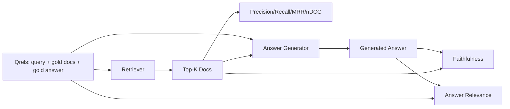

# Avaliação do RAG: Precisão, Recall, MRR, nDCG, Fiellidade, Relevança da resposta

> Se não conseguir classificar a sua recuperação e a sua resposta ao mesmo tempo, não pode enviar o sistema.

**Type:** Build
**Languages:** Python
**Prerequisites:** Phase 11 lessons 06 (RAG), 10 (evaluation); Phase 19 Track B foundations (lessons 20-29); Phase 19 lessons 64, 65, 66, 67
**Time:** ~90 minutes

## Objetivos de aprendizagem
- Calcule quatro métricas de recuperação a partir de qrels de ouro: precision@k, recall@k, MRR (rata média recíproca) e nDCG@k.
- Calcule duas métricas de classificação da resposta: fidelidade (cada alegação baseada no contexto recuperado) e relevância da resposta (a resposta responde à pergunta).
- Construir um arquivo qrels fixo (queries, IDs de documentos de ouro, texto de resposta de ouro) que o eval lê de ponta a ponta.
- Leia os valores métricos para diagnosticar onde um pipeline está falhando: recuperação, classificação, geração ou aterragem.

## O problema

Um sistema RAG tem pelo menos quatro partes móveis: chunker, retriever, reranker, gerador. Qualquer uma delas pode ser a causa de uma resposta errada. Sem métricas por estágio você está voando cego.

Um usuário relata uma resposta errada. É porque o chunker cortou o intervalo de resposta? É porque o retriever não incluiu o chunk no top-k? É porque o reranker empurrou o chunk direito para além da posição um? É porque o gerador ignorou o chunk e inventou algo? Você não pode dizer apenas pela resposta. Você precisa:

- Metricas de recuperação para classificar o que saiu do retriever.
- Classificação de métricas para classificação onde a peça certa estava na ordem.
- Fiel para avaliar se o gerador permaneceu dentro do contexto recuperado.
- Resposta relevância para classificar se a resposta aborda a pergunta.

Esta lição constrói os seis em cima de um arquivo Qrels fixo. A avaliação é offline e determinista; na produção você troca o LLM falso como juiz por um real.

## O conceito



### Precision@k

Dos documentos top-k que o recuperador devolveu, qual a fração que está no conjunto de ouro? Se o ouro tem três documentos e o top-3 devolve dois deles e um errado, precisão@3 é 2 / 3.

### Recall@k

Se o ouro tem três documentos e o top-5 contém todos os três, recall@5 é 1.0.

Na produção RAG a métrica que as pessoas costumam citar é recall@k. A geração pode deixar cair pedaços irrelevantes facilmente; não pode inventar uma resposta a partir de um pedaço que nunca viu.

### REM (Rango médio recíproco)

Para cada consulta, encontre a posição do primeiro documento relevante na lista classificada. A posição recíproca é 1 / posição. Medida em todo o conjunto de consulta. MRR é um resumo de um único número de como o retriever coloca a melhor resposta no topo.

A posição 1 é pesada por MRR. Uma consulta onde o documento de ouro está em posição 1 contribui 1.0.

### nDCG@k

Normal de ganho cumulativo descontado. A fórmula completa atribui um ganho a cada documento recuperado (muitas vezes 1 para relevante, 0 para não), descontos pelo registro da posição, somas e divididos pelo DCG ideal (o DCG que você teria se você classificado perfeitamente). Intervalo de 0 a 1.

O nDCG acomode relevância graduada: o ouro pode dizer "doc A é 3, doc B é 2, doc C é 1". MRR e recall@k aplanam tudo para binário. Use nDCG quando o corpus tem vários documentos parcialmente relevantes por consulta.

### Fielidade

Para cada reivindicação na resposta gerada, verifique se a reivindicação é apoiada pelo contexto recuperado. A implementação padrão usa um pedido de LLM-as-judge que toma ( reivindicação, contexto) e retorna sim ou não. A métrica é a fração de reivindicações que passam.

A fidelidade pega o modo de falha do gerador onde o modelo inventa conteúdo. Mesmo que o retriever devolva os pedaços certos, um gerador que alucina é quebrado.

Esta lição implementa fidelidade com um juiz determinista simulado que verifica se os tokens de cada reivindicação se sobrepõem ao contexto recuperado por um limiar.

### Resposta relevante

A resposta fiel realmente aborda a questão? A fidelidade pergunta "a resposta está fundamentada no contexto?" A relevância da resposta pergunta "a resposta está fundamentada na questão?" Uma resposta fiel, mas fora do tópico, tem um alto valor em fidelidade e baixa em relevância. Uma resposta curta e sobre o tópico que ignora o contexto tem um alto valor em relevância e baixa em fidelidade.

A aplicação padrão também utiliza o LLM-as-judge: take (pergunta, resposta) e pergunte se a resposta aborda a pergunta.

## O dispositivo

```python
{
  "qid": "q1",
  "query": "what is the abort threshold for multipart uploads",
  "gold_doc_ids": ["d1", "d3"],
  "gold_answer_substring": "three failed parts",
  "graded_relevance": {"d1": 3, "d3": 2},
}
```

Cada consulta contém:
- a cadeia de consulta,
- um conjunto de documentos de identificação de ouro (para precisão / retirada / MRR),
- um ditado de relevância classificado (para nDCG),
- a linha de resposta de ouro (mantida como metadados de referência em cada qrel; a fidelidade nesta lição é calculada julgando as alegações extraídas com base no contexto recuperado, não contra essa linha de referência).

Na produção, é preciso rotular isto, esta aula envia um dispositivo feito à mão para que a avaliação se esvaia da caixa.

```figure
ci-rag-metric-ladder
```

## Construí-lo

`code/main.py`Implementos:

- `precision_at_k(retrieved, gold, k)`- a definição literal.
- `recall_at_k(retrieved, gold, k)`- a definição literal.
- `mean_reciprocal_rank(retrieved_list_of_lists, gold_list)`- a média sobre perguntas.
- `ndcg_at_k(retrieved, graded_relevance, k)`- DCG/IDCG com ganhos binários ou classificados.
- `extract_claims(answer)`- divide uma resposta em alegações em forma de frase.
- `faithfulness(claims, context_texts, judge)`- fracção dos créditos considerados apoiados.
- `answer_relevance(question, answer, judge)`- julgar se a resposta responde à questão.
- `MockJudge`- Juez determinista de sobreposição de tokens, para que a avaliação seja desconectada.
- `evaluate_pipeline(pipeline_fn, qrels, ks)`- O orquestrador que controla todas as métricas.
- Uma demonstração que executa três variantes de pipeline (linha de base de cunker, recuperação híbrida, híbrido + re-ranqueamento) contra os qrels e imprime uma tabela de métricas.

- É o que é ?

```bash
python3 code/main.py
```

A saída mostra precisão@k, recall@k, MRR, nDCG@k, fidelidade e relevância de resposta para cada variante em uma única tabela de métricas. A linha de recuperação híbrida supera a linha de base do chunker em recall; a linha de rerank supera a híbrida em MRR.

## Lendo as métricas para diagnosticar falhas

| Symptom | Likely cause | What to fix |
|---------|-------------|-------------|
| Low recall@k, low precision@k | Chunker cut the answer or retriever cannot find it | Chunker boundaries (lesson 64) or retriever modality (lesson 65) |
| Decent recall@k, low MRR | Right chunk is in top-k but not at position 1 | Reranker (lesson 66) |
| High MRR, low faithfulness | Generator invents content despite right context | Generation prompt; force-cite-or-refuse |
| High faithfulness, low relevance | Answer is grounded but off-topic | Query rewriter (lesson 67) or generation prompt |
| All four high, users still complain | Eval set is unrepresentative | Expand qrels with real user queries |

## Modos de falha a demonstração vai esconder

**LLM-as-judge bias.**Um modelo julga suas próprias saídas como mais fiéis do que elas são.

**Qrels rot.**O ouro responde à deriva à medida que o corpus muda. Um documento que era ouro para Q1 em janeiro de 2024 não é mais a resposta certa em outubro de 2024 porque a equipe renomeou a função.

**Faithfulness micro-checks miss macro-claims.**A fidelidade por frase pode passar enquanto a estrutura geral da resposta engana. Adicione uma revisão qualitativa de nível de amostra em cima da métrica automatizada.

**Recall@k masks per-query failures.**Uma recall média de 90% pode esconder que uma classe de consulta sempre perde.

## Usá-lo

Padrões de produção:

- Execute o eval em cada alteração de retriever ou gerador.
- Quando um usuário reclama, procure a entrada qrels que corresponda e veja se ela teria sido capturada.
- Equação dos qrels: um conjunto de 20 consultas que se executam em CI; um conjunto de regressão de 200 que se executam noites; um conjunto profundo de 2000 que se executam semanalmente.

## Envia-o

Lição 69 conecta todo o pipeline (cunker, retriever, reranker, gerador) e executa esta avaliação contra o sistema de ponta a ponta.

## Exercícios

1. Adicione uma quinta métrica de recuperação: hit-rate@k. Compare-a com recall@k. Explique quando elas diferem.
2. Implementar uma fidelidade classificada: 0 (não suportado), 1 (parcialmente suportado), 2 (totalmente suportado). Atualizar a métrica em conformidade.
3. Substitua o juiz falso por uma chamada modelo real.
4. Adicione uma faixa de classe de consulta ("literal", "parafraseado", "multi-tema").
5. Adicione uma métrica de "longo de resposta" e correlacione-a com a fidelidade.

## Termos-chave

| Term | What people say | What it actually means |
|------|-----------------|------------------------|
| Precision@k | "Hit rate over retrieved" | Fraction of top-k that are gold |
| Recall@k | "Hit rate over gold" | Fraction of gold in top-k |
| MRR | "First-hit position" | Mean of 1 / rank of first relevant document |
| nDCG@k | "Graded ranking quality" | DCG over the top-k divided by ideal DCG |
| Faithfulness | "Groundedness" | Fraction of answer claims supported by retrieved context |
| Answer relevance | "Did it address the question?" | Whether the answer matches the question's intent |
| Qrels | "Gold labels" | The labeled set of queries and their gold documents and answers |

## Mais leitura

- Buckley, Voorhees, "Evaluating Evaluation Measure Stability", SIGIR 2000 - o artigo canônico sobre métricas de classificação
- Jarvelin, Kekalainen, "Avaliação acumulada de técnicas de IR com base em ganhos" - o artigo nDCG
- [Ragas: Automated Evaluation of RAG Pipelines](https://docs.ragas.io)
- [Anthropic, Evaluating RAG](https://www.anthropic.com/news/evaluating-rag)
- Fase 11 lição 10 - Fundamentos do quadro de avaliação
- Lições da fase 19 64-67 - componentes avaliados aqui
- Fase 19 lição 69 - o pipeline de ponta a ponta esta avaliação notas
