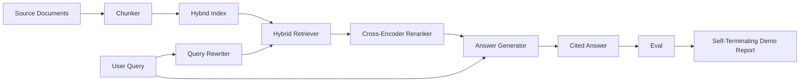

# Sistema de RAG de ponta a ponta

> Seis lições de componentes, um pipeline, um loop de avaliação, uma demonstração auto-terminadora.

**Type:** Build
**Languages:** Python
**Prerequisites:** Phase 11 lessons 06 (RAG), 10 (evaluation); Phase 19 Track B foundations (lessons 20-29); Phase 19 lessons 64, 65, 66, 67, 68
**Time:** ~90 minutes

## Objetivos de aprendizagem
- Compõem o chunker, o retriever híbrido, o reescritor de consulta, o reencoderador cruzado e o gerador de respostas em um único pipeline de ponta a ponta.
- Implementar um gerador de respostas que cita as suas reivindicações por pedaços de âncora, com recusa-em-baixo-confiança fallback.
- Execute a avaliação da lição 68 contra o pipeline montado e prove que a construção em fases vence em cada métrica sobre os mesmos componentes isoladamente.
- Construir uma demonstração de CLI auto-terminante que ingere um corpus de fixação, execute um conjunto de consultas fixo e sai de zero com um relatório resumido.

## O problema

Seis componentes isolados não provam nada. O chunker pode ganhar no recall@5 contra o corpus e perder no recall@5 do sistema porque o retriever não pode classificar o que o chunker emite. O re-ranqueador pode levantar o MRR num grupo de candidatos sintéticos e falhar em candidatos bi-encodadores reais porque a retirada do bi-encoder no orçamento de re-ranqueamento é muito baixa. O reescritor de consulta pode promover o documento de ouro em uma única consulta e romper na próxima porque a simulação de LLM retorna uma hipotética degenerada.

O teste de integração é a corrida de todo o pipeline de ponta a ponta contra os mesmos qrels fixos, com a mesma métrica, com um arquivo orquestador que conecta tudo. Isso é o que esta lição constrói. Se as métricas no pipeline integrado vencer as métricas na demonstração isolada de cada estágio, você provou o sistema.

## O conceito



### Opções de cablagem

O pipeline é um pequeno gráfico. Cada etapa é uma função com uma assinatura clara.

| Stage | Input | Output |
|-------|-------|--------|
| Chunker | Document text | List of Chunk records |
| Retriever | Query string | Top-N Chunk records |
| Rewriter (optional) | Query string | List of rewrites + hypothetical |
| Reranker | Query, candidates | Top-K Chunk records with cross scores |
| Generator | Query, top-K Chunk records | Answer string with citations |

A composição é simples quando cada assinatura é estável.`Pipeline`A classe tem os cinco estágios e um`query`Cada etapa é trocável: passar um chunker diferente, retriever, rewriteer, re-ranker ou gerador e o pipeline ainda funciona.

### Gerador de respostas com citações

O gerador é a última etapa e a mais fácil de quebrar.

1. Leva os pedaços de K mais altos.
2. Seleciona até dois blocos cujo texto contém o maior toque de conteúdo sobrepondo-se com a consulta.
3. Emite uma resposta que é uma concatenation de uma frase-de-cada-seleccionado-parte, com cada frase seguida por um `[doc_id:chunk_index]`Anca.
4. Se nenhuma peça se sobrepõe acima do limite de resíduos, emite "não sei" sem citação.

Na produção, trocas a simulação por uma chamada de LLM real com o modelo de solicitação:

```
You are answering a question using only the snippets below.
Cite every claim with the anchor in parentheses.
If the snippets do not answer the question, say "I do not know".

Question: {query}

Snippets:
{enumerated chunks with anchors}

Answer:
```

O caminho de rejeição em baixa confiança é a razão pela qual a pontuação de nível 1 do cross-encoder é registrada. Se estiver abaixo do limiar do corpus, o gerador recusa. Esta é a válvula de segurança contra respostas alucinadas.

### A demonstração autoterminação

A demonstração executa tudo de ponta a ponta. Imprime uma divisão por fase de uma consulta, executa o eval sobre os quatro qrels fixos, imprime uma tabela de métricas e sai com status zero se todas as métricas lição 68 atenderem os limiares estabelecidos na demonstração.

É a forma que um teste de fumaça CI assume. O tubo corre offline, rápido, determinista. Os limiares são deliberadamente apertados no dispositivo, de modo que uma regressão em qualquer das seis lições falha na demonstração.

```figure
rag-pipeline-flow
```

## Construí-lo

`code/main.py`Implementos:

- `Chunk`- o registo realizado em todas as fases (estende a forma da lição 64 com um chunk_index e um doc_id fonte).
- `Chunker`- seleciona uma estratégia a partir da lição 64 (divisão recursiva por defeito).
- `HybridIndex`- BM25 + denso + RRF da lição 65.
- `Rewriter`(opcional) - escolhe um de HyDE, multi-query, decomposição da lição 67 por comprimento da consulta e presença de conjunções.
- `Reranker`- o cross-encoder treinado da lição 66, com um conjunto de treinamento de dispositivos mais pequeno, para que converja em segundos.
- `Generator`- o gerador de simulação determinista com citações e rejeição de baixa confiança.
- `Pipeline`- compõe as cinco etapas com um`query(question)`método que retorna `Result(answer, top_k, latency_ms_per_stage)`- Não .
- `run_demo()`- ingere o corpus, executa três consultas de fixação, executa a avaliação, imprime os resultados, define o código de saída por limiar.

- É o que é ?

```bash
python3 code/main.py
```

A saída é um rastro de consulta impresso, a tabela de avaliação completa e um status final de passagem/falha. Retorna o código de saída 0 na fixação.

## Modos de falha a demonstração vai esconder

**Chunker boundary drift.**Se você trocar a estratégia de chunker entre o passe de rotulagem eval qrels e a demonstração, os documentos dourados não mais alinham. Fechar a estratégia de chunker no arquivo qrels. A demonstração inclui um cabeçalho que nomeia o chunker.

**Reranker training set leaks into the eval.**As 14 triplos de treinamento na lição 66 incluem consultas que se assemelham às consultas de avaliação. Na produção, mantenha as consultas de avaliação estritamente.

**Mock generator hides hallucination risk.**A simulação não pode alucinar porque emite apenas texto dos pedaços recuperados.

**No streaming.**O pipeline retorna a resposta completa no final de cada etapa. Um sistema de produção transmitiria a saída do gerador.

**Latency is offline.**As chamadas de LLM falsas são constantes. chamadas de LLM reais dominam. Planejar um orçamento de latência no escopo da solicitação; o tempo por etapa da lição só mede o trabalho da CPU.

## Usá-lo

Padrões de produção:

- Envie o arquivo do pipeline sob um orquestrador com interfaces de estágio explícitas.
- Execute o eval antes de cada fusão que toca um estágio.
- Permaneça a traça métrica por IC corrida para que você possa atribuir regressões a uma fase de troca.
- Adicione um conjunto de fumaça de 20 consultas (subconjunto do conjunto de regressão) que se execute em menos de 30 segundos; o conjunto completo de regressão se executa todas as noites.

## Envia-o

O arquivo de pipeline nesta lição é a forma que o resto das lições de F da Fase 19 assume. Lições subsequentes adicionariam automação de ingestão, re-indexação incremental, telemetria e uma camada de serviço no topo. As meias de recuperação, re-ranqueamento, reescritura e avaliação são completas aqui.

## Exercícios

1. Adicione um selector de estratégia por consulta dentro do reescritor: heurísticas da lição 67 (longoura, conjunções, relação de jargão) escolha HyDE, multi-query ou decomposição.
2. Adicione uma chamada de LLM real para o gerador atrás de uma bandeira de env.
3. Extenda a demonstração para tomar um `--corpus path`Repete a avaliação e a verificação do limiar.
4. Adicionar um`--strategy`A Comissão deve apresentar um relatório sobre a situação dos Estados-Membros no domínio da pesca.
5. Adicione uma interface de gerador de streaming e entregue-a no eval. Confirme que a fidelidade é calculada na cadeia final e não no prefixo streamed.

## Termos-chave

| Term | What people say | What it actually means |
|------|-----------------|------------------------|
| Pipeline | "RAG pipeline" | The composed stages from ingestion to cited answer |
| Citation anchor | "Source link" | The (doc_id, chunk_index) reference attached to each claim |
| Refuse-on-low-confidence | "I do not know" | Generator returns no answer when the reranker top-1 score sits below threshold |
| Smoke set | "CI eval" | The minimal qrels subset that runs in every PR check |
| Stage interface | "Function signature" | The stable input and output type of each pipeline stage |

## Mais leitura

- [Anthropic, Building search and retrieval](https://www.anthropic.com/news/contextual-retrieval)
- [Pinterest, MCP internal search](https://medium.com/pinterest-engineering)- arquitetura de produção de referência
- [Ragas: Automated Evaluation of RAG Pipelines](https://docs.ragas.io)
- Fase 11 lição 06 - Fundamentos do RAG
- Fase 19 lições 64-68 - os componentes compostos aqui
