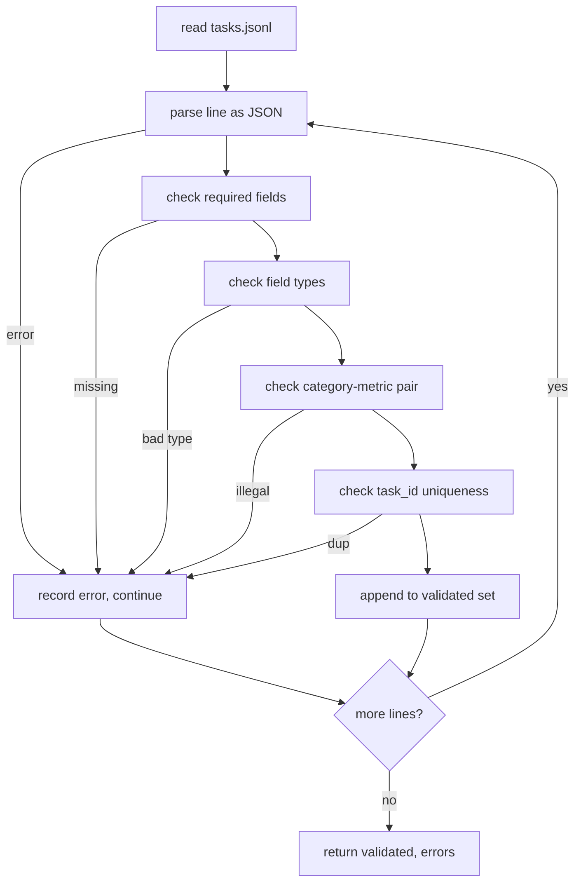

# Formatos de especificação de tarefas

> Um arsenal de avaliação é tão bom quanto o contrato suas tarefas honrar. Congelhe a forma JSONL e o vocabulário métrico antes de escrever uma única função de pontuação.

**Type:** Build
**Languages:** Python
**Prerequisites:** Phase 19 Track B foundations
**Time:** ~90 min

## Objectivos de aprendizagem

- Defina um esquema de registro de tarefas JSONL que cobre aritmética, escolha múltipla, execução de código, classificação e resumo de texto livre em uma forma.
- Aplique um vocabulário fechado de nomes métricos para que as lições de baixo-fluxo (71-73) possam ser enviadas em um único campo.
- Especifique exemplos de poucas fotos e regras de pós-processamento como parte da tarefa, não o corredor, para que o mesmo prompt produz o mesmo alvo em todos os modelos.
- Implementar um validador rigoroso que rejeita registros mal formados antes que eles cheguem ao corredor.
- Envie um conjunto de 10 tarefas que exerce cada ramo da especificação para que o validador tenha algo real para mastigar.

```figure
ci-task-spec-gate
```

## Por que um espec. congelado

Uma base de código de pesquisa acumulará scripts de avaliação mais rápido do que acumulará testes. Em seis meses, cada notebook tem sua própria forma JSON, cada métrica é reimplementada duas vezes, e nada pode ser comparado em todas as corridas. A correção é chata. Escolha um esquema. Escreva um validador. Rejeita tudo o resto. É isso que esta lição faz.

A forma leva ideias de grandes bancos, HELM e arneses de estilo lm-eval, mas os nomes de campos são nossos. Cada campo tem um único proprietário. O corredor lê a tarefa. A métrica lê os alvos. O passo pós-processo normaliza a geração. Nenhum campo é mutável no meio da pipeline.

## A forma do disco

Uma tarefa é um objeto JSON em uma única linha.`tasks.jsonl`Uma linha ruim aborta esse registro, não a corrida.

```json
{
  "task_id": "arith_001",
  "category": "arithmetic",
  "prompt": "Compute the result. Question: 17 + 24\nAnswer:",
  "targets": ["41"],
  "metric_name": "exact_match",
  "few_shot_examples": [
    {"prompt": "Question: 2 + 2\nAnswer:", "completion": "4"}
  ],
  "post_process": "strip_whitespace",
  "metadata": {"difficulty": "easy"}
}
```

Os campos necessários são:`task_id`- Não .`category`- Não .`prompt`- Não .`targets`- Não .`metric_name`- Não .`post_process`- Não .`few_shot_examples`E ...`metadata`Os campos de nível superior desconhecidos não validam.

## Regras de campo

`task_id`O validador impõe a singularidade ao arquivo.

`category`é um dos`arithmetic`- Não .`mcq`- Não .`code_exec`- Não .`classification`- Não .`summary`. A categoria limita qual par métrico e pós-processo é legal.`code_exec`tarefa deve utilizar `metric_name = code_exec`e um `mcq`tarefa deve utilizar `metric_name = exact_match`contra um alvo de uma única letra.

`prompt`O validador proíbe o espaço branco e rejeita registros que já contêm alguns blocos de tiros no corpo de solicitação.

`targets`é uma lista não vazia de cordas.`exact_match`, qualquer elemento correspondente conta.`f1`E ...`rouge_l`O alvo com maior pontuação ganha.`mcq`A lista contém exactamente um elemento.

`metric_name`é um dos`exact_match`- Não .`f1`- Não .`bleu_4`- Não .`rouge_l`- Não .`accuracy`- Não .`code_exec`O vocabulário está fechado, uma nova métrica requer uma nova lição e uma nova entrada aqui.

`few_shot_examples`é uma lista de `{prompt, completion}`O validador limita a lista a oito entradas para manter as instruções limitadas.

`post_process`é um dos`none`- Não .`strip_whitespace`- Não .`lower`- Não .`extract_letter`- Não .`extract_code_block`- Não .`extract_first_line`Cada regra tem um único comportamento determinista.

## Comportamento do validador



O validador retorna duas listas: registros validados e registros de erro com a linha infração, a regra violada e o campo em erro. O corredor se recusa a iniciar se a lista de erro não é vazia a menos que um explícito `--allow-bad-tasks`A bandeira está definida.

## Render de poucas imagens

O corredor concatenar alguns exemplos de tiros na frente do prompt com um separador de linha em branco. O mesmo caminho de código é executado para cada modelo, então a única fonte de variância é o próprio modelo. Os autores escrevem exemplos uma vez, não uma vez por provedor.

```python
def render(task):
    parts = []
    for ex in task.get("few_shot_examples", []):
        parts.append(ex["prompt"] + " " + ex["completion"])
    parts.append(task["prompt"])
    return "\n\n".join(parts)
```

## Regras de pós-processo

O passo pós-processo é gerado após geração, antes da métrica.

- `none`Retorna a corda inalterada.
- `strip_whitespace`Tiras que conduzem e seguem o espaço branco.
- `lower`Baixa a corda.
- `extract_letter`Retorna o primeiro caracter que corresponde `[A-E]`, utilizado para o MCQ.
- `extract_code_block`Retorna o corpo do primeiro bloco cercado de tripla represa, utilizado para a execução do código.
- `extract_first_line`Retorna a primeira linha não vazia, utilizada para a classificação resumida.

Uma tarefa que precisa de uma regra fora desta lista pertence a uma nova lição.

## O que esta lição não faz

Não faz pontuação, não chama modelo, não executa código, e as lições 71, 72 e 75 são as que se fazem.

A fixação de 10 tarefas abrange dois elementos aritméticos, dois elementos MCQ, dois elementos de execução de código, dois elementos de classificação e dois elementos de resumo.`tasks_bad.jsonl`) exclui todas as regras e o validador retorna exatamente tantos erros.

## Como ler o código

`main.py`define`TaskSpec`- Não .`validate_task`- Não .`validate_file`O carregador de dispositivos é `load_fixtures`Os auxiliares de renderização e pós-processo vivem ao lado da validação, por isso o corredor da lição 75 importa um único módulo.

Leia `main.py`De cima para baixo.`code/tests/test_spec.py`Os testes identificam todas as regras de validação e todos os comportamentos pós-processo.`main.py`Valida o dispositivo em conjunto e imprime um resumo.

## Vai mais longe

Os conjuntos de avaliação reais crescem categorias da mesma forma que os esquemas crescem colunas. O movimento sóbrio é recusar adicionar uma categoria sem adicionar também uma métrica, uma regra pós-processo e pelo menos uma tarefa fixa. Trate a especificação como uma migração de banco de dados. Cada mudança é revisada, versão e acompanhada de testes. O validador nesta lição é o portão.
